# Commercial Aviation & Airlines Systems Architecture — Master Presentation Framework & Slides Compendium

> **Executive Reference**: Complete transcript and architectural documentation for the **50+ Slide Reveal.js Presentation** covering requirements, IT standards, systems architecture, customer journeys, workflows, AI orchestration, and integration topology.

- **Sector**: Commercial Aviation & Airline Technology
- **Scale Baseline**: $800.0B Passenger GBV • 4.6B Departures • $160B Ancillary
- **Slide Count**: 52 Dense Slides
- **Interactive Presentation**: [`presentation.html`](presentation.html)

---


## PART 1: MACROECONOMICS & REVENUE

### Slide 1: Commercial Aviation Enterprise Architecture Masterclass
*Systems Architecture, Technology Stacks, and Operational Orchestration across 13 Enterprise Dimensions*

$800B
        Global GBV
        ▲ 12.4%
      
      
        $173.91
        Unit Value
        ▲ 5.2%
      
      
        52.5%
        Direct Channel
        ▲ 3.1%
      
      
        5.8%
        Friction
        ▼ 2.1%
      
      
        $55.6B
        Net EBIT
        ▲ 8.4%
      

            
              
          
            Executive Briefing Scope
            Comprehensive architectural blueprint analyzing the mission-critical systems governing modern commercial aviation ($800B global market, 4.6B passengers). Designed for Chief Information Officers, Chief Commercial Officers, and Enterprise Architects.

            
              13 Enterprise Layers
              3 Stack Variations
              52 Master Slides
              End-to-End Journeys
            
          
          
            Core Themes Covered
            1**Assumed Requirements & IT Standards:** TOGAF, C4 Model, Zero-Trust, EDA, and IATA NDC standards.
            2**13-Layer Master Architecture:** PSS, Marketing, CRM, Loyalty, CDP, Integration, Lakehouse, AI/ML, ERP.
            3**End-to-End Customer Journeys:** Inspiration, NDC booking, biometrics, in-flight, and autonomous IROPS recovery.
            4**AI-Assisted Operational Efficiency:** Agentforce, Palantir AIP, frontier LLMs, and Model Context Protocol.
          
        
              
    
      
        
        
        
        OpenBB Financial Terminal
      
      
        # Macroeconomic Benchmark Query
$ openbb equity/load --symbol DAL,LUV,AAL --stats

        { 'sector': 'AIRLINES', 'global_gbv': '$800B', 'direct_share': '52.5%' }
      
    
            
            
    
      **Strategic Takeaway:** Commercial Aviation requires sub-second dynamic pricing and autonomous IROPS recovery across 4.6B annual passengers.

> **Presenter Notes**: Welcome executive stakeholders. This deck provides an unbroken technical and commercial chain of logic across all airline technology layers.


---

### Slide 2: Global Aviation Sizing & Revenue Architecture
*Macroeconomic baseline: $800.0B Passenger Gross Booking Value across 4.6 Billion annual departures*

$800B
        Global GBV
        ▲ 12.4%
      
      
        $173.91
        Unit Value
        ▲ 5.2%
      
      
        52.5%
        Direct Channel
        ▲ 3.1%
      
      
        5.8%
        Friction
        ▼ 2.1%
      
      
        $55.6B
        Net EBIT
        ▲ 8.4%
      

            
    
      
        Visual Revenue Breakdown & Margin Leakage
        
          
        
      
      
        
          Macroeconomic Capital Allocation
          
            
              Base Product Revenue:
              <strong style="color: #10b981;">$600.0B**
            
            75%
          
          
            
              High-Margin Ancillary Revenue:
              <strong style="color: #8b5cf6;">$160B**
            
            20%
          
          
            
              Intermediary Distribution Friction:
              <strong style="color: #ef4444;">$46.4B**
            
            15%
          
          
            
              Net Enterprise Operating Profit (EBIT):
              <strong style="color: #38bdf8;">$55.6B**
            
            10%
          
        
        
          **Strategic Takeaway:** Ancillary spend represents over 100% of net industry operating profit. Shifting 5% of intermediated volume to direct digital channels eliminates friction and doubles enterprise EBITDA.
        
      
    
    
    
            
    
      **Strategic Takeaway:** Commercial Aviation requires sub-second dynamic pricing and autonomous IROPS recovery across 4.6B annual passengers.

> **Presenter Notes**: Establish the high-stakes financial reality: airlines cannot afford IT waste or failed integrations with 7.4% EBIT.


---

### Slide 3: Distribution Friction & Unit Economics
*Detailed financial waterfall tracking every dollar from gross ticket purchase to net airline operating profit*

$800B
        Global GBV
        ▲ 12.4%
      
      
        $173.91
        Unit Value
        ▲ 5.2%
      
      
        52.5%
        Direct Channel
        ▲ 3.1%
      
      
        5.8%
        Friction
        ▼ 2.1%
      
      
        $55.6B
        Net EBIT
        ▲ 8.4%
      

            
    
      
        Passenger Journey Unit Economics & Margin Waterfall
        
          
        
      
      
        
          Friction Analysis: The $10.09 Toll Barrier
          Every transaction carries an unavoidable toll to legacy GDS, OTAs, payment gateways, and reservation fees:

          
            
              -$10.09
              Intermediary Toll / Booking
            
            
              +$55.6
              Final Operating Profit (EBIT)
            
          
          
            **The 85% Leaked Profit Trap:** Intermediary friction ($10.09) consumes nearly **85%** of total net operating profit ($55.6). Shifting bookings to Direct Brand.com captures immediate margin lift.
          

        
        
          Direct Share: 52.5%
          OTA / GDS Share: 47.5%
          Net Retained: $147.82
        
      
    
    
    
            
    
      **Strategic Takeaway:** Commercial Aviation requires sub-second dynamic pricing and autonomous IROPS recovery across 4.6B annual passengers.

> **Presenter Notes**: Show the audience where the money leaks. The GDS fee is nearly equal to half the entire operating profit per seat.


---

### Slide 4: Channel Share Dynamics: The Direct & NDC Mandate
*The ongoing battle between Direct Web/Mobile (52.5%), IATA NDC (12.5%), and Legacy GDS EDIFACT (22.5%)*

$800B
        Global GBV
        ▲ 12.4%
      
      
        $173.91
        Unit Value
        ▲ 5.2%
      
      
        52.5%
        Direct Channel
        ▲ 3.1%
      
      
        5.8%
        Friction
        ▼ 2.1%
      
      
        $55.6B
        Net EBIT
        ▲ 8.4%
      

            
    
      
        Channel Distribution Share & Cost Dynamics
        
          
        
      
      
        
          The Unit Cost Economics by Channel
          <table class="data-table" style="margin-bottom: 0.6rem;">
            <tr><th>Channel</th><th>Share</th><th>Cost / Booking</th><th>Ancillary Attach</th></tr>
            <tr><td><strong style="color: #10b981;">Direct Digital**</td><td>52.5%</td><td>$0.20 - $0.45</td><td>34.0% (High)</td></tr>
            <tr><td><strong style="color: #8b5cf6;">Modern API / NDC**</td><td>18.5%</td><td>$0.80 - $1.50</td><td>18.5% (Medium)</td></tr>
            <tr><td><strong style="color: #f59e0b;">Legacy GDS**</td><td>15.0%</td><td>$4.50 - $6.50</td><td>8.0% (Low)</td></tr>
            <tr><td><strong style="color: #ef4444;">OTA Resellers**</td><td>14.0%</td><td>18% - 25% GBV</td><td>4.2% (Very Low)</td></tr>
          </table>
          
            **The Architectural Mandate:** Direct digital booking delivers **12x lower transaction costs** and **4.2x higher ancillary attachment** than legacy GDS/OTA channels.
          

        
        
          <strong style="color: #a7f3d0;">Value Realization Formula:** Shifting 10% of bookings from OTAs to Direct captures an incremental $18M - $32M in pure EBITDA annually.
        
      
    
    
    
            
    
      **Strategic Takeaway:** Commercial Aviation requires sub-second dynamic pricing and autonomous IROPS recovery across 4.6B annual passengers.

> **Presenter Notes**: Explain why airlines are aggressively penalizing legacy GDS. NDC is not just a protocol change; it is an economic power shift.


---

### Slide 5: Strategic Business Imperatives for the Next Decade
*The four existential battlegrounds defining airline commercial and operational software investments*

$800B
        Global GBV
        ▲ 12.4%
      
      
        $173.91
        Unit Value
        ▲ 5.2%
      
      
        52.5%
        Direct Channel
        ▲ 3.1%
      
      
        5.8%
        Friction
        ▼ 2.1%
      
      
        $55.6B
        Net EBIT
        ▲ 8.4%
      

            
              
          
            1. Direct Channel & Ancillary Maximization
            Airlines must expand direct digital share past 60% while growing ancillaries to 30%+ of total revenue. This requires sub-second dynamic pricing engines, personalized bundle generation, and seamless one-click payments across mobile wallets.

            Dynamic BundlingContinuous PricingApple Wallet
          
          
            2. Autonomous IROPS & Disruption Recovery
            Extreme weather and air traffic control delays cost global airlines $30B+ annually in hotel vouchers, crew duty timeouts, and EU261 penalties. Moving from manual phone queues to multi-agent autonomous rebooking is the #1 operational priority.

            Multi-Agent AIEU261 ComplianceAutomated Vouchers
          
          
            3. Servicing Cost Deflection & Contact Center Modernization
            Handling passenger calls during flight cancellations costs $4.50 to $7.00 per interaction. Airlines must deflect 60%+ of routine inquiries to generative AI agents across WhatsApp, SMS, and in-app chat, driving cost-per-contact below $0.30.

            AgentforceWhatsApp CommerceSub-$0.30 Cost
          
          
            4. Data Sovereignty & Sovereign Enterprise AI
            With tightening cross-border data privacy regulations (GDPR, Singapore PDPA, Indonesia UU PDP, and FAA cybersecurity mandates), airlines must adopt zero-copy data architectures that process passenger data within sovereign geographic boundaries.

            Zero-CopySovereign CloudPCI-DSS Tokenization
          
        
              
    
      
        
        
        
        Infracost Cloud FinOps
      
      
        # Shift-Left Cloud Architecture Cost Optimization
$ infracost breakdown --path ./terraform/direct_channel

        Total Monthly Cost: $48,200 (Diff: -$14,500 via Serverless Edge)
      
    
            
            
    
      **Strategic Takeaway:** Commercial Aviation requires sub-second dynamic pricing and autonomous IROPS recovery across 4.6B annual passengers.

> **Presenter Notes**: Summarize Part 1. These 4 imperatives establish the requirements for the architecture we explore in Parts 2-10.


---


## PART 2: REQUIREMENTS & CONSTRAINTS

### Slide 6: Enterprise Baseline Persona: Network Flagship + LCC
*Assumed operating model: Dual-brand aviation group with 300 aircraft and 45 Million annual passengers*

$800B
        Global GBV
        ▲ 12.4%
      
      
        $173.91
        Unit Value
        ▲ 5.2%
      
      
        52.5%
        Direct Channel
        ▲ 3.1%
      
      
        5.8%
        Friction
        ▼ 2.1%
      
      
        $55.6B
        Net EBIT
        ▲ 8.4%
      

            
              
      
        Fleet & Operational Scale Assumptions
        <table class="data-table">
          <tr><th>Parameter</th><th>Network Flagship (Full-Service)</th><th>LCC Subsidiary</th></tr>
          <tr><td>Fleet Size</td><td>210 Aircraft (A350, B777, B787, A321)</td><td>90 Aircraft (A320, B737 MAX)</td></tr>
          <tr><td>Annual Departures</td><td>240,000 Flights / Year</td><td>160,000 Flights / Year</td></tr>
          <tr><td>Passenger Volume</td><td>28 Million Passengers</td><td>17 Million Passengers</td></tr>
          <tr><td>Average Sector Length</td><td>3,400 km (Long-haul + Regional)</td><td>1,200 km (Short-haul Point-to-Point)</td></tr>
          <tr><td>Hub Airport</td><td>Primary Mega-Hub (Tier 1 Airport)</td><td>Secondary Low-Cost Terminals</td></tr>
          <tr><td>Core PSS</td><td>Amadeus Altéa (Reservations/DCS)</td><td>Navitaire New Skies</td></tr>
        </table>
      
      
        Commercial & Organization Topology
        **The Dual-Brand Operational Paradox:** The enterprise operates under a single holding company board, sharing frequent flyer programs, corporate sales teams, and ground handling infrastructure, while maintaining completely segregated brand identities, fare rules, and customer expectations.

        
          Key Business Constraint
          The solution must provide a single unified passenger data fabric across both brands without forcing the LCC to pay legacy PSS transaction fees or diluting the flagship carrier's premium service tiers.

        
      
    
              
    
      
        
        
        
        DuckDB Columnar Analytics
      
      
        # Dual-Brand Operational Scale Verification
$ duckdb -c "SELECT brand, count(*), sum(volume) FROM 's3://airlines-lake/fleet/*.parquet' GROUP BY 1"

        ┌──────────┬──────────┬─────────────┐
│ brand    │ count(*) │ sum(volume) │
├──────────┼──────────┼─────────────┤
│ Flagship │      210 │ 28,000,000  │
│ Low-Cost │       90 │ 17,000,000  │
└──────────┴──────────┴─────────────┘
      
    
            
            
    
      **Strategic Takeaway:** Commercial Aviation requires sub-second dynamic pricing and autonomous IROPS recovery across 4.6B annual passengers.

> **Presenter Notes**: Ground the audience in concrete reality. We are modeling a dual-brand group like Singapore Airlines/Scoot, Qantas/Jetstar, or IAG.


---

### Slide 7: Functional Requirements Matrix (Commerce, DCS, Ops)
*Decomposition of 85+ functional capabilities across 5 operational domains*

$800B
        Global GBV
        ▲ 12.4%
      
      
        $173.91
        Unit Value
        ▲ 5.2%
      
      
        52.5%
        Direct Channel
        ▲ 3.1%
      
      
        5.8%
        Friction
        ▼ 2.1%
      
      
        $55.6B
        Net EBIT
        ▲ 8.4%
      

            
              
      
        1. Commercial & Retailing
        • **Continuous Pricing:** Algorithmic fare calculation across 100+ fare classes.

        • **Dynamic Ancillaries:** Personalized seat map, baggage, and meal merchandising.

        • **Omni-Channel Cart:** Persistent reservation state across web, app, and contact center.

        • **Corporate Portal:** B2B contracted discounts and corporate travel manager self-service.

      
      
        2. Airport & Departure Control
        • **Biometric Boarding:** Walk-through facial recognition curb-to-gate (ICAO 9303).

        • **Automated Bag-Drop:** CUSS/CUTE kiosk integration and RFID baggage tag generation.

        • **Weight & Balance:** Real-time aircraft trim sheet calculation and load control.

        • **Standby / Gate Upgrades:** Automated revenue-maximizing gate upgrade auctioning.

      
      
        3. Operations & Crew
        • **Disruption Orchestration:** Automated recovery during diversions and weather groundings.

        • **Crew Legality:** FAA Part 117 and EASA FTL fatigue and duty time tracking.

        • **ACARS Telemetry:** Real-time aircraft engine and fuel burn streaming.

        • **Baggage Reconciliation:** IATA Resolution 753 compliance at transfer hubs.

      
    
    
      Cross-Functional Operational Matrix
      Every commercial transaction (e.g. purchasing an extra bag 2 hours before flight) must instantly propagate across 4 systems: Revenue Accounting (ASC 606), Departure Control (Weight & Balance), Baggage Handling (BHS RFID sortation), and the Mobile App Wallet.

    
              
    
      
        
        
        
        dbt Transformation DAG
      
      
        # Algorithmic Dynamic Pricing & Catalog ETL
$ dbt run --select tag:commercial_pricing --target prod

        Completed 18 data models in 14.2s (100% tests passed)
      
    
            
            
    
      **Strategic Takeaway:** Commercial Aviation requires sub-second dynamic pricing and autonomous IROPS recovery across 4.6B annual passengers.

> **Presenter Notes**: Emphasize cross-functional dependencies. A simple bag purchase impacts aircraft balance and baggage sortation.


---

### Slide 8: Non-Functional Requirements (NFRs) & Operational SLAs
*Strict enterprise performance, throughput, resilience, and recovery benchmarks*

$800B
        Global GBV
        ▲ 12.4%
      
      
        $173.91
        Unit Value
        ▲ 5.2%
      
      
        52.5%
        Direct Channel
        ▲ 3.1%
      
      
        5.8%
        Friction
        ▼ 2.1%
      
      
        $55.6B
        Net EBIT
        ▲ 8.4%
      

            
              
      
        Throughput & Latency SLAs
        <table class="data-table">
          <tr><th>System Interaction</th><th>Peak Throughput</th><th>Latency SLA</th><th>Business Impact</th></tr>
          <tr><td>Flight Search / Shopping</td><td>120,000 requests/sec</td><td>< 250 ms</td><td>Every 100ms delay drops booking conversion by 1.2%</td></tr>
          <tr><td>Booking & Payment Settlement</td><td>2,500 bookings/sec</td><td>< 800 ms</td><td>Prevents shopping cart abandonment during flash sales</td></tr>
          <tr><td>Departure Control Boarding</td><td>450 scans/second</td><td>< 50 ms</td><td>Avoids gate bottleneck; guarantees 35-minute turnaround</td></tr>
          <tr><td>Real-Time Identity Resolution</td><td>15,000 events/sec</td><td>< 100 ms</td><td>Enables instant personalized greeting on mobile app</td></tr>
          <tr><td>Agentforce Autonomous Prompt</td><td>8,000 concurrent chats</td><td>< 1,200 ms</td><td>Maintains natural conversational flow during IROPS</td></tr>
        </table>
      
      
        High Availability & Disaster Recovery (RTO / RPO)
        1**Five-Nines Availability (99.999%):** Maximum unplanned downtime of under 5.26 minutes per year across mission-critical PSS and DCS systems.
        2**Zero Recovery Point Objective (RPO = 0):** Zero transactional data loss permitted for issued tickets, baggage tags, or payment tokens.
        3**Recovery Time Objective (RTO < 5 min):** Automated multi-region cloud failover in under 5 minutes in event of primary data center failure.
        4**Offline Kiosk / Gate Survivability:** Airport check-in desks and boarding gates must operate locally for up to 4 hours during WAN blackouts.
      
    
              
    
      
        
        
        
        kcat High-Speed Consumer
      
      
        # Real-Time Operational SLA Monitoring
$ kcat -b kafka:9092 -t airlines.telemetry.sla -C -c 100

        { 'p99_latency_ms': 42, 'dcs_availability': '99.999%', 'rpo_seconds': 0 }
      
    
            
            
    
      **Strategic Takeaway:** Commercial Aviation requires sub-second dynamic pricing and autonomous IROPS recovery across 4.6B annual passengers.

> **Presenter Notes**: Airlines cannot tolerate downtime. If the DCS goes down for 30 minutes, an entire terminal grinds to a halt.


---

### Slide 9: Regulatory & Data Sovereignty Mandates
*Navigating GDPR, Singapore PDPA, Indonesia UU PDP, PCI-DSS Level 1, and Aviation Safety Regulations*

$800B
        Global GBV
        ▲ 12.4%
      
      
        $173.91
        Unit Value
        ▲ 5.2%
      
      
        52.5%
        Direct Channel
        ▲ 3.1%
      
      
        5.8%
        Friction
        ▼ 2.1%
      
      
        $55.6B
        Net EBIT
        ▲ 8.4%
      

            
              
      
        Global Data Privacy Compliance
        • **GDPR (EU):** Strict consent for passenger tracking; right to be forgotten (DSAR) within 30 days; cross-border transfer mechanisms (SCCs).

        • **Singapore PDPA:** Stringent NRIC and passport handling; mandatory data breach notification within 72 hours.

        • **Indonesia UU PDP:** Mandatory domestic processing for Indonesian citizen personal data and explicit consent for marketing profiling.

      
      
        Aviation Regulatory Standards
        • **EU261 / UK261:** Mandatory passenger compensation (€250-€600) for delays > 3 hours not caused by extraordinary circumstances.

        • **IATA Resolution 753:** Mandatory tracking of baggage at 4 key milestones (passenger handover, loading, transfer, arrival).

        • **APIS / iAPI:** Advance Passenger Information System streaming passenger manifests to border authorities pre-departure.

      
      
        Payment & Cybersecurity Governance
        • **PCI-DSS v4.0 Level 1:** Mandatory point-to-point encryption (P2PE) and tokenization of all credit card data; zero cleartext PAN storage.

        • **FAA / EASA Cybersecurity:** DO-326A / ED-202A airworthiness security process for aircraft systems and electronic flight bags (EFBs).

      
    
    
      Architectural Implication
      Data Cloud and AI systems must implement strict **Field-Level Encryption (FLE)** and **Object-Level Security (OLS)**. Sensitive passport, payment, and biometric data must never be passed unmasked into public foundation model prompts.

    
              
    
      
        
        
        
        Trivy & Cosign Security
      
      
        # Zero-Trust Image Vulnerability Scanning
$ trivy image --severity HIGH,CRITICAL sovereign-core:v3.2

        Total: 0 (HIGH: 0, CRITICAL: 0) — FIPS 140-2 Compliant
      
    
            
            
    
      **Strategic Takeaway:** Commercial Aviation requires sub-second dynamic pricing and autonomous IROPS recovery across 4.6B annual passengers.

> **Presenter Notes**: Highlight compliance. Failure to comply with EU261 or GDPR can wipe out millions in operating profit.


---

### Slide 10: Multi-Brand & Alliance Interline Complexity
*Managing Star Alliance / SkyTeam / oneworld partnerships, code-shares, and interline revenue proration*

$800B
        Global GBV
        ▲ 12.4%
      
      
        $173.91
        Unit Value
        ▲ 5.2%
      
      
        52.5%
        Direct Channel
        ▲ 3.1%
      
      
        5.8%
        Friction
        ▼ 2.1%
      
      
        $55.6B
        Net EBIT
        ▲ 8.4%
      

            
              
      
        Interline & Alliance Data Flows
        <table class="data-table">
          <tr><th>Alliance Interaction</th><th>Protocol / Standard</th><th>Data Exchanged</th><th>Friction Point</th></tr>
          <tr><td>Code-Share Booking</td><td>IATA Interline EDIFACT / NDC</td><td>Operating carrier PNR, seat availability</td><td>Inventory desynchronization across carriers</td></tr>
          <tr><td>Through Check-in</td><td>IATA Resolution 766 (IATCI)</td><td>Multi-sector boarding passes, bag tags</td><td>Mismatched baggage allowances across airlines</td></tr>
          <tr><td>Alliance Tier Recognition</td><td>Star Alliance / SkyTeam API</td><td>Elite status, lounge access entitlement</td><td>Latency in partner tier verification at lounge</td></tr>
          <tr><td>Revenue Proration</td><td>IATA Clearing House (ICH) / Prorate</td><td>Multilateral Proration Agreement (MPA)</td><td>Delayed financial settlement (30-60 days)</td></tr>
        </table>
      
      
        Architectural Solution: Zero-Copy Clean Rooms
        Historically, interline partnerships required clumsy batched file exchanges via SITA teletype networks. Today, modern airline groups deploy **Snowflake Sovereign Clean Rooms**:

        1**Secure Data Sharing:** Query partner booking availability without moving raw customer PII across borders.
        2**Instant Tier Validation:** Validate alliance Gold/Diamond status in under 20ms at airport lounge turnstiles.
        3**Automated Proration:** Real-time coupon proration calculating exact dollar entitlement upon flight departure.
      
    
              
    
      
        
        
        
        DuckDB Interline Analytics
      
      
        # Multi-Brand Clearing House Verification
$ duckdb -c "SELECT partner, sum(settled_amount) FROM 's3://airlines-lake/clearing/*.parquet' GROUP BY 1"

        Alliance & Code-Share Clearing House Settlement
      
    
            
            
    
      **Strategic Takeaway:** Commercial Aviation requires sub-second dynamic pricing and autonomous IROPS recovery across 4.6B annual passengers.

> **Presenter Notes**: Explain how modern clean rooms solve 40-year-old alliance friction points.


---


## PART 3: IT STANDARDS & GOVERNANCE

### Slide 11: Enterprise Architecture Governance: TOGAF & C4 Model
*Structuring complex aviation systems across Context, Container, Component, and Code tiers*

$800B
        Global GBV
        ▲ 12.4%
      
      
        $173.91
        Unit Value
        ▲ 5.2%
      
      
        52.5%
        Direct Channel
        ▲ 3.1%
      
      
        5.8%
        Friction
        ▼ 2.1%
      
      
        $55.6B
        Net EBIT
        ▲ 8.4%
      

            
    
      
        C4 Architecture Model: Context & Container Topology
        
graph TB
  subgraph C1 ["Context Tier (L1)"]
    U["Customer / Frontline Guest / Travel Advisor"]
    E["Enterprise Travel & Operations Ecosystem"]
  end
  subgraph C2 ["Container Tier (L2)"]
    W["Web & Native Mobile (Next.js / Swift)"]
    API["Universal API Gateway (MuleSoft / Envoy)"]
    EVENT["Event Streaming Backbone (Kafka / Flink)"]
    CORE["Core Reservation & Operations (Amadeus Altéa / Sabre PSS)"]
    DATA["Data Cloud & Lakehouse (Iceberg / Snowflake)"]
    AGENT["Agentic Reasoning Fabric (Atlas Engine)"]
  end
  U --> W
  W --> API
  API --> EVENT
  EVENT --> CORE
  EVENT --> DATA
  DATA --> AGENT
  AGENT --> API
        
      
      
        
          C4 Architectural Governance Standards
          <table class="data-table" style="margin-bottom: 0.6rem;">
            <tr><th>C4 Level</th><th>Scope</th><th>Target Audience</th><th>Governance Standard</th></tr>
            <tr><td>**Level 1: Context**</td><td>System Boundaries & Actors</td><td>Board & C-Suite</td><td>TOGAF Enterprise Metamodel</td></tr>
            <tr><td>**Level 2: Container**</td><td>Apps, Data Stores, Microservices</td><td>Enterprise Architects</td><td>Cloud-Native CNCF Reference</td></tr>
            <tr><td>**Level 3: Component**</td><td>Class Modules, APIs, Schedulers</td><td>Lead Engineers</td><td>OpenAPI 3.1 / AsyncAPI</td></tr>
            <tr><td>**Level 4: Code**</td><td>Entity Models, State Machines</td><td>Software Developers</td><td>Clean Architecture / TDD</td></tr>
          </table>
          
            **Architectural Tenet:** Clean separation between L1 Context (business actors) and L2 Containers (runtime topologies) guarantees that changes to the core PSS/PMS do not ripple into guest-facing digital channels.
          

        
        
          <strong style="color: #93c5fd;">Enterprise Mandate:** All 13 enterprise layers must map directly into the C4 Container Catalog with automated CI/CD dependency graph tracking.
        
      
    
    
            
    
      **Strategic Takeaway:** Commercial Aviation requires sub-second dynamic pricing and autonomous IROPS recovery across 4.6B annual passengers.

> **Presenter Notes**: Establish architectural rigor. Every tool must fit neatly into a well-defined C4 container.


---

### Slide 12: API-First Standard & Universal API Management
*Decoupling 50-year-old mainframe protocols from cloud microservices via 3-Tier API Architecture*

$800B
        Global GBV
        ▲ 12.4%
      
      
        $173.91
        Unit Value
        ▲ 5.2%
      
      
        52.5%
        Direct Channel
        ▲ 3.1%
      
      
        5.8%
        Friction
        ▼ 2.1%
      
      
        $55.6B
        Net EBIT
        ▲ 8.4%
      

            
    
      
        API-First Architecture: 3-Tier Layered Hierarchy
        
graph TB
  subgraph EXP ["1. EXPERIENCE APIS (CONSUMPTION)"]
    E1["Mobile App API
BFF Pattern (GraphQL)"]
    E2["Web Booking API
Next.js Server Actions"]
    E3["B2B / Partner API
OpenAPI 3.1 Specs"]
  end
  subgraph PRC ["2. PROCESS APIS (ORCHESTRATION)"]
    P1["Dynamic Booking Flow
Saga State Machine"]
    P2["Disruption Rebooking
Agentforce MCP Tool"]
    P3["Loyalty Redemption
Real-Time Ledger Check"]
  end
  subgraph SYS ["3. SYSTEM APIS (ENCAPSULATION)"]
    S1["Amadeus Altéa / Sabre PSS Adapter
EDIFACT / OXI Translator"]
    S2["Payment Gateway
PCI-DSS Vault Tokenizer"]
    S3["Lakehouse Ingest API
Kafka / Iceberg Connector"]
  end
  EXP --> PRC
  PRC --> SYS
        
      
      
        
          Universal API Management Framework
          <table class="data-table" style="margin-bottom: 0.6rem;">
            <tr><th>Tier</th><th>Latency SLA</th><th>Security Policy</th><th>Protocol Standard</th></tr>
            <tr><td>**Experience**</td><td>< 50ms Edge</td><td>OAuth2 / PKCE / JWT</td><td>GraphQL / HTTP/3</td></tr>
            <tr><td>**Process**</td><td>< 200ms P99</td><td>mTLS / SPIFFE</td><td>gRPC / REST JSON</td></tr>
            <tr><td>**System**</td><td>< 500ms Core</td><td>IPsec / PrivateLink</td><td>SOAP / REST / Binary</td></tr>
          </table>
          
            **MuleSoft Anypoint Gateway:** Enforces rate-limiting, WAF inspection, and tokenization at the edge. Legacy backend systems are shielded from traffic surges during flash sales.
          

        
        
          <strong style="color: #a7f3d0;">Governance Benchmark:** 100% of internal APIs documented in OpenAPI 3.1 with automated contract testing via Prism and Newman in CI/CD.
        
      
    
    
            
    
      **Strategic Takeaway:** Commercial Aviation requires sub-second dynamic pricing and autonomous IROPS recovery across 4.6B annual passengers.

> **Presenter Notes**: The 3-tier API-led connectivity model is the cornerstone of enterprise agility in airlines.


---

### Slide 13: Event-Driven Architecture (EDA) & Flight Telemetry
*Real-time event streaming spine processing 100,000+ flight, passenger, and baggage events per second*

$800B
        Global GBV
        ▲ 12.4%
      
      
        $173.91
        Unit Value
        ▲ 5.2%
      
      
        52.5%
        Direct Channel
        ▲ 3.1%
      
      
        5.8%
        Friction
        ▼ 2.1%
      
      
        $55.6B
        Net EBIT
        ▲ 8.4%
      

            
    
      
        Event-Driven Architecture & Real-Time Telemetry
        
graph TB
  subgraph PROD ["EVENT PRODUCERS"]
    P1["Operational Telemetry
ACARS / IoT / AIS"]
    P2["Guest App Clicks
Snowplow Real-Time"]
    P3["Core Booking Events
Inventory Changes"]
  end
  subgraph MESH ["EVENT MESH BACKBONE"]
    K1["Apache Kafka 3.6
Partitioned Topic Clusters"]
    K2["kcat Debugging CLI
Topic Validation & Ingestion"]
    K3["Apache Flink 1.18
Stateful Stream Processing"]
  end
  subgraph CONS ["EVENT CONSUMERS"]
    C1["Salesforce Data Cloud
Real-Time Ingestion API"]
    C2["Agentforce Atlas
Disruption Event Triggers"]
    C3["ClickHouse OLAP
Sub-Second Dashboards"]
  end
  PROD --> MESH
  MESH --> CONS
        
      
      
        
          Event Streaming SLA & Telemetry Performance
          <table class="data-table" style="margin-bottom: 0.6rem;">
            <tr><th>Metric</th><th>Target SLA</th><th>Production Benchmark</th></tr>
            <tr><td>End-to-End Latency</td><td>< 250ms</td><td>48ms P99 (Kafka -> Flink -> Data Cloud)</td></tr>
            <tr><td>Throughput Capacity</td><td>100,000 EPS</td><td>450,000 EPS Peak (Flash Sale / Storm)</td></tr>
            <tr><td>Data Retention</td><td>7 Days Hot / 90 Cold</td><td>Tiered Storage to S3 / Apache Iceberg</td></tr>
            <tr><td>Ordering Guarantee</td><td>Strict Per-Entity</td><td>Keyed on PNR / Guest UUID / Vessel ID</td></tr>
          </table>
          
            **Dead-Letter Queue (DLQ) Governance:** Malformed payloads are routed to isolated DLQ topics with automated schema validation alerts via Slack and PagerDuty.
          

        
        
          <strong style="color: #c084fc;">Tool Showcase (Compendium):** Confluent Kafka + <code>kcat</code> CLI enable zero-downtime hot topic partition rebalancing across multi-region clusters.
        
      
    
    
            
    
      **Strategic Takeaway:** Commercial Aviation requires sub-second dynamic pricing and autonomous IROPS recovery across 4.6B annual passengers.

> **Presenter Notes**: Airlines cannot rely on batch processing. When a flight is cancelled, downstream systems must react within milliseconds.


---

### Slide 14: Zero-Trust Security & Identity Governance
*Defense-in-depth architecture: CyberArk PAM, Okta CIAM, mTLS, and HSM Key Management*

$800B
        Global GBV
        ▲ 12.4%
      
      
        $173.91
        Unit Value
        ▲ 5.2%
      
      
        52.5%
        Direct Channel
        ▲ 3.1%
      
      
        5.8%
        Friction
        ▼ 2.1%
      
      
        $55.6B
        Net EBIT
        ▲ 8.4%
      

            
              
      
        1. Identity & Access (IAM)
        • **Okta Workforce Identity:** SSO and adaptive MFA for 35,000+ airline employees and flight crews.

        • **Auth0 / Okta CIAM:** Frictionless biometric passkey login for 40M+ frequent flyers on mobile apps.

        • **Contextual Access:** Enforces geographic and device health checks before granting access to PSS.

      
      
        2. Privileged Access (PAM)
        • **CyberArk Enterprise:** Dynamic credential rotation and keystroke recording for all cloud infrastructure admins.

        • **Zero Standing Privileges:** Just-in-Time (JIT) access elevation for flight dispatch and database engineers.

        • **Air-Gapped Vaults:** Critical flight safety control credentials stored in offline physical vaults.

      
      
        3. Cryptographic Governance
        • **HashiCorp Vault + HSM:** FIPS 140-2 Level 3 hardware security modules protecting root cryptographic keys.

        • **Salesforce Shield:** Bring Your Own Key (BYOK) tenant-level encryption for all passenger PII at rest.

        • **Microsegmentation:** Zscaler Zero Trust Exchange eliminating corporate VPN vulnerabilities.

      
    
    
      Zero-Trust Principle in Practice
      Never trust, always verify. An airport check-in contractor in Manila cannot see the passenger's corporate credit card details; a marketing analyst in London cannot export unmasked passport numbers. Every access is logged immutably.

    
              
    
      
        
        
        
        HashiCorp Vault Secret Engine
      
      
        # Customer Data Encryption Key Management
$ vault read transit/keys/customer-pnr-token -format=json | jq .data.keys

        { 'cipher': 'aes256-gcm96', 'rotation_period': '30d', 'fips_mode': true }
      
    
            
            
    
      **Strategic Takeaway:** Commercial Aviation requires sub-second dynamic pricing and autonomous IROPS recovery across 4.6B annual passengers.

> **Presenter Notes**: Aviation is critical national infrastructure. CyberArk and HSMs protect against state-sponsored attacks.


---

### Slide 15: Cloud-Native Principles & Hybrid Sovereign Deployments
*Balancing hyperscaler agility with sovereign data residency and airport edge survivability*

$800B
        Global GBV
        ▲ 12.4%
      
      
        $173.91
        Unit Value
        ▲ 5.2%
      
      
        52.5%
        Direct Channel
        ▲ 3.1%
      
      
        5.8%
        Friction
        ▼ 2.1%
      
      
        $55.6B
        Net EBIT
        ▲ 8.4%
      

            
              
      
        Hybrid Multi-Cloud Topology
        <table class="data-table">
          <tr><th>Deployment Tier</th><th>Platform</th><th>Workloads Hosted</th><th>Sovereignty Scope</th></tr>
          <tr><td>Terrestrial Hyperscaler Cloud</td><td>AWS & Google Cloud (Multi-Region)</td><td>Web booking, Marketing Cloud, Snowflake Lakehouse, Bedrock AI</td><td>Global elastic scale</td></tr>
          <tr><td>Sovereign Regional Enclaves</td><td>AWS European Sovereign / Hyperforce</td><td>Passenger PII, loyalty accounts, payments, Data Cloud</td><td>GDPR / Singapore PDPA compliance</td></tr>
          <tr><td>Airport Edge Kiosks & Gates</td><td>On-Premise Kubernetes (EKS Anywhere)</td><td>CUSS check-in kiosks, biometric boarding gate scanners, DCS local cache</td><td>4-hour WAN blackout survival</td></tr>
          <tr><td>In-Flight Avionics</td><td>Aircraft Server (ARINC 834 / ACARS)</td><td>Electronic Flight Bags (EFBs), In-Flight Entertainment (IFE)</td><td>DO-178C aviation safety certified</td></tr>
        </table>
      
      
        Edge Survivability Architecture
        **The Disconnected Airport Problem:** If an undersea fiber cable breaks and Changi or Frankfurt Airport loses connection to AWS, flights must still depart on time.

        
          Local DCS Cache Protocol
          Flight manifests and seat allocations are pushed to local airport edge servers 4 hours prior to departure. Boarding gates continue scanning passes locally and reconcile asynchronously once connectivity restores.

        
      
    
              
    
      
        
        
        
        Polars Rust DataFrame Engine
      
      
        # Edge Node High-Availability Health Check
$ polars run-query --sql "SELECT station_id, p99_latency FROM 'edge_health.parquet' WHERE p99_latency > 50"

        Found 0 nodes exceeding SLA threshold
      
    
            
            
    
      **Strategic Takeaway:** Commercial Aviation requires sub-second dynamic pricing and autonomous IROPS recovery across 4.6B annual passengers.

> **Presenter Notes**: Show the audience the edge architecture. Flights must depart even if the entire internet goes down.


---


## PART 4: 13-LAYER ARCHITECTURE

### Slide 16: 13-Layer Architectural Topology Overview
*The complete enterprise stack from mission-critical operations to customer touchpoints*

$800B
        Global GBV
        ▲ 12.4%
      
      
        $173.91
        Unit Value
        ▲ 5.2%
      
      
        52.5%
        Direct Channel
        ▲ 3.1%
      
      
        5.8%
        Friction
        ▼ 2.1%
      
      
        $55.6B
        Net EBIT
        ▲ 8.4%
      

            
    
      13-Layer Master Enterprise Architecture Topology — Commercial Aviation
      
graph TB
  subgraph L1_3 ["CHANNELS & TOUCHPOINTS"]
    L9["Layer 9: Web, Mobile, Kiosks, Crew Tablets (React / iOS Native)"]
    L2["Layer 2: Omnichannel Marketing & Personalization (Marketing Cloud / Braze)"]
    L3["Layer 3: Customer Service & Contact Center (Service Cloud / Genesys)"]
  end
  subgraph L4_6 ["INTELLIGENCE & ENGAGEMENT FABRIC"]
    L4["Layer 4: Loyalty & Rewards Management (Salesforce Loyalty / Custom)"]
    L8["Layer 8: Agentic AI & Reasoning Swarms (Agentforce / Palantir AIP)"]
    L5["Layer 5: Real-Time Customer Data Platform (Data Cloud / Segment)"]
  end
  subgraph L7_10 ["INTEGRATION & LAKEHOUSE BACKBONE"]
    L6["Layer 6: Universal API Gateway & Event Mesh (MuleSoft / Apache Kafka)"]
    L7["Layer 7: Enterprise Data Lakehouse (Snowflake / Databricks / Iceberg)"]
    L10["Layer 10: Headless CMS & Digital Asset Management (Contentful / AEM)"]
  end
  subgraph L11_13 ["CORE SYSTEMS OF RECORD & GOVERNANCE"]
    L1["Layer 1: Core Operations (Amadeus Altéa / Sabre PSS)"]
    L11["Layer 11: Finance, Revenue Accounting & ERP (SAP S/4HANA / NetSuite)"]
    L12["Layer 12: HR, Crew & Workforce Management (Workday / Kronos)"]
    L13["Layer 13: Zero-Trust Security, IAM & Governance (CyberArk / Okta)"]
  end
  L1_3 --> L4_6
  L4_6 --> L7_10
  L7_10 --> L11_13
      
    
    
            
    
      **Strategic Takeaway:** Commercial Aviation requires sub-second dynamic pricing and autonomous IROPS recovery across 4.6B annual passengers.

> **Presenter Notes**: Frame the 13 layers. This provides the blueprint for the deep-dive comparisons that follow.


---

### Slide 17: Variation 1: The Salesforce-Centric Ecosystem
*Unified customer data fabric and autonomous agentic workflows layered on industry core*

$800B
        Global GBV
        ▲ 12.4%
      
      
        $173.91
        Unit Value
        ▲ 5.2%
      
      
        52.5%
        Direct Channel
        ▲ 3.1%
      
      
        5.8%
        Friction
        ▼ 2.1%
      
      
        $55.6B
        Net EBIT
        ▲ 8.4%
      

            
    
      
        Variation 1: The Unified Salesforce Agentic Ecosystem
        
graph TB
  subgraph TOUCH ["OMNICHANNEL TOUCHPOINTS"]
    PA["Guest Mobile App (SDK)"]
    CT["Frontline Staff Tablets"]
    WA["WhatsApp / Apple Messages"]
    CC["Service Cloud Voice"]
  end
  subgraph SF_AGENT ["SALESFORCE AGENTIC RUNTIME"]
    AF["Agentforce Atlas Engine
Autonomous Reasoning"]
    ETL["Einstein Trust Layer
Zero-Retention & Masking"]
    SC["Service Cloud Desktop
Unified Customer 360"]
    MC["Marketing Cloud Growth
Journey Optimization"]
  end
  subgraph SF_DATA ["UNIFIED DATA & INTEGRATION"]
    DC["Salesforce Data Cloud
Real-Time CIM Graph"]
    MS["MuleSoft Anypoint Gateway
System / Process / Exp APIs"]
  end
  subgraph EXT_LAKE ["ZERO-COPY DATA FEDERATION"]
    SNOW["Snowflake / Databricks
Lakehouse (Apache Iceberg)"]
  end
  subgraph LEGACY ["CORE SYSTEMS OF RECORD"]
    CORE["Amadeus Altéa / Sabre PSS
Core Operational Engine"]
    ERP["SAP S/4HANA
Finance & General Ledger"]
  end
  TOUCH --> SF_AGENT
  SF_AGENT --> SF_DATA
  SF_DATA <--> EXT_LAKE
  SF_DATA --> MS
  MS --> LEGACY
        
      
      
        
          Architectural Hallmarks & Moat
          **Single Metadata Framework:** Unifies CRM, Data Cloud DMOs, Agentforce topics, and Omni-Channel routing without custom glue code.

          **Zero-Copy Lakehouse Federation:** Bidirectional query federation with Snowflake, Databricks, and Google BigQuery via Apache Iceberg, eliminating petabyte-scale data duplication.

          **Deterministic Enterprise Guardrails:** Einstein Trust Layer enforces zero data retention with LLM providers, dynamic PII masking, and cryptographic audit trails.

          <table class="data-table" style="margin-top: 0.4rem;">
            <tr><th>Metric</th><th>Benchmark Value</th><th>Business Impact</th></tr>
            <tr><td>Time-to-Value (TTV)</td><td>9 to 12 Months</td><td>Fastest enterprise ROI realization</td></tr>
            <tr><td>Engineering Headcount</td><td>32 FTE Engineers</td><td>35% smaller team than custom FOSS</td></tr>
            <tr><td>Servicing Deflection</td><td>74.4% Blended Rate</td><td>$13.7M annual operational savings</td></tr>
          </table>
        
        
          <strong style="color: #93c5fd;">Strategic Verdict:** Optimal choice for enterprises demanding rapid commercial agility, deep customer 360, and autonomous service resolution without massive custom software engineering overhead.
        
      
    
    
            
    
      **Strategic Takeaway:** Commercial Aviation requires sub-second dynamic pricing and autonomous IROPS recovery across 4.6B annual passengers.

> **Presenter Notes**: Highlight the Salesforce advantage: fast time-to-value and pre-built industry data models.


---

### Slide 18: Variation 2: Composable Best-of-Breed (No Salesforce)
*Decoupled open cloud architecture: Snowflake, Braze, Dynamics 365, Talon.One, and Kafka*

$800B
        Global GBV
        ▲ 12.4%
      
      
        $173.91
        Unit Value
        ▲ 5.2%
      
      
        52.5%
        Direct Channel
        ▲ 3.1%
      
      
        5.8%
        Friction
        ▼ 2.1%
      
      
        $55.6B
        Net EBIT
        ▲ 8.4%
      

            
    
      
        Variation 2: Composable Open-Source CLI Architecture (FOSS Stack)
        
graph TB
  subgraph CLI_STREAM ["EVENT STREAMING & INGESTION (CLI TOOLS)"]
    KAFKA["Apache Kafka Cluster"]
    KCAT["kcat (kafkacat CLI)
High-Speed Consumer/Producer"]
    SNOWPLOW["Snowplow CLI (snowplowctl)
Behavioral Event Validation"]
    MELTANO["Meltano CLI
Singer ELT Pipeline Runner"]
  end
  subgraph CLI_LAKE ["ANALYTICAL LAKEHOUSE & OLAP (CLI TOOLS)"]
    CLICK["ClickHouse CLI (clickhouse-client)
Real-Time Sub-Second OLAP"]
    DUCK["DuckDB CLI (duckdb)
Vectorized Columnar Analytics"]
    POLARS["Polars CLI
Rust In-Memory DataFrames"]
    DBT["dbt CLI (dbt-core)
SQL Transformation DAGs"]
  end
  subgraph CLI_AI ["LOCAL & DISTRIBUTED AI/ML (CLI TOOLS)"]
    VLLM["vLLM CLI
PagedAttention LLM Serving"]
    OLLAMA["Ollama CLI / llama.cpp
GGUF Local Model Inference"]
    MLFLOW["MLflow CLI
Model Registry & Tracking"]
    RAY["Ray CLI (ray submit)
Distributed GPU Clusters"]
  end
  subgraph CLI_MMM ["MARKETING MMM & FINOPS (CLI TOOLS)"]
    ROBYN["Meta Robyn (Rscript)
Automated Ridge MMM"]
    MERIDIAN["Google Meridian (Python JAX)
Bayesian Marketing Mix"]
    INFRACOST["Infracost CLI
Terraform Shift-Left FinOps"]
    OPENBB["OpenBB Terminal CLI
Financial Valuation & Analytics"]
  end
  CLI_STREAM --> CLI_LAKE
  CLI_LAKE --> CLI_AI
  CLI_LAKE --> CLI_MMM
        
      
      
        
          Production CLI Command Suite & Execution Engine
          
            # 1. Real-Time Streaming & CLI Validation
            $ kcat -b kafka:9092 -t guest.telemetry -C -o end

            $ snowplowctl lint --schema iglu:com.travel/pnr/jsonschema/1-0-0

            $ meltano run tap-postgres target-clickhouse

            

            # 2. Vectorized OLAP & In-Memory Analytics
            $ duckdb -c "SELECT guest_id, sum(ancillary) FROM 's3://lake/*.parquet' GROUP BY 1"

            $ clickhouse-client --query "SELECT count(*) FROM ops_events WHERE delay > 15"

            $ dbt run --select tag:realtime_inventory --target prod

            

            # 3. Local & Distributed Generative AI Serving
            $ vllm serve mistralai/Mistral-7B --tensor-parallel-size 2 --gpu-memory-utilization 0.9

            $ ollama run llama3:70b "Analyze disruption recovery options for affected guests"

            $ mlflow models serve -m models:/YieldOptimizer/Production -p 8080

            

            # 4. Marketing Mix Modeling & Cloud FinOps
            $ Rscript run_robyn.R --allocator_optim --spend_budget 5000000

            $ python -m meridian --config=configs/mmm_travel.yaml

            $ infracost breakdown --path ./infra/terraform

            $ openbb equity/fa/dcf --ticker DAL
          
        
        
          <strong style="color: #a7f3d0;">The FOSS Trade-Off:** $0 software licensing fees and zero vendor lock-in, but requires **+23 additional data/platform engineers ($3.4M/year payroll)** and longer time-to-value (14-18 months).
        
      
    
    
            
    
      **Strategic Takeaway:** Commercial Aviation requires sub-second dynamic pricing and autonomous IROPS recovery across 4.6B annual passengers.

> **Presenter Notes**: Be fair to the composable stack. It offers great flexibility, but requires high engineering headcount.


---

### Slide 19: Variation 3: The Best Platforms Money Can Buy
*Unconstrained budget, sovereign-grade pinnacle: Palantir Foundry, Adobe AEP, and Altéa Private Cloud*

$800B
        Global GBV
        ▲ 12.4%
      
      
        $173.91
        Unit Value
        ▲ 5.2%
      
      
        52.5%
        Direct Channel
        ▲ 3.1%
      
      
        5.8%
        Friction
        ▼ 2.1%
      
      
        $55.6B
        Net EBIT
        ▲ 8.4%
      

            
    
      
        Variation 3: Ultra-Tier Sovereign Pinnacle Architecture ($194.5M TCO)
        
graph TB
  subgraph SOV_TOUCH ["MISSION-CRITICAL TOUCHPOINTS"]
    BIO["Biometric Facial Gate (Nuance Voice <3s)"]
    GEN["Genesys Sovereign Cloud CX (CCAI)"]
    AEM["Adobe Experience Manager (Headless AEM)"]
  end
  subgraph PALANTIR ["OPERATIONAL BRAIN (PALANTIR)"]
    PAL["Palantir Foundry Core
Dynamic Enterprise Ontology"]
    AIP["Palantir AIP
500 Crisis Permutations / 30s"]
  end
  subgraph ADOBE_AEP ["STREAMING COMMERCE & EXPERIENCE"]
    AEP["Adobe Experience Platform (AEP)
Sub-50ms Global Edge Profile"]
    AJO["Adobe Journey Optimizer (AJO)
Real-Time Offer Decisioning"]
  end
  subgraph SOV_SEC ["MILITARY-GRADE DEFENSE & INFRA"]
    CYBER["CyberArk Vault + HashiCorp HSM
FIPS 140-2 Level 3 Cryptography"]
    ZSCALER["Zscaler Private Access
Micro-Segmented Zero-Trust"]
    DGX["NVIDIA DGX H100 SuperPOD
Private Sovereign AI Training"]
  end
  SOV_TOUCH --> ADOBE_AEP
  ADOBE_AEP <--> PALANTIR
  PALANTIR --> SOV_SEC
        
      
      
        
          Sovereign Mission-Critical Supremacy
          **Palantir Dynamic Enterprise Ontology:** Binds all physical assets, staff legalities, and passenger reservations into a real-time digital twin, evaluating 500 disruption permutations in 30 seconds.

          **Adobe Experience Platform (AEP):** Sub-50ms global edge profile calculation with Adobe Journey Optimizer for real-time 1-to-1 dynamic pricing and personalized upsell.

          **Defense-Grade Security & Sovereign AI:** CyberArk Vault with FIPS 140-2 Level 3 HSM hardware encryption, Zscaler micro-segmentation, and on-premise NVIDIA DGX H100 GPU clusters.

          <table class="data-table" style="margin-top: 0.4rem;">
            <tr><th>Dimension</th><th>Sovereign Tier Metric</th><th>Strategic Advantage</th></tr>
            <tr><td>Crisis Recovery Time</td><td>< 2 Minutes Autonomous</td><td>Zero human panic during mass grounding</td></tr>
            <tr><td>Sovereign Survivability</td><td>Air-Gapped Local Cluster</td><td>100% operational during global cloud outages</td></tr>
            <tr><td>3-Year Net Economic Value</td><td>+$230.5M Net Margin Lift</td><td>Justifies $194.5M TCO for mega-operators</td></tr>
          </table>
        
        
          <strong style="color: #fbbf24;">The Elite Standard:** Built for national flagships, mega-resorts, and cruise conglomerates where single-minute operational outages cost millions of dollars.
        
      
    
    
            
    
      **Strategic Takeaway:** Commercial Aviation requires sub-second dynamic pricing and autonomous IROPS recovery across 4.6B annual passengers.

> **Presenter Notes**: The ultra-tier stack is what Emirates, Singapore Airlines, or Delta deploy when failure is not an option.


---

### Slide 20: Cross-Variation Financial & TCO Comparison Matrix
*Complete 3-year Total Cost of Ownership (TCO) breakdown across all 3 variations*

$800B
        Global GBV
        ▲ 12.4%
      
      
        $173.91
        Unit Value
        ▲ 5.2%
      
      
        52.5%
        Direct Channel
        ▲ 3.1%
      
      
        5.8%
        Friction
        ▼ 2.1%
      
      
        $55.6B
        Net EBIT
        ▲ 8.4%
      

            
    
      
        3-Year TCO vs Net Economic Value Generated
        
          
        
      
      
        
          Executive TCO & ROI Scorecard
          <table class="data-table" style="margin-bottom: 0.6rem;">
            <tr><th>Metric</th><th>V1: Salesforce</th><th>V2: Without SF</th><th>V3: Best Money</th></tr>
            <tr><td>**3-Year Total TCO**</td><td>**$68.4M**</td><td>$52.1M</td><td>$194.5M</td></tr>
            <tr><td>Annual License ACV</td><td>$14.5M</td><td>$12.2M</td><td>$35.0M</td></tr>
            <tr><td>Engineering Payroll</td><td>$4.8M (32 eng)</td><td>$8.2M (55 eng)</td><td>$14.0M (85 eng)</td></tr>
            <tr><td>3-Year Gross Benefit</td><td>$145.2M</td><td>$112.5M</td><td>$425.0M</td></tr>
            <tr><td><strong style="color: #10b981;">Net Economic Value**</td><td><strong style="color: #10b981;">+$76.8M**</td><td>+$60.4M</td><td><strong style="color: #38bdf8;">+$230.5M**</td></tr>
            <tr><td>Payback Period</td><td>**9 Months**</td><td>16 Months</td><td>14 Months</td></tr>
          </table>
          
            **The Engineering Payroll Trap:** While Variation 2 appears cheaper on software licensing ($12.2M vs $14.5M), it requires 23 additional data engineers ($3.4M/year payroll), making its total 3-year TCO **$8.8M higher**.
          

        
        
          <strong style="color: #38bdf8;">C-Suite Recommendation:** Variation 1 provides the optimal risk-adjusted IRR (78.4%) and fastest time-to-value (9 months) for enterprise scale.
        
      
    
    
    
            
    
      **Strategic Takeaway:** Commercial Aviation requires sub-second dynamic pricing and autonomous IROPS recovery across 4.6B annual passengers.

> **Presenter Notes**: Show the CFO the math. Cheap software with expensive custom engineering is the most expensive mistake in enterprise IT.


---


## PART 5: TOOL COMPLEMENTARITY

### Slide 21: The Four Systems Framework in Aviation
*Classifying enterprise tools across Record, Intelligence, Engagement, and Action*

$800B
        Global GBV
        ▲ 12.4%
      
      
        $173.91
        Unit Value
        ▲ 5.2%
      
      
        52.5%
        Direct Channel
        ▲ 3.1%
      
      
        5.8%
        Friction
        ▼ 2.1%
      
      
        $55.6B
        Net EBIT
        ▲ 8.4%
      

            
    
      
        1. System of Record (SoR)
        
          **Definition:** The authoritative source of transactional truth for core assets and bookings.

          **Characteristics:** High ACID consistency, relational integrity, audited ledgers.

          **Primary Technologies:** Core PSS / PMS / CRS, SAP S/4HANA, Workday HCM.

        
        
          **Governance:** Strict schema contracts; zero unverified direct writes.
        
      
      
        2. System of Intelligence (SoI)
        
          **Definition:** The real-time data harmonization, ML feature store, and identity graph.

          **Characteristics:** Sub-second streaming, probabilistic resolution, Zero-Copy query.

          **Primary Technologies:** Salesforce Data Cloud, Snowflake, ClickHouse, DuckDB.

        
        
          **Governance:** Apache Iceberg tables; column-level masking; GDPR consent.
        
      
      
        3. System of Engagement (SoE)
        
          **Definition:** Omnichannel interaction runtime for customers and frontline employees.

          **Characteristics:** Contextual personalization, session persistence, low-latency UI.

          **Primary Technologies:** Service Cloud Voice, Agentforce, Marketing Cloud, WhatsApp.

        
        
          **Governance:** Einstein Trust Layer; zero LLM training on enterprise data.
        
      
      
        4. System of Decision (SoD)
        
          **Definition:** Real-time operational decisioning, algorithmic pricing, and disruption recovery.

          **Characteristics:** Mathematical optimization, multi-agent swarms, simulation.

          **Primary Technologies:** Atlas Engine, Palantir AIP, LangGraph, vLLM, CausalML.

        
        
          **Governance:** Human-in-the-loop triggers; strict financial authority limits.
        
      
    
    
            
    
      **Strategic Takeaway:** Commercial Aviation requires sub-second dynamic pricing and autonomous IROPS recovery across 4.6B annual passengers.

> **Presenter Notes**: The Four Systems framework clarifies architecture: tools should not try to be everything to everyone.


---

### Slide 22: Detailed System Synergy & Hand-Off Matrix
*Mapping exact data hand-offs, triggers, and protocols between core aviation platforms*

$800B
        Global GBV
        ▲ 12.4%
      
      
        $173.91
        Unit Value
        ▲ 5.2%
      
      
        52.5%
        Direct Channel
        ▲ 3.1%
      
      
        5.8%
        Friction
        ▼ 2.1%
      
      
        $55.6B
        Net EBIT
        ▲ 8.4%
      

            
              
      <table class="data-table">
        <tr><th>Source Platform</th><th>Target Platform</th><th>Trigger Event</th><th>Protocol / Payload</th><th>Handoff Outcome</th></tr>
        <tr><td>Amadeus Altéa PSS</td><td>MuleSoft ➔ Data Cloud</td><td>PNR Created / Modified</td><td>Type X / JSON CDC stream</td><td>Unified Passenger profile updated in real-time</td></tr>
        <tr><td>Data Cloud</td><td>Marketing Cloud</td><td>Segment Membership Change</td><td>Native Zero-Copy Sync</td><td>Triggers personalized 72-hour pre-flight upsell email</td></tr>
        <tr><td>FlightAware / ACARS</td><td>Confluent Kafka</td><td>Flight Delayed > 120 min</td><td>CloudEvents JSON</td><td>Broadcasts disruption event to all operational systems</td></tr>
        <tr><td>Confluent Kafka</td><td>Agentforce Service Agent</td><td>Disruption Event Ingested</td><td>gRPC / Pub/Sub API</td><td>Agentforce initiates autonomous passenger rebooking workflow</td></tr>
        <tr><td>Agentforce</td><td>Amadeus Altéa PSS</td><td>Rebooking Selected</td><td>REST via MuleSoft (OAS3)</td><td>Modifies PNR seat, re-issues e-Ticket coupon (EMD)</td></tr>
        <tr><td>Agentforce</td><td>Adyen Payment Gateway</td><td>Compensation Entitlement</td><td>HTTPS REST / OAuth2</td><td>Disburses instant digital meal voucher to Apple Wallet</td></tr>
        <tr><td>SITA WorldTracer</td><td>Service Cloud</td><td>Baggage Scan Mismatch</td><td>SITA Type B / MQ Series</td><td>Creates proactive baggage recovery case for airport concierge</td></tr>
      </table>
    
    
      Architectural Principle: Event-Driven Handoffs
      Notice that no operational system directly polls another database. All handoffs are **event-driven**, asynchronous, and mediated by enterprise integration layers (MuleSoft / Kafka), guaranteeing fault isolation.

    
              
    
      
        
        
        
        kcat State Transition Producer
      
      
        # Real-Time Reservation State Handoff
$ kcat -b cluster:9092 -t airlines.reservation.state -P -K: -l pnr_state.json

        Published 45,000 state transitions without loss
      
    
            
            
    
      **Strategic Takeaway:** Commercial Aviation requires sub-second dynamic pricing and autonomous IROPS recovery across 4.6B annual passengers.

> **Presenter Notes**: Walk through the exact mechanics of how Altéa, Data Cloud, Agentforce, and Adyen collaborate.


---

### Slide 23: Data Contracts & State Transition Architecture
*Formalizing PNR and Ticket lifecycles to prevent race conditions and inventory corruption*

$800B
        Global GBV
        ▲ 12.4%
      
      
        $173.91
        Unit Value
        ▲ 5.2%
      
      
        52.5%
        Direct Channel
        ▲ 3.1%
      
      
        5.8%
        Friction
        ▼ 2.1%
      
      
        $55.6B
        Net EBIT
        ▲ 8.4%
      

            
              
      
        PNR State Machine Transitions
        1**BOOKED (Open):** Reservation created, seat held, fare quotation active, ticketing time limit (TTL) running.
        2**TICKETED (Confirmed):** 13-digit e-Ticket and EMD issued; revenue recognized as unearned liability (UPR).
        3**CHECKED-IN (Airport):** Seat confirmed in DCS; boarding pass issued; baggage tags printed; APIS sent.
        4**BOARDED (Gate):** Biometric facial scan matched at gate; passenger marked on-board; trim sheet finalized.
        5**FLOWN (Lifted):** Flight wheels-up; e-Ticket coupon lifted; revenue recognized in General Ledger (ASC 606).
      
      
        Data Contract Schema (CloudEvents Avro)
        <code>{
  "specversion": "1.0",
  "type": "com.airline.pnr.state_changed",
  "source": "/altea/sin/reservation",
  "id": "A6B8C9-9876-4321",
  "time": "2026-09-20T14:32:00Z",
  "datacontenttype": "application/json",
  "data": {
    "pnr_locator": "X7K9LP",
    "previous_state": "TICKETED",
    "new_state": "CHECKED_IN",
    "passenger_id": "IND-884920",
    "flight_number": "SQ322",
    "seat_assignment": "14K",
    "checked_bags": 2
  }
}</code></pre>
      
    
              
    
      
        
        
        
        Snowplow Behavioral CLI
      
      
        # Data Contract & Schema Evolution Governance
$ snowplowctl lint --schema iglu:com.airlines/booking_event/jsonschema/2-0-0

        Schema validation PASSED — Zero breaking drift detected
      
    
            
            
    
      **Strategic Takeaway:** Commercial Aviation requires sub-second dynamic pricing and autonomous IROPS recovery across 4.6B annual passengers.

> **Presenter Notes**: State transitions must be strict. A passenger cannot be marked 'Flown' without passing through 'Boarded'.


---

### Slide 24: Real-Time Operational Handoff Sequence Diagram
*End-to-end trace of an autonomous IROPS flight delay rebooking interaction*

$800B
        Global GBV
        ▲ 12.4%
      
      
        $173.91
        Unit Value
        ▲ 5.2%
      
      
        52.5%
        Direct Channel
        ▲ 3.1%
      
      
        5.8%
        Friction
        ▼ 2.1%
      
      
        $55.6B
        Net EBIT
        ▲ 8.4%
      

            
    
      Real-Time Operational Handoff Sequence: Booking to Check-in / Boarding
      
sequenceDiagram
  autonumber
  actor Guest as Customer / Guest
  participant App as Mobile App / Web (React)
  participant API as MuleSoft API Gateway
  participant DC as Salesforce Data Cloud
  participant AF as Agentforce Atlas Engine
  participant Core as Core Ops (Amadeus Altéa / Sabre PSS)
  participant Lake as Snowflake / Lakehouse

  Guest->>App: 1. Selects itinerary & completes booking
  App->>API: 2. POST /v2/reservations (Payload + Payment Token)
  API->>Core: 3. Create reservation & lock inventory
  Core-->>API: 4. Confirmation (PNR / Folio #)
  API->>DC: 5. Stream booking event via Ingestion API
  DC->>Lake: 6. Zero-Copy Iceberg synchronization
  DC->>AF: 7. Trigger customer journey orchestrator
  AF->>Guest: 8. Personalized WhatsApp confirmation with Apple Wallet pass
  Note over Guest,Core: Day-of-Travel / Arrival Milestone
  Guest->>App: 9. Initiates digital check-in / biometric scan
  App->>API: 10. POST /v2/checkin (Biometric Token)
  API->>Core: 11. Update status to CHECKED_IN & assign seat/room
  Core-->>App: 12. Digital key / boarding barcode issued
  API->>DC: 13. Publish state transition event
      
    
    
            
    
      **Strategic Takeaway:** Commercial Aviation requires sub-second dynamic pricing and autonomous IROPS recovery across 4.6B annual passengers.

> **Presenter Notes**: Walk through this sequence step by step. This demonstrates true multi-agent operational autonomy.


---

### Slide 25: Distributed State Consistency & Race Conditions
*Preventing double-booking and inventory corruption across simultaneous digital channels*

$800B
        Global GBV
        ▲ 12.4%
      
      
        $173.91
        Unit Value
        ▲ 5.2%
      
      
        52.5%
        Direct Channel
        ▲ 3.1%
      
      
        5.8%
        Friction
        ▼ 2.1%
      
      
        $55.6B
        Net EBIT
        ▲ 8.4%
      

            
    
      Distributed State Consistency & Reservation Lifecycle State Machine
      
stateDiagram-v2
  [*] --> INITIATED: Guest begins checkout
  INITIATED --> INVENTORY_HELD: Temporary seat/room lock (10m TTL)
  INVENTORY_HELD --> PAYMENT_PROCESSING: Payment gateway authorization
  PAYMENT_PROCESSING --> CONFIRMED: Payment captured & PNR ticketed
  PAYMENT_PROCESSING --> INVENTORY_RELEASED: Payment declined / timeout
  INVENTORY_RELEASED --> [*]
  CONFIRMED --> CHECKED_IN: Digital check-in / boarding pass issued
  CHECKED_IN --> COMPLETED: Flight departed / Stay checked-out
  CONFIRMED --> DISRUPTED: Delay / Cancellation / Storm event
  DISRUPTED --> AUTO_REBOOKED: Agentforce autonomous recovery
  AUTO_REBOOKED --> CHECKED_IN: Guest accepts automated re-routing
  DISRUPTED --> REFUNDED: Compensation / refund issued (EU261/DOT)
  REFUNDED --> [*]
  COMPLETED --> [*]
      
    
    
            
    
      **Strategic Takeaway:** Commercial Aviation requires sub-second dynamic pricing and autonomous IROPS recovery across 4.6B annual passengers.

> **Presenter Notes**: Technical depth: Distributed locking and idempotency are mandatory when multiple channels touch a PNR.


---


## PART 6: DATA & LAKEHOUSE

### Slide 26: Multi-Tier Ingestion Architecture
*Harmonizing 4 distinct ingestion velocities: Batch, Micro-Batch, Streaming CDC, and Real-Time gRPC*

$800B
        Global GBV
        ▲ 12.4%
      
      
        $173.91
        Unit Value
        ▲ 5.2%
      
      
        52.5%
        Direct Channel
        ▲ 3.1%
      
      
        5.8%
        Friction
        ▼ 2.1%
      
      
        $55.6B
        Net EBIT
        ▲ 8.4%
      

            
              
      
        1. Real-Time gRPC / Pub/Sub
        < 10 ms
        Flight radar tracking, gate boarding scans, and passenger panic alerts.

      
      
        2. Streaming CDC (Kafka)
        < 100 ms
        PNR state changes, ticket issuance, baggage tracking, and web clickstreams.

      
      
        3. Micro-Batch (5-15 min)
        5 - 15 min
        Co-brand credit card swipe authorizations and partner hotel stay accruals.

      
      
        4. Batch ETL / Nightly
        Daily / 24h
        IATA BSP/ARC settlement files, fuel burn logs, and crew payroll files.

      
    
    
      Ingestion Flow Architecture
      All streaming sources feed into **Confluent Cloud Kafka** topics. Kafka streams raw JSON/Avro payloads into **Salesforce Data Cloud** for sub-second operational profile unification, while simultaneously sinking raw parquet data into the **Snowflake Analytical Lakehouse** via Kafka Connect Snowpipe Streaming.

    
              
    
      
        
        
        
        ClickHouse Real-Time OLAP
      
      
        # Multi-Tier Ingestion Streaming Telemetry
$ clickhouse-client --query "SELECT formatReadableQuantity(count(*)) FROM airlines_telemetry_stream"

        450,000 events/sec ingested with sub-50ms latency
      
    
            
            
    
      **Strategic Takeaway:** Commercial Aviation requires sub-second dynamic pricing and autonomous IROPS recovery across 4.6B annual passengers.

> **Presenter Notes**: Explain data velocity. Not all data needs to be sub-second; separating streaming from batch saves millions in compute.


---

### Slide 27: Domain Data Model Objects (DMOs) & Schemas
*Standardized canonical data models for aviation customer and operational entities*

$800B
        Global GBV
        ▲ 12.4%
      
      
        $173.91
        Unit Value
        ▲ 5.2%
      
      
        52.5%
        Direct Channel
        ▲ 3.1%
      
      
        5.8%
        Friction
        ▼ 2.1%
      
      
        $55.6B
        Net EBIT
        ▲ 8.4%
      

            
              
      
        Core Aviation DMO Entities
        <table class="data-table">
          <tr><th>DMO Name</th><th>Key Attributes</th><th>Primary Relationships</th></tr>
          <tr><td><code>Individual</code></td><td>PartyId, FirstName, LastName, PassportHash, DateOfBirth</td><td>ContactPoints, LoyaltyAccounts</td></tr>
          <tr><td><code>FlightLeg</code></td><td>FlightNumber, DepartureAirport, ArrivalAirport, STD, STA</td><td>AircraftTail, PassengerBookings</td></tr>
          <tr><td><code>PassengerBooking</code></td><td>PNRLocator, TicketNumber, CabinClass, SeatNumber</td><td>Individual, FlightLeg</td></tr>
          <tr><td><code>LoyaltyAccount</code></td><td>ProgramId, TierStatus, LifetimeSpend, MilesBalance</td><td>Individual, Transactions</td></tr>
          <tr><td><code>BaggageItem</code></td><td>BagTagNumber, WeightKg, RFIDStatus, CurrentLocation</td><td>PassengerBooking, FlightLeg</td></tr>
        </table>
      
      
        Calculated Insights & Real-Time Aggregations
        Data Cloud runs continuous real-time aggregations on top of DMOs to generate high-value operational metrics:

        1**Customer Lifetime Value (CLTV):** 36-month gross passenger revenue across flights, ancillaries, and co-brand spend.
        2**Disruption Propensity Score:** Historical count of delays experienced in past 12 months (used to prioritize VIP recovery).
        3**Upgrade Willingness Index:** Machine learning score indicating probability of buying a premium economy/business upgrade.
      
    
              
    
      
        
        
        
        DuckDB DMO Schema Inspector
      
      
        # Domain Data Model Object (DMO) Validation
$ duckdb -c "DESCRIBE SELECT * FROM 's3://airlines-lake/gold/dmo_guest.parquet'"

        42 fields, CIM-compliant, zero-copy Iceberg format
      
    
            
            
    
      **Strategic Takeaway:** Commercial Aviation requires sub-second dynamic pricing and autonomous IROPS recovery across 4.6B annual passengers.

> **Presenter Notes**: Show the data model. DMOs standardize messy PSS and GDS formats into clean enterprise entities.


---

### Slide 28: Identity Resolution: Deterministic vs Probabilistic
*Unifying fragmented anonymous browsing, corporate booking codes, and loyalty profiles into a Golden Record*

$800B
        Global GBV
        ▲ 12.4%
      
      
        $173.91
        Unit Value
        ▲ 5.2%
      
      
        52.5%
        Direct Channel
        ▲ 3.1%
      
      
        5.8%
        Friction
        ▼ 2.1%
      
      
        $55.6B
        Net EBIT
        ▲ 8.4%
      

            
              
      
        Identity Matching Hierarchy
        1**Tier 1: Deterministic Exact Match (100% Confidence):** Verified Frequent Flyer Number + Last Name, or SHA-256 Hashed Passport Number + Country Code.
        2**Tier 2: Strong Semi-Deterministic Match (95% Confidence):** Hashed Email Address + Mobile Phone Number (with international dialing code).
        3**Tier 3: Probabilistic Fuzzy Match (80% Confidence):** First Name + Last Name + Billing Postal Code + Device ID graph.
        4**Tier 4: Anonymous Session (Cookie / Device ID):** Anonymous browsing on Airline.com until booking or sign-in occurs.
      
      
        The OTA Passenger Re-Identification Miracle
        **The Problem:** When a corporate traveler books an airline ticket through Expedia or Amex GBT, the OTA frequently withholds the passenger's real email address, passing a masked relay email (e.g. <code>sq.83920@expedia-relay.com</code>).

        
          Data Cloud Resolution Engine
          Data Cloud matches the passenger's **First Name + Last Name + Mobile Phone Number** entered during mobile check-in to their existing loyalty profile, instantly merging the OTA booking into the Golden Record and unlocking personalized service.

        
      
    
              
    
      
        
        
        
        CausalML Uplift Modeling
      
      
        # Machine Learning Identity Match & Uplift
$ python -m causalml.inference --method xlearner --treatment loyalty_offer

        AUUC: 0.884 | Incremental Lift: +14.2% on VIP cohort
      
    
            
            
    
      **Strategic Takeaway:** Commercial Aviation requires sub-second dynamic pricing and autonomous IROPS recovery across 4.6B annual passengers.

> **Presenter Notes**: This is a massive commercial moat. Re-identifying OTA bookers allows airlines to reclaim the direct relationship.


---

### Slide 29: Lakehouse Data Layering: Medallion Architecture
*Structuring aviation big data across Bronze (Raw), Silver (Harmonized), and Gold (Business 360) tiers*

$800B
        Global GBV
        ▲ 12.4%
      
      
        $173.91
        Unit Value
        ▲ 5.2%
      
      
        52.5%
        Direct Channel
        ▲ 3.1%
      
      
        5.8%
        Friction
        ▼ 2.1%
      
      
        $55.6B
        Net EBIT
        ▲ 8.4%
      

            
              
      
        Bronze Tier (Raw Ingestion)
        • Unaltered append-only raw data lakes (S3 / GCS).

        • Stores raw Type B teletype messages, SITA BagMessage streams, and web server clickstreams.

        • Retained for 7+ years for regulatory compliance and audit trails.

      
      
        Silver Tier (Cleaned & Harmonized)
        • Schema validated, deduplicated, and enriched.

        • Delta Lake / Iceberg tables matching canonical DMOs.

        • PNR changes harmonized into unified flight leg records; currency conversions normalized to USD/EUR.

      
      
        Gold Tier (Business & AI Ready)
        • Aggregated, feature-engineered tables for BI and ML.

        • Passenger 360 view, route profitability dashboards, and dynamic pricing training feature stores.

        • High-performance sub-second SQL querying via Snowflake and Databricks SQL.

      
    
    
      Zero-Copy Federation: Bridging Gold to Salesforce
      Salesforce Data Cloud queries Snowflake Gold tables in-place using **Zero-Copy Open Data Sharing**. The CRM never copies petabytes of historical flight logs, eliminating data synchronization lag and storage egress fees.

    
              
    
      
        
        
        
        dbt Medallion DAG Runner
      
      
        # Lakehouse Medallion Architecture Transformation
$ dbt test --models tag:gold_dmo --threads 8 && dbt docs generate

        All 84 data integrity constraints passed across Bronze/Silver/Gold
      
    
            
            
    
      **Strategic Takeaway:** Commercial Aviation requires sub-second dynamic pricing and autonomous IROPS recovery across 4.6B annual passengers.

> **Presenter Notes**: Explain the Medallion architecture. Zero-copy federation between Snowflake Gold and Data Cloud is the holy grail.


---

### Slide 30: Data Governance, Cataloging & Lineage
*End-to-end data tracking from cockpit ACARS sensor to C-Suite financial earnings reports*

$800B
        Global GBV
        ▲ 12.4%
      
      
        $173.91
        Unit Value
        ▲ 5.2%
      
      
        52.5%
        Direct Channel
        ▲ 3.1%
      
      
        5.8%
        Friction
        ▼ 2.1%
      
      
        $55.6B
        Net EBIT
        ▲ 8.4%
      

            
              
      
        Collibra Enterprise Data Catalog
        <table class="data-table">
          <tr><th>Governance Pillar</th><th>Implementation</th><th>Regulatory Requirement</th></tr>
          <tr><td>Business Glossary</td><td>Standardized definitions for 1,200+ aviation terms (e.g. RevPAS, ASK, RPK)</td><td>Eliminates boardroom reporting discrepancies</td></tr>
          <tr><td>Data Lineage</td><td>Visual DAG tracking data flow from Altéa PSS through Kafka to SAP General Ledger</td><td>Mandatory for Sarbanes-Oxley (SOX) audit compliance</td></tr>
          <tr><td>Sensitive Data Tagging</td><td>Automated classification of PII, PCI, and biometric attributes</td><td>Enforces GDPR and Singapore PDPA encryption rules</td></tr>
          <tr><td>Data Quality Scoring</td><td>Automated Great Expectations tests validating PNR schema completeness</td><td>Prevents dirty data from entering AI model training sets</td></tr>
        </table>
      
      
        Automated Data Lineage in Practice
        When the Chief Commercial Officer reviews the monthly revenue report showing a $4.2M ancillary yield uplift, Collibra provides click-through lineage showing the exact 12 SQL transformations, 4 Kafka topics, and raw Altéa EMD transactions that produced that metric.

        
          Audit Defense Moat
          Reduces annual financial and regulatory audit preparation time from 6 weeks to 3 hours, saving $2.5M in external consulting audit fees.

        
      
    
              
    
      
        
        
        
        Great Expectations Suite
      
      
        # Data Governance & Column-Level Lineage
$ great_expectations checkpoint run airlines_gold_suite

        Validation Succeeded: 100% expectation compliance
      
    
            
            
    
      **Strategic Takeaway:** Commercial Aviation requires sub-second dynamic pricing and autonomous IROPS recovery across 4.6B annual passengers.

> **Presenter Notes**: Data governance is not glamorous, but it is what prevents multi-million-dollar SOX compliance failures.


---


## PART 7: CUSTOMER JOURNEYS

### Slide 31: Phase 1: Inspiration, Metasearch Bidding & Search
*Capturing traveler intent across Google Flights, Skyscanner, and direct brand discovery*

$800B
        Global GBV
        ▲ 12.4%
      
      
        $173.91
        Unit Value
        ▲ 5.2%
      
      
        52.5%
        Direct Channel
        ▲ 3.1%
      
      
        5.8%
        Friction
        ▼ 2.1%
      
      
        $55.6B
        Net EBIT
        ▲ 8.4%
      

            
              
      
        Metasearch Bidding Architecture (Google Flights / Skyscanner)
        • **The Problem:** Metasearch engines query airline shopping APIs billions of times per day with look-to-book ratios exceeding 1,000:1. If an airline cannot respond in < 250ms, Google drops the airline from results.

        • **Architectural Solution:** Deploy **Vercel Edge Caching** and **Amadeus Instant Search** pre-computed fare caches at the CDN edge, absorbing 95% of shopping volume without hitting core PSS inventory servers.

        • **Algorithmic Bidding (Koddi / AI):** Dynamically adjust CPC bids on Google Flights based on real-time flight load factors—bid aggressively on empty flights, bid zero on sold-out flights.

      
      
        Journey Step 1: Technical Flow
        1Traveler searches "SIN to LHR" on Google Flights.
        2Amadeus Instant Search API responds in 85ms with verified live fare ($1,150).
        3Traveler clicks deep-link directly into Airline.com Next.js booking engine.
        4Client-side SDK captures anonymous session cookie and registers intent topic in Kafka.
      
    
              
    
      
        
        
        
        Meta Robyn MMM CLI
      
      
        # Marketing Mix Modeling Ad Spend Allocation
$ Rscript run_robyn.R --allocator_optim --spend_budget 48000000

        Pareto optimal allocation: +18.4% direct channel ROAS
      
    
            
            
    
      **Strategic Takeaway:** Commercial Aviation requires sub-second dynamic pricing and autonomous IROPS recovery across 4.6B annual passengers.

> **Presenter Notes**: Explain how look-to-book caching protects the PSS core from being overwhelmed by Google Flights bots.


---

### Slide 32: Phase 2: Booking, Dynamic Pricing & Ancillaries
*Converting shoppers into booked passengers with personalized willingness-to-pay bundles*

$800B
        Global GBV
        ▲ 12.4%
      
      
        $173.91
        Unit Value
        ▲ 5.2%
      
      
        52.5%
        Direct Channel
        ▲ 3.1%
      
      
        5.8%
        Friction
        ▼ 2.1%
      
      
        $55.6B
        Net EBIT
        ▲ 8.4%
      

            
              
      
        Continuous Pricing & Merchandising Engine
        • **AI-Driven Dynamic Pricing:** Replaces rigid 26-bucket ATPCO fares with continuous pricing curves powered by PROS. Evaluates competitor fares, remaining seat inventory, and days-to-departure in real time.

        • **Contextual Ancillary Bundling:** If the traveler is flying with a family (2 adults, 2 children), the booking engine automatically bundles adjacent seats and 2 checked bags at a 20% bundle discount.

        • **Frictionless Payment:** Adyen Unified Commerce presents localized payment methods (Apple Pay, Google Pay, GrabPay in Singapore, WeChat Pay in China, iDEAL in Netherlands).

      
      
        Journey Step 2: Technical Flow
        1Traveler selects flight; PROS computes dynamic fare ($1,142.50).
        2Agentforce recommends extra legroom seat bundle based on user height/travel history.
        3Traveler completes purchase with Apple Pay in 4 seconds.
        4MuleSoft orchestrates simultaneous writes: Altéa issues PNR/EMD; Adyen settles payment; Data Cloud creates Passenger 360 profile.
      
    
              
    
      
        
        
        
        Uber Orbit Time-Series CLI
      
      
        # Dynamic Ancillary & Capacity Forecasting
$ python -m orbit.models.dlt --data route_demand.csv --predict

        Predicted 94.2% seat load factor across peak holiday corridors
      
    
            
            
    
      **Strategic Takeaway:** Commercial Aviation requires sub-second dynamic pricing and autonomous IROPS recovery across 4.6B annual passengers.

> **Presenter Notes**: Dynamic bundling and Apple Pay can increase booking conversion by up to 18%.


---

### Slide 33: Phase 3: Pre-Departure Engagement & Upsell
*Automated 72-hour pre-flight journeys: Seat upgrade bidding, lounge passes, and baggage*

$800B
        Global GBV
        ▲ 12.4%
      
      
        $173.91
        Unit Value
        ▲ 5.2%
      
      
        52.5%
        Direct Channel
        ▲ 3.1%
      
      
        5.8%
        Friction
        ▼ 2.1%
      
      
        $55.6B
        Net EBIT
        ▲ 8.4%
      

            
              
      
        Automated Pre-Flight Journey Trigger
        • **T-72 Hours:** Marketing Cloud sends personalized email/WhatsApp: *"Your flight to London is in 3 days. Bid for a Business Class upgrade starting at $350."*

        • **Plusgrade / Dynamic Upgrade Auction:** Passengers submit bids for unsold premium cabin seats; algorithm accepts optimal bids 24 hours prior to departure to maximize RevPAS.

        • **T-24 Hours:** Mobile check-in opens. Automated push notification directs passenger to native app for 1-click check-in and Apple Wallet boarding pass download.

      
      
        Journey Step 3: Technical Flow
        1Data Cloud triggers Marketing Cloud Journey Builder at exact T-72h timestamp.
        2Passenger submits $420 upgrade bid via Plusgrade embedded mobile webview.
        3At T-24h, revenue management algorithm clears bid; Altéa updates PNR cabin class from Economy (Y) to Business (J).
        4Apple Wallet boarding pass automatically updates via APNS push notification showing new seat (14K).
      
    
              
    
      
        
        
        
        PostHog Feature Flag CLI
      
      
        # Conversational Commerce Upsell Rollout
$ posthog feature-flags get --key dynamic-upsell-whatsapp-v3

        Status: ACTIVE (Rollout: 100% to authenticated mobile users)
      
    
            
            
    
      **Strategic Takeaway:** Commercial Aviation requires sub-second dynamic pricing and autonomous IROPS recovery across 4.6B annual passengers.

> **Presenter Notes**: Apple Wallet boarding passes update automatically via push notification. This delights customers and saves gate agent time.


---

### Slide 34: Phase 4: Day-of-Travel & Biometric Gate Boarding
*Curb-to-gate frictionless terminal navigation: SITA Smart Path, bag-drop, and facial recognition*

$800B
        Global GBV
        ▲ 12.4%
      
      
        $173.91
        Unit Value
        ▲ 5.2%
      
      
        52.5%
        Direct Channel
        ▲ 3.1%
      
      
        5.8%
        Friction
        ▼ 2.1%
      
      
        $55.6B
        Net EBIT
        ▲ 8.4%
      

            
              
      
        SITA Smart Path Biometric Workflow
        • **Curb Check-in / Bag-Drop:** Traveler scans passport at kiosk; camera captures high-resolution facial template matched against ICAO e-Passport chip.

        • **Tokenized Biometric Token:** A temporary single-day cryptographic token is generated, linking the passenger's face to their PNR and boarding pass.

        • **Security & Lounge:** Passenger walks through automated security turnstiles and airline lounge doors without showing physical passport or boarding pass.

        • **Biometric Gate Boarding:** Camera at gate matches face in < 300ms, marks passenger as 'Boarded' in Altéa DCS, and opens the e-Gate.

      
      
        Journey Step 4: Technical Flow
        1Passenger arrives at Changi Terminal 3; biometric token verified at automated bag-drop.
        2SITA BagMessage streams RFID bag tag scan (SQ849201) to Kafka topic.
        3Passenger approaches Gate B4; SITA e-Gate camera captures face, verifies token, opens gate.
        4Altéa DCS marks seat 14K 'BOARDED'; trim sheet load control updates weight & balance instantly.
      
    
              
    
      
        
        
        
        vLLM High-Throughput Serving
      
      
        # Biometric Gate & Kiosk Language Assistant
$ vllm serve meta-llama/Llama-3-70b-instruct --tensor-parallel-size 2

        Serving at 142 tokens/sec per GPU with PagedAttention
      
    
            
            
    
      **Strategic Takeaway:** Commercial Aviation requires sub-second dynamic pricing and autonomous IROPS recovery across 4.6B annual passengers.

> **Presenter Notes**: Biometrics cut boarding time for an A350 from 40 minutes to 18 minutes, directly improving aircraft utilization.


---

### Slide 35: Phase 5: In-Flight Experience & Connected Crew
*Real-time in-flight Wi-Fi, crew tablet intelligence, and personalized cabin service*

$800B
        Global GBV
        ▲ 12.4%
      
      
        $173.91
        Unit Value
        ▲ 5.2%
      
      
        52.5%
        Direct Channel
        ▲ 3.1%
      
      
        5.8%
        Friction
        ▼ 2.1%
      
      
        $55.6B
        Net EBIT
        ▲ 8.4%
      

            
              
      
        Connected Crew Tablet Application
        • **Offline-First Cabin Tablet:** Flight attendants carry secure iPads loaded with the passenger manifest, dietary requirements, and loyalty status.

        • **Contextual Recognition:** Tablet alerts cabin crew: *"Seat 14K is Dr. Tan, a Solitaire PPS member celebrating his wedding anniversary. His favorite drink is Singapore Sling."*

        • **In-Flight Problem Resolution:** If an in-flight entertainment screen malfunctions, the purser immediately issues a $100 travel voucher or 10,000 KrisFlyer miles directly from the tablet.

      
      
        Journey Step 5: Technical Flow
        1Crew iPads synchronize final boarding manifest via gate Wi-Fi 5 minutes before door close.
        2In-flight: Passenger connects to satellite Wi-Fi; portal authenticates loyalty status via Starlink link.
        3Purser logs IFE malfunction on seat 14K via Service Cloud offline tablet app.
        4Upon landing, tablet syncs via cellular; 10,000 miles post instantly to passenger's account with an automated apology email.
      
    
              
    
      
        
        
        
        llama.cpp Embedded Inference
      
      
        # Connected Crew & Frontline Tablet Copilot
$ llama-cli -m mistral-7b-q4.gguf -p "Frontline Commercial Aviation recognition summary"

        Offline inference latency: 32ms on Apple Silicon iPad
      
    
            
            
    
      **Strategic Takeaway:** Commercial Aviation requires sub-second dynamic pricing and autonomous IROPS recovery across 4.6B annual passengers.

> **Presenter Notes**: Service recovery in the air turns angry passengers into loyal brand advocates before they even step off the plane.


---

### Slide 36: Phase 6: Disruption Recovery & Autonomous IROPS
*Automated multi-agent crisis orchestration during severe weather groundings and EU261 events*

$800B
        Global GBV
        ▲ 12.4%
      
      
        $173.91
        Unit Value
        ▲ 5.2%
      
      
        52.5%
        Direct Channel
        ▲ 3.1%
      
      
        5.8%
        Friction
        ▼ 2.1%
      
      
        $55.6B
        Net EBIT
        ▲ 8.4%
      

            
    
      Autonomous Disruption Recovery (IROPS) Workflow Architecture
      
flowchart TD
  D1["Weather Alert / Mechanical Delay Event"] --> D2["Kafka Operational Telemetry Ingest"]
  D2 --> D3["Data Cloud: Affected Customer Cohort Identification"]
  D3 --> D4["Agentforce Atlas Engine: Reasoning Loop"]
  D4 --> D5Evaluation: High-Tier VIP or Standard Guest?
  D5 -- VIP Guest --> D6["Autonomous Rebooking on Earliest Flight/Suite + Limo Voucher"]
  D5 -- Standard Guest --> D7["Parallel Autonomous Multi-Option Offer via WhatsApp"]
  D6 --> D8["Push Notification + Apple Wallet Pass Update"]
  D7 --> D8
  D8 --> D9Guest Response?
  D9 -- 1-Click Accept --> D10["Update Core PSS / PMS via MuleSoft API"]
  D9 -- Decline / Modify --> D11["Escalate with Full Context to Live Service Cloud Agent"]
  D10 --> D12["Issue Meal / Hotel Voucher Barcode Automatically"]
  D11 --> D12
      
    
    
            
    
      **Strategic Takeaway:** Commercial Aviation requires sub-second dynamic pricing and autonomous IROPS recovery across 4.6B annual passengers.

> **Presenter Notes**: Autonomous IROPS is the single highest ROI use case for AI in aviation. It saves tens of millions during crises.


---


## PART 8: PROCESS OPTIMIZATION

### Slide 37: Core Operational Process: As-Is vs To-Be Turnaround
*Compressing aircraft ground turnaround time from 55 minutes to 35 minutes*

$800B
        Global GBV
        ▲ 12.4%
      
      
        $173.91
        Unit Value
        ▲ 5.2%
      
      
        52.5%
        Direct Channel
        ▲ 3.1%
      
      
        5.8%
        Friction
        ▼ 2.1%
      
      
        $55.6B
        Net EBIT
        ▲ 8.4%
      

            
              
      
        As-Is Process (55 Minutes - Fragmented & Manual)
        • **Choke Point 1:** Ground handlers wait for printed paper load sheets from flight dispatch.

        • **Choke Point 2:** Catering and cabin cleaning crews communicate via two-way radios with zero visibility into passenger deplaning progress.

        • **Choke Point 3:** Standby passengers manually processed at gate by single agent, delaying boarding door closure.

        • **Result:** 18% of flights suffer ground delays, costing $75 per minute of delay ($42M annually across fleet).

      
      
        To-Be Process (35 Minutes - IoT & AI Synchronized)
        • **IoT Milestones:** Computer vision cameras at gate detect wheel chocks, jet bridge connection, and baggage belt loader in real time.

        • **Automated Dispatch:** Catering, fueling, and cleaning crews dispatched automatically via mobile push based on precise touchdown time.

        • **Digital Trim Sheets:** Electronic flight bags receive digital weight & balance updates via ACARS/gRPC in 2 seconds.

        • **Result:** Turnaround compressed by 20 minutes; enables 1 additional daily flight per aircraft across fleet.

      
    
              
    
      
        
        
        
        LEAN Algorithmic Backtester
      
      
        # Process Turnaround Schedule Optimization
$ lean backtest --strategy TurnaroundScheduleOptimization

        Turnaround delay reduced by 14.8 minutes per departure
      
    
            
            
    
      **Strategic Takeaway:** Commercial Aviation requires sub-second dynamic pricing and autonomous IROPS recovery across 4.6B annual passengers.

> **Presenter Notes**: Aircraft only make money when they are in the air. 20 minutes saved on turnaround equals an entire extra flight per day.


---

### Slide 38: 35-Minute Aircraft Turnaround Workflow Gantt
*Synchronizing 8 ground handling workflows in parallel across the critical path*

$800B
        Global GBV
        ▲ 12.4%
      
      
        $173.91
        Unit Value
        ▲ 5.2%
      
      
        52.5%
        Direct Channel
        ▲ 3.1%
      
      
        5.8%
        Friction
        ▼ 2.1%
      
      
        $55.6B
        Net EBIT
        ▲ 8.4%
      

            
    
      Commercial Aviation Turnaround & Staging Critical Path Workflow
      
gantt
  title Turnaround Critical Path Workflow (Minutes 0 to 35)
  dateFormat X
  axisFormat %M min

  section Deboarding
  Aircraft Blocks In & Chocks Placed      :done, d1, 0, 2
  Jetbridge Connected & Doors Open        :done, d2, 2, 5
  Passenger Deboarding (180 Pax)          :active, d3, 3, 15

  section Ground Servicing
  Baggage Unloading (Fwd & Aft Cargo)    :b1, 4, 18
  Potable Water & Lavatory Service        :b2, 10, 20
  Cabin Cleaning & Security Check         :b3, 14, 25
  Galley Catering Restock                 :b4, 16, 26
  Fueling Operations (Hydrant Truck)      :crit, b5, 12, 28

  section Boarding & Departure
  Outbound Baggage Loading & Scan         :o1, 18, 30
  Biometric Gate Boarding Commences       :crit, o2, 20, 32
  Cargo Doors Closed & Trim Sheet Final   :o3, 30, 33
  Passenger Doors Closed & Jetbridge Ret  :o4, 32, 34
  Pushback Tug Connected & Departure      :crit, o5, 34, 35
      
    
    
            
    
      **Strategic Takeaway:** Commercial Aviation requires sub-second dynamic pricing and autonomous IROPS recovery across 4.6B annual passengers.

> **Presenter Notes**: The Gantt chart illustrates why parallel task execution managed by IoT and automated dispatch is critical.


---

### Slide 39: Automated SLA Tracking & Escalation Matrix
*Real-time SLA monitoring across ground handlers, catering suppliers, and fueling contractors*

$800B
        Global GBV
        ▲ 12.4%
      
      
        $173.91
        Unit Value
        ▲ 5.2%
      
      
        52.5%
        Direct Channel
        ▲ 3.1%
      
      
        5.8%
        Friction
        ▼ 2.1%
      
      
        $55.6B
        Net EBIT
        ▲ 8.4%
      

            
              
      <table class="data-table">
        <tr><th>Operational Milestone</th><th>Mandated SLA</th><th>Warning Threshold (Amber)</th><th>Breach Escalation (Red)</th><th>Contractual Penalty</th></tr>
        <tr><td>Jet Bridge Docking</td><td>Within 2 min of on-chocks</td><td>> 2 min 30 sec</td><td>> 4 min (Alert Airport Duty Mgr)</td><td>$250 per occurrence</td></tr>
        <tr><td>First Bag to Carousel</td><td>Within 12 min of on-chocks</td><td>> 14 min</td><td>> 18 min (Alert Baggage Ops)</td><td>$500 per occurrence</td></tr>
        <tr><td>Last Bag to Carousel</td><td>Within 25 min of on-chocks</td><td>> 27 min</td><td>> 32 min (Alert Ground Handling VP)</td><td>$1,000 per occurrence</td></tr>
        <tr><td>Cabin Cleaning Complete</td><td>Within 10 min of deboarding</td><td>> 11 min</td><td>> 13 min (Alert Turnaround Mgr)</td><td>$150 / min of delay</td></tr>
        <tr><td>Fueling Complete</td><td>At least 15 min before STD</td><td>> 12 min before STD</td><td>> 8 min before STD (Priority Alert)</td><td>$1,500 per delay</td></tr>
      </table>
    
    
      Automated Contractor Scorecarding
      Data Cloud automatically calculates supplier SLA performance across 150 airports worldwide. Penalty deductions are calculated automatically and applied directly to monthly supplier invoices in SAP S/4HANA Finance, recovering $18M in performance rebates annually.

    
              
    
      
        
        
        
        kcat Operational SLA Monitor
      
      
        # Operational Delay Triage & Escalation
$ kcat -L -b kafka:9092 | grep -E "sla.breach.alert|lag"

        Consumer lag: 0 across all mission-critical DCS partitions
      
    
            
            
    
      **Strategic Takeaway:** Commercial Aviation requires sub-second dynamic pricing and autonomous IROPS recovery across 4.6B annual passengers.

> **Presenter Notes**: Automated SLA enforcement creates operational accountability across third-party ground handling contractors.


---

### Slide 40: Flight Operations & Crew Legality Recovery
*Optimizing pilot and flight attendant rosters to prevent illegal duty-hour flight cancellations*

$800B
        Global GBV
        ▲ 12.4%
      
      
        $173.91
        Unit Value
        ▲ 5.2%
      
      
        52.5%
        Direct Channel
        ▲ 3.1%
      
      
        5.8%
        Friction
        ▼ 2.1%
      
      
        $55.6B
        Net EBIT
        ▲ 8.4%
      

            
              
      
        The Crew Duty Hour Trap (FAA Part 117 / EASA)
        • **Strict Legal Ceilings:** Commercial pilots cannot exceed 10 to 14 hours of daily flight duty period (FDP) depending on start time and sector count.

        • **The Cascade Collapse:** If a flight is delayed on the tarmac for 2 hours due to thunderstorms, the pilots may 'time out' mid-flight. The flight must be cancelled even if the weather clears, leaving 300 passengers stranded.

        • **Cost per Crew Timeout:** Over $250,000 in passenger accommodations, replacement aircraft repositioning, and flight rebooking.

      
      
        Jeppesen + Palantir AIP Autonomous Crew Recovery
        1**Predictive Legality Alert:** 3 hours before crew timeout, Jeppesen detects risk and alerts flight operations.
        2**Standby Crew Matching:** Palantir AIP queries standby pilot reserve pools, matching ratings (B777 type rating) and airport proximity.
        3**Automated Dispatch:** Replacement pilot notified via mobile app with an automated Uber/taxi dispatch to airport.
        4**Seamless Handoff:** Flight departs with zero cancellation; saves $250K+ per incident.
      
    
              
    
      
        
        
        
        Ray Distributed Compute
      
      
        # Operations & Crew Legality Recovery Optimization
$ ray submit cluster.yaml optimize_crew_roster.py --fleet B787

        Resolved 450 crew legality conflicts in 8.4 seconds
      
    
            
            
    
      **Strategic Takeaway:** Commercial Aviation requires sub-second dynamic pricing and autonomous IROPS recovery across 4.6B annual passengers.

> **Presenter Notes**: Crew duty time outs are the silent killer of airline operational reliability. Predictive alerting prevents them.


---

### Slide 41: Safety Incident Management & Regulatory Audit Trails
*Permanent cryptographic audit trails for FAA, EASA, and ICAO safety compliance*

$800B
        Global GBV
        ▲ 12.4%
      
      
        $173.91
        Unit Value
        ▲ 5.2%
      
      
        52.5%
        Direct Channel
        ▲ 3.1%
      
      
        5.8%
        Friction
        ▼ 2.1%
      
      
        $55.6B
        Net EBIT
        ▲ 8.4%
      

            
              
      
        Mandatory Safety Incident Reporting
        <table class="data-table">
          <tr><th>Incident Category</th><th>Regulatory Authority</th><th>Mandated Reporting SLA</th><th>Data Vaulting Requirement</th></tr>
          <tr><td>Bird Strike / Foreign Object Debris (FOD)</td><td>FAA / ICAO</td><td>Within 24 hours of landing</td><td>Permanently archived in digital aircraft logbook</td></tr>
          <tr><td>Cabin Turbulence Injury</td><td>FAA / NTSB / EASA</td><td>Immediate within 2 hours</td><td>100% voice/data flight recorder preservation</td></tr>
          <tr><td>Unruly Passenger / Security Threat</td><td>TSA / National Police</td><td>Immediate upon landing</td><td>Cabin CCTV footage and witness statements</td></tr>
          <tr><td>Component In-Flight Shut Down (IFSD)</td><td>Engine OEM & FAA</td><td>Within 12 hours</td><td>Full ACARS engine telemetry bus dump</td></tr>
        </table>
      
      
        Cryptographic Evidence Vault
        All incident reports, cockpit voice recorder (CVR) transcripts, and maintenance sign-offs are cryptographically sealed in **HashiCorp Vault HSM** with immutable write-once-read-many (WORM) storage.

        
          Regulatory Trust Moat
          Guarantees total legal defensibility during aviation accident investigations and national civil aviation authority (CAA) safety audits.

        
      
    
              
    
      
        
        
        
        Falco Runtime Security CLI
      
      
        # Safety Incident & Regulatory Audit Trail
$ falco -r /etc/falco/rules.d/aviation_safety_audit.yaml

        0 anomalous syscalls detected on core DCS container cluster
      
    
            
            
    
      **Strategic Takeaway:** Commercial Aviation requires sub-second dynamic pricing and autonomous IROPS recovery across 4.6B annual passengers.

> **Presenter Notes**: Aviation safety data cannot be altered. WORM storage and cryptographic hashing are required by law.


---


## PART 9: AI & AGENTIC SYSTEMS

### Slide 42: Agentic Reasoning Architecture: Atlas Engine vs LangGraph vs AIP
*Comparing the three leading enterprise agentic reasoning paradigms in commercial aviation*

$800B
        Global GBV
        ▲ 12.4%
      
      
        $173.91
        Unit Value
        ▲ 5.2%
      
      
        52.5%
        Direct Channel
        ▲ 3.1%
      
      
        5.8%
        Friction
        ▼ 2.1%
      
      
        $55.6B
        Net EBIT
        ▲ 8.4%
      

            
    
      Agentic Reasoning Architecture: Atlas Engine vs LangGraph vs Palantir AIP
      
flowchart LR
  subgraph INPUT ["GROUNDING & CONTEXT"]
    USR["User Prompt / Event Trigger"]
    CTX["Data Cloud Dynamic Profile (DMOs)"]
    KNOW["Enterprise Knowledge Base (Vector RAG)"]
  end
  subgraph ATLAS ["AGENTFORCE ATLAS REASONING ENGINE"]
    DEC["Goal Decomposition & Intent Classifier"]
    TOP["Topic & Guardrail Policy Enforcement"]
    LOOP["Autonomous ReAct Loop
(Reason -> Act -> Observe)"]
    PLAN["Plan Refinement & Memory Cache"]
  end
  subgraph TOOLS ["EXECUTABLE ENTERPRISE TOOLS (MCP)"]
    T1["MuleSoft PSS/PMS Booking Tool"]
    T2["Payment Gateway Tokenizer"]
    T3["Digital Voucher Generator"]
    T4["Notification Dispatch (WhatsApp/SMS)"]
  end
  subgraph TRUST ["EINSTEIN TRUST LAYER"]
    SEC["PII Masking & Tokenization"]
    TOX["Toxicity & Hallucination Guardrail"]
    AUD["Cryptographic Audit Trail"]
  end
  INPUT --> ATLAS
  ATLAS --> TRUST
  TRUST --> TOOLS
  TOOLS --> ATLAS
      
    
    
            
    
      **Strategic Takeaway:** Commercial Aviation requires sub-second dynamic pricing and autonomous IROPS recovery across 4.6B annual passengers.

> **Presenter Notes**: Clarify the difference between front-office agentic AI (Agentforce) and back-office operational AI (Palantir AIP).


---

### Slide 43: Multi-Agent Orchestration Patterns & Task Handoffs
*How specialized autonomous agents collaborate during complex aviation disruptions*

$800B
        Global GBV
        ▲ 12.4%
      
      
        $173.91
        Unit Value
        ▲ 5.2%
      
      
        52.5%
        Direct Channel
        ▲ 3.1%
      
      
        5.8%
        Friction
        ▼ 2.1%
      
      
        $55.6B
        Net EBIT
        ▲ 8.4%
      

            
    
      Multi-Agent Swarm Orchestration: Supervisor-Specialist Architecture
      
flowchart TD
  SUP["SUPERVISOR AGENT
Orchestration & Task Delegation"]
  subgraph SWARM ["SPECIALIST AUTONOMOUS AGENTS"]
    A1["COMMERCIAL AGENT
Dynamic Pricing & Ancillaries"]
    A2["DISRUPTION AGENT
IROPS & Flight Re-Routing"]
    A3["LOYALTY AGENT
Points Ledger & Tier Status"]
    A4["OPERATIONS AGENT
Baggage Tracking & Crew Legality"]
  end
  subgraph ENV ["ENTERPRISE RUNTIME ENVIRONMENT"]
    MCP["Model Context Protocol (MCP) Server Hub"]
    CORE["Core Reservation Systems (Altéa/Opera/Seaware)"]
  end
  SUP -->|Delegates Intent| A1
  SUP -->|Delegates Delay| A2
  SUP -->|Delegates Miles| A3
  SUP -->|Delegates Luggage| A4
  A1 <--> MCP
  A2 <--> MCP
  A3 <--> MCP
  A4 <--> MCP
  MCP <--> CORE
      
    
    
            
    
      **Strategic Takeaway:** Commercial Aviation requires sub-second dynamic pricing and autonomous IROPS recovery across 4.6B annual passengers.

> **Presenter Notes**: Multi-agent architecture prevents single-agent prompt bloat. Specialization is the key to enterprise reliability.


---

### Slide 44: RAG Pipelines & Model Context Protocol (MCP)
*Connecting frontier LLMs (Claude 3.7) to real-time airline systems using open JSON-RPC standards*

$800B
        Global GBV
        ▲ 12.4%
      
      
        $173.91
        Unit Value
        ▲ 5.2%
      
      
        52.5%
        Direct Channel
        ▲ 3.1%
      
      
        5.8%
        Friction
        ▼ 2.1%
      
      
        $55.6B
        Net EBIT
        ▲ 8.4%
      

            
    
      Model Context Protocol (MCP) & Enterprise RAG Pipeline
      
graph TB
  subgraph CLIENT ["AI AGENT HOSTS (MCP CLIENTS)"]
    C1["Agentforce Atlas Engine"]
    C2["LangGraph Multi-Agent Swarm"]
    C3["Frontline Assistant (iOS Tablet)"]
  end
  subgraph MCP_HUB ["UNIVERSAL MCP PROTOCOL LAYER"]
    HUB["MCP Server Hub (JSON-RPC 2.0 / SSE Transport)"]
    REG["Tool Registry & Dynamic Capability Discovery"]
    AUTH["Enterprise Authorization & Token Forwarding"]
  end
  subgraph SOURCES ["DATA & SYSTEM EXPOSURES (MCP SERVERS)"]
    S1["MuleSoft System APIs Server
Tools: get_pnr, rebook_flight, issue_voucher"]
    S2["Data Cloud Vector DB Server
Tools: search_faqs, match_guest_profile"]
    S3["Lakehouse Analytical Server
Tools: query_delay_history, get_route_margin"]
  end
  CLIENT <==>|JSON-RPC via SSE| MCP_HUB
  MCP_HUB <==> SOURCES
      
    
    
            
    
      **Strategic Takeaway:** Commercial Aviation requires sub-second dynamic pricing and autonomous IROPS recovery across 4.6B annual passengers.

> **Presenter Notes**: Model Context Protocol (MCP) is the future. It standardizes how LLMs talk to airline tools.


---

### Slide 45: Predictive Machine Learning Models in Aviation
*Supervised, unsupervised, and reinforcement learning models deployed across commercial and flight operations*

$800B
        Global GBV
        ▲ 12.4%
      
      
        $173.91
        Unit Value
        ▲ 5.2%
      
      
        52.5%
        Direct Channel
        ▲ 3.1%
      
      
        5.8%
        Friction
        ▼ 2.1%
      
      
        $55.6B
        Net EBIT
        ▲ 8.4%
      

            
              
      <table class="data-table">
        <tr><th>ML Model Domain</th><th>Algorithm / Model Type</th><th>Input Features / Datasets</th><th>Inference Latency</th><th>Business Value</th></tr>
        <tr><td>Dynamic Willingness-to-Pay</td><td>Reinforcement Learning (RL) + XGBoost</td><td>Competitor fares, search velocity, days to departure, season</td><td>< 25 ms</td><td>+3.5% to +5.2% passenger yield expansion ($42M)</td></tr>
        <tr><td>Passenger No-Show Prediction</td><td>Gradient Boosted Decision Trees (LightGBM)</td><td>Booking lead time, fare type, loyalty tier, historical no-shows</td><td>< 50 ms</td><td>Enables safe overbooking, reducing spoiled empty seats by 22%</td></tr>
        <tr><td>Turnaround Delay Prediction</td><td>LSTM Recurrent Neural Networks</td><td>Incoming flight delay, gate congestion, weather, baggage count</td><td>< 200 ms</td><td>Alerts dispatch 45 minutes prior to gate arrival, preventing delays</td></tr>
        <tr><td>Predictive Engine Maintenance</td><td>Random Forest + Anomaly Detection</td><td>ACARS engine vibration, EGT exhaust temp, fuel flow sensors</td><td>Batch / 10 min</td><td>Detects turbine blade wear 50 hours before failure, preventing AOG</td></tr>
        <tr><td>Customer Churn Scoring</td><td>Logistic Regression + Survival Analysis</td><td>Recency of flight, NPS score, customer service sentiment</td><td>Daily Batch</td><td>Triggers retention offers to high-value corporate travelers</td></tr>
      </table>
    
    
      Model Governance & Drift Monitoring
      All production models are tracked in **MLflow / Databricks Unity Catalog** with continuous monitoring for concept drift (e.g. sudden geopolitical oil price spikes invalidate historical pricing models). Retraining is triggered automatically.

    
              
    
      
        
        
        
        NVIDIA Triton Model Server
      
      
        # Predictive Delay & Dynamic Pricing Inference
$ tritonserver --model-repository=/opt/models/airlines_predictive

        Serving 12 deep learning models concurrently with dynamic batching
      
    
            
            
    
      **Strategic Takeaway:** Commercial Aviation requires sub-second dynamic pricing and autonomous IROPS recovery across 4.6B annual passengers.

> **Presenter Notes**: Detail the ML models. Predictive models generate hundreds of millions in yield and cost avoidance.


---

### Slide 46: AI Deflection Economics & ROI Business Case
*Quantifying the hard-dollar savings of generative AI contact center deflection*

$800B
        Global GBV
        ▲ 12.4%
      
      
        $173.91
        Unit Value
        ▲ 5.2%
      
      
        52.5%
        Direct Channel
        ▲ 3.1%
      
      
        5.8%
        Friction
        ▼ 2.1%
      
      
        $55.6B
        Net EBIT
        ▲ 8.4%
      

            
    
      
        Contact Center AI Deflection Curve & Cost-Per-Contact
        
          
        
      
      
        
          Deflection Economics & ROI Business Case
          <table class="data-table" style="margin-bottom: 0.6rem;">
            <tr><th>Channel</th><th>Cost / Contact</th><th>Deflection Rate</th><th>Customer CSAT</th></tr>
            <tr><td><strong style="color: #ef4444;">Human Voice Telephony**</td><td>$5.50 - $8.20</td><td>0% (Baseline)</td><td>74.2%</td></tr>
            <tr><td><strong style="color: #f59e0b;">Legacy Rules Chatbot**</td><td>$1.80 - $2.40</td><td>24.0%</td><td>58.1% (Low)</td></tr>
            <tr><td><strong style="color: #10b981;">Agentforce Autonomous AI**</td><td>$0.28 - $0.45</td><td>74.4%</td><td>86.8% (High)</td></tr>
          </table>
          
            **Annual Economic Impact:** Handling 12M annual customer contacts via Agentforce reduces contact center operating costs from **$66.0M to $19.4M**, capturing **$46.6M in direct OpEx savings annually**.
          

        
        
          <strong style="color: #a7f3d0;">Payback Metric:** Agentforce implementation reaches full financial break-even within **7.4 months** of enterprise production deployment.
        
      
    
    
    
            
    
      **Strategic Takeaway:** Commercial Aviation requires sub-second dynamic pricing and autonomous IROPS recovery across 4.6B annual passengers.

> **Presenter Notes**: This table is the executive business case. Deflecting 74% of contacts saves $13.7M annually, completely paying for the platform.


---


## PART 10: INTEGRATION & ROADMAP

### Slide 47: Master Integration Architecture Blueprint
*The end-to-end integration topology connecting all 13 enterprise layers*

$800B
        Global GBV
        ▲ 12.4%
      
      
        $173.91
        Unit Value
        ▲ 5.2%
      
      
        52.5%
        Direct Channel
        ▲ 3.1%
      
      
        5.8%
        Friction
        ▼ 2.1%
      
      
        $55.6B
        Net EBIT
        ▲ 8.4%
      

            
    
      Master Integration Architecture Blueprint: Hybrid Enterprise Bus
      
graph TB
  subgraph FRONT ["DIGITAL EXPERIENCE LAYER"]
    W["Web / Native Mobile App"]
    K["Airport / Hotel / Vessel Kiosks"]
    C["Frontline Staff Tablet App"]
  end
  subgraph IPASS ["ENTERPRISE INTEGRATION LAYER (MULESOFT)"]
    GW["MuleSoft API Gateway
Edge Security & Tokenization"]
    E_API["Experience API Tier
BFF GraphQL / REST"]
    P_API["Process API Tier
Booking & Disruption Sagas"]
    S_API["System API Tier
Protocol Translators"]
  end
  subgraph MESH ["EVENT STREAMING & FABRIC"]
    KAFKA["Apache Kafka Event Mesh
Real-Time Telemetry & CDC"]
    DC["Salesforce Data Cloud
Real-Time CIM Graph"]
  end
  subgraph BACKEND ["CORE SYSTEMS OF RECORD"]
    CORE["Amadeus Altéa / Sabre PSS
Core Operational Engine"]
    ERP["SAP S/4HANA
Financial Ledger"]
    CRM["Service Cloud Voice
Customer 360"]
  end
  FRONT --> GW
  GW --> E_API
  E_API --> P_API
  P_API --> S_API
  P_API <--> KAFKA
  KAFKA <--> DC
  S_API --> CORE
  S_API --> ERP
  DC --> CRM
      
    
    
            
    
      **Strategic Takeaway:** Commercial Aviation requires sub-second dynamic pricing and autonomous IROPS recovery across 4.6B annual passengers.

> **Presenter Notes**: Walk through the master integration blueprint. This summarizes the entire enterprise topology.


---

### Slide 48: Legacy Protocol Translation: EDIFACT & Type B
*How MuleSoft and Kafka bridge 1970s teletype protocols to modern JSON-RPC microservices*

$800B
        Global GBV
        ▲ 12.4%
      
      
        $173.91
        Unit Value
        ▲ 5.2%
      
      
        52.5%
        Direct Channel
        ▲ 3.1%
      
      
        5.8%
        Friction
        ▼ 2.1%
      
      
        $55.6B
        Net EBIT
        ▲ 8.4%
      

            
              
      
        Legacy Protocol vs Modern Protocol Mapping
        <table class="data-table">
          <tr><th>Legacy Aviation Protocol</th><th>Modern Target Standard</th><th>Transformation Engine</th><th>Latency Impact</th></tr>
          <tr><td>IATA EDIFACT PNRGOV / PADIS</td><td>JSON-RPC 2.0 / REST OpenAPI 3.0</td><td>MuleSoft Altéa Connector (Flex Gateway)</td><td>+12 ms</td></tr>
          <tr><td>SITA Type B Teletype (BTM, BSM)</td><td>CloudEvents JSON / Kafka Topic</td><td>SITA Message Broker to Kafka Bridge</td><td>+18 ms</td></tr>
          <tr><td>ARINC 429 Avionics Bus</td><td>gRPC / Protocol Buffers</td><td>On-Aircraft ARINC 834 Server</td><td>+5 ms</td></tr>
          <tr><td>IATA NDC XML (17.2 / 21.3)</td><td>GraphQL / Next.js Storefront API</td><td>MuleSoft GraphQL Federation Gateway</td><td>+8 ms</td></tr>
        </table>
      
      
        The Type B Teletype Translation Example
        A baggage barcode scan on the tarmac produces a 50-year-old teletype message:

        <code>BSM
.V/1FSQ
.F/SQ322/20SEP/SIN/LHR
.N/0016849201001
.S/14K/TAN/M
ENDBSM</code></pre>
        MuleSoft transforms this into structured JSON in 4ms, triggering a mobile push to Dr. Tan: *"Your bag (0016849201) has been loaded onto SQ322."*

      
    
              
    
      
        
        
        
        usql Protocol Translation
      
      
        # Legacy EDIFACT / Type B / OXI Protocol Bridge
$ usql pgsql://sovereign:5432/edifact_bridge -c "SELECT count(*) FROM translated_pnr"

        1,450,000 legacy records translated with zero syntax errors
      
    
            
            
    
      **Strategic Takeaway:** Commercial Aviation requires sub-second dynamic pricing and autonomous IROPS recovery across 4.6B annual passengers.

> **Presenter Notes**: Show the concrete code. Transforming legacy Type B messages into mobile push notifications demonstrates mastery.


---

### Slide 49: Phase 1 & 2 Implementation Roadmap (Months 1–12)
*Foundational integration, Data Cloud deployment, and quick-win contact center deflection*

$800B
        Global GBV
        ▲ 12.4%
      
      
        $173.91
        Unit Value
        ▲ 5.2%
      
      
        52.5%
        Direct Channel
        ▲ 3.1%
      
      
        5.8%
        Friction
        ▼ 2.1%
      
      
        $55.6B
        Net EBIT
        ▲ 8.4%
      

            
              
      


    
    
      
```mermaid
gantt
    title Enterprise Aviation Transformation: Year 1
    dateFormat MM
    axisFormat Month %m

    section Phase 1: Foundations
    MuleSoft Altéa & SITA Integration   :p1_1, 01, 3M
    Kafka Event Mesh Deployment          :p1_2, 02, 3M
    Data Cloud Zero-Copy Ingestion       :p1_3, 03, 3M

    section Phase 2: Quick-Win Value
    Service Cloud Voice (Amazon Connect) :p2_1, 04, 3M
    Agentforce Tier-1 Deflection Agent   :p2_2, 06, 3M
    Marketing Cloud Dynamic Upsell       :p2_3, 07, 3M
    Apple Wallet Boarding Pass Push      :p2_4, 09, 3M
```

        Key Milestones: Phase 1 (Months 1–6)
        • Establish core MuleSoft API connectivity to Altéa PSS and SITA.
• Deploy Confluent Kafka event mesh across primary AWS regions.
• Harmonize initial 10M passenger profiles in Salesforce Data Cloud.

      
      
        Key Milestones: Phase 2 (Months 7–12)
        • Launch Agentforce Tier-1 deflection on WhatsApp and Mobile App (deflecting 45%+ calls).
• Activate pre-flight ancillary upsell journeys, generating $1.8M/month in incremental revenue.
• Deploy Apple Wallet automated boarding pass updates.

      
    
              
    
      
        
        
        
        Infracost Phase 1 Diff
      
      
        # Phase 1 & 2 Implementation Cost Governance
$ infracost diff --path terraform/phase1_core --format json

        Monthly delta: +$24,500 (100% within allocated Capex budget)
      
    
            
            
    
      **Strategic Takeaway:** Commercial Aviation requires sub-second dynamic pricing and autonomous IROPS recovery across 4.6B annual passengers.

> **Presenter Notes**: A phased roadmap builds executive confidence. Phase 2 starts delivering hard-dollar ROI within 9 months.


---

### Slide 50: Phase 3 & 4 Implementation Roadmap (Months 13–24)
*Autonomous IROPS recovery, biometric gate boarding, and sovereign AI lakehouse*

$800B
        Global GBV
        ▲ 12.4%
      
      
        $173.91
        Unit Value
        ▲ 5.2%
      
      
        52.5%
        Direct Channel
        ▲ 3.1%
      
      
        5.8%
        Friction
        ▼ 2.1%
      
      
        $55.6B
        Net EBIT
        ▲ 8.4%
      

            
              
      
```mermaid
gantt
    title Enterprise Aviation Transformation: Year 2
    dateFormat MM
    axisFormat Month %m

    section Phase 3: Autonomous IROPS
    Multi-Agent IROPS Orchestration     :p3_1, 13, 4M
    Adyen Instant Voucher Disbursement  :p3_2, 15, 3M
    SITA Smart Path Biometric Gates     :p3_3, 16, 4M

    section Phase 4: Sovereign AI
    Snowflake Sovereign Clean Rooms     :p4_1, 18, 4M
    Palantir AIP Flight Operations Twin :p4_2, 20, 5M
    Full Enterprise Cutover & Sign-Off   :p4_3, 23, 2M
```

    
    
      
        Key Milestones: Phase 3 (Months 13–18)
        • Launch Multi-Agent Autonomous IROPS rebooking across primary hubs.
• Deploy Adyen automated digital compensation vouchers to Apple Wallet.
• Roll out SITA Smart Path biometric walk-through gates at 20 departure gates.

      
      
        Key Milestones: Phase 4 (Months 19–24)
        • Activate Snowflake Sovereign Clean Rooms for interline alliance revenue sharing.
• Deploy Palantir AIP fleet and crew operations digital twin.
• Full operational handover to internal Center of Excellence (CoE).

      
    
              
    
      
        
        
        
        MLflow Model Registry
      
      
        # Phase 3 & 4 Agentic AI Production Deployment
$ mlflow models serve -m "models:/CommercialAgent/Production" -p 9001

        Production model URI verified with cryptographic SHA256
      
    
            
            
    
      **Strategic Takeaway:** Commercial Aviation requires sub-second dynamic pricing and autonomous IROPS recovery across 4.6B annual passengers.

> **Presenter Notes**: Year 2 unlocks the advanced agentic and biometric capabilities, achieving the full 310% to 420% ROI.


---

### Slide 51: Change Management: BCG 'People + Agents' Model
*Aligning human talent, operating models, and autonomous agents for sustainable transformation*

$800B
        Global GBV
        ▲ 12.4%
      
      
        $173.91
        Unit Value
        ▲ 5.2%
      
      
        52.5%
        Direct Channel
        ▲ 3.1%
      
      
        5.8%
        Friction
        ▼ 2.1%
      
      
        $55.6B
        Net EBIT
        ▲ 8.4%
      

            
              
      
        The BCG 'People + Agents' Operating Model
        • **The 85% Failure Gap:** BCG research reveals that 85% of enterprise AI POCs fail to deliver production value because organizations treat AI as a technology project rather than an operating model redesign.

        • **Human-in-the-Loop Supervision:** Contact center agents transition from repetitive data entry to 'Agent Supervisors', monitoring autonomous Agentforce interactions and handling complex emotional escalations.

        • **Prompt & Tool Engineering CoE:** Establish an internal Center of Excellence dedicated to continuous prompt optimization, MCP tool evaluation, and safety guardrail governance.

      
      
        Organizational Transformation Pillars
        1**Role Evolution:** Front-desk and contact center staff retrained as 'Experience Concierges', measured on CSAT and relationship building rather than AHT.
        2**Incentive Alignment:** Compensation tied to customer lifetime value (CLTV) and digital adoption rather than call duration.
        3**Safety & Ethics Board:** Cross-functional committee (Legal, IT, CX, Operations) reviewing AI autonomous action logs bi-weekly.
      
    
              
    
      
        
        
        
        OpenBB Workforce Analytics
      
      
        # BCG 'People + Agents' Change Management
$ openbb economy indicators --country Global --report productivity

        Frontline staff productivity up 34.2% post-agentic deployment
      
    
            
            
    
      **Strategic Takeaway:** Commercial Aviation requires sub-second dynamic pricing and autonomous IROPS recovery across 4.6B annual passengers.

> **Presenter Notes**: Reference BCG's People + Agents framework. Transformation fails if you do not retrain the human workforce.


---

### Slide 52: Executive Summary & C-Suite Decision Scorecard
*Final architectural recommendation: Path forward for the Chief Information Officer and Board*

$800B
        Global GBV
        ▲ 12.4%
      
      
        $173.91
        Unit Value
        ▲ 5.2%
      
      
        52.5%
        Direct Channel
        ▲ 3.1%
      
      
        5.8%
        Friction
        ▼ 2.1%
      
      
        $55.6B
        Net EBIT
        ▲ 8.4%
      

            
              
      
        Recommended Path: Hybrid Var 1 + Var 3
        Deploy **Salesforce Data Cloud + Agentforce** for commercial agility, paired with **Palantir AIP** for operational flight ops and **Amadeus Altéa** for core PSS.

      
      
        Financial Return
        **3-Year Net Benefit: +$91.2M**
Payback achieved in 11 months via $13.7M annual servicing deflection and $24M incremental ancillary upsell.

      
      
        Strategic Moat
        Transforms the airline from a vulnerable commodity seat carrier into a high-margin travel retailer with industry-leading operational resilience.

      
    
    
      Immediate Next Steps (30-Day Execution Plan)
      1**Week 1–2:** Form Enterprise Architecture Steering Committee and finalize Data Cloud DMO schemas.
      2**Week 3:** Authorize MuleSoft Altéa and SITA connector pilot on staging environment.
      3**Week 4:** Launch 30-day Agentforce WhatsApp deflection pilot for flight delay alerts.
    
              
    
      
        
        
        
        DuckDB Executive Scorecard
      
      
        # C-Suite Strategic Decision Scorecard
$ duckdb -c "SELECT stack_variation, payback_months, net_economic_value FROM 'final_tco.parquet'"

        Variation 1 (Salesforce): 9 Months Payback | +$76.8M Net Economic Value
      
    
            
            
    
      **Strategic Takeaway:** Commercial Aviation requires sub-second dynamic pricing and autonomous IROPS recovery across 4.6B annual passengers.

> **Presenter Notes**: Close the presentation with a decisive, actionable call to action. The business case is indisputable.


---
