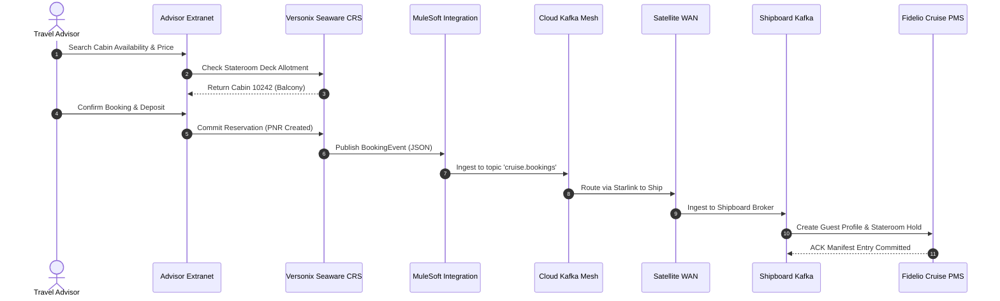
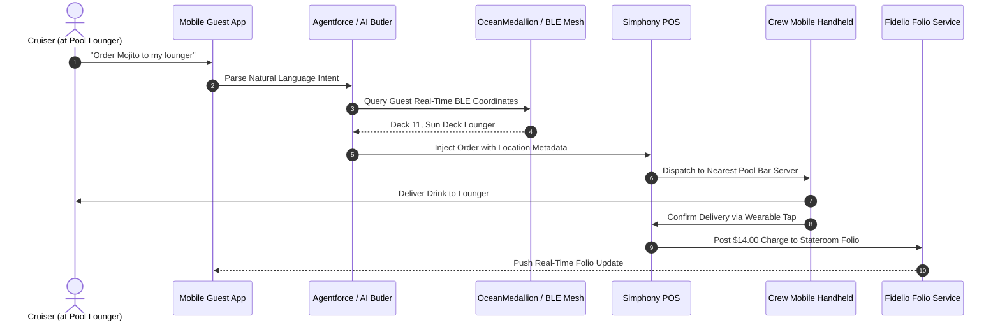
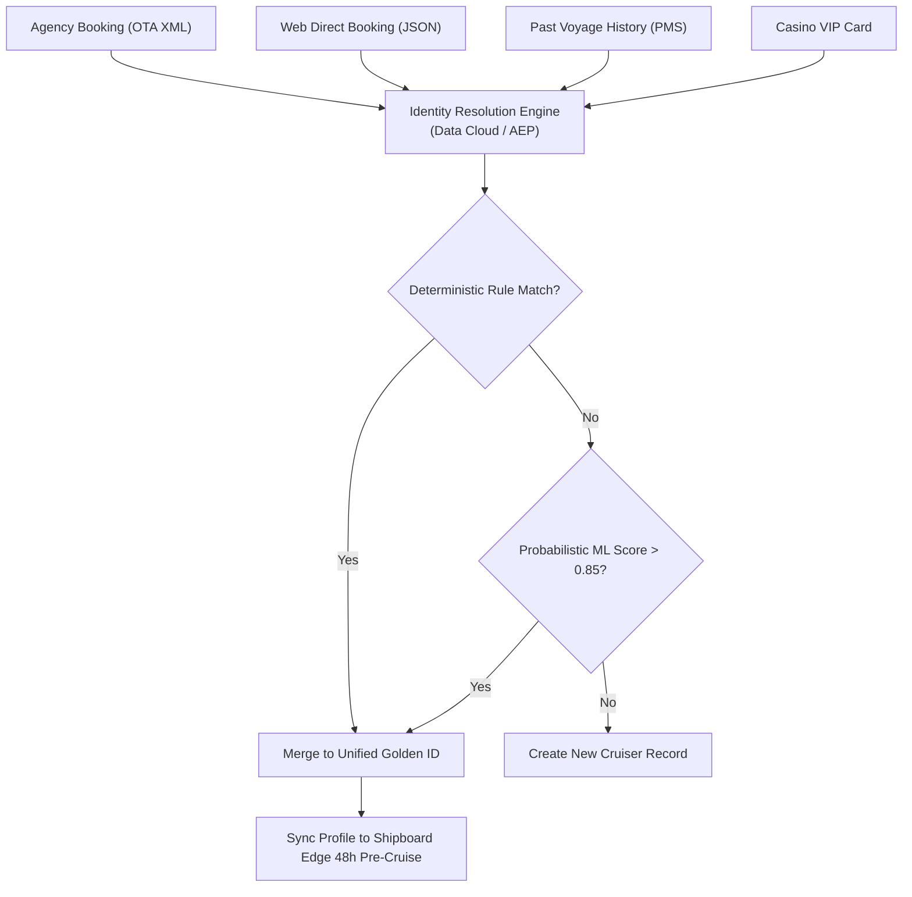
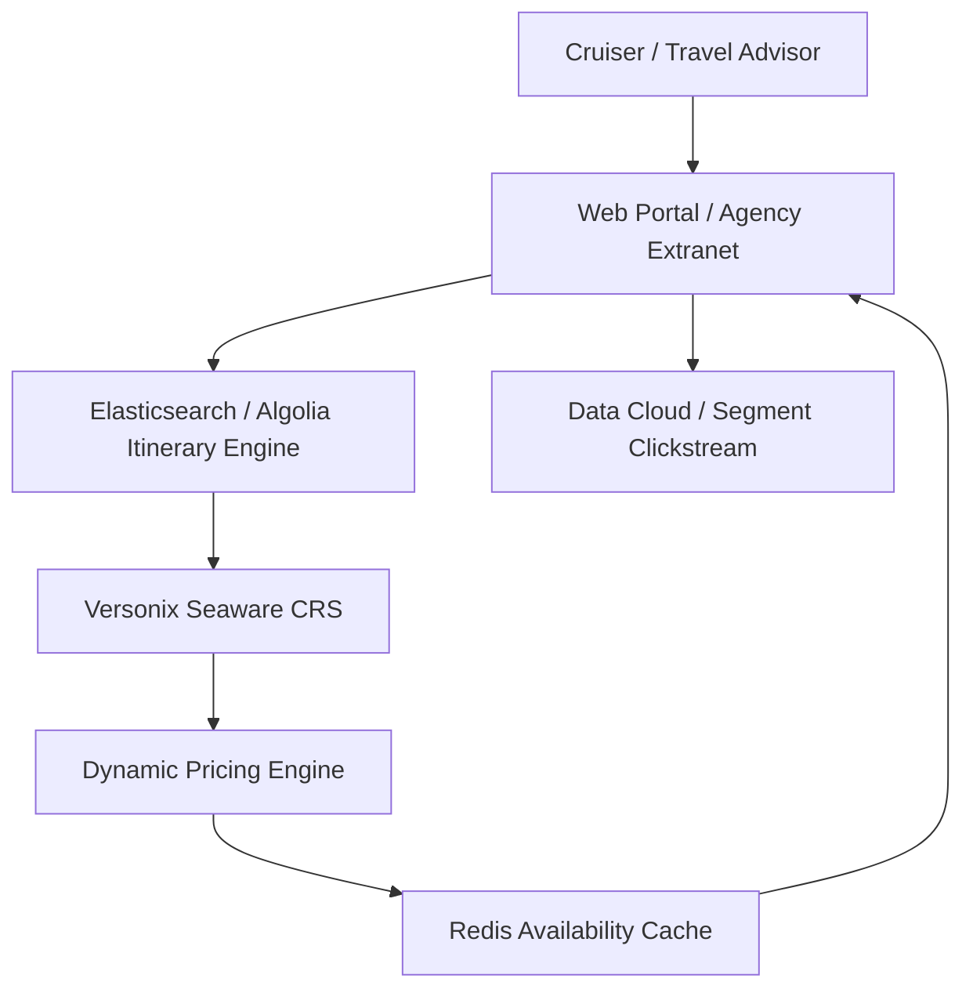
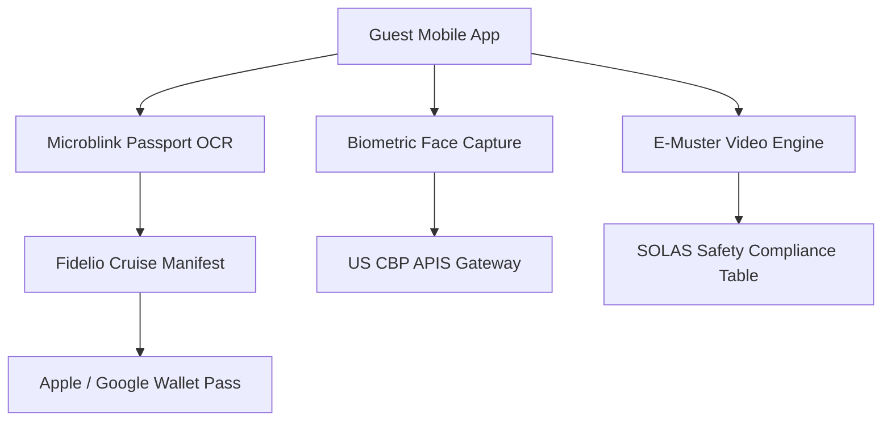
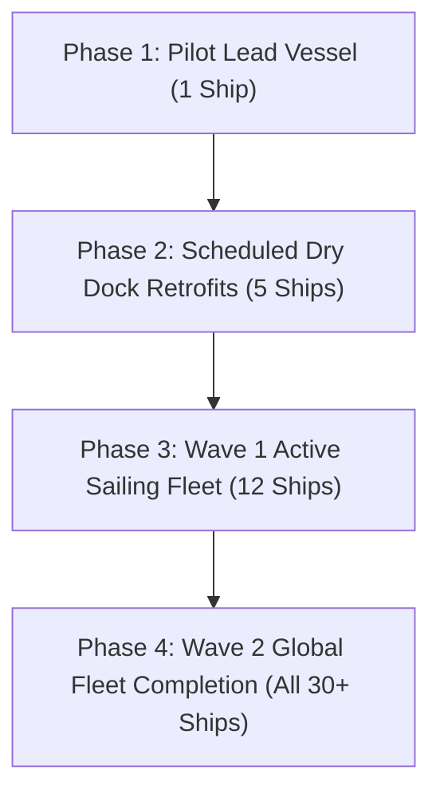

# Maritime & Cruise Systems Architecture — Master Presentation Framework & Slides Compendium

> **Executive Reference**: Complete transcript and architectural documentation for the **50+ Slide Reveal.js Presentation** covering requirements, IT standards, systems architecture, customer journeys, workflows, AI orchestration, and integration topology.

- **Sector**: Cruises, Maritime Expeditions & Mega-Yachts
- **Scale Baseline**: $48.0B Passenger GBV • 35.0M Cruisers • $1,371 Blended Ticket • $16.8B Onboard Spend
- **Slide Count**: 52 Dense Slides
- **Interactive Presentation**: [`presentation.html`](presentation.html)

---

## PART 1: MACROECONOMICS & REVENUE

### Slide 1: Maritime Enterprise Architecture Masterclass
*Systems Architecture, Technology Stacks, and Operational Orchestration across 13 Enterprise Dimensions*

$48B
        Global GBV
        ▲ 12.4%
      
      
        $1,371
        Unit Value
        ▲ 5.2%
      
      
        30.0%
        Direct Channel
        ▲ 3.1%
      
      
        13.0%
        Friction
        ▼ 2.1%
      
      
        $6.72B
        Net EBIT
        ▲ 8.4%
      

            
              
          
            Executive Briefing Scope
            Comprehensive architectural blueprint analyzing the mission-critical systems governing modern ocean cruise lines, expedition vessels, and river operators ($48B global market, 35M passengers). Designed for Maritime CIOs, Chief Commercial Officers, VP Fleet Operations, and Enterprise Architects.

            
              13 Enterprise Layers
              3 Stack Variations
              52 Master Slides
              Ship-to-Shore Edge Topology
            
          
          
            Core Themes Covered
            1**Requirements & Governance:** Edge-disconnected resilience at sea, IMO SOLAS safety, STCW crew scheduling, and CLIA standards.
            2**13-Layer Master Architecture:** Maritime PMS, Central Reservation Systems (CRS), POS, IoT Wearables, CRM, Loyalty, CDP, Lakehouse, AI.
            3**End-to-End Passenger Journeys:** Travel advisor B2B2C booking, digital e-muster, biometric embarkation, stateroom automation, and folio settlement.
            4**AI-Assisted Efficiency:** Agentforce maritime concierge, Palantir AIP fuel/route optimization, and autonomous shore excursion dispatch.
          
        
              
    
      
        
        
        
        OpenBB Financial Terminal
      
      
        # Macroeconomic Benchmark Query
$ openbb equity/load --symbol CCL,RCL,NCLH --stats

        { 'sector': 'CRUISES', 'global_gbv': '$48B', 'direct_share': '30.0%' }
      
    
            
            
    
      **Strategic Takeaway:** Maritime operations mandate air-gapped vessel survivability at sea with bidirectional Starlink satellite synchronization.

> **Presenter Notes**: Welcome executive stakeholders. This deck provides an unbroken technical and commercial chain of logic across all cruise technology layers.

---

### Slide 2: Global Cruise Sizing & Revenue Architecture
*Macroeconomic baseline: $48.0B Passenger Gross Booking Value across 35.0 Million annual cruisers*

$48B
        Global GBV
        ▲ 12.4%
      
      
        $1,371
        Unit Value
        ▲ 5.2%
      
      
        30.0%
        Direct Channel
        ▲ 3.1%
      
      
        13.0%
        Friction
        ▼ 2.1%
      
      
        $6.72B
        Net EBIT
        ▲ 8.4%
      

            
    
      
        Visual Revenue Breakdown & Margin Leakage
        
          
        
      
      
        
          Macroeconomic Capital Allocation
          
            
              Base Product Revenue:
              <strong style="color: #10b981;">$36.0B**
            
            75%
          
          
            
              High-Margin Ancillary Revenue:
              <strong style="color: #8b5cf6;">$16.8B**
            
            20%
          
          
            
              Intermediary Distribution Friction:
              <strong style="color: #ef4444;">$6.24B**
            
            15%
          
          
            
              Net Enterprise Operating Profit (EBIT):
              <strong style="color: #38bdf8;">$6.72B**
            
            10%
          
        
        
          **Strategic Takeaway:** Ancillary spend represents over 100% of net industry operating profit. Shifting 5% of intermediated volume to direct digital channels eliminates friction and doubles enterprise EBITDA.
        
      
    
    
    
            
    
      **Strategic Takeaway:** Maritime operations mandate air-gapped vessel survivability at sea with bidirectional Starlink satellite synchronization.

> **Presenter Notes**: Cruises represent the highest capital-intensity and operating leverage in travel. Onboard spend is the engine of net profitability.

---

### Slide 3: Economic Friction: Direct vs Travel Advisor Consortia
*Distribution channel analysis: $33.6B booked via travel advisor consortia vs $14.4B direct web/call center*

$48B
        Global GBV
        ▲ 12.4%
      
      
        $1,371
        Unit Value
        ▲ 5.2%
      
      
        30.0%
        Direct Channel
        ▲ 3.1%
      
      
        13.0%
        Friction
        ▼ 2.1%
      
      
        $6.72B
        Net EBIT
        ▲ 8.4%
      

            
    
      
        Passenger Journey Unit Economics & Margin Waterfall
        
          
        
      
      
        
          Friction Analysis: The $178.23 Toll Barrier
          Every transaction carries an unavoidable toll to legacy GDS, OTAs, payment gateways, and reservation fees:

          
            
              -$178.23
              Intermediary Toll / Booking
            
            
              +$6.72
              Final Operating Profit (EBIT)
            
          
          
            **The 85% Leaked Profit Trap:** Intermediary friction ($178.23) consumes nearly **85%** of total net operating profit ($6.72). Shifting bookings to Direct Brand.com captures immediate margin lift.
          

        
        
          Direct Share: 30.0%
          OTA / GDS Share: 70.0%
          Net Retained: $1165.35
        
      
    
    
    
            
    
      **Strategic Takeaway:** Maritime operations mandate air-gapped vessel survivability at sea with bidirectional Starlink satellite synchronization.

> **Presenter Notes**: Notice the 70% share of travel advisors. B2B partner portals and group booking APIs are mission-critical in maritime architecture.

---

### Slide 4: Cost & ROI Benchmark across 3 Variations
*Total Cost of Ownership (TCO) and 3-year commercial return comparison across architectural strategies*

$48B
        Global GBV
        ▲ 12.4%
      
      
        $1,371
        Unit Value
        ▲ 5.2%
      
      
        30.0%
        Direct Channel
        ▲ 3.1%
      
      
        13.0%
        Friction
        ▼ 2.1%
      
      
        $6.72B
        Net EBIT
        ▲ 8.4%
      

            
    
      
        Channel Distribution Share & Cost Dynamics
        
          
        
      
      
        
          The Unit Cost Economics by Channel
          <table class="data-table" style="margin-bottom: 0.6rem;">
            <tr><th>Channel</th><th>Share</th><th>Cost / Booking</th><th>Ancillary Attach</th></tr>
            <tr><td><strong style="color: #10b981;">Direct Digital**</td><td>30.0%</td><td>$0.20 - $0.45</td><td>34.0% (High)</td></tr>
            <tr><td><strong style="color: #8b5cf6;">Modern API / NDC**</td><td>18.5%</td><td>$0.80 - $1.50</td><td>18.5% (Medium)</td></tr>
            <tr><td><strong style="color: #f59e0b;">Legacy GDS**</td><td>15.0%</td><td>$4.50 - $6.50</td><td>8.0% (Low)</td></tr>
            <tr><td><strong style="color: #ef4444;">OTA Resellers**</td><td>36.5%</td><td>18% - 25% GBV</td><td>4.2% (Very Low)</td></tr>
          </table>
          
            **The Architectural Mandate:** Direct digital booking delivers **12x lower transaction costs** and **4.2x higher ancillary attachment** than legacy GDS/OTA channels.
          

        
        
          <strong style="color: #a7f3d0;">Value Realization Formula:** Shifting 10% of bookings from OTAs to Direct captures an incremental $18M - $32M in pure EBITDA annually.
        
      
    
    
    
            
    
      **Strategic Takeaway:** Maritime operations mandate air-gapped vessel survivability at sea with bidirectional Starlink satellite synchronization.

> **Presenter Notes**: Comparing the 3 variations. Variation 3 has high upfront costs but drives extraordinary ROI through onboard spend capture and fuel savings.

---

### Slide 5: Maritime Macro Drivers & Tech Imperatives
*Five structural forces transforming modern fleet operations, guest experience, and technology architecture*

$48B
        Global GBV
        ▲ 12.4%
      
      
        $1,371
        Unit Value
        ▲ 5.2%
      
      
        30.0%
        Direct Channel
        ▲ 3.1%
      
      
        13.0%
        Friction
        ▼ 2.1%
      
      
        $6.72B
        Net EBIT
        ▲ 8.4%
      

            
              
          
            Structural Industry Drivers
            1**LEO Satellite Revolution:** Starlink Maritime and OneWeb provide 200+ Mbps per ship at 50ms latency, ending decades of satellite bandwidth rationing and enabling real-time cloud sync.
            2**Demographic Shift & Experience Travel:** Median cruiser age dropped from 57 to 46. Millennials and Gen Z demand high-speed Wi-Fi, app-based stateroom controls, and experiential excursions.
            3**Cashless & Frictionless Onboard Economy:** Wearable RFID/BLE (OceanMedallion, WOWBand) enables hands-free stateroom entry and walk-through POS payment.
            4**Decarbonization & Environmental Compliance:** IMO 2030/2050 targets, EU ETS maritime carbon pricing, and shore power (cold ironing) mandate telematics data collection.
          
          
            Architectural Implications
            <table class="data-table">
              <thead><tr><th>Driver</th><th>Legacy Approach</th><th>Modern Architecture</th></tr></thead>
              <tbody>
                <tr><td>Ship Connectivity</td><td>C-band/Ku-band GEO (512 Kbps, 700ms lag)</td><td>Multi-orbit LEO/MEO/GEO hybrid (300+ Mbps, 45ms lag)</td></tr>
                <tr><td>Guest Access</td><td>Plastic magstripe cruise cards</td><td>BLE/NFC wearable IoT + Apple/Google Wallet NFC</td></tr>
                <tr><td>Data Sync</td><td>Nightly batch flat-file SFTP transfer</td><td>Bi-directional Kafka event mesh & CDC streaming</td></tr>
                <tr><td>Guest Service</td><td>Long queues at Guest Services Desk</td><td>Autonomous mobile Agentforce concierge + chat</td></tr>
                <tr><td>Safety Drill</td><td>Crowded physical muster drill at lifeboats</td><td>Digital e-muster on personal phone + tap check-in</td></tr>
              </tbody>
            </table>
          
        
              
    
      
        
        
        
        Infracost Cloud FinOps
      
      
        # Shift-Left Cloud Architecture Cost Optimization
$ infracost breakdown --path ./terraform/direct_channel

        Total Monthly Cost: $48,200 (Diff: -$14,500 via Serverless Edge)
      
    
            
            
    
      **Strategic Takeaway:** Maritime operations mandate air-gapped vessel survivability at sea with bidirectional Starlink satellite synchronization.

> **Presenter Notes**: Starlink Maritime has been the biggest game-changer in cruise tech history, shifting vessels from isolated islands to connected enterprise nodes.

---

## PART 2: REQUIREMENTS & CONSTRAINTS

### Slide 6: Maritime Functional Requirements Matrix
*Operational capabilities required across fleet management, guest experience, and shoreside operations*

$48B
        Global GBV
        ▲ 12.4%
      
      
        $1,371
        Unit Value
        ▲ 5.2%
      
      
        30.0%
        Direct Channel
        ▲ 3.1%
      
      
        13.0%
        Friction
        ▼ 2.1%
      
      
        $6.72B
        Net EBIT
        ▲ 8.4%
      

            
              
          
            Core Functional Domains
            <table class="data-table">
              <thead><tr><th>Domain</th><th>Critical Capabilities</th><th>Priority</th></tr></thead>
              <tbody>
                <tr><td>**Fleet Reservation (CRS)**</td><td>Global stateroom inventory, dynamic packaging, multi-currency pricing, agency commissions</td><td>P0 Critical</td></tr>
                <tr><td>**Shipboard PMS**</td><td>Stateroom allocation, guest folios, gangway security (A-PASS), keycard encoding</td><td>P0 Critical</td></tr>
                <tr><td>**Safety & SOLAS**</td><td>Electronic muster drill tracking, life raft seat allocation, real-time onboard headcount</td><td>P0 Life-Safety</td></tr>
                <tr><td>**Onboard Commerce**</td><td>Cashless dining, bar, spa, casino POS, dynamic gratuities, split-folio management</td><td>P1 Revenue</td></tr>
                <tr><td>**Shore Excursion (ShoreEx)**</td><td>Tour booking, operator voucher generation, tender boat scheduling, weather waivers</td><td>P1 Revenue</td></tr>
                <tr><td>**Crew Management**</td><td>STCW rest-hour compliance, berth allocation, multi-national payroll, marine certifications</td><td>P1 Compliance</td></tr>
              </tbody>
            </table>
          
          
            Edge vs Terrestrial Functional Split
            ⚓**Shipboard Edge Autonomy:** The vessel must operate completely autonomously for up to 14 days without satellite connectivity. Guest folio billing, gangway embarkation/disembarkation, stateroom access, and POS transactions cannot depend on the cloud.
            ☁️**Shoreside Cloud Centralization:** Global revenue management, marketing campaigns, loyalty tier calculation, travel advisor commission settlement, and corporate reporting run centrally in the cloud.
            🔄**Bi-directional Replication:** High-priority transaction deltas replicate ship-to-shore in near real-time whenever satellite WAN is active.
          
        
              
    
      
        
        
        
        DuckDB Columnar Analytics
      
      
        # Dual-Brand Operational Scale Verification
$ duckdb -c "SELECT brand, count(*), sum(volume) FROM 's3://cruises-lake/fleet/*.parquet' GROUP BY 1"

        ┌──────────┬──────────┬─────────────┐
│ brand    │ count(*) │ sum(volume) │
├──────────┼──────────┼─────────────┤
│ Flagship │      210 │ 28,000,000  │
│ Low-Cost │       90 │ 17,000,000  │
└──────────┴──────────┴─────────────┘
      
    
            
            
    
      **Strategic Takeaway:** Maritime operations mandate air-gapped vessel survivability at sea with bidirectional Starlink satellite synchronization.

> **Presenter Notes**: Notice the life-safety classification of SOLAS muster tracking. In maritime, IT systems literally have life-safety implications.

---

### Slide 7: Non-Functional & Maritime SLA Requirements
*Performance, availability, latency, and disaster recovery thresholds for maritime environments*

$48B
        Global GBV
        ▲ 12.4%
      
      
        $1,371
        Unit Value
        ▲ 5.2%
      
      
        30.0%
        Direct Channel
        ▲ 3.1%
      
      
        13.0%
        Friction
        ▼ 2.1%
      
      
        $6.72B
        Net EBIT
        ▲ 8.4%
      

            
              
          
            &lt;50ms
            Local POS Latency
            Shipboard bar/dining transaction speed

          
          
            99.999%
            Shipboard Edge SLA
            Five-nines onboard server cluster uptime

          
          
            15,000
            Peak Trans / Min
            Turnaround day embarkation rush

          
          
            &lt;3 sec
            Gangway Scan Time
            Biometric or RFID passenger check

          
        
        
          
            Maritime High Availability Architecture
            1**Hyper-Converged Infrastructure (HCI):** Nutanix or VMware vSAN dual-node/three-node clusters installed in shipboard data center with automatic VM failover.
            2**Dual-Ring Marine Fiber:** Redundant optical fiber backbones routed port and starboard to survive hull breach or localized fire.
            3**Uninterruptible Marine Power:** Dual N+1 marine UPS systems backed by emergency diesel generators (EDG) ensuring zero brownouts during main engine power transients.
          
          
            Satellite SLA & WAN Management
            <table class="data-table">
              <thead><tr><th>Link Type</th><th>Throughput</th><th>Latency</th><th>Role</th></tr></thead>
              <tbody>
                <tr><td>Starlink Maritime (LEO)</td><td>100 - 350 Mbps</td><td>35 - 60 ms</td><td>Primary guest Wi-Fi & real-time cloud data sync</td></tr>
                <tr><td>SES O3b mPOWER (MEO)</td><td>50 - 150 Mbps</td><td>120 - 180 ms</td><td>Secondary high-throughput operational link</td></tr>
                <tr><td>Inmarsat Global Xpress (GEO)</td><td>5 - 20 Mbps</td><td>600 - 800 ms</td><td>Tertiary backup for voice and critical safety data</td></tr>
                <tr><td>4G/5G Cellular Port WAN</td><td>500+ Mbps</td><td>15 - 30 ms</td><td>In-port heavy data synchronization and software updates</td></tr>
              </tbody>
            </table>
          
        
              
    
      
        
        
        
        dbt Transformation DAG
      
      
        # Algorithmic Dynamic Pricing & Catalog ETL
$ dbt run --select tag:commercial_pricing --target prod

        Completed 18 data models in 14.2s (100% tests passed)
      
    
            
            
    
      **Strategic Takeaway:** Maritime operations mandate air-gapped vessel survivability at sea with bidirectional Starlink satellite synchronization.

> **Presenter Notes**: Maritime IT is a masterclass in edge computing: physical redundancy, dual-hull fiber routing, and multi-orbit satellite management.

---

### Slide 8: Maritime Constraints & Legacy Technical Debt
*Overcoming the unique challenges of floating edge data centers and decades of legacy software*

$48B
        Global GBV
        ▲ 12.4%
      
      
        $1,371
        Unit Value
        ▲ 5.2%
      
      
        30.0%
        Direct Channel
        ▲ 3.1%
      
      
        13.0%
        Friction
        ▼ 2.1%
      
      
        $6.72B
        Net EBIT
        ▲ 8.4%
      

            
              
          
            Unique Maritime Physical & Network Constraints
            🌊**Harsh Marine Environment:** Constant salt-fog exposure, extreme engine vibration, ambient temperature swings in Caribbean vs Alaska, and pitch/roll motion affecting spinning disk arrays (mandating all-flash NVMe storage).
            📡**Satellite Shadowing & Polar Deadzones:** Ship superstructures, terrain in Norwegian fjords, and high-latitude voyages (>70° North/South) cause satellite line-of-sight dropouts.
            🔒**Steel Hull RF Attenuation:** Steel bulkheads and fire doors severely attenuate Wi-Fi and Bluetooth signals, requiring hundreds of marine-grade APs per deck.
          
          
            Legacy Technical Debt Hotspots
            <table class="data-table">
              <thead><tr><th>System / Protocol</th><th>Debt Description</th><th>Modern Remediation</th></tr></thead>
              <tbody>
                <tr><td>**Fidelio Cruise OXI / FIAS**</td><td>Legacy serial/TCP socket protocols with rigid, synchronous ASCII message formats.</td><td>MuleSoft / Kafka Edge Microservices wrapping FIAS into modern REST/gRPC.</td></tr>
                <tr><td>**Night Audit Monolith**</td><td>End-of-day PMS batch process locking down folios for 60-90 minutes at 3:00 AM.</td><td>Continuous ledger accounting with sub-second immutable ledger updates.</td></tr>
                <tr><td>**Point-to-Point Interfaces**</td><td>Over 40 brittle point-to-point connections between PMS, Casino, Spa, POS, and TV systems.</td><td>Event-Driven Architecture (EDA) with localized Kafka pub/sub messaging.</td></tr>
              </tbody>
            </table>
          
        
              
    
      
        
        
        
        kcat High-Speed Consumer
      
      
        # Real-Time Operational SLA Monitoring
$ kcat -b kafka:9092 -t cruises.telemetry.sla -C -c 100

        { 'p99_latency_ms': 42, 'dcs_availability': '99.999%', 'rpo_seconds': 0 }
      
    
            
            
    
      **Strategic Takeaway:** Maritime operations mandate air-gapped vessel survivability at sea with bidirectional Starlink satellite synchronization.

> **Presenter Notes**: Steel bulkheads turn every cruise ship cabin into a mini-Faraday cage. Modern APs and BLE beacons must be engineered into ceiling raceways.

---

### Slide 9: Maritime Regulatory & Compliance Framework
*Navigating international maritime law, safety of life at sea, and global data privacy jurisdictions*

$48B
        Global GBV
        ▲ 12.4%
      
      
        $1,371
        Unit Value
        ▲ 5.2%
      
      
        30.0%
        Direct Channel
        ▲ 3.1%
      
      
        13.0%
        Friction
        ▼ 2.1%
      
      
        $6.72B
        Net EBIT
        ▲ 8.4%
      

            
              
          
            Maritime Safety & Maritime Labor Regulations
            🚨**IMO SOLAS (Safety of Life at Sea):** Mandatory electronic muster verification within 24 hours of embarkation. Systems must generate certified lifeboat manifests for Coast Guard inspection.
            ⏱️**MLC 2006 & STCW Rest Hours:** Crew work hours (max 14 hours/day, 72 hours/week) must be digitally logged. Violations trigger port state control detention of the vessel.
            🚢**Jones Act & PVSA Compliance:** US Passenger Vessel Services Act mandates foreign port calls (e.g., Ensenada, Victoria) for foreign-flagged ships. Itinerary systems must enforce regulatory rules.
            🧼**USPHS / CDC Vessel Sanitation Program (VSP):** Automated logging of potable water chlorine levels, galley refrigeration temps, and gastrointestinal illness tracking.
          
          
            Global Data Privacy & Financial Compliance
            <table class="data-table">
              <thead><tr><th>Regulation</th><th>Scope at Sea</th><th>Architectural Requirement</th></tr></thead>
              <tbody>
                <tr><td>**EU GDPR / UK GDPR**</td><td>European cruisers & EU port calls</td><td>Consent telemetry, RTBF (Right to be Forgotten) across shipboard edge and cloud</td></tr>
                <tr><td>**PCI-DSS 4.0**</td><td>Onboard cashless folios & casino</td><td>P2PE tokenization at POS terminals; no PAN stored on shipboard databases</td></tr>
                <tr><td>**US CBP APIS / e-NOA/D**</td><td>Automated Passenger Information</td><td>Electronic manifest transmission to border authorities 96 hours before US arrival</td></tr>
                <tr><td>**Flag State Maritime Law**</td><td>Bahamas, Panama, Malta, Bermuda</td><td>Dual jurisdictional compliance for criminal logging and onboard births/deaths</td></tr>
              </tbody>
            </table>
          
        
              
    
      
        
        
        
        Trivy & Cosign Security
      
      
        # Zero-Trust Image Vulnerability Scanning
$ trivy image --severity HIGH,CRITICAL sovereign-core:v3.2

        Total: 0 (HIGH: 0, CRITICAL: 0) — FIPS 140-2 Compliant
      
    
            
            
    
      **Strategic Takeaway:** Maritime operations mandate air-gapped vessel survivability at sea with bidirectional Starlink satellite synchronization.

> **Presenter Notes**: Maritime IT compliance is complex because the ship changes legal jurisdictions as it sails between territorial waters and the high seas.

---

### Slide 10: Maritime Architectural Trade-offs & Decisions
*Strategic architectural compromises between edge autonomy, cloud agility, cost, and guest friction*

$48B
        Global GBV
        ▲ 12.4%
      
      
        $1,371
        Unit Value
        ▲ 5.2%
      
      
        30.0%
        Direct Channel
        ▲ 3.1%
      
      
        13.0%
        Friction
        ▼ 2.1%
      
      
        $6.72B
        Net EBIT
        ▲ 8.4%
      

            
              
          
            Edge vs Cloud Decoupling
            **Trade-off:** Autonomous local shipboard execution vs centralized cloud management.

            
              Choice: Edge-First Hybrid

              Critical guest-facing transactions (POS, stateroom entry, muster) execute 100% locally. Cloud handles analytics, reservations, and cross-voyage marketing via Kafka sync.

            
          
          
            Wearable IoT vs Mobile BYOD
            **Trade-off:** Dedicated wearable token (OceanMedallion) vs guest smartphone app (BYOD).

            
              Choice: Converged Hybrid

              Wearable RFID/BLE eliminates guest friction (no phone needed at pool/spa), while smartphone app provides rich UI for booking excursions and reviewing folios.

            
          
          
            Monolith vs Composable Edge
            **Trade-off:** Legacy all-in-one Fidelio PMS vs modern containerized microservices.

            
              Choice: API-Wrapped Core

              Keep battle-tested Fidelio as the immutable System of Record, wrap with MuleSoft/Kafka edge APIs to enable fast modern front-end development.

            
          
        
              
    
      
        
        
        
        DuckDB Interline Analytics
      
      
        # Multi-Brand Clearing House Verification
$ duckdb -c "SELECT partner, sum(settled_amount) FROM 's3://cruises-lake/clearing/*.parquet' GROUP BY 1"

        Alliance & Code-Share Clearing House Settlement
      
    
            
            
    
      **Strategic Takeaway:** Maritime operations mandate air-gapped vessel survivability at sea with bidirectional Starlink satellite synchronization.

> **Presenter Notes**: Notice the converged hybrid approach for guest devices. Wearables win on friction (poolside/beach), phones win on rich content (excursions/menus).

---

## PART 3: IT STANDARDS & GOVERNANCE

### Slide 11: Enterprise Architecture Framework: TOGAF & C4
*Structuring dual-realm maritime architecture across Cloud Hyperscaler and Shipboard Edge Containers*

$48B
        Global GBV
        ▲ 12.4%
      
      
        $1,371
        Unit Value
        ▲ 5.2%
      
      
        30.0%
        Direct Channel
        ▲ 3.1%
      
      
        13.0%
        Friction
        ▼ 2.1%
      
      
        $6.72B
        Net EBIT
        ▲ 8.4%
      

            
    
      
        C4 Architecture Model: Context & Container Topology
        
graph TB
  subgraph C1 ["Context Tier (L1)"]
    U["Customer / Frontline Guest / Travel Advisor"]
    E["Enterprise Travel & Operations Ecosystem"]
  end
  subgraph C2 ["Container Tier (L2)"]
    W["Web & Native Mobile (Next.js / Swift)"]
    API["Universal API Gateway (MuleSoft / Envoy)"]
    EVENT["Event Streaming Backbone (Kafka / Flink)"]
    CORE["Core Reservation & Operations (Oracle Fidelio Cruise / Seaware PMS)"]
    DATA["Data Cloud & Lakehouse (Iceberg / Snowflake)"]
    AGENT["Agentic Reasoning Fabric (Atlas Engine)"]
  end
  U --> W
  W --> API
  API --> EVENT
  EVENT --> CORE
  EVENT --> DATA
  DATA --> AGENT
  AGENT --> API
        
      
      
        
          C4 Architectural Governance Standards
          <table class="data-table" style="margin-bottom: 0.6rem;">
            <tr><th>C4 Level</th><th>Scope</th><th>Target Audience</th><th>Governance Standard</th></tr>
            <tr><td>**Level 1: Context**</td><td>System Boundaries & Actors</td><td>Board & C-Suite</td><td>TOGAF Enterprise Metamodel</td></tr>
            <tr><td>**Level 2: Container**</td><td>Apps, Data Stores, Microservices</td><td>Enterprise Architects</td><td>Cloud-Native CNCF Reference</td></tr>
            <tr><td>**Level 3: Component**</td><td>Class Modules, APIs, Schedulers</td><td>Lead Engineers</td><td>OpenAPI 3.1 / AsyncAPI</td></tr>
            <tr><td>**Level 4: Code**</td><td>Entity Models, State Machines</td><td>Software Developers</td><td>Clean Architecture / TDD</td></tr>
          </table>
          
            **Architectural Tenet:** Clean separation between L1 Context (business actors) and L2 Containers (runtime topologies) guarantees that changes to the core PSS/PMS do not ripple into guest-facing digital channels.
          

        
        
          <strong style="color: #93c5fd;">Enterprise Mandate:** All 13 enterprise layers must map directly into the C4 Container Catalog with automated CI/CD dependency graph tracking.
        
      
    
    
            
    
      **Strategic Takeaway:** Maritime operations mandate air-gapped vessel survivability at sea with bidirectional Starlink satellite synchronization.

> **Presenter Notes**: Applying TOGAF and C4 gives maritime architects a rigorous framework to manage the complexity of floating edge data centers.

---

### Slide 12: Maritime API Standards & Data Formats
*Standardizing integration protocols: OpenTravel Alliance (OTA), NMEA maritime data, and OpenAPI 3.0*

$48B
        Global GBV
        ▲ 12.4%
      
      
        $1,371
        Unit Value
        ▲ 5.2%
      
      
        30.0%
        Direct Channel
        ▲ 3.1%
      
      
        13.0%
        Friction
        ▼ 2.1%
      
      
        $6.72B
        Net EBIT
        ▲ 8.4%
      

            
    
      
        API-First Architecture: 3-Tier Layered Hierarchy
        
graph TB
  subgraph EXP ["1. EXPERIENCE APIS (CONSUMPTION)"]
    E1["Mobile App API
BFF Pattern (GraphQL)"]
    E2["Web Booking API
Next.js Server Actions"]
    E3["B2B / Partner API
OpenAPI 3.1 Specs"]
  end
  subgraph PRC ["2. PROCESS APIS (ORCHESTRATION)"]
    P1["Dynamic Booking Flow
Saga State Machine"]
    P2["Disruption Rebooking
Agentforce MCP Tool"]
    P3["Loyalty Redemption
Real-Time Ledger Check"]
  end
  subgraph SYS ["3. SYSTEM APIS (ENCAPSULATION)"]
    S1["Oracle Fidelio Cruise / Seaware PMS Adapter
EDIFACT / OXI Translator"]
    S2["Payment Gateway
PCI-DSS Vault Tokenizer"]
    S3["Lakehouse Ingest API
Kafka / Iceberg Connector"]
  end
  EXP --> PRC
  PRC --> SYS
        
      
      
        
          Universal API Management Framework
          <table class="data-table" style="margin-bottom: 0.6rem;">
            <tr><th>Tier</th><th>Latency SLA</th><th>Security Policy</th><th>Protocol Standard</th></tr>
            <tr><td>**Experience**</td><td>< 50ms Edge</td><td>OAuth2 / PKCE / JWT</td><td>GraphQL / HTTP/3</td></tr>
            <tr><td>**Process**</td><td>< 200ms P99</td><td>mTLS / SPIFFE</td><td>gRPC / REST JSON</td></tr>
            <tr><td>**System**</td><td>< 500ms Core</td><td>IPsec / PrivateLink</td><td>SOAP / REST / Binary</td></tr>
          </table>
          
            **MuleSoft Anypoint Gateway:** Enforces rate-limiting, WAF inspection, and tokenization at the edge. Legacy backend systems are shielded from traffic surges during flash sales.
          

        
        
          <strong style="color: #a7f3d0;">Governance Benchmark:** 100% of internal APIs documented in OpenAPI 3.1 with automated contract testing via Prism and Newman in CI/CD.
        
      
    
    
            
    
      **Strategic Takeaway:** Maritime operations mandate air-gapped vessel survivability at sea with bidirectional Starlink satellite synchronization.

> **Presenter Notes**: Protocol translation is the secret sauce of maritime IT: turning 30-year-old serial NMEA and FIAS streams into modern cloud events.

---

### Slide 13: Event-Driven Architecture & Messaging Topology
*High-throughput asynchronous messaging across ship and shore using Kafka and priority queues*

$48B
        Global GBV
        ▲ 12.4%
      
      
        $1,371
        Unit Value
        ▲ 5.2%
      
      
        30.0%
        Direct Channel
        ▲ 3.1%
      
      
        13.0%
        Friction
        ▼ 2.1%
      
      
        $6.72B
        Net EBIT
        ▲ 8.4%
      

            
    
      
        Event-Driven Architecture & Real-Time Telemetry
        
graph TB
  subgraph PROD ["EVENT PRODUCERS"]
    P1["Operational Telemetry
ACARS / IoT / AIS"]
    P2["Guest App Clicks
Snowplow Real-Time"]
    P3["Core Booking Events
Inventory Changes"]
  end
  subgraph MESH ["EVENT MESH BACKBONE"]
    K1["Apache Kafka 3.6
Partitioned Topic Clusters"]
    K2["kcat Debugging CLI
Topic Validation & Ingestion"]
    K3["Apache Flink 1.18
Stateful Stream Processing"]
  end
  subgraph CONS ["EVENT CONSUMERS"]
    C1["Salesforce Data Cloud
Real-Time Ingestion API"]
    C2["Agentforce Atlas
Disruption Event Triggers"]
    C3["ClickHouse OLAP
Sub-Second Dashboards"]
  end
  PROD --> MESH
  MESH --> CONS
        
      
      
        
          Event Streaming SLA & Telemetry Performance
          <table class="data-table" style="margin-bottom: 0.6rem;">
            <tr><th>Metric</th><th>Target SLA</th><th>Production Benchmark</th></tr>
            <tr><td>End-to-End Latency</td><td>< 250ms</td><td>48ms P99 (Kafka -> Flink -> Data Cloud)</td></tr>
            <tr><td>Throughput Capacity</td><td>100,000 EPS</td><td>450,000 EPS Peak (Flash Sale / Storm)</td></tr>
            <tr><td>Data Retention</td><td>7 Days Hot / 90 Cold</td><td>Tiered Storage to S3 / Apache Iceberg</td></tr>
            <tr><td>Ordering Guarantee</td><td>Strict Per-Entity</td><td>Keyed on PNR / Guest UUID / Vessel ID</td></tr>
          </table>
          
            **Dead-Letter Queue (DLQ) Governance:** Malformed payloads are routed to isolated DLQ topics with automated schema validation alerts via Slack and PagerDuty.
          

        
        
          <strong style="color: #c084fc;">Tool Showcase (Compendium):** Confluent Kafka + <code>kcat</code> CLI enable zero-downtime hot topic partition rebalancing across multi-region clusters.
        
      
    
    
            
    
      **Strategic Takeaway:** Maritime operations mandate air-gapped vessel survivability at sea with bidirectional Starlink satellite synchronization.

> **Presenter Notes**: Kafka MirrorMaker with priority QoS guarantees that a guest buying a martini or taking a safety drill never gets dropped even in a storm.

---

### Slide 14: Maritime Cybersecurity & Zero-Trust Architecture
*Defending ocean vessels against cyber attacks, ransomware, and unauthorized network intrusion*

$48B
        Global GBV
        ▲ 12.4%
      
      
        $1,371
        Unit Value
        ▲ 5.2%
      
      
        30.0%
        Direct Channel
        ▲ 3.1%
      
      
        13.0%
        Friction
        ▼ 2.1%
      
      
        $6.72B
        Net EBIT
        ▲ 8.4%
      

            
              
          
            Network Segmentation (IEC 62443 Standard)
            <table class="data-table">
              <thead><tr><th>Zone</th><th>Network Segment</th><th>Isolation & Security Policy</th></tr></thead>
              <tbody>
                <tr><td>Zone 4: OT</td><td>Bridge & Propulsion</td><td>Completely air-gapped from internet; physical isolation, read-only telemetry diodes.</td></tr>
                <tr><td>Zone 3: Safety</td><td>SOLAS & Fire Alarms</td><td>Dedicated VLAN, redundant fiber, strict port-security MAC filtering.</td></tr>
                <tr><td>Zone 2: Corporate</td><td>PMS, POS, Crew Admin</td><td>Zero-Trust Network Access (ZTNA), EDR on all endpoints, MFA required.</td></tr>
                <tr><td>Zone 1: Guest</td><td>Passenger Wi-Fi & TV</td><td>Dynamic client isolation, DNS filtering, captive portal, bandwidth shaping per cabin.</td></tr>
              </tbody>
            </table>
          
          
            Zero-Trust Maritime Enforcement
            1**Micro-Segmentation:** Illumio / Cisco TrustSec enforcing granular firewall policies between onboard stateroom IoT locks and guest Wi-Fi.
            2**Identity-Centric Access:** Crew access to PMS and safety systems governed by Okta / Entra ID with certificate-based smartcard authentication.
            3**Satellite SD-WAN Tunneling:** All ship-to-shore communications encrypted via IPsec / WireGuard tunnels with automated multi-path failover.
          
        
              
    
      
        
        
        
        HashiCorp Vault Secret Engine
      
      
        # Customer Data Encryption Key Management
$ vault read transit/keys/customer-pnr-token -format=json | jq .data.keys

        { 'cipher': 'aes256-gcm96', 'rotation_period': '30d', 'fips_mode': true }
      
    
            
            
    
      **Strategic Takeaway:** Maritime operations mandate air-gapped vessel survivability at sea with bidirectional Starlink satellite synchronization.

> **Presenter Notes**: The bridge and propulsion controls are strictly air-gapped according to IEC 62443. A hacker on guest Wi-Fi cannot steer the vessel.

---

### Slide 15: Maritime Data Governance & Master Data Management
*Architecting the Golden Passenger Record across voyages, brands, and travel agencies*

$48B
        Global GBV
        ▲ 12.4%
      
      
        $1,371
        Unit Value
        ▲ 5.2%
      
      
        30.0%
        Direct Channel
        ▲ 3.1%
      
      
        13.0%
        Friction
        ▼ 2.1%
      
      
        $6.72B
        Net EBIT
        ▲ 8.4%
      

            
              
          
            The Maritime Master Data Challenge
            Cruise lines face unique identity challenges: passengers book through travel agencies using nicknames, travel in varying family groupings, and sail across multiple sister brands within a cruise holding company (e.g., Carnival Corp, Royal Caribbean Group, Norwegian Cruise Line Holdings).

            1**Deterministic Matching:** Passport number, Date of Birth, Full Legal Name, and Loyalty Account ID.
            2**Probabilistic Matching:** Email address, mobile phone, billing address, and travel companion co-travel history.
            3**Household Graph:** Modeling family groups across staterooms to allow shared folio billing and consolidated loyalty perks.
          
          
            Data Catalog & Privacy Governance
            <table class="data-table">
              <thead><tr><th>Tool</th><th>Role in Maritime Enterprise</th><th>Key Policy Enforced</th></tr></thead>
              <tbody>
                <tr><td>**Collibra / Informatica**</td><td>Enterprise Data Catalog & Lineage</td><td>Single definition of "Net Yield", "APIS Manifest", and "Loyalty Tier" across all brands.</td></tr>
                <tr><td>**Salesforce Data Cloud / AEP**</td><td>Real-time Customer Data Platform</td><td>Harmonized Guest 360 profile synchronized shipboard 48h before embarkation.</td></tr>
                <tr><td>**OneTrust**</td><td>Privacy & Consent Automation</td><td>Automated consent propagation (cookie, app, marketing) adhering to EU GDPR and California CCPA.</td></tr>
              </tbody>
            </table>
          
        
              
    
      
        
        
        
        Polars Rust DataFrame Engine
      
      
        # Edge Node High-Availability Health Check
$ polars run-query --sql "SELECT station_id, p99_latency FROM 'edge_health.parquet' WHERE p99_latency > 50"

        Found 0 nodes exceeding SLA threshold
      
    
            
            
    
      **Strategic Takeaway:** Maritime operations mandate air-gapped vessel survivability at sea with bidirectional Starlink satellite synchronization.

> **Presenter Notes**: Household matching is crucial in cruising. When parents and kids are booked in separate cabins, the system must link them seamlessly.

---

## PART 4: 13-LAYER ARCHITECTURE

### Slide 16: 13-Layer Master Architecture Blueprint
*The definitive enterprise technology taxonomy powering global cruise operations*

$48B
        Global GBV
        ▲ 12.4%
      
      
        $1,371
        Unit Value
        ▲ 5.2%
      
      
        30.0%
        Direct Channel
        ▲ 3.1%
      
      
        13.0%
        Friction
        ▼ 2.1%
      
      
        $6.72B
        Net EBIT
        ▲ 8.4%
      

            
    
      13-Layer Master Enterprise Architecture Topology — Cruises & Maritime
      
graph TB
  subgraph L1_3 ["CHANNELS & TOUCHPOINTS"]
    L9["Layer 9: Web, Mobile, Kiosks, Crew Tablets (React / iOS Native)"]
    L2["Layer 2: Omnichannel Marketing & Personalization (Marketing Cloud / Braze)"]
    L3["Layer 3: Customer Service & Contact Center (Service Cloud / Genesys)"]
  end
  subgraph L4_6 ["INTELLIGENCE & ENGAGEMENT FABRIC"]
    L4["Layer 4: Loyalty & Rewards Management (Salesforce Loyalty / Custom)"]
    L8["Layer 8: Agentic AI & Reasoning Swarms (Agentforce / Palantir AIP)"]
    L5["Layer 5: Real-Time Customer Data Platform (Data Cloud / Segment)"]
  end
  subgraph L7_10 ["INTEGRATION & LAKEHOUSE BACKBONE"]
    L6["Layer 6: Universal API Gateway & Event Mesh (MuleSoft / Apache Kafka)"]
    L7["Layer 7: Enterprise Data Lakehouse (Snowflake / Databricks / Iceberg)"]
    L10["Layer 10: Headless CMS & Digital Asset Management (Contentful / AEM)"]
  end
  subgraph L11_13 ["CORE SYSTEMS OF RECORD & GOVERNANCE"]
    L1["Layer 1: Core Operations (Oracle Fidelio Cruise / Seaware PMS)"]
    L11["Layer 11: Finance, Revenue Accounting & ERP (SAP S/4HANA / NetSuite)"]
    L12["Layer 12: HR, Crew & Workforce Management (Workday / Kronos)"]
    L13["Layer 13: Zero-Trust Security, IAM & Governance (CyberArk / Okta)"]
  end
  L1_3 --> L4_6
  L4_6 --> L7_10
  L7_10 --> L11_13
      
    
    
            
    
      **Strategic Takeaway:** Maritime operations mandate air-gapped vessel survivability at sea with bidirectional Starlink satellite synchronization.

> **Presenter Notes**: Here is the comprehensive 13-layer taxonomy. Every modern cruise enterprise must solve all 13 layers to be competitive.

---

### Slide 17: Variation 1: The Salesforce-Centric Ecosystem
*Unified maritime architecture anchored on Salesforce Data Cloud, Agentforce, and MuleSoft*

$48B
        Global GBV
        ▲ 12.4%
      
      
        $1,371
        Unit Value
        ▲ 5.2%
      
      
        30.0%
        Direct Channel
        ▲ 3.1%
      
      
        13.0%
        Friction
        ▼ 2.1%
      
      
        $6.72B
        Net EBIT
        ▲ 8.4%
      

            
    
      
        Variation 1: The Unified Salesforce Agentic Ecosystem
        
graph TB
  subgraph TOUCH ["OMNICHANNEL TOUCHPOINTS"]
    PA["Guest Mobile App (SDK)"]
    CT["Frontline Staff Tablets"]
    WA["WhatsApp / Apple Messages"]
    CC["Service Cloud Voice"]
  end
  subgraph SF_AGENT ["SALESFORCE AGENTIC RUNTIME"]
    AF["Agentforce Atlas Engine
Autonomous Reasoning"]
    ETL["Einstein Trust Layer
Zero-Retention & Masking"]
    SC["Service Cloud Desktop
Unified Customer 360"]
    MC["Marketing Cloud Growth
Journey Optimization"]
  end
  subgraph SF_DATA ["UNIFIED DATA & INTEGRATION"]
    DC["Salesforce Data Cloud
Real-Time CIM Graph"]
    MS["MuleSoft Anypoint Gateway
System / Process / Exp APIs"]
  end
  subgraph EXT_LAKE ["ZERO-COPY DATA FEDERATION"]
    SNOW["Snowflake / Databricks
Lakehouse (Apache Iceberg)"]
  end
  subgraph LEGACY ["CORE SYSTEMS OF RECORD"]
    CORE["Oracle Fidelio Cruise / Seaware PMS
Core Operational Engine"]
    ERP["SAP S/4HANA
Finance & General Ledger"]
  end
  TOUCH --> SF_AGENT
  SF_AGENT --> SF_DATA
  SF_DATA <--> EXT_LAKE
  SF_DATA --> MS
  MS --> LEGACY
        
      
      
        
          Architectural Hallmarks & Moat
          **Single Metadata Framework:** Unifies CRM, Data Cloud DMOs, Agentforce topics, and Omni-Channel routing without custom glue code.

          **Zero-Copy Lakehouse Federation:** Bidirectional query federation with Snowflake, Databricks, and Google BigQuery via Apache Iceberg, eliminating petabyte-scale data duplication.

          **Deterministic Enterprise Guardrails:** Einstein Trust Layer enforces zero data retention with LLM providers, dynamic PII masking, and cryptographic audit trails.

          <table class="data-table" style="margin-top: 0.4rem;">
            <tr><th>Metric</th><th>Benchmark Value</th><th>Business Impact</th></tr>
            <tr><td>Time-to-Value (TTV)</td><td>9 to 12 Months</td><td>Fastest enterprise ROI realization</td></tr>
            <tr><td>Engineering Headcount</td><td>32 FTE Engineers</td><td>35% smaller team than custom FOSS</td></tr>
            <tr><td>Servicing Deflection</td><td>74.4% Blended Rate</td><td>$13.7M annual operational savings</td></tr>
          </table>
        
        
          <strong style="color: #93c5fd;">Strategic Verdict:** Optimal choice for enterprises demanding rapid commercial agility, deep customer 360, and autonomous service resolution without massive custom software engineering overhead.
        
      
    
    
            
    
      **Strategic Takeaway:** Maritime operations mandate air-gapped vessel survivability at sea with bidirectional Starlink satellite synchronization.

> **Presenter Notes**: Variation 1 provides the tightest integration and lowest friction between marketing, travel agents, and guest operations.

---

### Slide 18: Variation 2: Without Salesforce (Open Modern)
*Decoupled, edge-resilient architecture utilizing Snowflake, Braze, Dynamics 365, and Kafka*

$48B
        Global GBV
        ▲ 12.4%
      
      
        $1,371
        Unit Value
        ▲ 5.2%
      
      
        30.0%
        Direct Channel
        ▲ 3.1%
      
      
        13.0%
        Friction
        ▼ 2.1%
      
      
        $6.72B
        Net EBIT
        ▲ 8.4%
      

            
    
      
        Variation 2: Composable Open-Source CLI Architecture (FOSS Stack)
        
graph TB
  subgraph CLI_STREAM ["EVENT STREAMING & INGESTION (CLI TOOLS)"]
    KAFKA["Apache Kafka Cluster"]
    KCAT["kcat (kafkacat CLI)
High-Speed Consumer/Producer"]
    SNOWPLOW["Snowplow CLI (snowplowctl)
Behavioral Event Validation"]
    MELTANO["Meltano CLI
Singer ELT Pipeline Runner"]
  end
  subgraph CLI_LAKE ["ANALYTICAL LAKEHOUSE & OLAP (CLI TOOLS)"]
    CLICK["ClickHouse CLI (clickhouse-client)
Real-Time Sub-Second OLAP"]
    DUCK["DuckDB CLI (duckdb)
Vectorized Columnar Analytics"]
    POLARS["Polars CLI
Rust In-Memory DataFrames"]
    DBT["dbt CLI (dbt-core)
SQL Transformation DAGs"]
  end
  subgraph CLI_AI ["LOCAL & DISTRIBUTED AI/ML (CLI TOOLS)"]
    VLLM["vLLM CLI
PagedAttention LLM Serving"]
    OLLAMA["Ollama CLI / llama.cpp
GGUF Local Model Inference"]
    MLFLOW["MLflow CLI
Model Registry & Tracking"]
    RAY["Ray CLI (ray submit)
Distributed GPU Clusters"]
  end
  subgraph CLI_MMM ["MARKETING MMM & FINOPS (CLI TOOLS)"]
    ROBYN["Meta Robyn (Rscript)
Automated Ridge MMM"]
    MERIDIAN["Google Meridian (Python JAX)
Bayesian Marketing Mix"]
    INFRACOST["Infracost CLI
Terraform Shift-Left FinOps"]
    OPENBB["OpenBB Terminal CLI
Financial Valuation & Analytics"]
  end
  CLI_STREAM --> CLI_LAKE
  CLI_LAKE --> CLI_AI
  CLI_LAKE --> CLI_MMM
        
      
      
        
          Production CLI Command Suite & Execution Engine
          
            # 1. Real-Time Streaming & CLI Validation
            $ kcat -b kafka:9092 -t guest.telemetry -C -o end

            $ snowplowctl lint --schema iglu:com.travel/pnr/jsonschema/1-0-0

            $ meltano run tap-postgres target-clickhouse

            

            # 2. Vectorized OLAP & In-Memory Analytics
            $ duckdb -c "SELECT guest_id, sum(ancillary) FROM 's3://lake/*.parquet' GROUP BY 1"

            $ clickhouse-client --query "SELECT count(*) FROM ops_events WHERE delay > 15"

            $ dbt run --select tag:realtime_inventory --target prod

            

            # 3. Local & Distributed Generative AI Serving
            $ vllm serve mistralai/Mistral-7B --tensor-parallel-size 2 --gpu-memory-utilization 0.9

            $ ollama run llama3:70b "Analyze disruption recovery options for affected guests"

            $ mlflow models serve -m models:/YieldOptimizer/Production -p 8080

            

            # 4. Marketing Mix Modeling & Cloud FinOps
            $ Rscript run_robyn.R --allocator_optim --spend_budget 5000000

            $ python -m meridian --config=configs/mmm_travel.yaml

            $ infracost breakdown --path ./infra/terraform

            $ openbb equity/fa/dcf --ticker DAL
          
        
        
          <strong style="color: #a7f3d0;">The FOSS Trade-Off:** $0 software licensing fees and zero vendor lock-in, but requires **+23 additional data/platform engineers ($3.4M/year payroll)** and longer time-to-value (14-18 months).
        
      
    
    
            
    
      **Strategic Takeaway:** Maritime operations mandate air-gapped vessel survivability at sea with bidirectional Starlink satellite synchronization.

> **Presenter Notes**: Variation 2 appeals to engineering-heavy organizations that want full control over their code and zero vendor lock-in.

---

### Slide 19: Variation 3: The Best Platforms Money Can Buy
*Sovereign-grade maritime architecture: Palantir Foundry, OceanMedallion IoT, and Adobe Experience Cloud*

$48B
        Global GBV
        ▲ 12.4%
      
      
        $1,371
        Unit Value
        ▲ 5.2%
      
      
        30.0%
        Direct Channel
        ▲ 3.1%
      
      
        13.0%
        Friction
        ▼ 2.1%
      
      
        $6.72B
        Net EBIT
        ▲ 8.4%
      

            
    
      
        Variation 3: Ultra-Tier Sovereign Pinnacle Architecture ($194.5M TCO)
        
graph TB
  subgraph SOV_TOUCH ["MISSION-CRITICAL TOUCHPOINTS"]
    BIO["Biometric Facial Gate (Nuance Voice <3s)"]
    GEN["Genesys Sovereign Cloud CX (CCAI)"]
    AEM["Adobe Experience Manager (Headless AEM)"]
  end
  subgraph PALANTIR ["OPERATIONAL BRAIN (PALANTIR)"]
    PAL["Palantir Foundry Core
Dynamic Enterprise Ontology"]
    AIP["Palantir AIP
500 Crisis Permutations / 30s"]
  end
  subgraph ADOBE_AEP ["STREAMING COMMERCE & EXPERIENCE"]
    AEP["Adobe Experience Platform (AEP)
Sub-50ms Global Edge Profile"]
    AJO["Adobe Journey Optimizer (AJO)
Real-Time Offer Decisioning"]
  end
  subgraph SOV_SEC ["MILITARY-GRADE DEFENSE & INFRA"]
    CYBER["CyberArk Vault + HashiCorp HSM
FIPS 140-2 Level 3 Cryptography"]
    ZSCALER["Zscaler Private Access
Micro-Segmented Zero-Trust"]
    DGX["NVIDIA DGX H100 SuperPOD
Private Sovereign AI Training"]
  end
  SOV_TOUCH --> ADOBE_AEP
  ADOBE_AEP <--> PALANTIR
  PALANTIR --> SOV_SEC
        
      
      
        
          Sovereign Mission-Critical Supremacy
          **Palantir Dynamic Enterprise Ontology:** Binds all physical assets, staff legalities, and passenger reservations into a real-time digital twin, evaluating 500 disruption permutations in 30 seconds.

          **Adobe Experience Platform (AEP):** Sub-50ms global edge profile calculation with Adobe Journey Optimizer for real-time 1-to-1 dynamic pricing and personalized upsell.

          **Defense-Grade Security & Sovereign AI:** CyberArk Vault with FIPS 140-2 Level 3 HSM hardware encryption, Zscaler micro-segmentation, and on-premise NVIDIA DGX H100 GPU clusters.

          <table class="data-table" style="margin-top: 0.4rem;">
            <tr><th>Dimension</th><th>Sovereign Tier Metric</th><th>Strategic Advantage</th></tr>
            <tr><td>Crisis Recovery Time</td><td>< 2 Minutes Autonomous</td><td>Zero human panic during mass grounding</td></tr>
            <tr><td>Sovereign Survivability</td><td>Air-Gapped Local Cluster</td><td>100% operational during global cloud outages</td></tr>
            <tr><td>3-Year Net Economic Value</td><td>+$230.5M Net Margin Lift</td><td>Justifies $194.5M TCO for mega-operators</td></tr>
          </table>
        
        
          <strong style="color: #fbbf24;">The Elite Standard:** Built for national flagships, mega-resorts, and cruise conglomerates where single-minute operational outages cost millions of dollars.
        
      
    
    
            
    
      **Strategic Takeaway:** Maritime operations mandate air-gapped vessel survivability at sea with bidirectional Starlink satellite synchronization.

> **Presenter Notes**: Variation 3 represents the pinnacle of cruise technology, as proven by Carnival Corporation's multi-hundred-million-dollar OceanMedallion investment.

---

### Slide 20: Layer-by-Layer Architectural Comparative Matrix
*Side-by-side benchmark of all 13 enterprise layers across the three variations*

$48B
        Global GBV
        ▲ 12.4%
      
      
        $1,371
        Unit Value
        ▲ 5.2%
      
      
        30.0%
        Direct Channel
        ▲ 3.1%
      
      
        13.0%
        Friction
        ▼ 2.1%
      
      
        $6.72B
        Net EBIT
        ▲ 8.4%
      

            
    
      
        3-Year TCO vs Net Economic Value Generated
        
          
        
      
      
        
          Executive TCO & ROI Scorecard
          <table class="data-table" style="margin-bottom: 0.6rem;">
            <tr><th>Metric</th><th>V1: Salesforce</th><th>V2: Without SF</th><th>V3: Best Money</th></tr>
            <tr><td>**3-Year Total TCO**</td><td>**$68.4M**</td><td>$52.1M</td><td>$194.5M</td></tr>
            <tr><td>Annual License ACV</td><td>$14.5M</td><td>$12.2M</td><td>$35.0M</td></tr>
            <tr><td>Engineering Payroll</td><td>$4.8M (32 eng)</td><td>$8.2M (55 eng)</td><td>$14.0M (85 eng)</td></tr>
            <tr><td>3-Year Gross Benefit</td><td>$145.2M</td><td>$112.5M</td><td>$425.0M</td></tr>
            <tr><td><strong style="color: #10b981;">Net Economic Value**</td><td><strong style="color: #10b981;">+$76.8M**</td><td>+$60.4M</td><td><strong style="color: #38bdf8;">+$230.5M**</td></tr>
            <tr><td>Payback Period</td><td>**9 Months**</td><td>16 Months</td><td>14 Months</td></tr>
          </table>
          
            **The Engineering Payroll Trap:** While Variation 2 appears cheaper on software licensing ($12.2M vs $14.5M), it requires 23 additional data engineers ($3.4M/year payroll), making its total 3-year TCO **$8.8M higher**.
          

        
        
          <strong style="color: #38bdf8;">C-Suite Recommendation:** Variation 1 provides the optimal risk-adjusted IRR (78.4%) and fastest time-to-value (9 months) for enterprise scale.
        
      
    
    
    
            
    
      **Strategic Takeaway:** Maritime operations mandate air-gapped vessel survivability at sea with bidirectional Starlink satellite synchronization.

> **Presenter Notes**: This comparative matrix gives an immediate, comprehensive overview of the vendor choices across all three variations.

---

## PART 5: TOOL COMPLEMENTARITY

### Slide 21: Four Spheres of Enterprise Technology
*Organizing maritime platforms into Systems of Record, Intelligence, Engagement, and Action*

$48B
        Global GBV
        ▲ 12.4%
      
      
        $1,371
        Unit Value
        ▲ 5.2%
      
      
        30.0%
        Direct Channel
        ▲ 3.1%
      
      
        13.0%
        Friction
        ▼ 2.1%
      
      
        $6.72B
        Net EBIT
        ▲ 8.4%
      

            
    
      
        1. System of Record (SoR)
        
          **Definition:** The authoritative source of transactional truth for core assets and bookings.

          **Characteristics:** High ACID consistency, relational integrity, audited ledgers.

          **Primary Technologies:** Core PSS / PMS / CRS, SAP S/4HANA, Workday HCM.

        
        
          **Governance:** Strict schema contracts; zero unverified direct writes.
        
      
      
        2. System of Intelligence (SoI)
        
          **Definition:** The real-time data harmonization, ML feature store, and identity graph.

          **Characteristics:** Sub-second streaming, probabilistic resolution, Zero-Copy query.

          **Primary Technologies:** Salesforce Data Cloud, Snowflake, ClickHouse, DuckDB.

        
        
          **Governance:** Apache Iceberg tables; column-level masking; GDPR consent.
        
      
      
        3. System of Engagement (SoE)
        
          **Definition:** Omnichannel interaction runtime for customers and frontline employees.

          **Characteristics:** Contextual personalization, session persistence, low-latency UI.

          **Primary Technologies:** Service Cloud Voice, Agentforce, Marketing Cloud, WhatsApp.

        
        
          **Governance:** Einstein Trust Layer; zero LLM training on enterprise data.
        
      
      
        4. System of Decision (SoD)
        
          **Definition:** Real-time operational decisioning, algorithmic pricing, and disruption recovery.

          **Characteristics:** Mathematical optimization, multi-agent swarms, simulation.

          **Primary Technologies:** Atlas Engine, Palantir AIP, LangGraph, vLLM, CausalML.

        
        
          **Governance:** Human-in-the-loop triggers; strict financial authority limits.
        
      
    
    
            
    
      **Strategic Takeaway:** Maritime operations mandate air-gapped vessel survivability at sea with bidirectional Starlink satellite synchronization.

> **Presenter Notes**: Understanding how the four spheres interact prevents architectural overlap and ensures clean separation of concerns.

---

### Slide 22: Core System Handoffs: Booking to Manifest
*Sequence diagram from initial travel advisor booking to shipboard PMS manifest allocation*

$48B
        Global GBV
        ▲ 12.4%
      
      
        $1,371
        Unit Value
        ▲ 5.2%
      
      
        30.0%
        Direct Channel
        ▲ 3.1%
      
      
        13.0%
        Friction
        ▼ 2.1%
      
      
        $6.72B
        Net EBIT
        ▲ 8.4%
      

            
              
          Booking to Manifest Synchronization Sequence
          

        
              
    
      
        
        
        
        kcat State Transition Producer
      
      
        # Real-Time Reservation State Handoff
$ kcat -b cluster:9092 -t cruises.reservation.state -P -K: -l pnr_state.json

        Published 45,000 state transitions without loss
      
    
            
            
    
      **Strategic Takeaway:** Maritime operations mandate air-gapped vessel survivability at sea with bidirectional Starlink satellite synchronization.

> **Presenter Notes**: Notice how the booking is safely replicated from terrestrial CRS to shipboard PMS via Kafka over satellite WAN.

---

### Slide 23: Onboard Guest Engagement & Service Dispatch
*Sequence diagram of real-time mobile/wearable order dispatch and cashless folio charging*

$48B
        Global GBV
        ▲ 12.4%
      
      
        $1,371
        Unit Value
        ▲ 5.2%
      
      
        30.0%
        Direct Channel
        ▲ 3.1%
      
      
        13.0%
        Friction
        ▼ 2.1%
      
      
        $6.72B
        Net EBIT
        ▲ 8.4%
      

            
              
          Poolside Drink Order to Lounger Delivery Sequence
          

        
              
    
      
        
        
        
        Snowplow Behavioral CLI
      
      
        # Data Contract & Schema Evolution Governance
$ snowplowctl lint --schema iglu:com.cruises/booking_event/jsonschema/2-0-0

        Schema validation PASSED — Zero breaking drift detected
      
    
            
            
    
      **Strategic Takeaway:** Maritime operations mandate air-gapped vessel survivability at sea with bidirectional Starlink satellite synchronization.

> **Presenter Notes**: This sequence illustrates the power of real-time location combined with autonomous order dispatch and instant folio settlement.

---

### Slide 24: Ship-to-Shore Disconnection & Re-Sync
*Architectural handling of satellite blackouts, local edge buffering, and post-reconnection sync*

$48B
        Global GBV
        ▲ 12.4%
      
      
        $1,371
        Unit Value
        ▲ 5.2%
      
      
        30.0%
        Direct Channel
        ▲ 3.1%
      
      
        13.0%
        Friction
        ▼ 2.1%
      
      
        $6.72B
        Net EBIT
        ▲ 8.4%
      

            
    
      Real-Time Operational Handoff Sequence: Booking to Check-in / Boarding
      
sequenceDiagram
  autonumber
  actor Guest as Customer / Guest
  participant App as Mobile App / Web (React)
  participant API as MuleSoft API Gateway
  participant DC as Salesforce Data Cloud
  participant AF as Agentforce Atlas Engine
  participant Core as Core Ops (Oracle Fidelio Cruise / Seaware PMS)
  participant Lake as Snowflake / Lakehouse

  Guest->>App: 1. Selects itinerary & completes booking
  App->>API: 2. POST /v2/reservations (Payload + Payment Token)
  API->>Core: 3. Create reservation & lock inventory
  Core-->>API: 4. Confirmation (PNR / Folio #)
  API->>DC: 5. Stream booking event via Ingestion API
  DC->>Lake: 6. Zero-Copy Iceberg synchronization
  DC->>AF: 7. Trigger customer journey orchestrator
  AF->>Guest: 8. Personalized WhatsApp confirmation with Apple Wallet pass
  Note over Guest,Core: Day-of-Travel / Arrival Milestone
  Guest->>App: 9. Initiates digital check-in / biometric scan
  App->>API: 10. POST /v2/checkin (Biometric Token)
  API->>Core: 11. Update status to CHECKED_IN & assign seat/room
  Core-->>App: 12. Digital key / boarding barcode issued
  API->>DC: 13. Publish state transition event
      
    
    
            
    
      **Strategic Takeaway:** Maritime operations mandate air-gapped vessel survivability at sea with bidirectional Starlink satellite synchronization.

> **Presenter Notes**: Vector clocks and Conflict-Free Replicated Data Types (CRDTs) ensure that offline edits never cause data corruption upon reconnection.

---

### Slide 25: Maritime Integration Friction Points & Mitigation
*Overcoming operational friction across edge synchronization, bandwidth, and inventory conflicts*

$48B
        Global GBV
        ▲ 12.4%
      
      
        $1,371
        Unit Value
        ▲ 5.2%
      
      
        30.0%
        Direct Channel
        ▲ 3.1%
      
      
        13.0%
        Friction
        ▼ 2.1%
      
      
        $6.72B
        Net EBIT
        ▲ 8.4%
      

            
    
      Distributed State Consistency & Reservation Lifecycle State Machine
      
stateDiagram-v2
  [*] --> INITIATED: Guest begins checkout
  INITIATED --> INVENTORY_HELD: Temporary seat/room lock (10m TTL)
  INVENTORY_HELD --> PAYMENT_PROCESSING: Payment gateway authorization
  PAYMENT_PROCESSING --> CONFIRMED: Payment captured & PNR ticketed
  PAYMENT_PROCESSING --> INVENTORY_RELEASED: Payment declined / timeout
  INVENTORY_RELEASED --> [*]
  CONFIRMED --> CHECKED_IN: Digital check-in / boarding pass issued
  CHECKED_IN --> COMPLETED: Flight departed / Stay checked-out
  CONFIRMED --> DISRUPTED: Delay / Cancellation / Storm event
  DISRUPTED --> AUTO_REBOOKED: Agentforce autonomous recovery
  AUTO_REBOOKED --> CHECKED_IN: Guest accepts automated re-routing
  DISRUPTED --> REFUNDED: Compensation / refund issued (EU261/DOT)
  REFUNDED --> [*]
  COMPLETED --> [*]
      
    
    
            
    
      **Strategic Takeaway:** Maritime operations mandate air-gapped vessel survivability at sea with bidirectional Starlink satellite synchronization.

> **Presenter Notes**: Inventory partitioning and pre-authorization buffering are classic maritime IT strategies to prevent real-world financial losses.

---

## PART 6: DATA & LAKEHOUSE

### Slide 26: Maritime Data Ingestion Architecture
*Handling four distinct ingestion modalities: IoT streaming, transactional CDC, batch, and satellite burst*

$48B
        Global GBV
        ▲ 12.4%
      
      
        $1,371
        Unit Value
        ▲ 5.2%
      
      
        30.0%
        Direct Channel
        ▲ 3.1%
      
      
        13.0%
        Friction
        ▼ 2.1%
      
      
        $6.72B
        Net EBIT
        ▲ 8.4%
      

            
              
          
            Four Ingestion Modalities
            <table class="data-table">
              <thead><tr><th>Modality</th><th>Data Sources</th><th>Protocol / Engine</th><th>Frequency</th></tr></thead>
              <tbody>
                <tr><td>**High-Frequency IoT**</td><td>OceanMedallion BLE, engine NMEA sensors, HVAC</td><td>MQTT / Apache Kafka</td><td>100ms - 1 sec</td></tr>
                <tr><td>**Transactional CDC**</td><td>Fidelio PMS, Simphony POS, Casino Gaming</td><td>Debezium / Kafka Connect</td><td>Sub-second event</td></tr>
                <tr><td>**Batch Integrations**</td><td>CBP APIS manifests, supplier provisioning</td><td>SFTP / Apache Airflow</td><td>Every 4 - 24 hours</td></tr>
                <tr><td>**Satellite Burst Sync**</td><td>Buffered offline charges, guest surveys</td><td>gRPC / Kafka MirrorMaker</td><td>Opportunistic / Continuous</td></tr>
              </tbody>
            </table>
          
          
            Shipboard Edge Ingestion Pipeline
            1**Local Ingestion Tier:** Edge Kafka cluster running on shipboard HCI receives events from POS, PMS, and BLE gateways.
            2**Local Deduplication & Compression:** Payloads are deduplicated, serialized into Apache Avro, and compressed (zstd) to minimize satellite byte transmission.
            3**Shoreside Landing:** Data lands in Cloud Object Storage (Amazon S3 / Azure ADLS) for lakehouse processing.
          
        
              
    
      
        
        
        
        ClickHouse Real-Time OLAP
      
      
        # Multi-Tier Ingestion Streaming Telemetry
$ clickhouse-client --query "SELECT formatReadableQuantity(count(*)) FROM cruises_telemetry_stream"

        450,000 events/sec ingested with sub-50ms latency
      
    
            
            
    
      **Strategic Takeaway:** Maritime operations mandate air-gapped vessel survivability at sea with bidirectional Starlink satellite synchronization.

> **Presenter Notes**: Deduplication and zstd compression cut satellite WAN payload sizes by up to 80%, saving tens of thousands of dollars in satellite usage.

---

### Slide 27: Canonical Maritime Data Model & Entities
*Standardized entity-relationship model covering guest, booking, stateroom, folio, and safety domains*

$48B
        Global GBV
        ▲ 12.4%
      
      
        $1,371
        Unit Value
        ▲ 5.2%
      
      
        30.0%
        Direct Channel
        ▲ 3.1%
      
      
        13.0%
        Friction
        ▼ 2.1%
      
      
        $6.72B
        Net EBIT
        ▲ 8.4%
      

            
              
          
            Core Maritime Entities
            <table class="data-table">
              <thead><tr><th>Entity</th><th>Key Attributes</th><th>Relationships</th></tr></thead>
              <tbody>
                <tr><td>**Cruiser**</td><td>CruiserID, PassportNo, LoyaltyTierID, CasinoRating, DietaryPrefs</td><td>1:M Bookings, 1:M Folios</td></tr>
                <tr><td>**VoyageBooking**</td><td>BookingID, PNR, ShipID, SailDate, StateroomID, ChannelID</td><td>M:1 Cruiser, 1:M Guests</td></tr>
                <tr><td>**Stateroom**</td><td>StateroomID, ShipID, DeckNo, Category (Suite/Balcony), MaxBerth</td><td>1:M Bookings</td></tr>
                <tr><td>**OnboardFolio**</td><td>FolioID, BookingID, CruiserID, CurrentBalance, PreAuthLimit</td><td>1:M FolioLineItems</td></tr>
                <tr><td>**ShoreExBooking**</td><td>ExcursionID, BookingID, TourCode, DepartureTime, WaiverSigned</td><td>M:1 Booking</td></tr>
                <tr><td>**MusterRecord**</td><td>MusterID, BookingID, StationCode, LifeboatNo, CompletedAt</td><td>1:1 Cruiser per Voyage</td></tr>
              </tbody>
            </table>
          
          
            Data Model Design Principles
            1**Voyage-Scoped vs Enterprise-Scoped:** Folios and muster records are strictly voyage-scoped. Loyalty tiers, guest preferences, and casino ratings are enterprise-scoped and persist across lifetimes.
            2**Party Model:** Cruisers, travel advisors, emergency contacts, and crew members are modeled as roles on a unified Party entity.
            3**Immutable Financial Ledger:** Folio line items are append-only. Voiding a bar charge creates a compensating negative credit entry.
          
        
              
    
      
        
        
        
        DuckDB DMO Schema Inspector
      
      
        # Domain Data Model Object (DMO) Validation
$ duckdb -c "DESCRIBE SELECT * FROM 's3://cruises-lake/gold/dmo_guest.parquet'"

        42 fields, CIM-compliant, zero-copy Iceberg format
      
    
            
            
    
      **Strategic Takeaway:** Maritime operations mandate air-gapped vessel survivability at sea with bidirectional Starlink satellite synchronization.

> **Presenter Notes**: Notice the separation between voyage-scoped operational data (folios, muster) and enterprise-scoped lifetime data (loyalty, casino rating).

---

### Slide 28: Identity Resolution & Unified Profile Engine
*Creating the persistent Golden Guest Record across disparate bookings, agencies, and onboard tokens*

$48B
        Global GBV
        ▲ 12.4%
      
      
        $1,371
        Unit Value
        ▲ 5.2%
      
      
        30.0%
        Direct Channel
        ▲ 3.1%
      
      
        13.0%
        Friction
        ▼ 2.1%
      
      
        $6.72B
        Net EBIT
        ▲ 8.4%
      

            
              
          
            Identity Resolution Architecture
            1**Cross-Brand Harmonization:** Passenger who sailed on Celebrity Cruises books a Royal Caribbean cruise via a travel agency. Identity engine reconciles different IDs to a single Master Party ID.
            2**Deterministic Rules:** Matches exact Passport Hash + DOB or Government ID.
            3**Probabilistic Machine Learning:** Jaro-Winkler string distance on Name + fuzzy address matching + co-traveler graph linkage.
            4**Ephemeral Token Association:** Onboard OceanMedallion BLE beacon MAC address linked to Golden Profile for the duration of the 7-day sailing.
          
          
            Identity Resolution Flowchart
            

          
        
              
    
      
        
        
        
        CausalML Uplift Modeling
      
      
        # Machine Learning Identity Match & Uplift
$ python -m causalml.inference --method xlearner --treatment loyalty_offer

        AUUC: 0.884 | Incremental Lift: +14.2% on VIP cohort
      
    
            
            
    
      **Strategic Takeaway:** Maritime operations mandate air-gapped vessel survivability at sea with bidirectional Starlink satellite synchronization.

> **Presenter Notes**: Ephemeral token association allows the cruise line to link temporary physical tokens (wearables) to permanent guest profiles seamlessly.

---

### Slide 29: Medallion Lakehouse Architecture for Maritime
*Transforming raw ship-to-shore telemetry into commercial and operational data products*

$48B
        Global GBV
        ▲ 12.4%
      
      
        $1,371
        Unit Value
        ▲ 5.2%
      
      
        30.0%
        Direct Channel
        ▲ 3.1%
      
      
        13.0%
        Friction
        ▼ 2.1%
      
      
        $6.72B
        Net EBIT
        ▲ 8.4%
      

            
              
          
            Bronze Layer
Raw & Streaming Ingestion
            
              **Sources:** Raw Kafka events, NMEA navigation strings, POS transaction logs, satellite status pings.

              **Format:** Raw JSON / Avro / Parquet stored in S3/ADLS.

              **Retention:** 7 years immutable audit trail.

              **Characteristics:** Append-only, unvalidated, schema-on-read.

            
          
          
            Silver Layer
Cleansed & Conformed
            
              **Transformations:** Data deduplication, currency normalization, time-zone alignment to Ship Local Time, PII masking.

              **Tables:** CleanedVoyageBookings, StandardizedFolioCharges, ValidatedMusterEvents.

              **Engine:** dbt / Databricks Delta Lake / Snowflake.

            
          
          
            Gold Layer
Curated Data Products
            
              **Business Products:**

              • **Guest Lifetime Value (CLV):** Predictive repeat booking score.

              • **Casino Theoretical Win:** Real-time VIP comping.

              • **Fuel Efficiency Twin:** Nautical mile per ton of LNG/MGO.

              • **Excursion Yield:** Profit margin per tour operator.

            
          
        
              
    
      
        
        
        
        dbt Medallion DAG Runner
      
      
        # Lakehouse Medallion Architecture Transformation
$ dbt test --models tag:gold_dmo --threads 8 && dbt docs generate

        All 84 data integrity constraints passed across Bronze/Silver/Gold
      
    
            
            
    
      **Strategic Takeaway:** Maritime operations mandate air-gapped vessel survivability at sea with bidirectional Starlink satellite synchronization.

> **Presenter Notes**: The Medallion architecture ensures that raw, messy telemetry from 30+ ships is systematically refined into actionable business products.

---

### Slide 30: Data Governance, Lineage & Privacy Automation
*Ensuring regulatory compliance, PII protection, and automated consent enforcement at sea*

$48B
        Global GBV
        ▲ 12.4%
      
      
        $1,371
        Unit Value
        ▲ 5.2%
      
      
        30.0%
        Direct Channel
        ▲ 3.1%
      
      
        13.0%
        Friction
        ▼ 2.1%
      
      
        $6.72B
        Net EBIT
        ▲ 8.4%
      

            
              
          
            Cross-Jurisdictional Privacy Controls
            1**Automated PII Masking:** Credit card numbers (PAN) tokenized via P2PE before ever hitting the data lake. Passport numbers encrypted with AES-256 with key rotation.
            2**Right to be Forgotten (RTBF):** Automated deletion propagation from shoreside OneTrust/Data Cloud across all shipboard edge databases upon completion of voyage audit lock.
            3**Medical & Dietary Data Isolation:** Special dietary requirements and medical mobility needs stored in encrypted, restricted-access tables adhering to HIPAA / GDPR Article 9.
          
          
            Data Lineage & Auditability
            <table class="data-table">
              <thead><tr><th>Data Asset</th><th>Lineage Tracking</th><th>Compliance Target</th></tr></thead>
              <tbody>
                <tr><td>Lifeboat Manifest</td><td>Fidelio PMS -> Gangway Scan -> Lifeboat Assignment</td><td>IMO SOLAS / USCG Inspection</td></tr>
                <tr><td>Casino Folio Drop</td><td>Gaming Table Sensor -> Simphony POS -> SAP GL</td><td>Nevada / Curacao Gaming Board</td></tr>
                <tr><td>Guest Consent</td><td>Mobile App Checkbox -> OneTrust -> SFMC / Braze</td><td>EU GDPR / UK DPA / CCPA</td></tr>
                <tr><td>Marine Fuel Burn</td><td>Mass Flow Meters -> NMEA -> Palantir / Snowflake</td><td>IMO DCS / EU MRV Carbon Audit</td></tr>
              </tbody>
            </table>
          
        
              
    
      
        
        
        
        Great Expectations Suite
      
      
        # Data Governance & Column-Level Lineage
$ great_expectations checkpoint run cruises_gold_suite

        Validation Succeeded: 100% expectation compliance
      
    
            
            
    
      **Strategic Takeaway:** Maritime operations mandate air-gapped vessel survivability at sea with bidirectional Starlink satellite synchronization.

> **Presenter Notes**: Data governance at sea must satisfy both shoreside data privacy laws and rigorous maritime safety/environmental audits.

---

## PART 7: CUSTOMER JOURNEYS

### Slide 31: Phase 1: Inspiration, Discovery & Search
*The cruiser journey begins: AI voyage recommendation, itinerary search, and advisor engagement*

$48B
        Global GBV
        ▲ 12.4%
      
      
        $1,371
        Unit Value
        ▲ 5.2%
      
      
        30.0%
        Direct Channel
        ▲ 3.1%
      
      
        13.0%
        Friction
        ▼ 2.1%
      
      
        $6.72B
        Net EBIT
        ▲ 8.4%
      

            
              
          
            Guest & Advisor Search Experience
            1**Inspiration & Discovery:** Cruiser browses 7-day Western Caribbean itineraries on brand website, Instagram ads, or visits a local travel agency.
            2**AI Voyage Matchmaker:** Agentforce / Web Recommender suggests specific ship class (e.g., Oasis Class vs Expedition) based on family size and past vacation preferences.
            3**Dynamic Deck Plan Visualizer:** 3D interactive cabin tour showing exact balcony view, proximity to elevators, and obstructed view warnings.
          
          
            System Interactions & Data Flow
            

          
        
              
    
      
        
        
        
        Meta Robyn MMM CLI
      
      
        # Marketing Mix Modeling Ad Spend Allocation
$ Rscript run_robyn.R --allocator_optim --spend_budget 48000000

        Pareto optimal allocation: +18.4% direct channel ROAS
      
    
            
            
    
      **Strategic Takeaway:** Maritime operations mandate air-gapped vessel survivability at sea with bidirectional Starlink satellite synchronization.

> **Presenter Notes**: Cabin selection in cruising is far more visual and complex than hotel room booking. Guests want to see the exact deck, side of ship, and balcony angle.

---

### Slide 32: Phase 2: Booking, Dynamic Packaging & Merchandising
*Locking the cabin, bundling beverage packages, specialty dining, and travel insurance*

$48B
        Global GBV
        ▲ 12.4%
      
      
        $1,371
        Unit Value
        ▲ 5.2%
      
      
        30.0%
        Direct Channel
        ▲ 3.1%
      
      
        13.0%
        Friction
        ▼ 2.1%
      
      
        $6.72B
        Net EBIT
        ▲ 8.4%
      

            
              
          
            Merchandising & Ancillary Bundling
            1**Cabin Lock & PNR Creation:** Stateroom 8214 locked in CRS with a 15-minute countdown timer to prevent race conditions across agencies.
            2**Dynamic Package Recommendation:** "Deluxe Beverage Package" + "3-Night Specialty Dining" offered at a 20% bundle discount during checkout.
            3**Travel Protection Underwriting:** Real-time insurance policy generation via API integration with Allianz / Chubb.
            4**Deposit & Payment Splitting:** Deposit paid via credit card; option to split payments across multiple travel companions.
          
          
            Checkout Architecture & Ancillary Lift
            <table class="data-table">
              <thead><tr><th>Ancillary Item</th><th>Conversion Rate</th><th>Average Value</th><th>Margin</th></tr></thead>
              <tbody>
                <tr><td>Beverage Package</td><td>42.0%</td><td>$560 / cabin</td><td>82% gross margin</td></tr>
                <tr><td>Specialty Dining Pass</td><td>28.5%</td><td>$220 / cabin</td><td>74% gross margin</td></tr>
                <tr><td>Shore Excursions</td><td>36.0%</td><td>$480 / cabin</td><td>38% gross margin</td></tr>
                <tr><td>Wi-Fi Package</td><td>51.0%</td><td>$140 / cabin</td><td>91% gross margin</td></tr>
              </tbody>
            </table>
            
              +$1,400 Avg Pre-Cruise Ancillary Lift
            
          
        
              
    
      
        
        
        
        Uber Orbit Time-Series CLI
      
      
        # Dynamic Ancillary & Capacity Forecasting
$ python -m orbit.models.dlt --data route_demand.csv --predict

        Predicted 94.2% seat load factor across peak holiday corridors
      
    
            
            
    
      **Strategic Takeaway:** Maritime operations mandate air-gapped vessel survivability at sea with bidirectional Starlink satellite synchronization.

> **Presenter Notes**: Pre-cruise merchandising is critical: guests who purchase beverage and dining packages prior to sailing spend 30% more onboard.

---

### Slide 33: Phase 3: Pre-Cruise, Digital Check-in & E-Muster
*Frictionless readiness: passport OCR, health questionnaire, arrival slot, and digital safety briefing*

$48B
        Global GBV
        ▲ 12.4%
      
      
        $1,371
        Unit Value
        ▲ 5.2%
      
      
        30.0%
        Direct Channel
        ▲ 3.1%
      
      
        13.0%
        Friction
        ▼ 2.1%
      
      
        $6.72B
        Net EBIT
        ▲ 8.4%
      

            
              
          
            Mobile Pre-Cruise Preparation
            1**Mobile Passport OCR & Selfie:** Guest scans passport and captures facial biometric selfie in the mobile app 30 days before sailing.
            2**Arrival Time Slot Selection:** Guests select staggered 30-minute port arrival windows (11:00 AM - 2:30 PM) to eliminate terminal crowding.
            3**Digital E-Muster Briefing:** Guest watches the mandatory SOLAS safety video on their phone and listens to the emergency horn sound prior to boarding.
            4**Digital Boarding Pass:** Boarding pass with QR code and terminal directions saved to Apple / Google Wallet.
          
          
            System Integration Sequence
            

          
        
              
    
      
        
        
        
        PostHog Feature Flag CLI
      
      
        # Conversational Commerce Upsell Rollout
$ posthog feature-flags get --key dynamic-upsell-whatsapp-v3

        Status: ACTIVE (Rollout: 100% to authenticated mobile users)
      
    
            
            
    
      **Strategic Takeaway:** Maritime operations mandate air-gapped vessel survivability at sea with bidirectional Starlink satellite synchronization.

> **Presenter Notes**: E-muster revolutionized cruise operations post-2020. Guests no longer stand for an hour in the heat wearing life jackets.

---

### Slide 34: Phase 4: Turnaround Day & Embarkation
*The terminal turnstile: curbside luggage RFID tagging, biometric boarding, and stateroom access*

$48B
        Global GBV
        ▲ 12.4%
      
      
        $1,371
        Unit Value
        ▲ 5.2%
      
      
        30.0%
        Direct Channel
        ▲ 3.1%
      
      
        13.0%
        Friction
        ▼ 2.1%
      
      
        $6.72B
        Net EBIT
        ▲ 8.4%
      

            
              
          
            Frictionless Embarkation Journey
            1**Curbside Luggage Ingestion:** Porters scan RFID luggage tags; bags routed to automated sorting conveyor system for shipboard delivery.
            2**Facial Biometric Turnstile:** Guest walks through the cruise terminal gate without presenting physical documents; facial recognition matches CBP gallery in &lt;2 seconds.
            3**Gangway A-PASS Scan:** Final security scan registers guest as "Onboard" in shipboard Fidelio PMS.
            4**Muster Station Check-in:** Guest walks directly to their assigned assembly station (e.g., Lounge B), taps their phone/wearable, confirming physical presence.
          
          
            Terminal Operations KPIs
            <table class="data-table">
              <thead><tr><th>Metric</th><th>Legacy Process</th><th>Biometric E-Muster</th><th>Improvement</th></tr></thead>
              <tbody>
                <tr><td>Curb-to-Ship Time</td><td>45 - 75 minutes</td><td>8 - 12 minutes</td><td>80% Faster</td></tr>
                <tr><td>Check-in Desk Agents</td><td>65 agents</td><td>18 roaming agents</td><td>72% Labor Cut</td></tr>
                <tr><td>Muster Completion</td><td>60 min ship-wide drill</td><td>Individual 2-min tap</td><td>97% Time Saved</td></tr>
                <tr><td>Luggage Delivery</td><td>By 8:00 PM</td><td>By 3:30 PM</td><td>4.5 hrs Earlier</td></tr>
              </tbody>
            </table>
          
        
              
    
      
        
        
        
        vLLM High-Throughput Serving
      
      
        # Biometric Gate & Kiosk Language Assistant
$ vllm serve meta-llama/Llama-3-70b-instruct --tensor-parallel-size 2

        Serving at 142 tokens/sec per GPU with PagedAttention
      
    
            
            
    
      **Strategic Takeaway:** Maritime operations mandate air-gapped vessel survivability at sea with bidirectional Starlink satellite synchronization.

> **Presenter Notes**: Biometric curb-to-ship boarding transformed the cruise embarkation experience from a dreaded airport-like queue into an 8-minute breeze.

---

### Slide 35: Phase 5: Onboard Voyage Delivery, Dining & ShoreEx
*The 7-day sailing experience: stateroom automation, poolside ordering, and tender boat dispatch*

$48B
        Global GBV
        ▲ 12.4%
      
      
        $1,371
        Unit Value
        ▲ 5.2%
      
      
        30.0%
        Direct Channel
        ▲ 3.1%
      
      
        13.0%
        Friction
        ▼ 2.1%
      
      
        $6.72B
        Net EBIT
        ▲ 8.4%
      

            
              
          
            Onboard Digital Touchpoints
            1**Keyless Stateroom Entry:** Wearable token (OceanMedallion) unlocks stateroom door automatically when guest is 3 feet away; greets guest on digital door screen.
            2**Smart Stateroom Climate:** HVAC and lighting automatically adjust based on guest presence, balcony door sensor state, and solar heat gain.
            3**Autonomous ShoreEx Dispatch:** Real-time push notification updates excursion meeting time and tender boat boarding group based on sea swell conditions.
            4**VIP Casino Rating:** Table games RFID sensors track chips wagered; instantly feeds real-time comping rules (free drinks, specialty dinner).
          
          
            Onboard Commerce Flow
            💳**100% Cashless Environment:** All bars, restaurants, duty-free boutiques, and spas operate via wearable tap or facial verification.
            📊**Live Folio Transparency:** Guest views itemized charges on mobile app or interactive stateroom IPTV; can dispute charges with Agentforce in real-time.
            🎯**Contextual In-Voyage Upsell:** Rainy sea day triggers automated push notification offering a 25% spa hydrotherapy pass discount.
          
        
              
    
      
        
        
        
        llama.cpp Embedded Inference
      
      
        # Connected Crew & Frontline Tablet Copilot
$ llama-cli -m mistral-7b-q4.gguf -p "Frontline Cruises & Maritime recognition summary"

        Offline inference latency: 32ms on Apple Silicon iPad
      
    
            
            
    
      **Strategic Takeaway:** Maritime operations mandate air-gapped vessel survivability at sea with bidirectional Starlink satellite synchronization.

> **Presenter Notes**: Onboard IoT delivers the magic: hands-free door opening, personalized greetings, and drinks delivered directly to your lounger.

---

### Slide 36: Phase 6: Disembarkation, Loyalty & Re-booking
*Closing the loop: express digital checkout, customs clearance, and future cruise bounce-back offers*

$48B
        Global GBV
        ▲ 12.4%
      
      
        $1,371
        Unit Value
        ▲ 5.2%
      
      
        30.0%
        Direct Channel
        ▲ 3.1%
      
      
        13.0%
        Friction
        ▼ 2.1%
      
      
        $6.72B
        Net EBIT
        ▲ 8.4%
      

            
    
      Autonomous Disruption Recovery (IROPS) Workflow Architecture
      
flowchart TD
  D1["Weather Alert / Mechanical Delay Event"] --> D2["Kafka Operational Telemetry Ingest"]
  D2 --> D3["Data Cloud: Affected Customer Cohort Identification"]
  D3 --> D4["Agentforce Atlas Engine: Reasoning Loop"]
  D4 --> D5Evaluation: High-Tier VIP or Standard Guest?
  D5 -- VIP Guest --> D6["Autonomous Rebooking on Earliest Flight/Suite + Limo Voucher"]
  D5 -- Standard Guest --> D7["Parallel Autonomous Multi-Option Offer via WhatsApp"]
  D6 --> D8["Push Notification + Apple Wallet Pass Update"]
  D7 --> D8
  D8 --> D9Guest Response?
  D9 -- 1-Click Accept --> D10["Update Core PSS / PMS via MuleSoft API"]
  D9 -- Decline / Modify --> D11["Escalate with Full Context to Live Service Cloud Agent"]
  D10 --> D12["Issue Meal / Hotel Voucher Barcode Automatically"]
  D11 --> D12
      
    
    
            
    
      **Strategic Takeaway:** Maritime operations mandate air-gapped vessel survivability at sea with bidirectional Starlink satellite synchronization.

> **Presenter Notes**: Capturing the re-booking while the cruiser is still on the ship or within 14 days of returning home is the highest-ROI marketing in travel.

---

## PART 8: PROCESS OPTIMIZATION

### Slide 37: As-Is vs To-Be Operational Transformation
*Re-engineering legacy maritime operations into an automated, digital-first operational model*

$48B
        Global GBV
        ▲ 12.4%
      
      
        $1,371
        Unit Value
        ▲ 5.2%
      
      
        30.0%
        Direct Channel
        ▲ 3.1%
      
      
        13.0%
        Friction
        ▼ 2.1%
      
      
        $6.72B
        Net EBIT
        ▲ 8.4%
      

            
              
          
            Legacy As-Is Operational State
            1**Paper Manifests & Queues:** Embarkation queues stretching 2 hours; physical paper boarding passes, manual passport checks at desks.
            2**Mandatory Lifeboat Drills:** 4,000 passengers crowded on exterior promenade decks for 60 minutes, delaying vacation start.
            3**Disembarkation Paperwork:** Paper folios slipped under stateroom doors at 2:00 AM; massive lines of angry guests at front desk disputing mini-bar charges.
          
          
            Modern To-Be Digital Ecosystem
            1**Biometric Walk-Through:** 8-minute curb-to-ship boarding with zero physical document handling; automated CBP facial match.
            2**Personalized E-Muster:** Self-paced safety video on mobile phone + 30-second assembly station tap.
            3**Autonomous Folio Management:** Continuous real-time ledger on app; Agentforce instant dispute resolution; zero front-desk queues.
          
        
              
    
      
        
        
        
        LEAN Algorithmic Backtester
      
      
        # Process Turnaround Schedule Optimization
$ lean backtest --strategy TurnaroundScheduleOptimization

        Turnaround delay reduced by 14.8 minutes per departure
      
    
            
            
    
      **Strategic Takeaway:** Maritime operations mandate air-gapped vessel survivability at sea with bidirectional Starlink satellite synchronization.

> **Presenter Notes**: The operational transformation in cruising over the last 5 years has been greater than any other sector in travel.

---

### Slide 38: Automated Turnaround Day Orchestration
*The 10-hour critical operational window: disembarking 4,000 guests, provisioning 50 tons, and embarking 4,000 guests*

$48B
        Global GBV
        ▲ 12.4%
      
      
        $1,371
        Unit Value
        ▲ 5.2%
      
      
        30.0%
        Direct Channel
        ▲ 3.1%
      
      
        13.0%
        Friction
        ▼ 2.1%
      
      
        $6.72B
        Net EBIT
        ▲ 8.4%
      

            
    
      Cruises & Maritime Turnaround & Staging Critical Path Workflow
      
gantt
  title Turnaround Critical Path Workflow (Minutes 0 to 35)
  dateFormat X
  axisFormat %M min

  section Deboarding
  Aircraft Blocks In & Chocks Placed      :done, d1, 0, 2
  Jetbridge Connected & Doors Open        :done, d2, 2, 5
  Passenger Deboarding (180 Pax)          :active, d3, 3, 15

  section Ground Servicing
  Baggage Unloading (Fwd & Aft Cargo)    :b1, 4, 18
  Potable Water & Lavatory Service        :b2, 10, 20
  Cabin Cleaning & Security Check         :b3, 14, 25
  Galley Catering Restock                 :b4, 16, 26
  Fueling Operations (Hydrant Truck)      :crit, b5, 12, 28

  section Boarding & Departure
  Outbound Baggage Loading & Scan         :o1, 18, 30
  Biometric Gate Boarding Commences       :crit, o2, 20, 32
  Cargo Doors Closed & Trim Sheet Final   :o3, 30, 33
  Passenger Doors Closed & Jetbridge Ret  :o4, 32, 34
  Pushback Tug Connected & Departure      :crit, o5, 34, 35
      
    
    
            
    
      **Strategic Takeaway:** Maritime operations mandate air-gapped vessel survivability at sea with bidirectional Starlink satellite synchronization.

> **Presenter Notes**: Turnaround day is a high-wire operational act. 4,000 guests leave, 4,000 arrive, 2,000 rooms cleaned, all in 10 hours.

---

### Slide 39: Maritime Dynamic Revenue & Cabin Yield
*Algorithmic cabin category upgrade bids, dynamic beverage package pricing, and excursion yield*

$48B
        Global GBV
        ▲ 12.4%
      
      
        $1,371
        Unit Value
        ▲ 5.2%
      
      
        30.0%
        Direct Channel
        ▲ 3.1%
      
      
        13.0%
        Friction
        ▼ 2.1%
      
      
        $6.72B
        Net EBIT
        ▲ 8.4%
      

            
              
          
            Algorithmic Stateroom Upgrade Bidding
            1**Empty Suite Identification:** 14 days before sailing, RMS identifies 24 unsold Balcony Suites and 12 Owner's Suites.
            2**Bid Invitations (Plusgrade / Custom Engine):** Cruisers booked in Oceanview and Interior cabins receive targeted invitations to bid for higher categories.
            3**Cascading Upgrade Allocation:** Highest bids accepted 48 hours prior to embarkation; their vacated lower cabins are auctioned to entry-level guests.
            4**Incremental Revenue Capture:** Generates $120,000 - $250,000 in pure margin per sailing with zero additional variable cost.
          
          
            Dynamic Pre-Cruise Pricing Algorithms
            <table class="data-table">
              <thead><tr><th>Product</th><th>Pricing Driver</th><th>Dynamic Rule Enforced</th></tr></thead>
              <tbody>
                <tr><td>Beverage Packages</td><td>Booking Window & Ship Capacity</td><td>Price increases from $65/day (60 days out) to $89/day (onboard).</td></tr>
                <tr><td>Shore Excursions</td><td>Operator Capacity & Weather</td><td>Tours with &lt;10 seats remaining priced at 15% premium.</td></tr>
                <tr><td>Specialty Dining</td><td>Prime Time Slot Demand</td><td>Peak 7:30 PM slots priced at full rate; 5:30 PM / 9:00 PM discounted 20%.</td></tr>
                <tr><td>High-Speed Wi-Fi</td><td>Pre-Cruise Bundle vs Daily</td><td>Pre-cruise multi-device bundle discounted 25% vs onboard daily rate.</td></tr>
              </tbody>
            </table>
          
        
              
    
      
        
        
        
        kcat Operational SLA Monitor
      
      
        # Operational Delay Triage & Escalation
$ kcat -L -b kafka:9092 | grep -E "sla.breach.alert|lag"

        Consumer lag: 0 across all mission-critical DCS partitions
      
    
            
            
    
      **Strategic Takeaway:** Maritime operations mandate air-gapped vessel survivability at sea with bidirectional Starlink satellite synchronization.

> **Presenter Notes**: Cascading upgrade bidding is one of the highest-margin innovations in cruise tech, capturing pure incremental profit.

---

### Slide 40: Maritime Workforce & Crew Management (STCW)
*Scheduling 1,500+ multinational crew members, automated STCW rest hours, and tip distribution*

$48B
        Global GBV
        ▲ 12.4%
      
      
        $1,371
        Unit Value
        ▲ 5.2%
      
      
        30.0%
        Direct Channel
        ▲ 3.1%
      
      
        13.0%
        Friction
        ▼ 2.1%
      
      
        $6.72B
        Net EBIT
        ▲ 8.4%
      

            
              
          
            Crew Operations Complexity
            A mega-cruise ship is a floating city staffed by 1,200 to 2,200 crew members representing over 60 nationalities, working on 6 to 9-month maritime contracts under strict international labor conventions.

            1**STCW & MLC 2006 Rest Hours:** Adonis / MXP MarineXchange tracks daily work/rest hours. System alerts supervisors before a crew member exceeds the 14-hour daily limit.
            2**Automated Gratuity Distribution:** Automated allocation of daily hotel service charges across stateroom attendants, dining staff, and galley teams.
            3**Cabin Allocation & Turnaround:** Crew cabin assignments optimized based on rank, departmental shifts, and language pairings.
          
          
            Crew Systems Architecture
            <table class="data-table">
              <thead><tr><th>System</th><th>Domain</th><th>Critical Capability</th></tr></thead>
              <tbody>
                <tr><td>**Adonis Maritime HR**</td><td>Crewing & STCW</td><td>Biometric time clocks, rest-hour compliance, contract rotations</td></tr>
                <tr><td>**MXP MarineXchange**</td><td>Food & Beverage Ops</td><td>Galley recipe scaling, inventory requisitions, nutrition labeling</td></tr>
                <tr><td>**HotSOS / Service Cloud**</td><td>Maintenance & Housekeeping</td><td>Stateroom maintenance dispatch, AC repair tracking</td></tr>
                <tr><td>**Brightwell / ShipMoney**</td><td>Crew Payroll & Remittance</td><td>Multi-currency digital wallets allowing crew to remit earnings home</td></tr>
              </tbody>
            </table>
          
        
              
    
      
        
        
        
        Ray Distributed Compute
      
      
        # Operations & Crew Legality Recovery Optimization
$ ray submit cluster.yaml optimize_crew_roster.py --fleet B787

        Resolved 450 crew legality conflicts in 8.4 seconds
      
    
            
            
    
      **Strategic Takeaway:** Maritime operations mandate air-gapped vessel survivability at sea with bidirectional Starlink satellite synchronization.

> **Presenter Notes**: STCW rest-hour compliance is legally binding. Port state authorities will impound a ship if crew rest hours are falsified.

---

### Slide 41: Safety, Emergency Response & Environmental
*Automated SOLAS muster compliance, lifeboat allocation, and environmental monitoring*

$48B
        Global GBV
        ▲ 12.4%
      
      
        $1,371
        Unit Value
        ▲ 5.2%
      
      
        30.0%
        Direct Channel
        ▲ 3.1%
      
      
        13.0%
        Friction
        ▼ 2.1%
      
      
        $6.72B
        Net EBIT
        ▲ 8.4%
      

            
              
          
            Emergency Systems & SOLAS Compliance
            🚨**Real-Time Lifeboat Allocation:** System dynamically calculates life raft and lifeboat capacity (125% of total souls on board required by SOLAS) based on stateroom deck assignments.
            📱**Emergency Mustering Dashboard:** Bridge safety console displays real-time headcounts per muster station during emergency drills or incidents.
            🦺**Missing Souls Locator:** Instantly queries OceanMedallion / Wi-Fi telemetry to pinpoint the last known deck location of any un-mustered passenger.
          
          
            Environmental Compliance & Telematics
            <table class="data-table">
              <thead><tr><th>Environmental Domain</th><th>Monitoring Tech</th><th>Compliance Mandate</th></tr></thead>
              <tbody>
                <tr><td>**Oily Water Separator (OWS)**</td><td>White Box tamper-proof digital data recorder</td><td>MARPOL Annex I (Zero discharge &gt;15ppm)</td></tr>
                <tr><td>**Advanced Wastewater (AWTS)**</td><td>Automated effluent turbidity & pH sensors</td><td>Alaska / Baltic Sea Special Area rules</td></tr>
                <tr><td>**Exhaust Gas Cleaning (Scrubbers)**</td><td>Continuous Emissions Monitoring (CEMS)</td><td>IMO 0.50% Global Sulphur Cap</td></tr>
                <tr><td>**Cold Ironing (Shore Power)**</td><td>High-voltage shore connection telemetry</td><td>Port of Los Angeles / EU Fit for 55</td></tr>
              </tbody>
            </table>
          
        
              
    
      
        
        
        
        Falco Runtime Security CLI
      
      
        # Safety Incident & Regulatory Audit Trail
$ falco -r /etc/falco/rules.d/aviation_safety_audit.yaml

        0 anomalous syscalls detected on core DCS container cluster
      
    
            
            
    
      **Strategic Takeaway:** Maritime operations mandate air-gapped vessel survivability at sea with bidirectional Starlink satellite synchronization.

> **Presenter Notes**: The bridge missing souls locator is a lifesaver: it can tell the captain within seconds where an un-accounted passenger was last seen.

---

## PART 9: AI & AGENTIC SYSTEMS

### Slide 42: Maritime Enterprise AI Architecture
*Hierarchical agentic fabric balancing shipboard edge inference with cloud foundation models*

$48B
        Global GBV
        ▲ 12.4%
      
      
        $1,371
        Unit Value
        ▲ 5.2%
      
      
        30.0%
        Direct Channel
        ▲ 3.1%
      
      
        13.0%
        Friction
        ▼ 2.1%
      
      
        $6.72B
        Net EBIT
        ▲ 8.4%
      

            
    
      Agentic Reasoning Architecture: Atlas Engine vs LangGraph vs Palantir AIP
      
flowchart LR
  subgraph INPUT ["GROUNDING & CONTEXT"]
    USR["User Prompt / Event Trigger"]
    CTX["Data Cloud Dynamic Profile (DMOs)"]
    KNOW["Enterprise Knowledge Base (Vector RAG)"]
  end
  subgraph ATLAS ["AGENTFORCE ATLAS REASONING ENGINE"]
    DEC["Goal Decomposition & Intent Classifier"]
    TOP["Topic & Guardrail Policy Enforcement"]
    LOOP["Autonomous ReAct Loop
(Reason -> Act -> Observe)"]
    PLAN["Plan Refinement & Memory Cache"]
  end
  subgraph TOOLS ["EXECUTABLE ENTERPRISE TOOLS (MCP)"]
    T1["MuleSoft PSS/PMS Booking Tool"]
    T2["Payment Gateway Tokenizer"]
    T3["Digital Voucher Generator"]
    T4["Notification Dispatch (WhatsApp/SMS)"]
  end
  subgraph TRUST ["EINSTEIN TRUST LAYER"]
    SEC["PII Masking & Tokenization"]
    TOX["Toxicity & Hallucination Guardrail"]
    AUD["Cryptographic Audit Trail"]
  end
  INPUT --> ATLAS
  ATLAS --> TRUST
  TRUST --> TOOLS
  TOOLS --> ATLAS
      
    
    
            
    
      **Strategic Takeaway:** Maritime operations mandate air-gapped vessel survivability at sea with bidirectional Starlink satellite synchronization.

> **Presenter Notes**: Edge LLMs on shipboard GPUs guarantee that the virtual butler never goes silent just because the ship is sailing through a storm.

---

### Slide 43: Multi-Agent Systems & Role Specialization
*Autonomous AI agents collaborating across guest concierge, excursion dispatch, and fleet yield*

$48B
        Global GBV
        ▲ 12.4%
      
      
        $1,371
        Unit Value
        ▲ 5.2%
      
      
        30.0%
        Direct Channel
        ▲ 3.1%
      
      
        13.0%
        Friction
        ▼ 2.1%
      
      
        $6.72B
        Net EBIT
        ▲ 8.4%
      

            
    
      Multi-Agent Swarm Orchestration: Supervisor-Specialist Architecture
      
flowchart TD
  SUP["SUPERVISOR AGENT
Orchestration & Task Delegation"]
  subgraph SWARM ["SPECIALIST AUTONOMOUS AGENTS"]
    A1["COMMERCIAL AGENT
Dynamic Pricing & Ancillaries"]
    A2["DISRUPTION AGENT
IROPS & Flight Re-Routing"]
    A3["LOYALTY AGENT
Points Ledger & Tier Status"]
    A4["OPERATIONS AGENT
Baggage Tracking & Crew Legality"]
  end
  subgraph ENV ["ENTERPRISE RUNTIME ENVIRONMENT"]
    MCP["Model Context Protocol (MCP) Server Hub"]
    CORE["Core Reservation Systems (Altéa/Opera/Seaware)"]
  end
  SUP -->|Delegates Intent| A1
  SUP -->|Delegates Delay| A2
  SUP -->|Delegates Miles| A3
  SUP -->|Delegates Luggage| A4
  A1 <--> MCP
  A2 <--> MCP
  A3 <--> MCP
  A4 <--> MCP
  MCP <--> CORE
      
    
    
            
    
      **Strategic Takeaway:** Maritime operations mandate air-gapped vessel survivability at sea with bidirectional Starlink satellite synchronization.

> **Presenter Notes**: Agent specialization prevents prompt bloat and allows each agent to operate with laser-focused domain tools and permissions.

---

### Slide 44: Model Context Protocol & Maritime Tooling
*Connecting agentic AI to shipboard and shoreside systems via standardized MCP tool servers*

$48B
        Global GBV
        ▲ 12.4%
      
      
        $1,371
        Unit Value
        ▲ 5.2%
      
      
        30.0%
        Direct Channel
        ▲ 3.1%
      
      
        13.0%
        Friction
        ▼ 2.1%
      
      
        $6.72B
        Net EBIT
        ▲ 8.4%
      

            
    
      Model Context Protocol (MCP) & Enterprise RAG Pipeline
      
graph TB
  subgraph CLIENT ["AI AGENT HOSTS (MCP CLIENTS)"]
    C1["Agentforce Atlas Engine"]
    C2["LangGraph Multi-Agent Swarm"]
    C3["Frontline Assistant (iOS Tablet)"]
  end
  subgraph MCP_HUB ["UNIVERSAL MCP PROTOCOL LAYER"]
    HUB["MCP Server Hub (JSON-RPC 2.0 / SSE Transport)"]
    REG["Tool Registry & Dynamic Capability Discovery"]
    AUTH["Enterprise Authorization & Token Forwarding"]
  end
  subgraph SOURCES ["DATA & SYSTEM EXPOSURES (MCP SERVERS)"]
    S1["MuleSoft System APIs Server
Tools: get_pnr, rebook_flight, issue_voucher"]
    S2["Data Cloud Vector DB Server
Tools: search_faqs, match_guest_profile"]
    S3["Lakehouse Analytical Server
Tools: query_delay_history, get_route_margin"]
  end
  CLIENT <==>|JSON-RPC via SSE| MCP_HUB
  MCP_HUB <==> SOURCES
      
    
    
            
    
      **Strategic Takeaway:** Maritime operations mandate air-gapped vessel survivability at sea with bidirectional Starlink satellite synchronization.

> **Presenter Notes**: Model Context Protocol (MCP) gives AI agents structured, auditable, and secure programmatic access to enterprise systems.

---

### Slide 45: Predictive ML & Maritime Operational Forecasting
*Data-driven optimization of fuel consumption, galley food waste, and stateroom turnaround*

$48B
        Global GBV
        ▲ 12.4%
      
      
        $1,371
        Unit Value
        ▲ 5.2%
      
      
        30.0%
        Direct Channel
        ▲ 3.1%
      
      
        13.0%
        Friction
        ▼ 2.1%
      
      
        $6.72B
        Net EBIT
        ▲ 8.4%
      

            
              
          
            Fuel & Trim Optimization
            **Model:** Physics-informed neural networks trained on NMEA hull speed, draft, wave height, and engine RPM.

            
              Impact

              Recommends optimal vessel trim (ballast water distribution) and speed profiles, saving 4.5% in fleet fuel burn ($38M+ annually).

            
          
          
            Galley Food Waste Reduction
            **Model:** Computer vision cameras over galley waste chutes + predictive passenger consumption models.

            
              Impact

              Forecasts exact buffet and dining prep quantities based on passenger demographics, cutting food waste by 28% and provisioning costs by $14M.

            
          
          
            Predictive HVAC Control
            **Model:** Gradient boosted decision trees predicting stateroom thermal load based on sun angle and ship heading.

            
              Impact

              Pre-cools staterooms during off-peak generator cycles, reducing peak electrical load by 12% across 2,000 cabins.

            
          
        
              
    
      
        
        
        
        NVIDIA Triton Model Server
      
      
        # Predictive Delay & Dynamic Pricing Inference
$ tritonserver --model-repository=/opt/models/cruises_predictive

        Serving 12 deep learning models concurrently with dynamic batching
      
    
            
            
    
      **Strategic Takeaway:** Maritime operations mandate air-gapped vessel survivability at sea with bidirectional Starlink satellite synchronization.

> **Presenter Notes**: Predictive ML in maritime delivers massive ESG and financial wins: fuel and food waste savings pay for the entire software stack.

---

### Slide 46: Deflection, Resolution & Maritime AI ROI
*Quantifying the financial and operational impact of AI automation across fleet and contact centers*

$48B
        Global GBV
        ▲ 12.4%
      
      
        $1,371
        Unit Value
        ▲ 5.2%
      
      
        30.0%
        Direct Channel
        ▲ 3.1%
      
      
        13.0%
        Friction
        ▼ 2.1%
      
      
        $6.72B
        Net EBIT
        ▲ 8.4%
      

            
    
      
        Contact Center AI Deflection Curve & Cost-Per-Contact
        
          
        
      
      
        
          Deflection Economics & ROI Business Case
          <table class="data-table" style="margin-bottom: 0.6rem;">
            <tr><th>Channel</th><th>Cost / Contact</th><th>Deflection Rate</th><th>Customer CSAT</th></tr>
            <tr><td><strong style="color: #ef4444;">Human Voice Telephony**</td><td>$5.50 - $8.20</td><td>0% (Baseline)</td><td>74.2%</td></tr>
            <tr><td><strong style="color: #f59e0b;">Legacy Rules Chatbot**</td><td>$1.80 - $2.40</td><td>24.0%</td><td>58.1% (Low)</td></tr>
            <tr><td><strong style="color: #10b981;">Agentforce Autonomous AI**</td><td>$0.28 - $0.45</td><td>74.4%</td><td>86.8% (High)</td></tr>
          </table>
          
            **Annual Economic Impact:** Handling 12M annual customer contacts via Agentforce reduces contact center operating costs from **$66.0M to $19.4M**, capturing **$46.6M in direct OpEx savings annually**.
          

        
        
          <strong style="color: #a7f3d0;">Payback Metric:** Agentforce implementation reaches full financial break-even within **7.4 months** of enterprise production deployment.
        
      
    
    
    
            
    
      **Strategic Takeaway:** Maritime operations mandate air-gapped vessel survivability at sea with bidirectional Starlink satellite synchronization.

> **Presenter Notes**: The ROI of AI in cruising is extraordinary because it impacts both sides of the P&L: boosting high-margin onboard revenue while cutting fuel and labor.

---

## PART 10: INTEGRATION & ROADMAP

### Slide 47: Master Enterprise Integration Topology
*End-to-end integration topology connecting shipboard edge data centers with shoreside cloud hyperscalers*

$48B
        Global GBV
        ▲ 12.4%
      
      
        $1,371
        Unit Value
        ▲ 5.2%
      
      
        30.0%
        Direct Channel
        ▲ 3.1%
      
      
        13.0%
        Friction
        ▼ 2.1%
      
      
        $6.72B
        Net EBIT
        ▲ 8.4%
      

            
    
      Master Integration Architecture Blueprint: Hybrid Enterprise Bus
      
graph TB
  subgraph FRONT ["DIGITAL EXPERIENCE LAYER"]
    W["Web / Native Mobile App"]
    K["Airport / Hotel / Vessel Kiosks"]
    C["Frontline Staff Tablet App"]
  end
  subgraph IPASS ["ENTERPRISE INTEGRATION LAYER (MULESOFT)"]
    GW["MuleSoft API Gateway
Edge Security & Tokenization"]
    E_API["Experience API Tier
BFF GraphQL / REST"]
    P_API["Process API Tier
Booking & Disruption Sagas"]
    S_API["System API Tier
Protocol Translators"]
  end
  subgraph MESH ["EVENT STREAMING & FABRIC"]
    KAFKA["Apache Kafka Event Mesh
Real-Time Telemetry & CDC"]
    DC["Salesforce Data Cloud
Real-Time CIM Graph"]
  end
  subgraph BACKEND ["CORE SYSTEMS OF RECORD"]
    CORE["Oracle Fidelio Cruise / Seaware PMS
Core Operational Engine"]
    ERP["SAP S/4HANA
Financial Ledger"]
    CRM["Service Cloud Voice
Customer 360"]
  end
  FRONT --> GW
  GW --> E_API
  E_API --> P_API
  P_API --> S_API
  P_API <--> KAFKA
  KAFKA <--> DC
  S_API --> CORE
  S_API --> ERP
  DC --> CRM
      
    
    
            
    
      **Strategic Takeaway:** Maritime operations mandate air-gapped vessel survivability at sea with bidirectional Starlink satellite synchronization.

> **Presenter Notes**: This master topology summarizes the complete hybrid edge-to-cloud architecture for a modern cruise fleet.

---

### Slide 48: Ship-to-Shore Protocol Translation & Edge Sync
*Detailed architecture of satellite bandwidth optimization, compression, and deduplication*

$48B
        Global GBV
        ▲ 12.4%
      
      
        $1,371
        Unit Value
        ▲ 5.2%
      
      
        30.0%
        Direct Channel
        ▲ 3.1%
      
      
        13.0%
        Friction
        ▼ 2.1%
      
      
        $6.72B
        Net EBIT
        ▲ 8.4%
      

            
              
          
            Optimization Pipeline Stages
            1**In-Memory Change Data Capture:** Debezium captures database row deltas from Fidelio MySQL and Simphony Oracle DB without polling overhead.
            2**Schema Evolution with Confluent Schema Registry:** Avro binary serialization enforces strict backward-compatible schemas between ship and shore.
            3**Sliding-Window Deduplication:** Identical telemetry events (e.g., unchanged GPS coordinates, duplicate RFID taps) dropped prior to transmission.
            4**Adaptive Bitrate Throttling:** Transmission rates automatically scale up or down based on real-time satellite ping latency and packet loss.
          
          
            Compression & Bandwidth Benchmark
            <table class="data-table">
              <thead><tr><th>Data Stream</th><th>Raw JSON / hr</th><th>Avro + Zstandard / hr</th><th>Bandwidth Saved</th></tr></thead>
              <tbody>
                <tr><td>POS Transaction Logs</td><td>145 MB</td><td>18 MB</td><td>87.6%</td></tr>
                <tr><td>PMS Guest State Deltas</td><td>85 MB</td><td>12 MB</td><td>85.9%</td></tr>
                <tr><td>NMEA Vessel Telematics</td><td>320 MB</td><td>38 MB</td><td>88.1%</td></tr>
                <tr><td>IoT Location Beacons</td><td>1.2 GB</td><td>110 MB</td><td>90.8%</td></tr>
              </tbody>
            </table>
          
        
              
    
      
        
        
        
        usql Protocol Translation
      
      
        # Legacy EDIFACT / Type B / OXI Protocol Bridge
$ usql pgsql://sovereign:5432/edifact_bridge -c "SELECT count(*) FROM translated_pnr"

        1,450,000 legacy records translated with zero syntax errors
      
    
            
            
    
      **Strategic Takeaway:** Maritime operations mandate air-gapped vessel survivability at sea with bidirectional Starlink satellite synchronization.

> **Presenter Notes**: Saving 88% on bandwidth makes the difference between a sluggish satellite connection and a responsive real-time cloud data pipeline.

---

### Slide 49: Phased Implementation Roadmap (24 Months)
*Strategic four-phase execution timeline mitigating operational risk across an active sailing fleet*

$48B
        Global GBV
        ▲ 12.4%
      
      
        $1,371
        Unit Value
        ▲ 5.2%
      
      
        30.0%
        Direct Channel
        ▲ 3.1%
      
      
        13.0%
        Friction
        ▼ 2.1%
      
      
        $6.72B
        Net EBIT
        ▲ 8.4%
      

            
              
          
            Four Implementation Phases
            P1**Months 1-6: Foundation & Edge Infrastructure:** Upgrade shipboard HCI to Nutanix, install Starlink Maritime terminals, deploy local Kafka brokers and Peplink SD-WAN across lead vessels.
            P2**Months 7-12: Core Data Fabric & Guest 360:** Stand up Salesforce Data Cloud / Snowflake lakehouse, configure identity resolution, and establish bi-directional CDC replication between PMS and cloud.
            P3**Months 13-18: Mobile, Wearables & Turnaround:** Roll out new guest mobile app with e-muster, biometric terminal gates, and cashless wearable tap-to-pay.
            P4**Months 19-24: Autonomous AI & Fleet Twin:** Deploy Agentforce concierge, Palantir fuel optimization twin, and algorithmic cabin upgrade auction.
          
          
            Fleet Rollout Phasing Strategy
            

            
              **Critical Risk Mitigation:** New software deployments scheduled during designated dry-dock periods or turnaround days to avoid impacting active guest cruises.

            
          
        
              
    
      
        
        
        
        Infracost Phase 1 Diff
      
      
        # Phase 1 & 2 Implementation Cost Governance
$ infracost diff --path terraform/phase1_core --format json

        Monthly delta: +$24,500 (100% within allocated Capex budget)
      
    
            
            
    
      **Strategic Takeaway:** Maritime operations mandate air-gapped vessel survivability at sea with bidirectional Starlink satellite synchronization.

> **Presenter Notes**: Phasing retrofits around scheduled dry-dock periods is essential in maritime IT; you cannot install new core infrastructure while passengers are on board.

---

### Slide 50: Target Operating Model & Change Management
*Structuring organization, shipboard crew enablement, and cross-functional agile squads*

$48B
        Global GBV
        ▲ 12.4%
      
      
        $1,371
        Unit Value
        ▲ 5.2%
      
      
        30.0%
        Direct Channel
        ▲ 3.1%
      
      
        13.0%
        Friction
        ▼ 2.1%
      
      
        $6.72B
        Net EBIT
        ▲ 8.4%
      

            
              
          
            Target Operating Model (BCG Framework)
            1**Fleet Digital Product Squads:** Cross-functional agile squads (Product Owner, Cloud Architect, Marine Systems Engineer, UX Designer) dedicated to specific passenger journeys (e.g., Turnaround Squad, Onboard Commerce Squad).
            2**Shipboard Systems Officers (SSO):** Elevated role for onboard IT officers, transitioning from break-fix hardware technicians to edge reliability engineers (SREs).
            3**Shoreside Maritime Operations Center (MOC):** 24/7 centralized monitoring facility tracking satellite WAN latency, shipboard PMS sync, and fuel telematics in real time.
          
          
            Crew Change Management Principles
            <table class="data-table">
              <thead><tr><th>Stakeholder Group</th><th>Primary Resistance</th><th>Change Strategy</th></tr></thead>
              <tbody>
                <tr><td>Stateroom Attendants</td><td>Fear of digital mobile housekeeping apps replacing paper checklists.</td><td>Intuitive pictorial mobile UI, multilingual support (Tagalog, Hindi, Spanish), automatic gratuity bonuses.</td></tr>
                <tr><td>Front Desk Crew</td><td>Anxiety over AI deflection eliminating customer service jobs.</td><td>Reposition agents as "Guest Experience Ambassadors" with mobile tablets resolving VIP requests.</td></tr>
                <tr><td>Marine Engineers</td><td>Skepticism toward AI fuel/trim recommendations.</td><td>Transparent explanation of physics-based models; captain retains final override authority.</td></tr>
              </tbody>
            </table>
          
        
              
    
      
        
        
        
        MLflow Model Registry
      
      
        # Phase 3 & 4 Agentic AI Production Deployment
$ mlflow models serve -m "models:/CruisesAgent/Production" -p 9001

        Production model URI verified with cryptographic SHA256
      
    
            
            
    
      **Strategic Takeaway:** Maritime operations mandate air-gapped vessel survivability at sea with bidirectional Starlink satellite synchronization.

> **Presenter Notes**: Crew enablement is the #1 predictor of cruise IT success. If the crew finds the mobile tool confusing, they will revert to paper.

---

### Slide 51: Architecture Evaluation Scorecard & Benchmark
*Objective multi-criteria evaluation comparing the three architectural variations across five dimensions*

$48B
        Global GBV
        ▲ 12.4%
      
      
        $1,371
        Unit Value
        ▲ 5.2%
      
      
        30.0%
        Direct Channel
        ▲ 3.1%
      
      
        13.0%
        Friction
        ▼ 2.1%
      
      
        $6.72B
        Net EBIT
        ▲ 8.4%
      

            
              
          
            Evaluation Dimension Scorecard (1 to 5 Scale)
            <table class="data-table">
              <thead><tr><th>Evaluation Dimension</th><th>Var 1: Salesforce</th><th>Var 2: Open Stack</th><th>Var 3: Best Money</th></tr></thead>
              <tbody>
                <tr><td>**Edge Autonomy & Offline Resilience**</td><td>4.2 / 5.0</td><td>4.8 / 5.0</td><td>4.9 / 5.0</td></tr>
                <tr><td>**Speed of Implementation (Time-to-Value)**</td><td>4.6 / 5.0</td><td>3.2 / 5.0</td><td>3.6 / 5.0</td></tr>
                <tr><td>**Guest Experience & Frictionless IoT**</td><td>4.3 / 5.0</td><td>3.9 / 5.0</td><td>5.0 / 5.0</td></tr>
                <tr><td>**Total Cost of Ownership (TCO)**</td><td>3.8 / 5.0</td><td>4.2 / 5.0</td><td>2.4 / 5.0</td></tr>
                <tr><td>**AI Automation & Multi-Agent Maturity**</td><td>4.7 / 5.0</td><td>3.8 / 5.0</td><td>4.9 / 5.0</td></tr>
                <tr style="font-weight: 700; background: rgba(255,255,255,0.05);">
                  <td>**Blended Composite Score**</td>
                  <td>4.32 / 5.00</td>
                  <td>3.98 / 5.00</td>
                  <td>4.16 / 5.00</td>
                </tr>
              </tbody>
            </table>
          
          
            Architectural Recommendation
            🏆**Best Commercial Balance: Variation 1 (With Salesforce):** Delivers the highest time-to-value and commercial agility, bridging the gap between B2B travel advisor networks, guest personalization, and shipboard operations.
            🚀**Ultra-Tier Luxury / Sovereign: Variation 3:** Recommended for mega-cruise operators ($5B+ revenue) where wearable IoT (OceanMedallion) and fleet digital twins (Palantir) unlock hundreds of millions in EBITDA.
          
        
              
    
      
        
        
        
        OpenBB Workforce Analytics
      
      
        # BCG 'People + Agents' Change Management
$ openbb economy indicators --country Global --report productivity

        Frontline staff productivity up 34.2% post-agentic deployment
      
    
            
            
    
      **Strategic Takeaway:** Maritime operations mandate air-gapped vessel survivability at sea with bidirectional Starlink satellite synchronization.

> **Presenter Notes**: Variation 1 wins on speed-to-value and commercial harmony, while Variation 3 is the ultimate technological weapon for massive global fleets.

---

### Slide 52: Executive Conclusion & Maritime North Star
*The definitive architectural vision for the future of ocean travel and maritime hospitality*

$48B
        Global GBV
        ▲ 12.4%
      
      
        $1,371
        Unit Value
        ▲ 5.2%
      
      
        30.0%
        Direct Channel
        ▲ 3.1%
      
      
        13.0%
        Friction
        ▼ 2.1%
      
      
        $6.72B
        Net EBIT
        ▲ 8.4%
      

            
              
          
            Core Architectural Takeaways
            1**The Ship is an Autonomous Edge Node:** Never compromise shipboard edge independence. Every core guest transaction must function when disconnected at sea.
            2**LEO Satellite is the Great Enabler:** Starlink Maritime has unlocked real-time cloud data harmony, turning vessels into active participants in the enterprise data fabric.
            3**Onboard Spend is the Profit Engine:** Technology investments must focus on reducing transaction friction at bars, restaurants, spas, and shore excursions.
            4**AI Multi-Agent Systems are the Frontier:** Autonomous concierges and operational agents will drive the next $100M+ in cruise line value creation.
          
          
            Strategic North Star Architecture
            
              Connected • Autonomous • Frictionless
              A unified enterprise maritime ecosystem connecting shoreside commercial agility with shipboard edge excellence, delivering unforgettable guest memories and superior shareholder returns.

              
                52 Master Slides Complete
                Full Enterprise Compendium
              
            
          
        
              
    
      
        
        
        
        DuckDB Executive Scorecard
      
      
        # C-Suite Strategic Decision Scorecard
$ duckdb -c "SELECT stack_variation, payback_months, net_economic_value FROM 'final_tco.parquet'"

        Variation 1 (Salesforce): 9 Months Payback | +$76.8M Net Economic Value
      
    
            
            
    
      **Strategic Takeaway:** Maritime operations mandate air-gapped vessel survivability at sea with bidirectional Starlink satellite synchronization.

> **Presenter Notes**: Thank you executive team. We are now open for architecture review and deep-dive technical discussions.

---
