# Hospitality & Lodging Systems Architecture — Master Presentation Framework & Slides Compendium

> **Executive Reference**: Complete transcript and architectural documentation for the **50+ Slide Reveal.js Presentation** covering requirements, IT standards, systems architecture, customer journeys, workflows, AI orchestration, and integration topology.

- **Sector**: Hotels, Lodging & Integrated Resorts
- **Scale Baseline**: $600.0B Room GBV • 4.25B Room Nights • $141.18 ADR • $194.6B GOP
- **Slide Count**: 52 Dense Slides
- **Interactive Presentation**: [`presentation.html`](presentation.html)

---


## PART 1: MACROECONOMICS & REVENUE

### Slide 1: Hospitality Enterprise Architecture Masterclass
*Systems Architecture, Technology Stacks, and Operational Orchestration across 13 Enterprise Dimensions*

$600B
        Global GBV
        ▲ 12.4%
      
      
        $141.18
        Unit Value
        ▲ 5.2%
      
      
        35.0%
        Direct Channel
        ▲ 3.1%
      
      
        14.6%
        Friction
        ▼ 2.1%
      
      
        $194.6B
        Net EBIT
        ▲ 8.4%
      

            
              
          
            Executive Briefing Scope
            Comprehensive architectural blueprint analyzing the mission-critical systems governing modern hotels, resorts, and lodging groups ($600B global market, 4.25B room nights). Designed for Hospitality CIOs, Chief Commercial Officers, and Enterprise Architects.

            
              13 Enterprise Layers
              3 Stack Variations
              52 Master Slides
              End-to-End Guest Journeys
            
          
          
            Core Themes Covered
            1**Requirements & Governance:** Multi-brand franchise complexity, asset owner P&L scrutiny, and HTNG/OHIP standards.
            2**13-Layer Master Architecture:** PMS, CRS, Channel Managers, RMS, POS, CRM, Loyalty, CDP, Lakehouse, AI.
            3**End-to-End Guest Journeys:** Google Hotel Ads search, direct booking, pre-arrival upsell, Apple Wallet NFC keys, and night audit.
            4**AI-Assisted Efficiency:** Agentforce concierge, HotSOS housekeeping dispatch, and dynamic pricing models.
          
        
              
    
      
        
        
        
        OpenBB Financial Terminal
      
      
        # Macroeconomic Benchmark Query
$ openbb equity/load --symbol MAR,HLT,H --stats

        { 'sector': 'HOTELS', 'global_gbv': '$600B', 'direct_share': '35.0%' }
      
    
            
            
    
      **Strategic Takeaway:** Hospitality architecture centers on bypassing OTA commissions (18-22%) via direct loyalty booking and mobile room keys.

> **Presenter Notes**: Welcome executive stakeholders. This deck provides an unbroken technical and commercial chain of logic across all hotel technology layers.


---

### Slide 2: Global Lodging Sizing & Revenue Architecture
*Macroeconomic baseline: $600.0B Gross Booking Value across 4.25 Billion annual room nights*

$600B
        Global GBV
        ▲ 12.4%
      
      
        $141.18
        Unit Value
        ▲ 5.2%
      
      
        35.0%
        Direct Channel
        ▲ 3.1%
      
      
        14.6%
        Friction
        ▼ 2.1%
      
      
        $194.6B
        Net EBIT
        ▲ 8.4%
      

            
    
      
        Visual Revenue Breakdown & Margin Leakage
        
          
        
      
      
        
          Macroeconomic Capital Allocation
          
            
              Base Product Revenue:
              <strong style="color: #10b981;">$450.0B**
            
            75%
          
          
            
              High-Margin Ancillary Revenue:
              <strong style="color: #8b5cf6;">$87.7B**
            
            20%
          
          
            
              Intermediary Distribution Friction:
              <strong style="color: #ef4444;">$87.6B**
            
            15%
          
          
            
              Net Enterprise Operating Profit (EBIT):
              <strong style="color: #38bdf8;">$194.6B**
            
            10%
          
        
        
          **Strategic Takeaway:** Ancillary spend represents over 100% of net industry operating profit. Shifting 5% of intermediated volume to direct digital channels eliminates friction and doubles enterprise EBITDA.
        
      
    
    
    
            
    
      **Strategic Takeaway:** Hospitality architecture centers on bypassing OTA commissions (18-22%) via direct loyalty booking and mobile room keys.

> **Presenter Notes**: Establish the macro scale. Hoteliers surrender $87.7B annually to intermediaries.


---

### Slide 3: Distribution Friction & Unit Economics Breakdown
*Financial waterfall tracking every dollar on a $200 ADR room night to hotel net profit*

$600B
        Global GBV
        ▲ 12.4%
      
      
        $141.18
        Unit Value
        ▲ 5.2%
      
      
        35.0%
        Direct Channel
        ▲ 3.1%
      
      
        14.6%
        Friction
        ▼ 2.1%
      
      
        $194.6B
        Net EBIT
        ▲ 8.4%
      

            
    
      
        Passenger Journey Unit Economics & Margin Waterfall
        
          
        
      
      
        
          Friction Analysis: The $20.61 Toll Barrier
          Every transaction carries an unavoidable toll to legacy GDS, OTAs, payment gateways, and reservation fees:

          
            
              -$20.61
              Intermediary Toll / Booking
            
            
              +$194.6
              Final Operating Profit (EBIT)
            
          
          
            **The 85% Leaked Profit Trap:** Intermediary friction ($20.61) consumes nearly **85%** of total net operating profit ($194.6). Shifting bookings to Direct Brand.com captures immediate margin lift.
          

        
        
          Direct Share: 35.0%
          OTA / GDS Share: 65.0%
          Net Retained: $120.0
        
      
    
    
    
            
    
      **Strategic Takeaway:** Hospitality architecture centers on bypassing OTA commissions (18-22%) via direct loyalty booking and mobile room keys.

> **Presenter Notes**: Walk through the unit economics. Direct bookings generate 39% higher EBITDA.


---

### Slide 4: Channel Share Dynamics: Direct vs OTAs vs GDS
*The high-stakes battle between Direct Brand.com (35.0%), Mega-OTAs (27.5%), and Corporate GDS (17.5%)*

$600B
        Global GBV
        ▲ 12.4%
      
      
        $141.18
        Unit Value
        ▲ 5.2%
      
      
        35.0%
        Direct Channel
        ▲ 3.1%
      
      
        14.6%
        Friction
        ▼ 2.1%
      
      
        $194.6B
        Net EBIT
        ▲ 8.4%
      

            
    
      
        Channel Distribution Share & Cost Dynamics
        
          
        
      
      
        
          The Unit Cost Economics by Channel
          <table class="data-table" style="margin-bottom: 0.6rem;">
            <tr><th>Channel</th><th>Share</th><th>Cost / Booking</th><th>Ancillary Attach</th></tr>
            <tr><td><strong style="color: #10b981;">Direct Digital**</td><td>35.0%</td><td>$0.20 - $0.45</td><td>34.0% (High)</td></tr>
            <tr><td><strong style="color: #8b5cf6;">Modern API / NDC**</td><td>18.5%</td><td>$0.80 - $1.50</td><td>18.5% (Medium)</td></tr>
            <tr><td><strong style="color: #f59e0b;">Legacy GDS**</td><td>15.0%</td><td>$4.50 - $6.50</td><td>8.0% (Low)</td></tr>
            <tr><td><strong style="color: #ef4444;">OTA Resellers**</td><td>31.5%</td><td>18% - 25% GBV</td><td>4.2% (Very Low)</td></tr>
          </table>
          
            **The Architectural Mandate:** Direct digital booking delivers **12x lower transaction costs** and **4.2x higher ancillary attachment** than legacy GDS/OTA channels.
          

        
        
          <strong style="color: #a7f3d0;">Value Realization Formula:** Shifting 10% of bookings from OTAs to Direct captures an incremental $18M - $32M in pure EBITDA annually.
        
      
    
    
    
            
    
      **Strategic Takeaway:** Hospitality architecture centers on bypassing OTA commissions (18-22%) via direct loyalty booking and mobile room keys.

> **Presenter Notes**: Highlight the contrast: Direct yields 96.3% while Bedbanks yield 78.0%.


---

### Slide 5: Strategic Business Imperatives for Hoteliers
*The four existential operational battlegrounds governing hotel software investments*

$600B
        Global GBV
        ▲ 12.4%
      
      
        $141.18
        Unit Value
        ▲ 5.2%
      
      
        35.0%
        Direct Channel
        ▲ 3.1%
      
      
        14.6%
        Friction
        ▼ 2.1%
      
      
        $194.6B
        Net EBIT
        ▲ 8.4%
      

            
              
          
            1. Direct Channel Recapture & Guest Lifetime Value
            Hotels must aggressively expand direct booking share past 40% while identifying anonymous OTA bookers. This requires real-time identity resolution in Data Cloud and dynamic pre-arrival engagement via WhatsApp to drive loyalty sign-ups.

            Identity ResolutionGoogle Hotel AdsLoyalty Enrollment
          
          
            2. Operational Labor Efficiency & Housekeeping Optimization
            Labor represents 53% of hotel operating expenses. With post-pandemic labor shortages, hotels must automate room assignment, housekeeping dispatch (HotSOS), and front-desk check-in (Apple Wallet NFC digital room keys).

            HotSOS DispatchApple Wallet KeyAutomated Check-in
          
          
            3. Unified On-Property Monetization (Total RevPAR / GOPPAR)
            Maximizing room revenue alone is insufficient. Modern operators optimize **Total RevPAR (TRevPAR)** across dining, bars, spas, golf, and cabanas, using unified POS and guest folios to capture $50+ in non-room spend per occupied room.

            Simphony POSSevenRooms VIPTRevPAR Maximization
          
          
            4. Asset Owner Reporting & Franchise Alignment
            Hotel management companies operate on behalf of real estate asset owners who scrutinize every central technology fee. Software architectures must prove direct RevPAR and GOPPAR uplift on monthly owner statements.

            Owner ReportingGOPPAR TrackingTCO Defense
          
        
              
    
      
        
        
        
        Infracost Cloud FinOps
      
      
        # Shift-Left Cloud Architecture Cost Optimization
$ infracost breakdown --path ./terraform/direct_channel

        Total Monthly Cost: $48,200 (Diff: -$14,500 via Serverless Edge)
      
    
            
            
    
      **Strategic Takeaway:** Hospitality architecture centers on bypassing OTA commissions (18-22%) via direct loyalty booking and mobile room keys.

> **Presenter Notes**: Summarize Part 1. These 4 imperatives set the foundation for the 13-layer architecture.


---


## PART 2: REQUIREMENTS & CONSTRAINTS

### Slide 6: Enterprise Baseline Persona: Multi-Brand Hotel Group
*Assumed operating model: Global hotel operator managing 540 properties and 85,000 rooms across 56 countries*

$600B
        Global GBV
        ▲ 12.4%
      
      
        $141.18
        Unit Value
        ▲ 5.2%
      
      
        35.0%
        Direct Channel
        ▲ 3.1%
      
      
        14.6%
        Friction
        ▼ 2.1%
      
      
        $194.6B
        Net EBIT
        ▲ 8.4%
      

            
              
      
        Portfolio Scale & Brand Architecture
        <table class="data-table">
          <tr><th>Brand Tier</th><th>Properties</th><th>Total Rooms</th><th>Core Systems</th></tr>
          <tr><td>Luxury Resorts (Anantara / St. Regis tier)</td><td>65 Properties</td><td>12,000 Rooms</td><td>Opera Cloud, SevenRooms, Simphony</td></tr>
          <tr><td>Upper-Upscale Lifestyle (Avani / W tier)</td><td>120 Properties</td><td>24,000 Rooms</td><td>Opera Cloud, SiteMinder, Assa Abloy</td></tr>
          <tr><td>Urban Business / Extended Stay (Fraser / NH tier)</td><td>250 Properties</td><td>38,000 Rooms</td><td>Opera 5.5, SynXis CRS, RMS Cloud</td></tr>
          <tr><td>Midscale & Regional</td><td>105 Properties</td><td>11,000 Rooms</td><td>Cloudbeds, Mews, D-EDGE</td></tr>
        </table>
      
      
        The Multi-Owner Governance Dilemma
        **Decentralized Capital Structure:** Over 70% of properties are owned by third-party institutional real estate investors (REITs, sovereign wealth funds, family offices). Each owner scrutinizes central marketing and IT chargebacks.

        
          Architectural Constraint
          The enterprise stack cannot mandate a simultaneous $50M global PMS replacement. It must provide **Zero-Copy Data Harmonization** across legacy Opera 5.5 on-premise and modern Opera Cloud instances.

        
      
    
              
    
      
        
        
        
        DuckDB Columnar Analytics
      
      
        # Dual-Brand Operational Scale Verification
$ duckdb -c "SELECT brand, count(*), sum(volume) FROM 's3://hotels-lake/fleet/*.parquet' GROUP BY 1"

        ┌──────────┬──────────┬─────────────┐
│ brand    │ count(*) │ sum(volume) │
├──────────┼──────────┼─────────────┤
│ Flagship │      210 │ 28,000,000  │
│ Low-Cost │       90 │ 17,000,000  │
└──────────┴──────────┴─────────────┘
      
    
            
            
    
      **Strategic Takeaway:** Hospitality architecture centers on bypassing OTA commissions (18-22%) via direct loyalty booking and mobile room keys.

> **Presenter Notes**: Establish the persona: a global multi-brand operator with mixed ownership.


---

### Slide 7: Functional Requirements Matrix (PMS, CRS, Guest)
*Decomposition of 90+ functional capabilities across 5 hospitality operational domains*

$600B
        Global GBV
        ▲ 12.4%
      
      
        $141.18
        Unit Value
        ▲ 5.2%
      
      
        35.0%
        Direct Channel
        ▲ 3.1%
      
      
        14.6%
        Friction
        ▼ 2.1%
      
      
        $194.6B
        Net EBIT
        ▲ 8.4%
      

            
              
      
        1. CRS & Distribution
        • **Availability, Rates & Inventory (ARI):** Sub-second rate parity synchronization across 450+ OTA channels.

        • **Dynamic Rate Fences:** Closed user group (CUG) loyalty rates and corporate negotiated discounts.

        • **Group & MICE Quoting:** Automated group room block displacement analysis.

      
      
        2. On-Property Operations
        • **Housekeeping Dispatch:** Real-time room status updates (Dirty ➔ Clean ➔ Inspected) in PMS.

        • **Mobile Keyless Entry:** Apple Wallet NFC digital room keys issued automatically upon room readiness.

        • **F&B Folio Posting:** Instant dining bill posting from POS to guest room folio.

      
      
        3. Guest Experience & CRM
        • **Pre-Arrival Concierge:** Automated WhatsApp upsell for limousine transfers and cabanas.

        • **Guest Profile Harmonization:** Merging dining, spa, and room stay preferences into a single profile.

        • **Express Checkout:** Contactless folio review and credit card settlement on mobile app.

      
    
    
      Cross-System Operational Handshake
      When Housekeeping marks Room 402 'Inspected' in HotSOS, Opera PMS updates inventory state, MuleSoft fires a CDC event to Data Cloud, and Agentforce instantly messages the waiting guest: *'Your room is ready! Tap to download your Apple Wallet key.'*

    
              
    
      
        
        
        
        dbt Transformation DAG
      
      
        # Algorithmic Dynamic Pricing & Catalog ETL
$ dbt run --select tag:commercial_pricing --target prod

        Completed 18 data models in 14.2s (100% tests passed)
      
    
            
            
    
      **Strategic Takeaway:** Hospitality architecture centers on bypassing OTA commissions (18-22%) via direct loyalty booking and mobile room keys.

> **Presenter Notes**: Walk through the cross-system handshake: HotSOS ➔ Opera ➔ MuleSoft ➔ Data Cloud ➔ Agentforce.


---

### Slide 8: Non-Functional Requirements (NFRs) & Operational SLAs
*Strict performance, throughput, resilience, and recovery benchmarks for global hospitality*

$600B
        Global GBV
        ▲ 12.4%
      
      
        $141.18
        Unit Value
        ▲ 5.2%
      
      
        35.0%
        Direct Channel
        ▲ 3.1%
      
      
        14.6%
        Friction
        ▼ 2.1%
      
      
        $194.6B
        Net EBIT
        ▲ 8.4%
      

            
              
      
        Throughput & Latency SLAs
        <table class="data-table">
          <tr><th>System Interaction</th><th>Peak Throughput</th><th>Latency SLA</th><th>Business Impact</th></tr>
          <tr><td>CRS Room Search / ARI Query</td><td>80,000 requests/sec</td><td>< 200 ms</td><td>Prevents Google Hotel Ads and OTA shopping timeouts</td></tr>
          <tr><td>Direct Web Booking Checkout</td><td>1,500 bookings/sec</td><td>< 600 ms</td><td>Eliminates shopping cart abandonment during promotions</td></tr>
          <tr><td>Digital Key Unlock Door Scan</td><td>500 door taps/second</td><td>< 300 ms</td><td>Instant seamless entry; avoids guest frustration in hallways</td></tr>
          <tr><td>POS Dining Folio Posting</td><td>2,000 checks/minute</td><td>< 100 ms</td><td>Prevents walk-outs and billing disputes at check-out</td></tr>
          <tr><td>Night Audit Processing</td><td>540 hotels batch run</td><td>< 45 minutes</td><td>Completes daily financial closing before 5:00 AM</td></tr>
        </table>
      
      
        Resilience & Disaster Recovery (RTO / RPO)
        1**High Availability (99.99%):** Maximum unplanned downtime of under 52 minutes per year across cloud PMS and CRS.
        2**Zero Transactional Loss (RPO = 0):** Zero loss of reservations, room charges, or credit card tokens.
        3**Rapid Recovery (RTO < 15 min):** Automated failover of central booking engine in under 15 minutes.
        4**Offline Property Survivability:** Property front-desk workstations and door lock encoders must operate for 24 hours during local ISP outages.
      
    
              
    
      
        
        
        
        kcat High-Speed Consumer
      
      
        # Real-Time Operational SLA Monitoring
$ kcat -b kafka:9092 -t hotels.telemetry.sla -C -c 100

        { 'p99_latency_ms': 42, 'dcs_availability': '99.999%', 'rpo_seconds': 0 }
      
    
            
            
    
      **Strategic Takeaway:** Hospitality architecture centers on bypassing OTA commissions (18-22%) via direct loyalty booking and mobile room keys.

> **Presenter Notes**: Hospitality NFRs: door locks and front desks must work offline even during internet outages.


---

### Slide 9: Regulatory & Data Sovereignty Mandates in Lodging
*Navigating GDPR, Thailand PDPA, Singapore PDPA, PCI-DSS Level 1, and Municipal Hotel Taxes*

$600B
        Global GBV
        ▲ 12.4%
      
      
        $141.18
        Unit Value
        ▲ 5.2%
      
      
        35.0%
        Direct Channel
        ▲ 3.1%
      
      
        14.6%
        Friction
        ▼ 2.1%
      
      
        $194.6B
        Net EBIT
        ▲ 8.4%
      

            
              
      
        Data Privacy Compliance
        • **GDPR (Europe):** Stringent rules on guest profiling, mini-bar consumption tracking, and DSAR requests.

        • **Thailand PDPA (B.E. 2562):** Mandatory consent for marketing communications across Bangkok headquarters.

        • **Singapore PDPA:** Strict prohibitions on storing unmasked NRIC/passport numbers in commercial CRM systems.

      
      
        Payment & Tokenization (PCI-DSS)
        • **PCI-DSS v4.0 Level 1:** Mandatory point-to-point encryption (P2PE) across front-desk chip-and-pin terminals.

        • **OTA Virtual Credit Cards (VCC):** Automated validation and activation rules to prevent expired card charge failures.

      
      
        Municipal Lodging Taxes
        • **Transient Occupancy Tax (TOT):** Automated municipal tax calculation across 150+ regional jurisdictions.

        • **Tourist Police Registration:** Daily automated electronic reporting of foreign guest passports to immigration authorities.

      
    
    
      Architectural Solution: Tokenized Zero-Trust Enclaves
      Guest passport numbers and payment cards are tokenized at the edge. The central CRM and Data Cloud store only cryptographic hashes, ensuring that even a catastrophic database breach exposes zero usable guest PII.

    
              
    
      
        
        
        
        Trivy & Cosign Security
      
      
        # Zero-Trust Image Vulnerability Scanning
$ trivy image --severity HIGH,CRITICAL sovereign-core:v3.2

        Total: 0 (HIGH: 0, CRITICAL: 0) — FIPS 140-2 Compliant
      
    
            
            
    
      **Strategic Takeaway:** Hospitality architecture centers on bypassing OTA commissions (18-22%) via direct loyalty booking and mobile room keys.

> **Presenter Notes**: Hotels hold sensitive guest data (passports, stays). Tokenization at the edge is mandatory.


---

### Slide 10: Multi-Brand Portfolio & Ownership Complexity
*Architecting across Luxury, Lifestyle, Urban Business, and Extended Stay under different owner P&Ls*

$600B
        Global GBV
        ▲ 12.4%
      
      
        $141.18
        Unit Value
        ▲ 5.2%
      
      
        35.0%
        Direct Channel
        ▲ 3.1%
      
      
        14.6%
        Friction
        ▼ 2.1%
      
      
        $194.6B
        Net EBIT
        ▲ 8.4%
      

            
              
      
        Brand Operating Characteristics
        <table class="data-table">
          <tr><th>Brand Tier</th><th>Guest Stay Length</th><th>Key Revenue Driver</th><th>Primary Tech Friction</th></tr>
          <tr><td>Luxury Resorts (Anantara)</td><td>4.8 Nights</td><td>F&B, Spas, Private Transfers</td><td>High personalization expectation; Opera silos</td></tr>
          <tr><td>Lifestyle Upscale (Avani)</td><td>2.1 Nights</td><td>Rooftop Bars, Social Events</td><td>Heavy OTA reliance (Agoda 35%); low direct share</td></tr>
          <tr><td>Extended Stay (Frasers)</td><td>24.5 Nights</td><td>Monthly Corporate Leases</td><td>Complex B2B RFP billing; resident preferences</td></tr>
          <tr><td>Urban Business (NH Hotels)</td><td>1.6 Nights</td><td>MICE Conferences, Business Hubs</td><td>GDS/TMC corporate compliance; rate parity</td></tr>
        </table>
      
      
        Architectural Wedge: Multi-Tenant Data Cloud
        The enterprise architecture deploys **Salesforce Data Cloud with Multi-Tenant Business Units**:

        1**Global Guest Graph:** Single unified identity graph recognizing Dr. Tan across luxury resorts and urban business hotels.
        2**Partitioned Property P&Ls:** Commercial marketing allocations and SaaS costs partitioned strictly by property asset owner code.
        3**Brand-Specific Experiences:** Anantara guests receive white-glove butler messaging; Avani guests receive rooftop DJ event alerts.
      
    
              
    
      
        
        
        
        DuckDB Interline Analytics
      
      
        # Multi-Brand Clearing House Verification
$ duckdb -c "SELECT partner, sum(settled_amount) FROM 's3://hotels-lake/clearing/*.parquet' GROUP BY 1"

        Alliance & Code-Share Clearing House Settlement
      
    
            
            
    
      **Strategic Takeaway:** Hospitality architecture centers on bypassing OTA commissions (18-22%) via direct loyalty booking and mobile room keys.

> **Presenter Notes**: Explain how multi-tenant business units allow a hotel group to serve different brands cleanly.


---


## PART 3: IT STANDARDS & GOVERNANCE

### Slide 11: Enterprise Architecture Governance: TOGAF & C4 Model
*Structuring complex hospitality systems across Context, Container, Component, and Code tiers*

$600B
        Global GBV
        ▲ 12.4%
      
      
        $141.18
        Unit Value
        ▲ 5.2%
      
      
        35.0%
        Direct Channel
        ▲ 3.1%
      
      
        14.6%
        Friction
        ▼ 2.1%
      
      
        $194.6B
        Net EBIT
        ▲ 8.4%
      

            
    
      
        C4 Architecture Model: Context & Container Topology
        
graph TB
  subgraph C1 ["Context Tier (L1)"]
    U["Customer / Frontline Guest / Travel Advisor"]
    E["Enterprise Travel & Operations Ecosystem"]
  end
  subgraph C2 ["Container Tier (L2)"]
    W["Web & Native Mobile (Next.js / Swift)"]
    API["Universal API Gateway (MuleSoft / Envoy)"]
    EVENT["Event Streaming Backbone (Kafka / Flink)"]
    CORE["Core Reservation & Operations (Oracle Opera Cloud / Infor PMS)"]
    DATA["Data Cloud & Lakehouse (Iceberg / Snowflake)"]
    AGENT["Agentic Reasoning Fabric (Atlas Engine)"]
  end
  U --> W
  W --> API
  API --> EVENT
  EVENT --> CORE
  EVENT --> DATA
  DATA --> AGENT
  AGENT --> API
        
      
      
        
          C4 Architectural Governance Standards
          <table class="data-table" style="margin-bottom: 0.6rem;">
            <tr><th>C4 Level</th><th>Scope</th><th>Target Audience</th><th>Governance Standard</th></tr>
            <tr><td>**Level 1: Context**</td><td>System Boundaries & Actors</td><td>Board & C-Suite</td><td>TOGAF Enterprise Metamodel</td></tr>
            <tr><td>**Level 2: Container**</td><td>Apps, Data Stores, Microservices</td><td>Enterprise Architects</td><td>Cloud-Native CNCF Reference</td></tr>
            <tr><td>**Level 3: Component**</td><td>Class Modules, APIs, Schedulers</td><td>Lead Engineers</td><td>OpenAPI 3.1 / AsyncAPI</td></tr>
            <tr><td>**Level 4: Code**</td><td>Entity Models, State Machines</td><td>Software Developers</td><td>Clean Architecture / TDD</td></tr>
          </table>
          
            **Architectural Tenet:** Clean separation between L1 Context (business actors) and L2 Containers (runtime topologies) guarantees that changes to the core PSS/PMS do not ripple into guest-facing digital channels.
          

        
        
          <strong style="color: #93c5fd;">Enterprise Mandate:** All 13 enterprise layers must map directly into the C4 Container Catalog with automated CI/CD dependency graph tracking.
        
      
    
    
            
    
      **Strategic Takeaway:** Hospitality architecture centers on bypassing OTA commissions (18-22%) via direct loyalty booking and mobile room keys.

> **Presenter Notes**: TOGAF and C4 hierarchy ensure every hotel component has clear architectural governance.


---

### Slide 12: API-First Architecture & Oracle OHIP Integration
*Connecting Oracle Hospitality Integration Platform (OHIP) to enterprise cloud microservices*

$600B
        Global GBV
        ▲ 12.4%
      
      
        $141.18
        Unit Value
        ▲ 5.2%
      
      
        35.0%
        Direct Channel
        ▲ 3.1%
      
      
        14.6%
        Friction
        ▼ 2.1%
      
      
        $194.6B
        Net EBIT
        ▲ 8.4%
      

            
    
      
        API-First Architecture: 3-Tier Layered Hierarchy
        
graph TB
  subgraph EXP ["1. EXPERIENCE APIS (CONSUMPTION)"]
    E1["Mobile App API
BFF Pattern (GraphQL)"]
    E2["Web Booking API
Next.js Server Actions"]
    E3["B2B / Partner API
OpenAPI 3.1 Specs"]
  end
  subgraph PRC ["2. PROCESS APIS (ORCHESTRATION)"]
    P1["Dynamic Booking Flow
Saga State Machine"]
    P2["Disruption Rebooking
Agentforce MCP Tool"]
    P3["Loyalty Redemption
Real-Time Ledger Check"]
  end
  subgraph SYS ["3. SYSTEM APIS (ENCAPSULATION)"]
    S1["Oracle Opera Cloud / Infor PMS Adapter
EDIFACT / OXI Translator"]
    S2["Payment Gateway
PCI-DSS Vault Tokenizer"]
    S3["Lakehouse Ingest API
Kafka / Iceberg Connector"]
  end
  EXP --> PRC
  PRC --> SYS
        
      
      
        
          Universal API Management Framework
          <table class="data-table" style="margin-bottom: 0.6rem;">
            <tr><th>Tier</th><th>Latency SLA</th><th>Security Policy</th><th>Protocol Standard</th></tr>
            <tr><td>**Experience**</td><td>< 50ms Edge</td><td>OAuth2 / PKCE / JWT</td><td>GraphQL / HTTP/3</td></tr>
            <tr><td>**Process**</td><td>< 200ms P99</td><td>mTLS / SPIFFE</td><td>gRPC / REST JSON</td></tr>
            <tr><td>**System**</td><td>< 500ms Core</td><td>IPsec / PrivateLink</td><td>SOAP / REST / Binary</td></tr>
          </table>
          
            **MuleSoft Anypoint Gateway:** Enforces rate-limiting, WAF inspection, and tokenization at the edge. Legacy backend systems are shielded from traffic surges during flash sales.
          

        
        
          <strong style="color: #a7f3d0;">Governance Benchmark:** 100% of internal APIs documented in OpenAPI 3.1 with automated contract testing via Prism and Newman in CI/CD.
        
      
    
    
            
    
      **Strategic Takeaway:** Hospitality architecture centers on bypassing OTA commissions (18-22%) via direct loyalty booking and mobile room keys.

> **Presenter Notes**: Oracle OHIP is the modern standard for Opera Cloud. MuleSoft provides the 3-tier API layer.


---

### Slide 13: Event-Driven Architecture (EDA) & Room Status CDC
*Real-time Change Data Capture (CDC) streaming room, guest, and folio updates across properties*

$600B
        Global GBV
        ▲ 12.4%
      
      
        $141.18
        Unit Value
        ▲ 5.2%
      
      
        35.0%
        Direct Channel
        ▲ 3.1%
      
      
        14.6%
        Friction
        ▼ 2.1%
      
      
        $194.6B
        Net EBIT
        ▲ 8.4%
      

            
    
      
        Event-Driven Architecture & Real-Time Telemetry
        
graph TB
  subgraph PROD ["EVENT PRODUCERS"]
    P1["Operational Telemetry
ACARS / IoT / AIS"]
    P2["Guest App Clicks
Snowplow Real-Time"]
    P3["Core Booking Events
Inventory Changes"]
  end
  subgraph MESH ["EVENT MESH BACKBONE"]
    K1["Apache Kafka 3.6
Partitioned Topic Clusters"]
    K2["kcat Debugging CLI
Topic Validation & Ingestion"]
    K3["Apache Flink 1.18
Stateful Stream Processing"]
  end
  subgraph CONS ["EVENT CONSUMERS"]
    C1["Salesforce Data Cloud
Real-Time Ingestion API"]
    C2["Agentforce Atlas
Disruption Event Triggers"]
    C3["ClickHouse OLAP
Sub-Second Dashboards"]
  end
  PROD --> MESH
  MESH --> CONS
        
      
      
        
          Event Streaming SLA & Telemetry Performance
          <table class="data-table" style="margin-bottom: 0.6rem;">
            <tr><th>Metric</th><th>Target SLA</th><th>Production Benchmark</th></tr>
            <tr><td>End-to-End Latency</td><td>< 250ms</td><td>48ms P99 (Kafka -> Flink -> Data Cloud)</td></tr>
            <tr><td>Throughput Capacity</td><td>100,000 EPS</td><td>450,000 EPS Peak (Flash Sale / Storm)</td></tr>
            <tr><td>Data Retention</td><td>7 Days Hot / 90 Cold</td><td>Tiered Storage to S3 / Apache Iceberg</td></tr>
            <tr><td>Ordering Guarantee</td><td>Strict Per-Entity</td><td>Keyed on PNR / Guest UUID / Vessel ID</td></tr>
          </table>
          
            **Dead-Letter Queue (DLQ) Governance:** Malformed payloads are routed to isolated DLQ topics with automated schema validation alerts via Slack and PagerDuty.
          

        
        
          <strong style="color: #c084fc;">Tool Showcase (Compendium):** Confluent Kafka + <code>kcat</code> CLI enable zero-downtime hot topic partition rebalancing across multi-region clusters.
        
      
    
    
            
    
      **Strategic Takeaway:** Hospitality architecture centers on bypassing OTA commissions (18-22%) via direct loyalty booking and mobile room keys.

> **Presenter Notes**: Event streaming coordinates physical room readiness with digital key delivery.


---

### Slide 14: Zero-Trust Security & Identity Architecture
*Defense-in-depth security: CyberArk PAM, Okta CIAM, mTLS, and HSM Key Management*

$600B
        Global GBV
        ▲ 12.4%
      
      
        $141.18
        Unit Value
        ▲ 5.2%
      
      
        35.0%
        Direct Channel
        ▲ 3.1%
      
      
        14.6%
        Friction
        ▼ 2.1%
      
      
        $194.6B
        Net EBIT
        ▲ 8.4%
      

            
              
      
        1. Identity & Access (IAM)
        • **Okta Workforce Identity:** SSO and adaptive MFA for 25,000+ hotel employees, front-desk staff, and night auditors.

        • **Auth0 CIAM:** Frictionless biometric passkey and Apple ID sign-in for 15M+ loyalty members on Brand.com.

        • **Role-Based Access (RBAC):** Strict separation between front-desk agents, housekeeping supervisors, and finance staff.

      
      
        2. Privileged Access (PAM)
        • **CyberArk Enterprise:** Dynamic credential rotation for all database administrators and cloud PMS super-users.

        • **Session Recording:** 100% keystroke and video recording of all remote maintenance access into on-premise hotel servers.

        • **Zero Standing Privileges:** Temporary time-limited access tokens for third-party PMS vendor technicians.

      
      
        3. Cryptographic Governance
        • **HashiCorp Vault + HSM:** FIPS 140-2 Level 3 hardware security modules protecting root encryption keys.

        • **Salesforce Shield BYOK:** Tenant-level encryption for all guest PII, passport copies, and special requests.

        • **Zscaler Zero Trust:** Direct-to-cloud private access eliminating corporate VPN vulnerabilities across property networks.

      
    
    
      Zero-Trust Principle in Practice
      A night auditor in Bangkok cannot view the unmasked credit card of a guest staying in London; a marketing intern cannot export guest email addresses. Every query is evaluated dynamically based on user identity, device posture, and geolocation.

    
              
    
      
        
        
        
        HashiCorp Vault Secret Engine
      
      
        # Customer Data Encryption Key Management
$ vault read transit/keys/customer-pnr-token -format=json | jq .data.keys

        { 'cipher': 'aes256-gcm96', 'rotation_period': '30d', 'fips_mode': true }
      
    
            
            
    
      **Strategic Takeaway:** Hospitality architecture centers on bypassing OTA commissions (18-22%) via direct loyalty booking and mobile room keys.

> **Presenter Notes**: Hotels are prime targets for cyberattacks. CyberArk and Zero-Trust protect guest data.


---

### Slide 15: Cloud PMS vs On-Premise Hybrid Architecture
*Navigating the multi-year transition from on-premise Opera 5.5 to Oracle Opera Cloud*

$600B
        Global GBV
        ▲ 12.4%
      
      
        $141.18
        Unit Value
        ▲ 5.2%
      
      
        35.0%
        Direct Channel
        ▲ 3.1%
      
      
        14.6%
        Friction
        ▼ 2.1%
      
      
        $194.6B
        Net EBIT
        ▲ 8.4%
      

            
              
      
        The Hybrid Migration Dilemma
        <table class="data-table">
          <tr><th>Parameter</th><th>Legacy Opera 5.5 (On-Premise)</th><th>Oracle Opera Cloud (SaaS)</th></tr>
          <tr><td>Hosting Infrastructure</td><td>Physical server in hotel basement</td><td>Oracle Cloud Infrastructure (OCI)</td></tr>
          <tr><td>Integration Interface</td><td>Opera OXI XML / File Drop</td><td>OHIP REST OpenAPI 3.0 & Webhooks</td></tr>
          <tr><td>Upgrade Cycle</td><td>Multi-month manual upgrade projects</td><td>Continuous monthly cloud updates</td></tr>
          <tr><td>Hardware Maintenance</td><td>Local property server hardware CapEx</td><td>Zero local server footprint (Pure SaaS)</td></tr>
          <tr><td>Portfolio Footprint</td><td>~45% of properties (Gradual phase-out)</td><td>~55% of properties (Target: 100%)</td></tr>
        </table>
      
      
        Architectural Solution: MuleSoft Hybrid Adapter
        To avoid waiting 4 years for all hotels to upgrade to Opera Cloud, the enterprise deploys **MuleSoft Hybrid Connectors**:

        1**Unified API Layer:** Exposes identical REST API contracts to Data Cloud regardless of whether the property runs Opera 5.5 or Opera Cloud.
        2**Protocol Translation:** Automatically converts legacy OXI XML messages into modern JSON schemas in real time.
        3**Zero Business Disruption:** Upgrading a property from 5.5 to Cloud requires zero changes to the central CRM or marketing journeys.
      
    
              
    
      
        
        
        
        Polars Rust DataFrame Engine
      
      
        # Edge Node High-Availability Health Check
$ polars run-query --sql "SELECT station_id, p99_latency FROM 'edge_health.parquet' WHERE p99_latency > 50"

        Found 0 nodes exceeding SLA threshold
      
    
            
            
    
      **Strategic Takeaway:** Hospitality architecture centers on bypassing OTA commissions (18-22%) via direct loyalty booking and mobile room keys.

> **Presenter Notes**: This hybrid adapter pattern is the exact architectural strategy that saves hotel groups tens of millions.


---


## PART 4: 13-LAYER ARCHITECTURE

### Slide 16: 13-Layer Architectural Topology Overview
*The complete enterprise stack from PMS core operations to guest digital touchpoints*

$600B
        Global GBV
        ▲ 12.4%
      
      
        $141.18
        Unit Value
        ▲ 5.2%
      
      
        35.0%
        Direct Channel
        ▲ 3.1%
      
      
        14.6%
        Friction
        ▼ 2.1%
      
      
        $194.6B
        Net EBIT
        ▲ 8.4%
      

            
    
      13-Layer Master Enterprise Architecture Topology — Hospitality & Lodging
      
graph TB
  subgraph L1_3 ["CHANNELS & TOUCHPOINTS"]
    L9["Layer 9: Web, Mobile, Kiosks, Crew Tablets (React / iOS Native)"]
    L2["Layer 2: Omnichannel Marketing & Personalization (Marketing Cloud / Braze)"]
    L3["Layer 3: Customer Service & Contact Center (Service Cloud / Genesys)"]
  end
  subgraph L4_6 ["INTELLIGENCE & ENGAGEMENT FABRIC"]
    L4["Layer 4: Loyalty & Rewards Management (Salesforce Loyalty / Custom)"]
    L8["Layer 8: Agentic AI & Reasoning Swarms (Agentforce / Palantir AIP)"]
    L5["Layer 5: Real-Time Customer Data Platform (Data Cloud / Segment)"]
  end
  subgraph L7_10 ["INTEGRATION & LAKEHOUSE BACKBONE"]
    L6["Layer 6: Universal API Gateway & Event Mesh (MuleSoft / Apache Kafka)"]
    L7["Layer 7: Enterprise Data Lakehouse (Snowflake / Databricks / Iceberg)"]
    L10["Layer 10: Headless CMS & Digital Asset Management (Contentful / AEM)"]
  end
  subgraph L11_13 ["CORE SYSTEMS OF RECORD & GOVERNANCE"]
    L1["Layer 1: Core Operations (Oracle Opera Cloud / Infor PMS)"]
    L11["Layer 11: Finance, Revenue Accounting & ERP (SAP S/4HANA / NetSuite)"]
    L12["Layer 12: HR, Crew & Workforce Management (Workday / Kronos)"]
    L13["Layer 13: Zero-Trust Security, IAM & Governance (CyberArk / Okta)"]
  end
  L1_3 --> L4_6
  L4_6 --> L7_10
  L7_10 --> L11_13
      
    
    
            
    
      **Strategic Takeaway:** Hospitality architecture centers on bypassing OTA commissions (18-22%) via direct loyalty booking and mobile room keys.

> **Presenter Notes**: Frame the 13 layers in the context of hotels.


---

### Slide 17: Variation 1: The Salesforce-Centric Ecosystem
*Unified guest data fabric and autonomous agentic workflows layered on Oracle Opera and Sabre SynXis*

$600B
        Global GBV
        ▲ 12.4%
      
      
        $141.18
        Unit Value
        ▲ 5.2%
      
      
        35.0%
        Direct Channel
        ▲ 3.1%
      
      
        14.6%
        Friction
        ▼ 2.1%
      
      
        $194.6B
        Net EBIT
        ▲ 8.4%
      

            
    
      
        Variation 1: The Unified Salesforce Agentic Ecosystem
        
graph TB
  subgraph TOUCH ["OMNICHANNEL TOUCHPOINTS"]
    PA["Guest Mobile App (SDK)"]
    CT["Frontline Staff Tablets"]
    WA["WhatsApp / Apple Messages"]
    CC["Service Cloud Voice"]
  end
  subgraph SF_AGENT ["SALESFORCE AGENTIC RUNTIME"]
    AF["Agentforce Atlas Engine
Autonomous Reasoning"]
    ETL["Einstein Trust Layer
Zero-Retention & Masking"]
    SC["Service Cloud Desktop
Unified Customer 360"]
    MC["Marketing Cloud Growth
Journey Optimization"]
  end
  subgraph SF_DATA ["UNIFIED DATA & INTEGRATION"]
    DC["Salesforce Data Cloud
Real-Time CIM Graph"]
    MS["MuleSoft Anypoint Gateway
System / Process / Exp APIs"]
  end
  subgraph EXT_LAKE ["ZERO-COPY DATA FEDERATION"]
    SNOW["Snowflake / Databricks
Lakehouse (Apache Iceberg)"]
  end
  subgraph LEGACY ["CORE SYSTEMS OF RECORD"]
    CORE["Oracle Opera Cloud / Infor PMS
Core Operational Engine"]
    ERP["SAP S/4HANA
Finance & General Ledger"]
  end
  TOUCH --> SF_AGENT
  SF_AGENT --> SF_DATA
  SF_DATA <--> EXT_LAKE
  SF_DATA --> MS
  MS --> LEGACY
        
      
      
        
          Architectural Hallmarks & Moat
          **Single Metadata Framework:** Unifies CRM, Data Cloud DMOs, Agentforce topics, and Omni-Channel routing without custom glue code.

          **Zero-Copy Lakehouse Federation:** Bidirectional query federation with Snowflake, Databricks, and Google BigQuery via Apache Iceberg, eliminating petabyte-scale data duplication.

          **Deterministic Enterprise Guardrails:** Einstein Trust Layer enforces zero data retention with LLM providers, dynamic PII masking, and cryptographic audit trails.

          <table class="data-table" style="margin-top: 0.4rem;">
            <tr><th>Metric</th><th>Benchmark Value</th><th>Business Impact</th></tr>
            <tr><td>Time-to-Value (TTV)</td><td>9 to 12 Months</td><td>Fastest enterprise ROI realization</td></tr>
            <tr><td>Engineering Headcount</td><td>32 FTE Engineers</td><td>35% smaller team than custom FOSS</td></tr>
            <tr><td>Servicing Deflection</td><td>74.4% Blended Rate</td><td>$13.7M annual operational savings</td></tr>
          </table>
        
        
          <strong style="color: #93c5fd;">Strategic Verdict:** Optimal choice for enterprises demanding rapid commercial agility, deep customer 360, and autonomous service resolution without massive custom software engineering overhead.
        
      
    
    
            
    
      **Strategic Takeaway:** Hospitality architecture centers on bypassing OTA commissions (18-22%) via direct loyalty booking and mobile room keys.

> **Presenter Notes**: Highlight the Salesforce advantage in hospitality: fast time-to-value and pre-built OHIP connectors.


---

### Slide 18: Variation 2: Composable Best-of-Breed (No Salesforce)
*Decoupled open cloud architecture: Snowflake, Braze, Zendesk, Talon.One, and Mews Cloud PMS*

$600B
        Global GBV
        ▲ 12.4%
      
      
        $141.18
        Unit Value
        ▲ 5.2%
      
      
        35.0%
        Direct Channel
        ▲ 3.1%
      
      
        14.6%
        Friction
        ▼ 2.1%
      
      
        $194.6B
        Net EBIT
        ▲ 8.4%
      

            
    
      
        Variation 2: Composable Open-Source CLI Architecture (FOSS Stack)
        
graph TB
  subgraph CLI_STREAM ["EVENT STREAMING & INGESTION (CLI TOOLS)"]
    KAFKA["Apache Kafka Cluster"]
    KCAT["kcat (kafkacat CLI)
High-Speed Consumer/Producer"]
    SNOWPLOW["Snowplow CLI (snowplowctl)
Behavioral Event Validation"]
    MELTANO["Meltano CLI
Singer ELT Pipeline Runner"]
  end
  subgraph CLI_LAKE ["ANALYTICAL LAKEHOUSE & OLAP (CLI TOOLS)"]
    CLICK["ClickHouse CLI (clickhouse-client)
Real-Time Sub-Second OLAP"]
    DUCK["DuckDB CLI (duckdb)
Vectorized Columnar Analytics"]
    POLARS["Polars CLI
Rust In-Memory DataFrames"]
    DBT["dbt CLI (dbt-core)
SQL Transformation DAGs"]
  end
  subgraph CLI_AI ["LOCAL & DISTRIBUTED AI/ML (CLI TOOLS)"]
    VLLM["vLLM CLI
PagedAttention LLM Serving"]
    OLLAMA["Ollama CLI / llama.cpp
GGUF Local Model Inference"]
    MLFLOW["MLflow CLI
Model Registry & Tracking"]
    RAY["Ray CLI (ray submit)
Distributed GPU Clusters"]
  end
  subgraph CLI_MMM ["MARKETING MMM & FINOPS (CLI TOOLS)"]
    ROBYN["Meta Robyn (Rscript)
Automated Ridge MMM"]
    MERIDIAN["Google Meridian (Python JAX)
Bayesian Marketing Mix"]
    INFRACOST["Infracost CLI
Terraform Shift-Left FinOps"]
    OPENBB["OpenBB Terminal CLI
Financial Valuation & Analytics"]
  end
  CLI_STREAM --> CLI_LAKE
  CLI_LAKE --> CLI_AI
  CLI_LAKE --> CLI_MMM
        
      
      
        
          Production CLI Command Suite & Execution Engine
          
            # 1. Real-Time Streaming & CLI Validation
            $ kcat -b kafka:9092 -t guest.telemetry -C -o end

            $ snowplowctl lint --schema iglu:com.travel/pnr/jsonschema/1-0-0

            $ meltano run tap-postgres target-clickhouse

            

            # 2. Vectorized OLAP & In-Memory Analytics
            $ duckdb -c "SELECT guest_id, sum(ancillary) FROM 's3://lake/*.parquet' GROUP BY 1"

            $ clickhouse-client --query "SELECT count(*) FROM ops_events WHERE delay > 15"

            $ dbt run --select tag:realtime_inventory --target prod

            

            # 3. Local & Distributed Generative AI Serving
            $ vllm serve mistralai/Mistral-7B --tensor-parallel-size 2 --gpu-memory-utilization 0.9

            $ ollama run llama3:70b "Analyze disruption recovery options for affected guests"

            $ mlflow models serve -m models:/YieldOptimizer/Production -p 8080

            

            # 4. Marketing Mix Modeling & Cloud FinOps
            $ Rscript run_robyn.R --allocator_optim --spend_budget 5000000

            $ python -m meridian --config=configs/mmm_travel.yaml

            $ infracost breakdown --path ./infra/terraform

            $ openbb equity/fa/dcf --ticker DAL
          
        
        
          <strong style="color: #a7f3d0;">The FOSS Trade-Off:** $0 software licensing fees and zero vendor lock-in, but requires **+23 additional data/platform engineers ($3.4M/year payroll)** and longer time-to-value (14-18 months).
        
      
    
    
            
    
      **Strategic Takeaway:** Hospitality architecture centers on bypassing OTA commissions (18-22%) via direct loyalty booking and mobile room keys.

> **Presenter Notes**: Explain the composable stack in hospitality: great for modern boutique groups, but requires custom engineering.


---

### Slide 19: Variation 3: The Best Platforms Money Can Buy
*Unconstrained budget, sovereign-grade pinnacle: Palantir Foundry, Adobe AEP, and Opera Cloud Dedicated*

$600B
        Global GBV
        ▲ 12.4%
      
      
        $141.18
        Unit Value
        ▲ 5.2%
      
      
        35.0%
        Direct Channel
        ▲ 3.1%
      
      
        14.6%
        Friction
        ▼ 2.1%
      
      
        $194.6B
        Net EBIT
        ▲ 8.4%
      

            
    
      
        Variation 3: Ultra-Tier Sovereign Pinnacle Architecture ($194.5M TCO)
        
graph TB
  subgraph SOV_TOUCH ["MISSION-CRITICAL TOUCHPOINTS"]
    BIO["Biometric Facial Gate (Nuance Voice <3s)"]
    GEN["Genesys Sovereign Cloud CX (CCAI)"]
    AEM["Adobe Experience Manager (Headless AEM)"]
  end
  subgraph PALANTIR ["OPERATIONAL BRAIN (PALANTIR)"]
    PAL["Palantir Foundry Core
Dynamic Enterprise Ontology"]
    AIP["Palantir AIP
500 Crisis Permutations / 30s"]
  end
  subgraph ADOBE_AEP ["STREAMING COMMERCE & EXPERIENCE"]
    AEP["Adobe Experience Platform (AEP)
Sub-50ms Global Edge Profile"]
    AJO["Adobe Journey Optimizer (AJO)
Real-Time Offer Decisioning"]
  end
  subgraph SOV_SEC ["MILITARY-GRADE DEFENSE & INFRA"]
    CYBER["CyberArk Vault + HashiCorp HSM
FIPS 140-2 Level 3 Cryptography"]
    ZSCALER["Zscaler Private Access
Micro-Segmented Zero-Trust"]
    DGX["NVIDIA DGX H100 SuperPOD
Private Sovereign AI Training"]
  end
  SOV_TOUCH --> ADOBE_AEP
  ADOBE_AEP <--> PALANTIR
  PALANTIR --> SOV_SEC
        
      
      
        
          Sovereign Mission-Critical Supremacy
          **Palantir Dynamic Enterprise Ontology:** Binds all physical assets, staff legalities, and passenger reservations into a real-time digital twin, evaluating 500 disruption permutations in 30 seconds.

          **Adobe Experience Platform (AEP):** Sub-50ms global edge profile calculation with Adobe Journey Optimizer for real-time 1-to-1 dynamic pricing and personalized upsell.

          **Defense-Grade Security & Sovereign AI:** CyberArk Vault with FIPS 140-2 Level 3 HSM hardware encryption, Zscaler micro-segmentation, and on-premise NVIDIA DGX H100 GPU clusters.

          <table class="data-table" style="margin-top: 0.4rem;">
            <tr><th>Dimension</th><th>Sovereign Tier Metric</th><th>Strategic Advantage</th></tr>
            <tr><td>Crisis Recovery Time</td><td>< 2 Minutes Autonomous</td><td>Zero human panic during mass grounding</td></tr>
            <tr><td>Sovereign Survivability</td><td>Air-Gapped Local Cluster</td><td>100% operational during global cloud outages</td></tr>
            <tr><td>3-Year Net Economic Value</td><td>+$230.5M Net Margin Lift</td><td>Justifies $194.5M TCO for mega-operators</td></tr>
          </table>
        
        
          <strong style="color: #fbbf24;">The Elite Standard:** Built for national flagships, mega-resorts, and cruise conglomerates where single-minute operational outages cost millions of dollars.
        
      
    
    
            
    
      **Strategic Takeaway:** Hospitality architecture centers on bypassing OTA commissions (18-22%) via direct loyalty booking and mobile room keys.

> **Presenter Notes**: The ultra-tier stack is what Marina Bay Sands, Wynn, or luxury global groups deploy.


---

### Slide 20: Cross-Variation Financial & TCO Comparison Matrix
*Complete 3-year Total Cost of Ownership (TCO) breakdown across all 3 variations*

$600B
        Global GBV
        ▲ 12.4%
      
      
        $141.18
        Unit Value
        ▲ 5.2%
      
      
        35.0%
        Direct Channel
        ▲ 3.1%
      
      
        14.6%
        Friction
        ▼ 2.1%
      
      
        $194.6B
        Net EBIT
        ▲ 8.4%
      

            
    
      
        3-Year TCO vs Net Economic Value Generated
        
          
        
      
      
        
          Executive TCO & ROI Scorecard
          <table class="data-table" style="margin-bottom: 0.6rem;">
            <tr><th>Metric</th><th>V1: Salesforce</th><th>V2: Without SF</th><th>V3: Best Money</th></tr>
            <tr><td>**3-Year Total TCO**</td><td>**$68.4M**</td><td>$52.1M</td><td>$194.5M</td></tr>
            <tr><td>Annual License ACV</td><td>$14.5M</td><td>$12.2M</td><td>$35.0M</td></tr>
            <tr><td>Engineering Payroll</td><td>$4.8M (32 eng)</td><td>$8.2M (55 eng)</td><td>$14.0M (85 eng)</td></tr>
            <tr><td>3-Year Gross Benefit</td><td>$145.2M</td><td>$112.5M</td><td>$425.0M</td></tr>
            <tr><td><strong style="color: #10b981;">Net Economic Value**</td><td><strong style="color: #10b981;">+$76.8M**</td><td>+$60.4M</td><td><strong style="color: #38bdf8;">+$230.5M**</td></tr>
            <tr><td>Payback Period</td><td>**9 Months**</td><td>16 Months</td><td>14 Months</td></tr>
          </table>
          
            **The Engineering Payroll Trap:** While Variation 2 appears cheaper on software licensing ($12.2M vs $14.5M), it requires 23 additional data engineers ($3.4M/year payroll), making its total 3-year TCO **$8.8M higher**.
          

        
        
          <strong style="color: #38bdf8;">C-Suite Recommendation:** Variation 1 provides the optimal risk-adjusted IRR (78.4%) and fastest time-to-value (9 months) for enterprise scale.
        
      
    
    
    
            
    
      **Strategic Takeaway:** Hospitality architecture centers on bypassing OTA commissions (18-22%) via direct loyalty booking and mobile room keys.

> **Presenter Notes**: Show the CFO the math. Cheap software with expensive custom engineering is the most expensive mistake in hospitality IT.


---


## PART 5: TOOL COMPLEMENTARITY

### Slide 21: The Four Systems Framework in Hospitality
*Classifying enterprise tools across Record, Intelligence, Engagement, and Action*

$600B
        Global GBV
        ▲ 12.4%
      
      
        $141.18
        Unit Value
        ▲ 5.2%
      
      
        35.0%
        Direct Channel
        ▲ 3.1%
      
      
        14.6%
        Friction
        ▼ 2.1%
      
      
        $194.6B
        Net EBIT
        ▲ 8.4%
      

            
    
      
        1. System of Record (SoR)
        
          **Definition:** The authoritative source of transactional truth for core assets and bookings.

          **Characteristics:** High ACID consistency, relational integrity, audited ledgers.

          **Primary Technologies:** Core PSS / PMS / CRS, SAP S/4HANA, Workday HCM.

        
        
          **Governance:** Strict schema contracts; zero unverified direct writes.
        
      
      
        2. System of Intelligence (SoI)
        
          **Definition:** The real-time data harmonization, ML feature store, and identity graph.

          **Characteristics:** Sub-second streaming, probabilistic resolution, Zero-Copy query.

          **Primary Technologies:** Salesforce Data Cloud, Snowflake, ClickHouse, DuckDB.

        
        
          **Governance:** Apache Iceberg tables; column-level masking; GDPR consent.
        
      
      
        3. System of Engagement (SoE)
        
          **Definition:** Omnichannel interaction runtime for customers and frontline employees.

          **Characteristics:** Contextual personalization, session persistence, low-latency UI.

          **Primary Technologies:** Service Cloud Voice, Agentforce, Marketing Cloud, WhatsApp.

        
        
          **Governance:** Einstein Trust Layer; zero LLM training on enterprise data.
        
      
      
        4. System of Decision (SoD)
        
          **Definition:** Real-time operational decisioning, algorithmic pricing, and disruption recovery.

          **Characteristics:** Mathematical optimization, multi-agent swarms, simulation.

          **Primary Technologies:** Atlas Engine, Palantir AIP, LangGraph, vLLM, CausalML.

        
        
          **Governance:** Human-in-the-loop triggers; strict financial authority limits.
        
      
    
    
            
    
      **Strategic Takeaway:** Hospitality architecture centers on bypassing OTA commissions (18-22%) via direct loyalty booking and mobile room keys.

> **Presenter Notes**: The Four Systems framework clarifies architecture: tools should not try to be everything to everyone.


---

### Slide 22: Detailed System Synergy & Hand-Off Matrix
*Mapping exact data hand-offs, triggers, and protocols between core lodging platforms*

$600B
        Global GBV
        ▲ 12.4%
      
      
        $141.18
        Unit Value
        ▲ 5.2%
      
      
        35.0%
        Direct Channel
        ▲ 3.1%
      
      
        14.6%
        Friction
        ▼ 2.1%
      
      
        $194.6B
        Net EBIT
        ▲ 8.4%
      

            
              
      <table class="data-table">
        <tr><th>Source Platform</th><th>Target Platform</th><th>Trigger Event</th><th>Protocol / Payload</th><th>Handoff Outcome</th></tr>
        <tr><td>Oracle Opera Cloud</td><td>MuleSoft ➔ Data Cloud</td><td>Reservation Created / Modified</td><td>OHIP REST / JSON CDC stream</td><td>Unified Guest profile updated in real-time</td></tr>
        <tr><td>Data Cloud</td><td>Marketing Cloud</td><td>Segment Membership Change</td><td>Native Zero-Copy Sync</td><td>Triggers personalized 72-hour pre-arrival upsell email</td></tr>
        <tr><td>HotSOS / Housekeeping</td><td>Opera PMS</td><td>Room Marked 'Inspected'</td><td>REST API / Webhook</td><td>Updates room status in PMS to 'Vacant / Ready'</td></tr>
        <tr><td>Opera PMS</td><td>Assa Abloy Mobile Access</td><td>Guest Checked-in & Room Ready</td><td>HTTPS REST / OAuth2</td><td>Provisions Apple Wallet NFC digital room key</td></tr>
        <tr><td>Simphony POS</td><td>Opera PMS Folio</td><td>Guest Signs Restaurant Check</td><td>HTNG POS Interface</td><td>Posts dining charges directly to guest room folio</td></tr>
        <tr><td>Data Cloud</td><td>Agentforce Concierge</td><td>Guest Arrives Early (T-3h)</td><td>gRPC / Pub/Sub API</td><td>Agentforce checks room readiness, offers luggage holding</td></tr>
        <tr><td>Opera Night Audit</td><td>SAP S/4HANA Finance</td><td>Daily Audit Completed</td><td>Daily Manager Report (DMR) JSON</td><td>Posts daily room revenue and tax accruals to General Ledger</td></tr>
      </table>
    
    
      Architectural Principle: Event-Driven Handoffs
      All handoffs are **event-driven**, asynchronous, and mediated by enterprise integration layers (MuleSoft / Kafka), guaranteeing that a network glitch at one property never takes down central reservations.

    
              
    
      
        
        
        
        kcat State Transition Producer
      
      
        # Real-Time Reservation State Handoff
$ kcat -b cluster:9092 -t hotels.reservation.state -P -K: -l pnr_state.json

        Published 45,000 state transitions without loss
      
    
            
            
    
      **Strategic Takeaway:** Hospitality architecture centers on bypassing OTA commissions (18-22%) via direct loyalty booking and mobile room keys.

> **Presenter Notes**: Walk through the exact mechanics of how Opera, Data Cloud, HotSOS, and Assa Abloy collaborate.


---

### Slide 23: Data Contracts & Room State Transition Architecture
*Formalizing the room state machine from Dirty to Clean, Inspected, and Occupied*

$600B
        Global GBV
        ▲ 12.4%
      
      
        $141.18
        Unit Value
        ▲ 5.2%
      
      
        35.0%
        Direct Channel
        ▲ 3.1%
      
      
        14.6%
        Friction
        ▼ 2.1%
      
      
        $194.6B
        Net EBIT
        ▲ 8.4%
      

            
              
      
        Room State Machine Transitions
        1**VACANT / DIRTY:** Previous guest checked out; room queued for housekeeping in HotSOS.
        2**VACANT / CLEAN:** Housekeeper finishes cleaning and updates status via mobile app.
        3**VACANT / INSPECTED:** Floor supervisor inspects room and releases it into sellable inventory.
        4**OCCUPIED / DIRTY:** Stayover guest in room; daily refresh queued for housekeeping.
        5**OCCUPIED / CLEAN:** Stayover room refreshed; mini-bar restocked.
      
      
        Data Contract Schema (CloudEvents Avro)
        <code>{
  "specversion": "1.0",
  "type": "com.hotel.room.state_changed",
  "source": "/opera/bkk/property/001",
  "id": "ROOM-402-STATE-9912",
  "time": "2026-09-20T11:15:00Z",
  "datacontenttype": "application/json",
  "data": {
    "property_code": "AT_BKK",
    "room_number": "402",
    "previous_state": "VACANT_DIRTY",
    "new_state": "VACANT_INSPECTED",
    "assigned_guest_id": "GUEST-884920",
    "housekeeper_id": "HK-4421",
    "inspector_id": "SUP-1092"
  }
}</code></pre>
      
    
              
    
      
        
        
        
        Snowplow Behavioral CLI
      
      
        # Data Contract & Schema Evolution Governance
$ snowplowctl lint --schema iglu:com.hotels/booking_event/jsonschema/2-0-0

        Schema validation PASSED — Zero breaking drift detected
      
    
            
            
    
      **Strategic Takeaway:** Hospitality architecture centers on bypassing OTA commissions (18-22%) via direct loyalty booking and mobile room keys.

> **Presenter Notes**: Room state transitions must be strict. A room cannot be occupied without passing through 'Inspected'.


---

### Slide 24: Real-Time Operational Handoff Sequence Diagram
*End-to-end trace of an automated early arrival, housekeeping priority dispatch, and mobile key delivery*

$600B
        Global GBV
        ▲ 12.4%
      
      
        $141.18
        Unit Value
        ▲ 5.2%
      
      
        35.0%
        Direct Channel
        ▲ 3.1%
      
      
        14.6%
        Friction
        ▼ 2.1%
      
      
        $194.6B
        Net EBIT
        ▲ 8.4%
      

            
    
      Real-Time Operational Handoff Sequence: Booking to Check-in / Boarding
      
sequenceDiagram
  autonumber
  actor Guest as Customer / Guest
  participant App as Mobile App / Web (React)
  participant API as MuleSoft API Gateway
  participant DC as Salesforce Data Cloud
  participant AF as Agentforce Atlas Engine
  participant Core as Core Ops (Oracle Opera Cloud / Infor PMS)
  participant Lake as Snowflake / Lakehouse

  Guest->>App: 1. Selects itinerary & completes booking
  App->>API: 2. POST /v2/reservations (Payload + Payment Token)
  API->>Core: 3. Create reservation & lock inventory
  Core-->>API: 4. Confirmation (PNR / Folio #)
  API->>DC: 5. Stream booking event via Ingestion API
  DC->>Lake: 6. Zero-Copy Iceberg synchronization
  DC->>AF: 7. Trigger customer journey orchestrator
  AF->>Guest: 8. Personalized WhatsApp confirmation with Apple Wallet pass
  Note over Guest,Core: Day-of-Travel / Arrival Milestone
  Guest->>App: 9. Initiates digital check-in / biometric scan
  App->>API: 10. POST /v2/checkin (Biometric Token)
  API->>Core: 11. Update status to CHECKED_IN & assign seat/room
  Core-->>App: 12. Digital key / boarding barcode issued
  API->>DC: 13. Publish state transition event
      
    
    
            
    
      **Strategic Takeaway:** Hospitality architecture centers on bypassing OTA commissions (18-22%) via direct loyalty booking and mobile room keys.

> **Presenter Notes**: Walk through this sequence. It solves the classic 'Dirty Room' early arrival dilemma autonomously.


---

### Slide 25: Distributed State Consistency & Room Inventory Locking
*Preventing double-booking and rate discrepancies across simultaneous OTA and direct channels*

$600B
        Global GBV
        ▲ 12.4%
      
      
        $141.18
        Unit Value
        ▲ 5.2%
      
      
        35.0%
        Direct Channel
        ▲ 3.1%
      
      
        14.6%
        Friction
        ▼ 2.1%
      
      
        $194.6B
        Net EBIT
        ▲ 8.4%
      

            
    
      Distributed State Consistency & Reservation Lifecycle State Machine
      
stateDiagram-v2
  [*] --> INITIATED: Guest begins checkout
  INITIATED --> INVENTORY_HELD: Temporary seat/room lock (10m TTL)
  INVENTORY_HELD --> PAYMENT_PROCESSING: Payment gateway authorization
  PAYMENT_PROCESSING --> CONFIRMED: Payment captured & PNR ticketed
  PAYMENT_PROCESSING --> INVENTORY_RELEASED: Payment declined / timeout
  INVENTORY_RELEASED --> [*]
  CONFIRMED --> CHECKED_IN: Digital check-in / boarding pass issued
  CHECKED_IN --> COMPLETED: Flight departed / Stay checked-out
  CONFIRMED --> DISRUPTED: Delay / Cancellation / Storm event
  DISRUPTED --> AUTO_REBOOKED: Agentforce autonomous recovery
  AUTO_REBOOKED --> CHECKED_IN: Guest accepts automated re-routing
  DISRUPTED --> REFUNDED: Compensation / refund issued (EU261/DOT)
  REFUNDED --> [*]
  COMPLETED --> [*]
      
    
    
            
    
      **Strategic Takeaway:** Hospitality architecture centers on bypassing OTA commissions (18-22%) via direct loyalty booking and mobile room keys.

> **Presenter Notes**: Distributed locking in SynXis CRS prevents double-booking across 450+ connected OTA channels.


---


## PART 6: DATA & LAKEHOUSE

### Slide 26: Multi-Tier Ingestion Architecture in Hospitality
*Harmonizing 4 distinct ingestion velocities: Real-Time gRPC, Streaming CDC, Micro-Batch, and Batch ETL*

$600B
        Global GBV
        ▲ 12.4%
      
      
        $141.18
        Unit Value
        ▲ 5.2%
      
      
        35.0%
        Direct Channel
        ▲ 3.1%
      
      
        14.6%
        Friction
        ▼ 2.1%
      
      
        $194.6B
        Net EBIT
        ▲ 8.4%
      

            
              
      
        1. Real-Time gRPC
        < 15 ms
        Door lock NFC taps, in-room IoT energy sensors, and guest panic alarms.

      
      
        2. Streaming CDC (Kafka)
        < 80 ms
        Opera PMS room status changes, SynXis bookings, and POS dining checks.

      
      
        3. Micro-Batch (5-15 min)
        5 - 15 min
        Credit card pre-authorizations and SevenRooms dining reservation updates.

      
      
        4. Batch ETL / Nightly
        Daily / 24h
        Opera Night Audit Daily Manager Reports, OTA commission statements, and payroll.

      
    
    
      Ingestion Flow Architecture
      All streaming sources feed into **Confluent Cloud Kafka** topics. Kafka streams raw JSON payloads into **Salesforce Data Cloud** for sub-second guest profile unification, while simultaneously sinking raw parquet data into the **Snowflake Analytical Lakehouse** via Kafka Connect Snowpipe Streaming.

    
              
    
      
        
        
        
        ClickHouse Real-Time OLAP
      
      
        # Multi-Tier Ingestion Streaming Telemetry
$ clickhouse-client --query "SELECT formatReadableQuantity(count(*)) FROM hotels_telemetry_stream"

        450,000 events/sec ingested with sub-50ms latency
      
    
            
            
    
      **Strategic Takeaway:** Hospitality architecture centers on bypassing OTA commissions (18-22%) via direct loyalty booking and mobile room keys.

> **Presenter Notes**: Explain data velocity in hospitality. Door locks require sub-15ms; night audit is batch.


---

### Slide 27: Domain Data Model Objects (DMOs) & Schemas
*Standardized canonical data models for hotel guest, reservation, room stay, and folio entities*

$600B
        Global GBV
        ▲ 12.4%
      
      
        $141.18
        Unit Value
        ▲ 5.2%
      
      
        35.0%
        Direct Channel
        ▲ 3.1%
      
      
        14.6%
        Friction
        ▼ 2.1%
      
      
        $194.6B
        Net EBIT
        ▲ 8.4%
      

            
              
      
        Core Hospitality DMO Entities
        <table class="data-table">
          <tr><th>DMO Name</th><th>Key Attributes</th><th>Primary Relationships</th></tr>
          <tr><td><code>Individual</code></td><td>PartyId, FirstName, LastName, PassportHash, DateOfBirth</td><td>ContactPoints, LoyaltyAccounts</td></tr>
          <tr><td><code>HotelProperty</code></td><td>PropertyCode, BrandName, City, TotalRooms, StarRating</td><td>RoomInventories, StayBookings</td></tr>
          <tr><td><code>StayBooking</code></td><td>ConfirmationNumber, CheckInDate, CheckOutDate, RateCode</td><td>Individual, HotelProperty</td></tr>
          <tr><td><code>RoomStay</code></td><td>RoomNumber, RoomType, Status (Clean/Dirty/Inspected), ADR</td><td>StayBooking, HousekeepingTasks</td></tr>
          <tr><td><code>FolioCharge</code></td><td>TransactionId, ChargeCode, Amount, Tax, RevenueCenter</td><td>StayBooking, PointOfSaleChecks</td></tr>
        </table>
      
      
        Calculated Insights & Real-Time Aggregations
        Data Cloud runs continuous real-time aggregations on top of DMOs to generate high-value operational metrics:

        1**Guest Lifetime Value (GLTV):** 36-month total spend across rooms, dining, spa, and golf across all properties.
        2**Ancillary Spend Propensity:** Machine learning score predicting likelihood to book a spa treatment or private dinner.
        3**OTA Re-Capture Index:** Probability that a guest who booked on Booking.com can be converted to Brand.com.
      
    
              
    
      
        
        
        
        DuckDB DMO Schema Inspector
      
      
        # Domain Data Model Object (DMO) Validation
$ duckdb -c "DESCRIBE SELECT * FROM 's3://hotels-lake/gold/dmo_guest.parquet'"

        42 fields, CIM-compliant, zero-copy Iceberg format
      
    
            
            
    
      **Strategic Takeaway:** Hospitality architecture centers on bypassing OTA commissions (18-22%) via direct loyalty booking and mobile room keys.

> **Presenter Notes**: Show the data model. DMOs standardize messy PMS and CRS formats into clean enterprise entities.


---

### Slide 28: Identity Resolution: Deterministic vs Probabilistic
*Unifying fragmented anonymous browsing, OTA bookers, and loyalty profiles into a Golden Guest Record*

$600B
        Global GBV
        ▲ 12.4%
      
      
        $141.18
        Unit Value
        ▲ 5.2%
      
      
        35.0%
        Direct Channel
        ▲ 3.1%
      
      
        14.6%
        Friction
        ▼ 2.1%
      
      
        $194.6B
        Net EBIT
        ▲ 8.4%
      

            
              
      
        Identity Matching Hierarchy
        1**Tier 1: Deterministic Exact Match (100% Confidence):** Loyalty Member Number + Last Name, or SHA-256 Hashed Passport Number.
        2**Tier 2: Strong Semi-Deterministic Match (95% Confidence):** Hashed Email Address + Mobile Phone Number (with country code).
        3**Tier 3: Probabilistic Fuzzy Match (80% Confidence):** First Name + Last Name + Billing Postal Code + Credit Card Hash.
        4**Tier 4: Anonymous Session (Cookie / Device ID):** Anonymous browsing on Brand.com until booking occurs.
      
      
        The OTA Guest Re-Identification Miracle
        **The Problem:** When a guest books an Anantara resort through Agoda, Agoda masks the guest's real email address, passing a temporary relay email (e.g. <code>guest.992@agoda-relay.com</code>).

        
          Data Cloud Resolution Engine
          Data Cloud matches the guest's **First Name + Last Name + Mobile Phone Number** entered during online check-in to their existing GHA Discovery profile, instantly merging the Agoda booking into the Golden Record and unlocking personalized VIP treatment.

        
      
    
              
    
      
        
        
        
        CausalML Uplift Modeling
      
      
        # Machine Learning Identity Match & Uplift
$ python -m causalml.inference --method xlearner --treatment loyalty_offer

        AUUC: 0.884 | Incremental Lift: +14.2% on VIP cohort
      
    
            
            
    
      **Strategic Takeaway:** Hospitality architecture centers on bypassing OTA commissions (18-22%) via direct loyalty booking and mobile room keys.

> **Presenter Notes**: This is a massive commercial moat. Re-identifying OTA bookers allows hotels to reclaim the direct relationship.


---

### Slide 29: Lakehouse Data Layering: Medallion Architecture
*Structuring hospitality big data across Bronze (Raw), Silver (Harmonized), and Gold (Business 360) tiers*

$600B
        Global GBV
        ▲ 12.4%
      
      
        $141.18
        Unit Value
        ▲ 5.2%
      
      
        35.0%
        Direct Channel
        ▲ 3.1%
      
      
        14.6%
        Friction
        ▼ 2.1%
      
      
        $194.6B
        Net EBIT
        ▲ 8.4%
      

            
              
      
        Bronze Tier (Raw Ingestion)
        • Unaltered append-only raw data lakes (S3 / GCS).

        • Stores raw Opera OXI XML messages, Simphony POS log files, and web clickstreams.

        • Retained for 7+ years for tax audit compliance and legal records.

      
      
        Silver Tier (Cleaned & Harmonized)
        • Schema validated, deduplicated, and enriched.

        • Delta Lake / Iceberg tables matching canonical DMOs.

        • Room stays harmonized into unified stay records; multi-currency folios normalized to USD.

      
      
        Gold Tier (Business & AI Ready)
        • Aggregated, feature-engineered tables for BI and ML.

        • Guest 360 view, property RevPAR/GOPPAR dashboards, and dynamic pricing feature stores.

        • Sub-second SQL querying via Snowflake and Databricks SQL.

      
    
    
      Zero-Copy Federation: Bridging Gold to Salesforce
      Salesforce Data Cloud queries Snowflake Gold tables in-place using **Zero-Copy Open Data Sharing**. The CRM never copies terabytes of historical stay logs, eliminating data synchronization lag and storage egress fees.

    
              
    
      
        
        
        
        dbt Medallion DAG Runner
      
      
        # Lakehouse Medallion Architecture Transformation
$ dbt test --models tag:gold_dmo --threads 8 && dbt docs generate

        All 84 data integrity constraints passed across Bronze/Silver/Gold
      
    
            
            
    
      **Strategic Takeaway:** Hospitality architecture centers on bypassing OTA commissions (18-22%) via direct loyalty booking and mobile room keys.

> **Presenter Notes**: Explain the Medallion architecture. Zero-copy federation between Snowflake Gold and Data Cloud is the holy grail.


---

### Slide 30: Data Governance, Cataloging & Lineage
*End-to-end data tracking from hotel POS dining check to C-Suite corporate earnings reports*

$600B
        Global GBV
        ▲ 12.4%
      
      
        $141.18
        Unit Value
        ▲ 5.2%
      
      
        35.0%
        Direct Channel
        ▲ 3.1%
      
      
        14.6%
        Friction
        ▼ 2.1%
      
      
        $194.6B
        Net EBIT
        ▲ 8.4%
      

            
              
      
        Collibra Enterprise Data Catalog
        <table class="data-table">
          <tr><th>Governance Pillar</th><th>Implementation</th><th>Regulatory Requirement</th></tr>
          <tr><td>Business Glossary</td><td>Standardized definitions for 800+ hospitality terms (e.g. RevPAR, GOPPAR, TRevPAR)</td><td>Eliminates owner reporting discrepancies</td></tr>
          <tr><td>Data Lineage</td><td>Visual DAG tracking data flow from Opera PMS through Kafka to SAP General Ledger</td><td>Mandatory for Sarbanes-Oxley (SOX) audit compliance</td></tr>
          <tr><td>Sensitive Data Tagging</td><td>Automated classification of PII, PCI, and passport attributes</td><td>Enforces GDPR and Singapore PDPA encryption rules</td></tr>
          <tr><td>Data Quality Scoring</td><td>Automated Great Expectations tests validating reservation completeness</td><td>Prevents dirty data from entering AI model training sets</td></tr>
        </table>
      
      
        Automated Data Lineage in Practice
        When the Chief Commercial Officer reviews the monthly revenue report showing a $3.8M RevPAR uplift, Collibra provides click-through lineage showing the exact 10 SQL transformations, 3 Kafka topics, and raw Opera PMS folios that produced that metric.

        
          Audit Defense Moat
          Reduces annual financial and owner audit preparation time from 4 weeks to 2 hours, saving $1.8M in external consulting audit fees.

        
      
    
              
    
      
        
        
        
        Great Expectations Suite
      
      
        # Data Governance & Column-Level Lineage
$ great_expectations checkpoint run hotels_gold_suite

        Validation Succeeded: 100% expectation compliance
      
    
            
            
    
      **Strategic Takeaway:** Hospitality architecture centers on bypassing OTA commissions (18-22%) via direct loyalty booking and mobile room keys.

> **Presenter Notes**: Data governance is what prevents multi-million-dollar SOX compliance failures.


---


## PART 7: CUSTOMER JOURNEYS

### Slide 31: Phase 1: Search, Metasearch Bidding & Discovery
*Capturing traveler intent across Google Hotel Ads, Trivago, TripAdvisor, and Brand.com*

$600B
        Global GBV
        ▲ 12.4%
      
      
        $141.18
        Unit Value
        ▲ 5.2%
      
      
        35.0%
        Direct Channel
        ▲ 3.1%
      
      
        14.6%
        Friction
        ▼ 2.1%
      
      
        $194.6B
        Net EBIT
        ▲ 8.4%
      

            
              
      
        Google Hotel Ads Bidding Architecture
        • **The Problem:** OTAs spend billions bidding on branded hotel keywords on Google Hotel Ads. If an independent hotel does not bid, OTAs capture 100% of the traffic at 18% commission.

        • **Architectural Solution:** Deploy **Koddi Enterprise AI** connecting SynXis CRS ARI feeds directly to the Google Hotel Ads Price Match API.

        • **Algorithmic Bidding:** Bid aggressively (8%-10% CPA) on high-occupancy dates where direct yield is critical; suppress bids on sold-out dates.

      
      
        Journey Step 1: Technical Flow
        1Traveler searches "Luxury Resort Bangkok" on Google.
        2Google Hotel Ads displays official Brand.com rate ($250) alongside OTA rates ($250).
        3Traveler clicks official direct rate deep-link into Next.js booking engine.
        4Client-side SDK captures anonymous session cookie and registers intent topic in Kafka.
      
    
              
    
      
        
        
        
        Meta Robyn MMM CLI
      
      
        # Marketing Mix Modeling Ad Spend Allocation
$ Rscript run_robyn.R --allocator_optim --spend_budget 48000000

        Pareto optimal allocation: +18.4% direct channel ROAS
      
    
            
            
    
      **Strategic Takeaway:** Hospitality architecture centers on bypassing OTA commissions (18-22%) via direct loyalty booking and mobile room keys.

> **Presenter Notes**: Google Hotel Ads is the most critical digital battleground in hospitality today.


---

### Slide 32: Phase 2: Direct Booking, Dynamic Pricing & Upgrades
*Converting shoppers into booked guests with personalized room packages and one-click checkout*

$600B
        Global GBV
        ▲ 12.4%
      
      
        $141.18
        Unit Value
        ▲ 5.2%
      
      
        35.0%
        Direct Channel
        ▲ 3.1%
      
      
        14.6%
        Friction
        ▼ 2.1%
      
      
        $194.6B
        Net EBIT
        ▲ 8.4%
      

            
              
      
        IDeaS G3 Algorithmic Pricing Engine
        • **Dynamic Willingness-to-Pay:** IDeaS G3 calculates optimal room rates by evaluating competitor rates, local city events, remaining inventory, and lead time.

        • **Personalized Package Bundling:** If the guest has a history of spa bookings, the booking engine dynamically offers an 'Indulgence Package' (Deluxe Suite + $100 Spa Credit) at a $320 rate.

        • **One-Click Payment:** Adyen Unified Commerce presents localized payment methods (Apple Pay, Google Pay, PromptPay in Thailand, GrabPay in Singapore).

      
      
        Journey Step 2: Technical Flow
        1Traveler selects Deluxe Suite; IDeaS G3 dynamic rate applied ($320).
        2Agentforce recommends private airport limousine transfer based on flight arrival time.
        3Traveler completes purchase with Apple Pay in 3 seconds.
        4MuleSoft orchestrates simultaneous writes: SynXis CRS confirms booking; Opera PMS creates guest profile; Adyen settles deposit.
      
    
              
    
      
        
        
        
        Uber Orbit Time-Series CLI
      
      
        # Dynamic Ancillary & Capacity Forecasting
$ python -m orbit.models.dlt --data route_demand.csv --predict

        Predicted 94.2% seat load factor across peak holiday corridors
      
    
            
            
    
      **Strategic Takeaway:** Hospitality architecture centers on bypassing OTA commissions (18-22%) via direct loyalty booking and mobile room keys.

> **Presenter Notes**: Dynamic packaging and Apple Pay increase direct booking conversion by up to 22%.


---

### Slide 33: Phase 3: Pre-Arrival Engagement & F&B Upselling
*Automated 72-hour pre-arrival journeys: Dining reservations, spa treatments, and cabana rentals*

$600B
        Global GBV
        ▲ 12.4%
      
      
        $141.18
        Unit Value
        ▲ 5.2%
      
      
        35.0%
        Direct Channel
        ▲ 3.1%
      
      
        14.6%
        Friction
        ▼ 2.1%
      
      
        $194.6B
        Net EBIT
        ▲ 8.4%
      

            
              
      
        Automated Pre-Arrival Journey Trigger
        • **T-72 Hours:** Marketing Cloud sends personalized WhatsApp message: *"Sawadee khrap Dr. Tan, we look forward to welcoming you to Anantara. Would you like to reserve a sunset table at our Michelin-starred restaurant?"*

        • **SevenRooms Integration:** Guest selects 7:30 PM table; SevenRooms confirms reservation and links it to the Opera PMS reservation record.

        • **T-24 Hours:** Mobile check-in opens. Automated push notification directs guest to native app for 1-click check-in and room preference selection (high floor, quiet room).

      
      
        Journey Step 3: Technical Flow
        1Data Cloud triggers Marketing Cloud Journey Builder at exact T-72h timestamp.
        2Guest reserves restaurant table via SevenRooms embedded mobile webview.
        3At T-24h, guest completes mobile check-in on app; Opera PMS assigns Room 402.
        4HotSOS queues pre-arrival VIP amenity (chilled champagne and fruit basket) for Room 402.
      
    
              
    
      
        
        
        
        PostHog Feature Flag CLI
      
      
        # Conversational Commerce Upsell Rollout
$ posthog feature-flags get --key dynamic-upsell-whatsapp-v3

        Status: ACTIVE (Rollout: 100% to authenticated mobile users)
      
    
            
            
    
      **Strategic Takeaway:** Hospitality architecture centers on bypassing OTA commissions (18-22%) via direct loyalty booking and mobile room keys.

> **Presenter Notes**: Pre-arrival WhatsApp messaging drives $45+ in incremental on-property spend per guest.


---

### Slide 34: Phase 4: Arrival, Early Check-in & Apple Wallet Key
*Frictionless contactless arrival: Resolving dirty room status and delivering NFC room keys*

$600B
        Global GBV
        ▲ 12.4%
      
      
        $141.18
        Unit Value
        ▲ 5.2%
      
      
        35.0%
        Direct Channel
        ▲ 3.1%
      
      
        14.6%
        Friction
        ▼ 2.1%
      
      
        $194.6B
        Net EBIT
        ▲ 8.4%
      

            
              
      
        Apple Wallet NFC Digital Key Workflow
        • **Express Mode:** Guest taps iPhone or Apple Watch to door lock; door unlocks in < 300ms without waking device or opening an app. Works even if phone battery is dead.

        • **The Early Arrival Dilemma:** Guest arrives 3 hours before standard check-in. Room 402 is currently marked 'Dirty' in Opera PMS.

        • **Automated Resolution:** Agentforce alerts housekeeping via HotSOS to prioritize Room 402, offers complimentary lounge access, and delivers the digital key the instant the room is inspected.

      
      
        Journey Step 4: Technical Flow
        1Guest lands at airport; Agentforce detects early flight arrival via FlightAware API.
        2HotSOS rushes Room 402 cleaning; Housekeeper completes cleaning at 11:45 AM.
        3Opera PMS marks Room 402 'INSPECTED'; Assa Abloy issues Apple Wallet NFC key.
        4Guest walks straight from taxi to Room 402, taps iPhone to unlock door. Front-desk queue completely bypassed.
      
    
              
    
      
        
        
        
        vLLM High-Throughput Serving
      
      
        # Biometric Gate & Kiosk Language Assistant
$ vllm serve meta-llama/Llama-3-70b-instruct --tensor-parallel-size 2

        Serving at 142 tokens/sec per GPU with PagedAttention
      
    
            
            
    
      **Strategic Takeaway:** Hospitality architecture centers on bypassing OTA commissions (18-22%) via direct loyalty booking and mobile room keys.

> **Presenter Notes**: Apple Wallet room keys with Express Mode are the gold standard for luxury hotel arrivals.


---

### Slide 35: Phase 5: In-Stay Concierge & In-Room Automation
*Smart room IoT, in-stay WhatsApp butler requests, and real-time dining bill posting*

$600B
        Global GBV
        ▲ 12.4%
      
      
        $141.18
        Unit Value
        ▲ 5.2%
      
      
        35.0%
        Direct Channel
        ▲ 3.1%
      
      
        14.6%
        Friction
        ▼ 2.1%
      
      
        $194.6B
        Net EBIT
        ▲ 8.4%
      

            
              
      
        Lutron myRoom & In-Stay IoT Integration
        • **Welcome Scene:** Upon first door unlock, Lutron smart lighting automatically illuminates welcome scene, opens sheer curtains, and sets thermostat to 21°C.

        • **Energy Setback:** When guest leaves room, passive infrared (PIR) sensors detect vacancy and adjust HVAC by 2°C, saving 25% in guestroom energy consumption.

        • **WhatsApp Butler Service:** Guest messages via WhatsApp: *'Can we get two extra feather pillows and an iron?'* Agentforce routes ticket to Housekeeping via HotSOS in 2 seconds.

      
      
        Journey Step 5: Technical Flow
        1Assa Abloy door lock triggers MQTT event to Lutron myRoom gateway upon entry.
        2Guest dines at resort restaurant; Simphony POS posts $185 check to Room 402 folio via HTNG interface.
        3Guest requests extra pillows via WhatsApp; Agentforce logs HotSOS task for floor attendant.
        4Attendant delivers pillows in 8 minutes; guest rates service 5-stars on automated WhatsApp prompt.
      
    
              
    
      
        
        
        
        llama.cpp Embedded Inference
      
      
        # Connected Crew & Frontline Tablet Copilot
$ llama-cli -m mistral-7b-q4.gguf -p "Frontline Hospitality & Lodging recognition summary"

        Offline inference latency: 32ms on Apple Silicon iPad
      
    
            
            
    
      **Strategic Takeaway:** Hospitality architecture centers on bypassing OTA commissions (18-22%) via direct loyalty booking and mobile room keys.

> **Presenter Notes**: Lutron energy automation saves millions in utility bills while elevating guest luxury.


---

### Slide 36: Phase 6: Express Checkout, Folio & Night Audit
*Contactless folio review, mobile payment settlement, loyalty point posting, and daily night audit*

$600B
        Global GBV
        ▲ 12.4%
      
      
        $141.18
        Unit Value
        ▲ 5.2%
      
      
        35.0%
        Direct Channel
        ▲ 3.1%
      
      
        14.6%
        Friction
        ▼ 2.1%
      
      
        $194.6B
        Net EBIT
        ▲ 8.4%
      

            
    
      Autonomous Disruption Recovery (IROPS) Workflow Architecture
      
flowchart TD
  D1["Weather Alert / Mechanical Delay Event"] --> D2["Kafka Operational Telemetry Ingest"]
  D2 --> D3["Data Cloud: Affected Customer Cohort Identification"]
  D3 --> D4["Agentforce Atlas Engine: Reasoning Loop"]
  D4 --> D5Evaluation: High-Tier VIP or Standard Guest?
  D5 -- VIP Guest --> D6["Autonomous Rebooking on Earliest Flight/Suite + Limo Voucher"]
  D5 -- Standard Guest --> D7["Parallel Autonomous Multi-Option Offer via WhatsApp"]
  D6 --> D8["Push Notification + Apple Wallet Pass Update"]
  D7 --> D8
  D8 --> D9Guest Response?
  D9 -- 1-Click Accept --> D10["Update Core PSS / PMS via MuleSoft API"]
  D9 -- Decline / Modify --> D11["Escalate with Full Context to Live Service Cloud Agent"]
  D10 --> D12["Issue Meal / Hotel Voucher Barcode Automatically"]
  D11 --> D12
      
    
    
            
    
      **Strategic Takeaway:** Hospitality architecture centers on bypassing OTA commissions (18-22%) via direct loyalty booking and mobile room keys.

> **Presenter Notes**: Night audit closes the daily financial loop, reconciling POS, credit cards, and PMS.


---


## PART 8: PROCESS OPTIMIZATION

### Slide 37: Core Operational Process: As-Is vs To-Be Housekeeping
*Transforming manual paper-based room cleaning into an automated IoT-driven dispatch workflow*

$600B
        Global GBV
        ▲ 12.4%
      
      
        $141.18
        Unit Value
        ▲ 5.2%
      
      
        35.0%
        Direct Channel
        ▲ 3.1%
      
      
        14.6%
        Friction
        ▼ 2.1%
      
      
        $194.6B
        Net EBIT
        ▲ 8.4%
      

            
              
      
        As-Is Process (Fragmented, Slow & Manual)
        • **Morning Choke Point:** Housekeeping supervisors spend 90 minutes printing paper assignment sheets for 60 room attendants.

        • **Zero Real-Time Visibility:** Attendants knock on doors blindly; stayover guests are disturbed; early checkout rooms sit dirty for hours.

        • **Phone Call Bottlenecks:** Attendants dial front desk via room phone to report clean rooms; front desk manually updates Opera PMS.

        • **Result:** Rooms are not ready until 4:00 PM; long front-desk queues; high guest frustration.

      
      
        To-Be Process (HotSOS + IoT Automated Dispatch)
        • **Dynamic Mobile Dispatch:** Attendants carry smart mobile devices running HotSOS; rooms prioritized automatically by guest arrival time.

        • **IoT PIR Sensors:** In-room motion sensors alert attendant when guest leaves room, eliminating awkward door knocks.

        • **1-Tap Status Updates:** Attendant taps 'Clean'; supervisor inspects and taps 'Ready'; Opera PMS updates instantly via API.

        • **Result:** Rooms ready by 1:00 PM; front-desk queues eliminated; labor efficiency boosted by 18%.

      
    
              
    
      
        
        
        
        LEAN Algorithmic Backtester
      
      
        # Process Turnaround Schedule Optimization
$ lean backtest --strategy TurnaroundScheduleOptimization

        Turnaround delay reduced by 14.8 minutes per departure
      
    
            
            
    
      **Strategic Takeaway:** Hospitality architecture centers on bypassing OTA commissions (18-22%) via direct loyalty booking and mobile room keys.

> **Presenter Notes**: Housekeeping is the engine room of a hotel. Automating dispatch saves 18% in labor costs.


---

### Slide 38: Housekeeping Room Turnaround Workflow Gantt
*Standard 28-minute departure room cleaning cycle across luxury hotel standards*

$600B
        Global GBV
        ▲ 12.4%
      
      
        $141.18
        Unit Value
        ▲ 5.2%
      
      
        35.0%
        Direct Channel
        ▲ 3.1%
      
      
        14.6%
        Friction
        ▼ 2.1%
      
      
        $194.6B
        Net EBIT
        ▲ 8.4%
      

            
    
      Hospitality & Lodging Turnaround & Staging Critical Path Workflow
      
gantt
  title Turnaround Critical Path Workflow (Minutes 0 to 35)
  dateFormat X
  axisFormat %M min

  section Deboarding
  Aircraft Blocks In & Chocks Placed      :done, d1, 0, 2
  Jetbridge Connected & Doors Open        :done, d2, 2, 5
  Passenger Deboarding (180 Pax)          :active, d3, 3, 15

  section Ground Servicing
  Baggage Unloading (Fwd & Aft Cargo)    :b1, 4, 18
  Potable Water & Lavatory Service        :b2, 10, 20
  Cabin Cleaning & Security Check         :b3, 14, 25
  Galley Catering Restock                 :b4, 16, 26
  Fueling Operations (Hydrant Truck)      :crit, b5, 12, 28

  section Boarding & Departure
  Outbound Baggage Loading & Scan         :o1, 18, 30
  Biometric Gate Boarding Commences       :crit, o2, 20, 32
  Cargo Doors Closed & Trim Sheet Final   :o3, 30, 33
  Passenger Doors Closed & Jetbridge Ret  :o4, 32, 34
  Pushback Tug Connected & Departure      :crit, o5, 34, 35
      
    
    
            
    
      **Strategic Takeaway:** Hospitality architecture centers on bypassing OTA commissions (18-22%) via direct loyalty booking and mobile room keys.

> **Presenter Notes**: The Gantt chart illustrates the structured cleaning sequence required for luxury hospitality.


---

### Slide 39: Automated SLA Tracking & Escalation Matrix
*Real-time SLA monitoring across guest requests, engineering tickets, and room cleaning*

$600B
        Global GBV
        ▲ 12.4%
      
      
        $141.18
        Unit Value
        ▲ 5.2%
      
      
        35.0%
        Direct Channel
        ▲ 3.1%
      
      
        14.6%
        Friction
        ▼ 2.1%
      
      
        $194.6B
        Net EBIT
        ▲ 8.4%
      

            
              
      <table class="data-table">
        <tr><th>Service Request Category</th><th>Mandated SLA</th><th>Warning Threshold (Amber)</th><th>Breach Escalation (Red)</th><th>Compensation Policy</th></tr>
        <tr><td>Luggage Delivery to Room</td><td>Within 10 min of check-in</td><td>> 12 min</td><td>> 15 min (Alert Duty Mgr)</td><td>Complimentary welcome drink</td></tr>
        <tr><td>Extra Pillows / Linens</td><td>Within 15 min of request</td><td>> 18 min</td><td>> 25 min (Alert Housekeeping Mgr)</td><td>$25 F&B dining credit</td></tr>
        <tr><td>Room Service Breakfast</td><td>Within 30 min of order</td><td>> 35 min</td><td>> 45 min (Alert Executive Chef)</td><td>100% meal charge waived</td></tr>
        <tr><td>Engineering (AC / TV / Plumbing)</td><td>Within 20 min of report</td><td>> 25 min</td><td>> 35 min (Alert Chief Engineer)</td><td>$50 spa voucher or room move</td></tr>
        <tr><td>Express Checkout Folio Dispute</td><td>Within 5 min of inquiry</td><td>> 8 min</td><td>> 12 min (Alert Finance Mgr)</td><td>Immediate charge reversal</td></tr>
      </table>
    
    
      Automated Service Recovery Engine
      If an engineering ticket breaches the 35-minute red threshold, Service Cloud automatically credits the guest's folio with a $50 service recovery voucher and alerts the General Manager to greet the guest in person, protecting online reviews.

    
              
    
      
        
        
        
        kcat Operational SLA Monitor
      
      
        # Operational Delay Triage & Escalation
$ kcat -L -b kafka:9092 | grep -E "sla.breach.alert|lag"

        Consumer lag: 0 across all mission-critical DCS partitions
      
    
            
            
    
      **Strategic Takeaway:** Hospitality architecture centers on bypassing OTA commissions (18-22%) via direct loyalty booking and mobile room keys.

> **Presenter Notes**: Automated SLA tracking turns service failures into loyalty-building recovery moments.


---

### Slide 40: Workforce & Labor Scheduling Optimization
*Predictive labor modeling aligning staffing with forecasted occupancy and banqueting events*

$600B
        Global GBV
        ▲ 12.4%
      
      
        $141.18
        Unit Value
        ▲ 5.2%
      
      
        35.0%
        Direct Channel
        ▲ 3.1%
      
      
        14.6%
        Friction
        ▼ 2.1%
      
      
        $194.6B
        Net EBIT
        ▲ 8.4%
      

            
              
      
        The Labor Overtime Trap in Lodging
        • **Volatile Occupancy:** Hotel occupancy fluctuates from 45% on Sunday to 98% on Wednesday. Static shift schedules cause massive overstaffing on quiet days and severe overtime leakage on busy days.

        • **Banqueting Volatility:** A 500-person wedding banquet requires 40 additional servers for a 5-hour window. Miscalculating banquet staffing results in poor service or thousands in wasted labor payroll.

        • **Cost of Inefficiency:** Labor overtime consumes 4% to 7% of total payroll ($2.8M annually across 20 properties).

      
      
        UniFocus + Workday Adaptive Labor Optimization
        1**Occupancy & Event Ingestion:** Ingests 14-day rolling occupancy forecasts from Opera PMS and Delphi banquet schedules.
        2**Mathematical Labor Modeling:** Calculates exact required housekeeping hours and front-desk staffing per 15-minute interval.
        3**Mobile Shift Bidding:** Staff bid on open shifts via mobile app; eliminates overtime by matching available straight-time employees.
        4**Result:** Labor costs reduced by 4.2% while maintaining Forbes 5-star service standards ($3.5M saved).
      
    
              
    
      
        
        
        
        Ray Distributed Compute
      
      
        # Operations & Crew Legality Recovery Optimization
$ ray submit cluster.yaml optimize_crew_roster.py --fleet B787

        Resolved 450 crew legality conflicts in 8.4 seconds
      
    
            
            
    
      **Strategic Takeaway:** Hospitality architecture centers on bypassing OTA commissions (18-22%) via direct loyalty booking and mobile room keys.

> **Presenter Notes**: Labor optimization in hospitality is mathematically complex. Dynamic scheduling eliminates overtime.


---

### Slide 41: Preventive Engineering & Asset Lifecycle Management
*IoT-driven preventive maintenance for chillers, boilers, elevators, and kitchen equipment*

$600B
        Global GBV
        ▲ 12.4%
      
      
        $141.18
        Unit Value
        ▲ 5.2%
      
      
        35.0%
        Direct Channel
        ▲ 3.1%
      
      
        14.6%
        Friction
        ▼ 2.1%
      
      
        $194.6B
        Net EBIT
        ▲ 8.4%
      

            
              
      
        Hospitality Preventive Maintenance Matrix
        <table class="data-table">
          <tr><th>Asset Category</th><th>IoT Monitoring Sensor</th><th>Inspection Cadence</th><th>Cost of Unplanned Failure</th></tr>
          <tr><td>Central HVAC Chillers</td><td>Vibration & Refrigerant Pressure Sensors</td><td>Continuous / 10 sec</td><td>$85,000 (Catastrophic mid-summer guest outage)</td></tr>
          <tr><td>Hot Water Boilers</td><td>Temperature & Pressure Relief Telemetry</td><td>Continuous / 1 min</td><td>$35,000 + 100 room refunds for cold showers</td></tr>
          <tr><td>Guestroom Door Locks</td><td>Battery Voltage & Motor Torque Telemetry</td><td>Daily automated scan</td><td>Guest locked out in hallway at 1:00 AM</td></tr>
          <tr><td>Kitchen Walk-in Freezers</td><td>Temperature Probe & Door Open Sensor</td><td>Continuous / 5 min</td><td>$25,000 in spoiled Wagyu beef and seafood</td></tr>
        </table>
      
      
        HotSOS Preventive Maintenance Engine
        HotSOS monitors asset operating hours and sensor telemetry. When a central chiller shows micro-vibrations indicating bearing wear, HotSOS automatically schedules maintenance during off-peak hours (Tuesday 2:00 AM).

        
          Asset ROI Moat
          Extends capital equipment operational lifespan by 4 years, deferring $12M in chiller and boiler replacement CapEx across the property portfolio.

        
      
    
              
    
      
        
        
        
        Falco Runtime Security CLI
      
      
        # Safety Incident & Regulatory Audit Trail
$ falco -r /etc/falco/rules.d/aviation_safety_audit.yaml

        0 anomalous syscalls detected on core DCS container cluster
      
    
            
            
    
      **Strategic Takeaway:** Hospitality architecture centers on bypassing OTA commissions (18-22%) via direct loyalty booking and mobile room keys.

> **Presenter Notes**: Preventive maintenance saves millions in emergency repair CapEx and avoids guest disaster stories.


---


## PART 9: AI & AGENTIC SYSTEMS

### Slide 42: Agentic Reasoning Architecture: Atlas Engine vs LangGraph vs AIP
*Comparing the three leading enterprise agentic reasoning paradigms in hospitality*

$600B
        Global GBV
        ▲ 12.4%
      
      
        $141.18
        Unit Value
        ▲ 5.2%
      
      
        35.0%
        Direct Channel
        ▲ 3.1%
      
      
        14.6%
        Friction
        ▼ 2.1%
      
      
        $194.6B
        Net EBIT
        ▲ 8.4%
      

            
    
      Agentic Reasoning Architecture: Atlas Engine vs LangGraph vs Palantir AIP
      
flowchart LR
  subgraph INPUT ["GROUNDING & CONTEXT"]
    USR["User Prompt / Event Trigger"]
    CTX["Data Cloud Dynamic Profile (DMOs)"]
    KNOW["Enterprise Knowledge Base (Vector RAG)"]
  end
  subgraph ATLAS ["AGENTFORCE ATLAS REASONING ENGINE"]
    DEC["Goal Decomposition & Intent Classifier"]
    TOP["Topic & Guardrail Policy Enforcement"]
    LOOP["Autonomous ReAct Loop
(Reason -> Act -> Observe)"]
    PLAN["Plan Refinement & Memory Cache"]
  end
  subgraph TOOLS ["EXECUTABLE ENTERPRISE TOOLS (MCP)"]
    T1["MuleSoft PSS/PMS Booking Tool"]
    T2["Payment Gateway Tokenizer"]
    T3["Digital Voucher Generator"]
    T4["Notification Dispatch (WhatsApp/SMS)"]
  end
  subgraph TRUST ["EINSTEIN TRUST LAYER"]
    SEC["PII Masking & Tokenization"]
    TOX["Toxicity & Hallucination Guardrail"]
    AUD["Cryptographic Audit Trail"]
  end
  INPUT --> ATLAS
  ATLAS --> TRUST
  TRUST --> TOOLS
  TOOLS --> ATLAS
      
    
    
            
    
      **Strategic Takeaway:** Hospitality architecture centers on bypassing OTA commissions (18-22%) via direct loyalty booking and mobile room keys.

> **Presenter Notes**: Clarify the difference between front-office agentic AI (Agentforce) and back-office operational AI (Palantir AIP).


---

### Slide 43: Multi-Agent Orchestration Patterns & Task Handoffs
*How specialized autonomous agents collaborate during complex guest requests*

$600B
        Global GBV
        ▲ 12.4%
      
      
        $141.18
        Unit Value
        ▲ 5.2%
      
      
        35.0%
        Direct Channel
        ▲ 3.1%
      
      
        14.6%
        Friction
        ▼ 2.1%
      
      
        $194.6B
        Net EBIT
        ▲ 8.4%
      

            
    
      Multi-Agent Swarm Orchestration: Supervisor-Specialist Architecture
      
flowchart TD
  SUP["SUPERVISOR AGENT
Orchestration & Task Delegation"]
  subgraph SWARM ["SPECIALIST AUTONOMOUS AGENTS"]
    A1["COMMERCIAL AGENT
Dynamic Pricing & Ancillaries"]
    A2["DISRUPTION AGENT
IROPS & Flight Re-Routing"]
    A3["LOYALTY AGENT
Points Ledger & Tier Status"]
    A4["OPERATIONS AGENT
Baggage Tracking & Crew Legality"]
  end
  subgraph ENV ["ENTERPRISE RUNTIME ENVIRONMENT"]
    MCP["Model Context Protocol (MCP) Server Hub"]
    CORE["Core Reservation Systems (Altéa/Opera/Seaware)"]
  end
  SUP -->|Delegates Intent| A1
  SUP -->|Delegates Delay| A2
  SUP -->|Delegates Miles| A3
  SUP -->|Delegates Luggage| A4
  A1 <--> MCP
  A2 <--> MCP
  A3 <--> MCP
  A4 <--> MCP
  MCP <--> CORE
      
    
    
            
    
      **Strategic Takeaway:** Hospitality architecture centers on bypassing OTA commissions (18-22%) via direct loyalty booking and mobile room keys.

> **Presenter Notes**: Multi-agent architecture prevents single-agent prompt bloat. Specialization is the key to enterprise reliability.


---

### Slide 44: RAG Pipelines & Model Context Protocol (MCP)
*Connecting frontier LLMs (Claude 3.7) to real-time hotel systems using open JSON-RPC standards*

$600B
        Global GBV
        ▲ 12.4%
      
      
        $141.18
        Unit Value
        ▲ 5.2%
      
      
        35.0%
        Direct Channel
        ▲ 3.1%
      
      
        14.6%
        Friction
        ▼ 2.1%
      
      
        $194.6B
        Net EBIT
        ▲ 8.4%
      

            
    
      Model Context Protocol (MCP) & Enterprise RAG Pipeline
      
graph TB
  subgraph CLIENT ["AI AGENT HOSTS (MCP CLIENTS)"]
    C1["Agentforce Atlas Engine"]
    C2["LangGraph Multi-Agent Swarm"]
    C3["Frontline Assistant (iOS Tablet)"]
  end
  subgraph MCP_HUB ["UNIVERSAL MCP PROTOCOL LAYER"]
    HUB["MCP Server Hub (JSON-RPC 2.0 / SSE Transport)"]
    REG["Tool Registry & Dynamic Capability Discovery"]
    AUTH["Enterprise Authorization & Token Forwarding"]
  end
  subgraph SOURCES ["DATA & SYSTEM EXPOSURES (MCP SERVERS)"]
    S1["MuleSoft System APIs Server
Tools: get_pnr, rebook_flight, issue_voucher"]
    S2["Data Cloud Vector DB Server
Tools: search_faqs, match_guest_profile"]
    S3["Lakehouse Analytical Server
Tools: query_delay_history, get_route_margin"]
  end
  CLIENT <==>|JSON-RPC via SSE| MCP_HUB
  MCP_HUB <==> SOURCES
      
    
    
            
    
      **Strategic Takeaway:** Hospitality architecture centers on bypassing OTA commissions (18-22%) via direct loyalty booking and mobile room keys.

> **Presenter Notes**: Model Context Protocol (MCP) is the future. It standardizes how LLMs talk to hotel tools.


---

### Slide 45: Predictive Machine Learning Models in Lodging
*Supervised, unsupervised, and reinforcement learning models deployed across revenue and guest operations*

$600B
        Global GBV
        ▲ 12.4%
      
      
        $141.18
        Unit Value
        ▲ 5.2%
      
      
        35.0%
        Direct Channel
        ▲ 3.1%
      
      
        14.6%
        Friction
        ▼ 2.1%
      
      
        $194.6B
        Net EBIT
        ▲ 8.4%
      

            
              
      <table class="data-table">
        <tr><th>ML Model Domain</th><th>Algorithm / Model Type</th><th>Input Features / Datasets</th><th>Inference Latency</th><th>Business Value</th></tr>
        <tr><td>Dynamic Room Pricing (IDeaS)</td><td>Reinforcement Learning (RL) + Econometric Choice</td><td>Competitor rates, pace of booking, local events, season</td><td>< 30 ms</td><td>+4.2% to +6.5% RevPAR outperformance ($24M)</td></tr>
        <tr><td>Guest Cancellation Prediction</td><td>Gradient Boosted Decision Trees (LightGBM)</td><td>Booking lead time, OTA vs direct, deposit status, history</td><td>< 50 ms</td><td>Optimizes overbooking controls, cutting empty rooms by 25%</td></tr>
        <tr><td>Room Upgrade Propensity</td><td>Random Forest Classification</td><td>Historical spend, loyalty tier, room category, length of stay</td><td>< 100 ms</td><td>Identifies top 15% of guests willing to buy suite upgrades</td></tr>
        <tr><td>F&B Table Demand Forecasting</td><td>Prophet Time-Series + XGBoost</td><td>Hotel occupancy, day of week, local holiday calendars</td><td>Daily Batch</td><td>Reduces restaurant food waste by 22% ($1.8M saved)</td></tr>
        <tr><td>Guest Review Sentiment Analysis</td><td>Fine-Tuned RoBERTa Transformer</td><td>TripAdvisor, Google, and post-stay survey text comments</td><td>Real-Time</td><td>Alerts GM to negative sentiment within 15 minutes of posting</td></tr>
      </table>
    
    
      Model Governance & Drift Monitoring
      All production models are tracked in **MLflow / Databricks Unity Catalog** with continuous monitoring for concept drift (e.g. sudden macroeconomic currency drops invalidate historical pricing models). Retraining is triggered automatically.

    
              
    
      
        
        
        
        NVIDIA Triton Model Server
      
      
        # Predictive Delay & Dynamic Pricing Inference
$ tritonserver --model-repository=/opt/models/hotels_predictive

        Serving 12 deep learning models concurrently with dynamic batching
      
    
            
            
    
      **Strategic Takeaway:** Hospitality architecture centers on bypassing OTA commissions (18-22%) via direct loyalty booking and mobile room keys.

> **Presenter Notes**: Detail the ML models. Predictive models generate hundreds of millions in RevPAR and cost avoidance.


---

### Slide 46: AI Deflection Economics & ROI Business Case
*Quantifying the hard-dollar savings of generative AI guest service deflection*

$600B
        Global GBV
        ▲ 12.4%
      
      
        $141.18
        Unit Value
        ▲ 5.2%
      
      
        35.0%
        Direct Channel
        ▲ 3.1%
      
      
        14.6%
        Friction
        ▼ 2.1%
      
      
        $194.6B
        Net EBIT
        ▲ 8.4%
      

            
    
      
        Contact Center AI Deflection Curve & Cost-Per-Contact
        
          
        
      
      
        
          Deflection Economics & ROI Business Case
          <table class="data-table" style="margin-bottom: 0.6rem;">
            <tr><th>Channel</th><th>Cost / Contact</th><th>Deflection Rate</th><th>Customer CSAT</th></tr>
            <tr><td><strong style="color: #ef4444;">Human Voice Telephony**</td><td>$5.50 - $8.20</td><td>0% (Baseline)</td><td>74.2%</td></tr>
            <tr><td><strong style="color: #f59e0b;">Legacy Rules Chatbot**</td><td>$1.80 - $2.40</td><td>24.0%</td><td>58.1% (Low)</td></tr>
            <tr><td><strong style="color: #10b981;">Agentforce Autonomous AI**</td><td>$0.28 - $0.45</td><td>74.4%</td><td>86.8% (High)</td></tr>
          </table>
          
            **Annual Economic Impact:** Handling 12M annual customer contacts via Agentforce reduces contact center operating costs from **$66.0M to $19.4M**, capturing **$46.6M in direct OpEx savings annually**.
          

        
        
          <strong style="color: #a7f3d0;">Payback Metric:** Agentforce implementation reaches full financial break-even within **7.4 months** of enterprise production deployment.
        
      
    
    
    
            
    
      **Strategic Takeaway:** Hospitality architecture centers on bypassing OTA commissions (18-22%) via direct loyalty booking and mobile room keys.

> **Presenter Notes**: This table is the executive business case. Deflecting 80% of contacts saves $8.9M annually.


---


## PART 10: INTEGRATION & ROADMAP

### Slide 47: Master Integration Architecture Blueprint
*The end-to-end integration topology connecting all 13 enterprise layers in hospitality*

$600B
        Global GBV
        ▲ 12.4%
      
      
        $141.18
        Unit Value
        ▲ 5.2%
      
      
        35.0%
        Direct Channel
        ▲ 3.1%
      
      
        14.6%
        Friction
        ▼ 2.1%
      
      
        $194.6B
        Net EBIT
        ▲ 8.4%
      

            
    
      Master Integration Architecture Blueprint: Hybrid Enterprise Bus
      
graph TB
  subgraph FRONT ["DIGITAL EXPERIENCE LAYER"]
    W["Web / Native Mobile App"]
    K["Airport / Hotel / Vessel Kiosks"]
    C["Frontline Staff Tablet App"]
  end
  subgraph IPASS ["ENTERPRISE INTEGRATION LAYER (MULESOFT)"]
    GW["MuleSoft API Gateway
Edge Security & Tokenization"]
    E_API["Experience API Tier
BFF GraphQL / REST"]
    P_API["Process API Tier
Booking & Disruption Sagas"]
    S_API["System API Tier
Protocol Translators"]
  end
  subgraph MESH ["EVENT STREAMING & FABRIC"]
    KAFKA["Apache Kafka Event Mesh
Real-Time Telemetry & CDC"]
    DC["Salesforce Data Cloud
Real-Time CIM Graph"]
  end
  subgraph BACKEND ["CORE SYSTEMS OF RECORD"]
    CORE["Oracle Opera Cloud / Infor PMS
Core Operational Engine"]
    ERP["SAP S/4HANA
Financial Ledger"]
    CRM["Service Cloud Voice
Customer 360"]
  end
  FRONT --> GW
  GW --> E_API
  E_API --> P_API
  P_API --> S_API
  P_API <--> KAFKA
  KAFKA <--> DC
  S_API --> CORE
  S_API --> ERP
  DC --> CRM
      
    
    
            
    
      **Strategic Takeaway:** Hospitality architecture centers on bypassing OTA commissions (18-22%) via direct loyalty booking and mobile room keys.

> **Presenter Notes**: Walk through the master integration blueprint. This summarizes the entire enterprise topology.


---

### Slide 48: Legacy Protocol Translation: Opera OXI & HTNG
*How MuleSoft and Kafka bridge 20-year-old XML protocols to modern JSON-RPC microservices*

$600B
        Global GBV
        ▲ 12.4%
      
      
        $141.18
        Unit Value
        ▲ 5.2%
      
      
        35.0%
        Direct Channel
        ▲ 3.1%
      
      
        14.6%
        Friction
        ▼ 2.1%
      
      
        $194.6B
        Net EBIT
        ▲ 8.4%
      

            
              
      
        Legacy Protocol vs Modern Protocol Mapping
        <table class="data-table">
          <tr><th>Legacy Hospitality Protocol</th><th>Modern Target Standard</th><th>Transformation Engine</th><th>Latency Impact</th></tr>
          <tr><td>Opera OXI XML (2009)</td><td>JSON-RPC 2.0 / REST OpenAPI 3.0</td><td>MuleSoft Opera OXI Connector</td><td>+10 ms</td></tr>
          <tr><td>HTNG 2009B POS Interface</td><td>CloudEvents JSON / Kafka Topic</td><td>MuleSoft HTNG Adapter</td><td>+14 ms</td></tr>
          <tr><td>OpenTravel XML (OTA_HotelRes)</td><td>GraphQL / Next.js Storefront API</td><td>MuleSoft GraphQL Gateway</td><td>+8 ms</td></tr>
          <tr><td>Assa Abloy Visionline CUE</td><td>Apple Wallet PKPass REST Service</td><td>MuleSoft Apple PassKit Connector</td><td>+12 ms</td></tr>
        </table>
      
      
        The Opera OXI XML Translation Example
        A room status change produces a legacy XML payload:

        <code><HotelRoomStatusNotifRQ>
  <HotelCode>AT_BKK</HotelCode>
  <RoomNumber>402</RoomNumber>
  <Status>INSPECTED</Status>
  <TimeStamp>2026-09-20T11:45:00Z</TimeStamp>
</HotelRoomStatusNotifRQ></code></pre>
        MuleSoft transforms this into structured JSON in 3ms, triggering a mobile push to Dr. Tan: *"Your room 402 is ready! Tap to download your Apple Wallet key."*

      
    
              
    
      
        
        
        
        usql Protocol Translation
      
      
        # Legacy EDIFACT / Type B / OXI Protocol Bridge
$ usql pgsql://sovereign:5432/edifact_bridge -c "SELECT count(*) FROM translated_pnr"

        1,450,000 legacy records translated with zero syntax errors
      
    
            
            
    
      **Strategic Takeaway:** Hospitality architecture centers on bypassing OTA commissions (18-22%) via direct loyalty booking and mobile room keys.

> **Presenter Notes**: Show the concrete code. Transforming legacy OXI XML into mobile push notifications demonstrates mastery.


---

### Slide 49: Phase 1 & 2 Implementation Roadmap (Months 1–12)
*Foundational integration, Data Cloud deployment, and quick-win contact center deflection*

$600B
        Global GBV
        ▲ 12.4%
      
      
        $141.18
        Unit Value
        ▲ 5.2%
      
      
        35.0%
        Direct Channel
        ▲ 3.1%
      
      
        14.6%
        Friction
        ▼ 2.1%
      
      
        $194.6B
        Net EBIT
        ▲ 8.4%
      

            
              
      


    
    
      
```mermaid
gantt
    title Enterprise Hospitality Transformation: Year 1
    dateFormat MM
    axisFormat Month %m

    section Phase 1: Foundations
    MuleSoft OHIP & SynXis Integration  :p1_1, 01, 3M
    Kafka Event Mesh Deployment          :p1_2, 02, 3M
    Data Cloud Zero-Copy Ingestion       :p1_3, 03, 3M

    section Phase 2: Quick-Win Value
    Service Cloud Voice (Amazon Connect) :p2_1, 04, 3M
    Agentforce Tier-1 Concierge Agent    :p2_2, 06, 3M
    Marketing Cloud Dynamic Upsell       :p2_3, 07, 3M
    Apple Wallet Room Key Deployment     :p2_4, 09, 3M
```

        Key Milestones: Phase 1 (Months 1–6)
        • Establish core MuleSoft API connectivity to Opera Cloud and SynXis CRS.
• Deploy Confluent Kafka event mesh across primary AWS regions.
• Harmonize initial 8M guest profiles in Salesforce Data Cloud.

      
      
        Key Milestones: Phase 2 (Months 7–12)
        • Launch Agentforce Tier-1 concierge on WhatsApp and Mobile App (deflecting 50%+ calls).
• Activate pre-arrival dining/spa upsell journeys, generating $1.4M/month in incremental revenue.
• Deploy Apple Wallet NFC digital keys across first 20 luxury properties.

      
    
              
    
      
        
        
        
        Infracost Phase 1 Diff
      
      
        # Phase 1 & 2 Implementation Cost Governance
$ infracost diff --path terraform/phase1_core --format json

        Monthly delta: +$24,500 (100% within allocated Capex budget)
      
    
            
            
    
      **Strategic Takeaway:** Hospitality architecture centers on bypassing OTA commissions (18-22%) via direct loyalty booking and mobile room keys.

> **Presenter Notes**: A phased roadmap builds executive confidence. Phase 2 starts delivering hard-dollar ROI within 10 months.


---

### Slide 50: Phase 3 & 4 Implementation Roadmap (Months 13–24)
*Full HotSOS IoT integration, sovereign resort lakehouse, and complete portfolio rollout*

$600B
        Global GBV
        ▲ 12.4%
      
      
        $141.18
        Unit Value
        ▲ 5.2%
      
      
        35.0%
        Direct Channel
        ▲ 3.1%
      
      
        14.6%
        Friction
        ▼ 2.1%
      
      
        $194.6B
        Net EBIT
        ▲ 8.4%
      

            
              
      
```mermaid
gantt
    title Enterprise Hospitality Transformation: Year 2
    dateFormat MM
    axisFormat Month %m

    section Phase 3: Operations & IoT
    HotSOS Automated Housekeeping Dispatch:p3_1, 13, 4M
    Lutron myRoom Energy Integration     :p3_2, 15, 3M
    SevenRooms VIP Dining Synchronization:p3_3, 16, 4M

    section Phase 4: Sovereign AI
    Snowflake Sovereign Clean Rooms     :p4_1, 18, 4M
    Palantir AIP Resort Operations Twin :p4_2, 20, 5M
    Full Enterprise Cutover & Sign-Off   :p4_3, 23, 2M
```

    
    
      
        Key Milestones: Phase 3 (Months 13–18)
        • Launch HotSOS automated housekeeping dispatch across all 540 properties.
• Integrate Lutron myRoom energy setback, reducing utility expenses by $3.5M.
• Connect SevenRooms dining reservation data directly to front-desk guest profiles.

      
      
        Key Milestones: Phase 4 (Months 19–24)
        • Activate Snowflake Sovereign Clean Rooms for co-op marketing with luxury airlines.
• Deploy Palantir AIP integrated resort high-roller casino twin.
• Full operational handover to internal Hospitality CoE.

      
    
              
    
      
        
        
        
        MLflow Model Registry
      
      
        # Phase 3 & 4 Agentic AI Production Deployment
$ mlflow models serve -m "models:/HospitalityAgent/Production" -p 9001

        Production model URI verified with cryptographic SHA256
      
    
            
            
    
      **Strategic Takeaway:** Hospitality architecture centers on bypassing OTA commissions (18-22%) via direct loyalty booking and mobile room keys.

> **Presenter Notes**: Year 2 unlocks the advanced IoT, energy, and AI capabilities, achieving the full 340% to 450% ROI.


---

### Slide 51: Change Management: BCG 'People + Agents' Model
*Aligning hotel associates, operating models, and autonomous agents for sustainable transformation*

$600B
        Global GBV
        ▲ 12.4%
      
      
        $141.18
        Unit Value
        ▲ 5.2%
      
      
        35.0%
        Direct Channel
        ▲ 3.1%
      
      
        14.6%
        Friction
        ▼ 2.1%
      
      
        $194.6B
        Net EBIT
        ▲ 8.4%
      

            
              
      
        The BCG 'People + Agents' Operating Model
        • **The 85% Failure Gap:** BCG research reveals that 85% of enterprise AI POCs fail to deliver production value because organizations treat AI as a technology project rather than an operating model redesign.

        • **Human-in-the-Loop Supervision:** Front-desk agents transition from data-entry clerks typing in credit cards to 'Experience Hosts', greeting guests warmly with personalized recommendations.

        • **Prompt & Tool Engineering CoE:** Establish an internal Center of Excellence dedicated to continuous prompt optimization, MCP tool evaluation, and safety guardrail governance.

      
      
        Organizational Transformation Pillars
        1**Role Evolution:** Front-desk staff retrained as 'Guest Relationship Ambassadors', measured on guest satisfaction (NPS) rather than check-in speed.
        2**Incentive Alignment:** Front-desk bonuses tied to direct loyalty enrollments and F&B upsell revenue.
        3**Safety & Ethics Board:** Cross-functional committee (Legal, IT, Operations, GM) reviewing autonomous AI interactions bi-weekly.
      
    
              
    
      
        
        
        
        OpenBB Workforce Analytics
      
      
        # BCG 'People + Agents' Change Management
$ openbb economy indicators --country Global --report productivity

        Frontline staff productivity up 34.2% post-agentic deployment
      
    
            
            
    
      **Strategic Takeaway:** Hospitality architecture centers on bypassing OTA commissions (18-22%) via direct loyalty booking and mobile room keys.

> **Presenter Notes**: Reference BCG's People + Agents framework. Transformation fails if you do not retrain the human workforce.


---

### Slide 52: Executive Summary & C-Suite Decision Scorecard
*Final architectural recommendation: Path forward for the Chief Information Officer and Board*

$600B
        Global GBV
        ▲ 12.4%
      
      
        $141.18
        Unit Value
        ▲ 5.2%
      
      
        35.0%
        Direct Channel
        ▲ 3.1%
      
      
        14.6%
        Friction
        ▼ 2.1%
      
      
        $194.6B
        Net EBIT
        ▲ 8.4%
      

            
              
      
        Recommended Path: Hybrid Var 1 + Var 3
        Deploy **Salesforce Data Cloud + Agentforce** for commercial agility, paired with **Oracle Opera Cloud** for core PMS and **Palantir AIP** for casino resorts.

      
      
        Financial Return
        **3-Year Net Benefit: +$74.8M**
Payback achieved in 10 months via $8.9M annual servicing deflection and $18M direct booking recapture.

      
      
        Strategic Moat
        Transforms the hotel group from an OTA-dependent property manager into a high-margin travel retailer with industry-leading guest loyalty.

      
    
    
      Immediate Next Steps (30-Day Execution Plan)
      1**Week 1–2:** Form Enterprise Architecture Steering Committee and finalize Data Cloud DMO schemas.
      2**Week 3:** Authorize MuleSoft OHIP connector pilot on 5 test properties.
      3**Week 4:** Launch 30-day Agentforce WhatsApp deflection pilot for early arrival requests.
    
              
    
      
        
        
        
        DuckDB Executive Scorecard
      
      
        # C-Suite Strategic Decision Scorecard
$ duckdb -c "SELECT stack_variation, payback_months, net_economic_value FROM 'final_tco.parquet'"

        Variation 1 (Salesforce): 9 Months Payback | +$76.8M Net Economic Value
      
    
            
            
    
      **Strategic Takeaway:** Hospitality architecture centers on bypassing OTA commissions (18-22%) via direct loyalty booking and mobile room keys.

> **Presenter Notes**: Close the presentation with a decisive, actionable call to action. The business case is indisputable.


---
