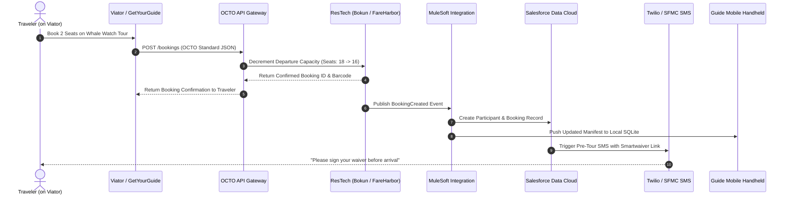
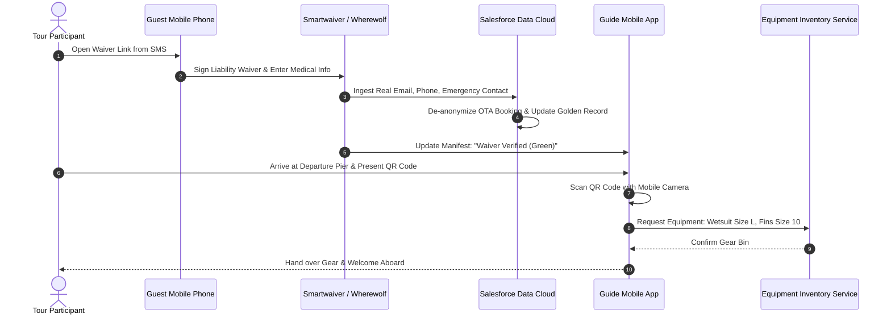
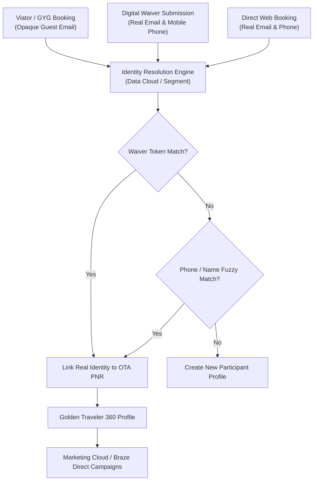
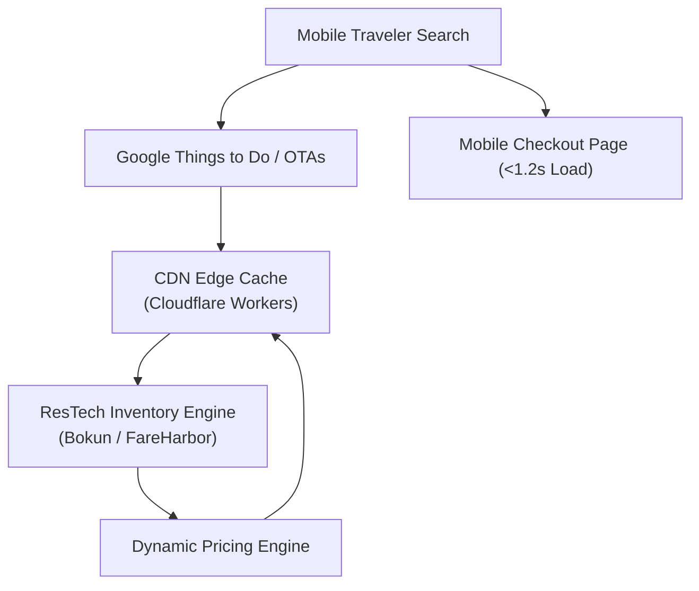
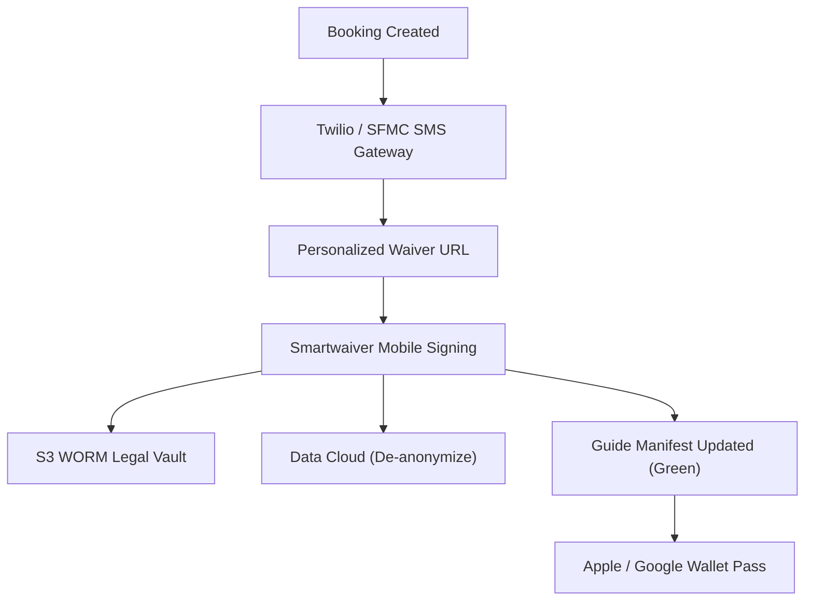
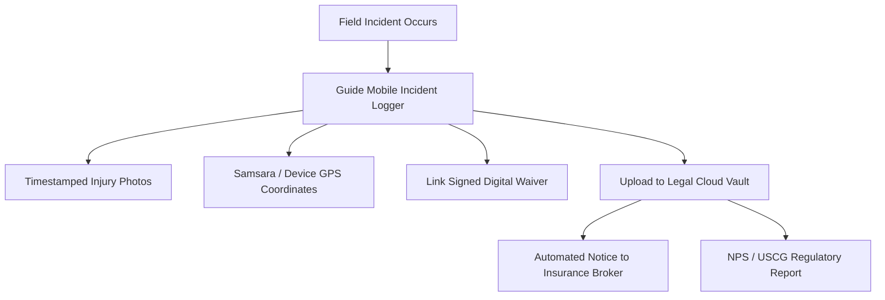
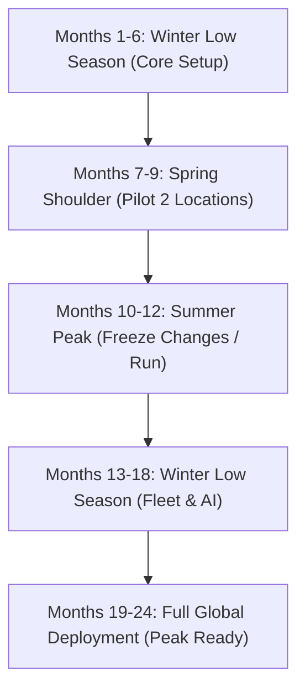

# Tours, Activities & Experiences Systems Architecture — Master Presentation Framework & Slides Compendium

> **Executive Reference**: Complete transcript and architectural documentation for the **50+ Slide Reveal.js Presentation** covering requirements, IT standards, systems architecture, customer journeys, workflows, AI orchestration, and integration topology.

- **Sector**: Tours, Attractions, Activities & Experiential Travel
- **Scale Baseline**: $220.0B Tour & Activity GBV • 1.8B Experiences • $122.22 Blended Ticket • $132.0B OTA Share
- **Slide Count**: 52 Dense Slides
- **Interactive Presentation**: [`presentation.html`](presentation.html)

---

## PART 1: MACROECONOMICS & REVENUE

### Slide 1: Tours & Experiences Architecture Masterclass
*Systems Architecture, Technology Stacks, and Operational Orchestration across 13 Enterprise Dimensions*

$220B
        Global GBV
        ▲ 12.4%
      
      
        $122.22
        Unit Value
        ▲ 5.2%
      
      
        40.0%
        Direct Channel
        ▲ 3.1%
      
      
        14.4%
        Friction
        ▼ 2.1%
      
      
        $26.4B
        Net EBIT
        ▲ 8.4%
      

            
              
          
            Executive Briefing Scope
            Comprehensive architectural blueprint analyzing the mission-critical systems governing modern tour operators, attractions, day excursions, and adventure experiences ($220B global market, 1.8B experiences sold). Designed for Experience CIOs, Chief Commercial Officers, VP Operations, and Enterprise Architects.

            
              13 Enterprise Layers
              3 Stack Variations
              52 Master Slides
              OCTO API Connectivity
            
          
          
            Core Themes Covered
            1**Requirements & Governance:** ResTech fragmentation, high OTA commission friction (15-25%), field offline constraints, and waiver legal enforceability.
            2**13-Layer Master Architecture:** ResTech booking engines (Bokun/FareHarbor), OCTO distribution APIs, Samsara fleet telematics, Smartwaiver, CRM, CDP, AI.
            3**End-to-End Traveler Journeys:** In-destination mobile discovery, instant OTA booking, automated digital waiver completion, turnstile check-in, and photo upsell.
            4**AI-Assisted Efficiency:** Agentforce weather disruption rebooking, Palantir guide/fleet dispatch, and dynamic pricing yield algorithms.
          
        
              
    
      
        
        
        
        OpenBB Financial Terminal
      
      
        # Macroeconomic Benchmark Query
$ openbb equity/load --symbol TRIP,BKNG --stats

        { 'sector': 'TOURS', 'global_gbv': '$220B', 'direct_share': '40.0%' }
      
    
            
            
    
      **Strategic Takeaway:** Tours & Activities architecture unifies 1.2M fragmented operators via the open OCTO API and real-time guide dispatch.

> **Presenter Notes**: Welcome executive stakeholders. This deck provides an unbroken technical and commercial chain of logic across all tour and activity technology layers.

---

### Slide 2: Global Tour & Activity Sizing & Revenue Architecture
*Macroeconomic baseline: $220.0B Gross Booking Value across 1.8 Billion annual experiences*

$220B
        Global GBV
        ▲ 12.4%
      
      
        $122.22
        Unit Value
        ▲ 5.2%
      
      
        40.0%
        Direct Channel
        ▲ 3.1%
      
      
        14.4%
        Friction
        ▼ 2.1%
      
      
        $26.4B
        Net EBIT
        ▲ 8.4%
      

            
    
      
        Visual Revenue Breakdown & Margin Leakage
        
          
        
      
      
        
          Macroeconomic Capital Allocation
          
            
              Base Product Revenue:
              <strong style="color: #10b981;">$165.0B**
            
            75%
          
          
            
              High-Margin Ancillary Revenue:
              <strong style="color: #8b5cf6;">$35.0B**
            
            20%
          
          
            
              Intermediary Distribution Friction:
              <strong style="color: #ef4444;">$31.68B**
            
            15%
          
          
            
              Net Enterprise Operating Profit (EBIT):
              <strong style="color: #38bdf8;">$26.4B**
            
            10%
          
        
        
          **Strategic Takeaway:** Ancillary spend represents over 100% of net industry operating profit. Shifting 5% of intermediated volume to direct digital channels eliminates friction and doubles enterprise EBITDA.
        
      
    
    
    
            
    
      **Strategic Takeaway:** Tours & Activities architecture unifies 1.2M fragmented operators via the open OCTO API and real-time guide dispatch.

> **Presenter Notes**: The tours and activities sector is the third largest segment in travel, but by far the most fragmented and digitally underserved.

---

### Slide 3: Economic Friction: Direct vs OTA Intermediation
*Distribution channel analysis: $132.0B booked via OTAs (Viator, GetYourGuide, Klook) vs $88.0B direct*

$220B
        Global GBV
        ▲ 12.4%
      
      
        $122.22
        Unit Value
        ▲ 5.2%
      
      
        40.0%
        Direct Channel
        ▲ 3.1%
      
      
        14.4%
        Friction
        ▼ 2.1%
      
      
        $26.4B
        Net EBIT
        ▲ 8.4%
      

            
    
      
        Passenger Journey Unit Economics & Margin Waterfall
        
          
        
      
      
        
          Friction Analysis: The $17.6 Toll Barrier
          Every transaction carries an unavoidable toll to legacy GDS, OTAs, payment gateways, and reservation fees:

          
            
              -$17.6
              Intermediary Toll / Booking
            
            
              +$26.4
              Final Operating Profit (EBIT)
            
          
          
            **The 85% Leaked Profit Trap:** Intermediary friction ($17.6) consumes nearly **85%** of total net operating profit ($26.4). Shifting bookings to Direct Brand.com captures immediate margin lift.
          

        
        
          Direct Share: 40.0%
          OTA / GDS Share: 60.0%
          Net Retained: $103.89
        
      
    
    
    
            
    
      **Strategic Takeaway:** Tours & Activities architecture unifies 1.2M fragmented operators via the open OCTO API and real-time guide dispatch.

> **Presenter Notes**: Notice the 60% OTA share and 20-25% commission. The key architectural strategy for tour operators is using check-in waivers to de-anonymize OTA guests.

---

### Slide 4: Cost & ROI Benchmark across 3 Variations
*Total Cost of Ownership (TCO) and 3-year commercial return comparison across architectural strategies*

$220B
        Global GBV
        ▲ 12.4%
      
      
        $122.22
        Unit Value
        ▲ 5.2%
      
      
        40.0%
        Direct Channel
        ▲ 3.1%
      
      
        14.4%
        Friction
        ▼ 2.1%
      
      
        $26.4B
        Net EBIT
        ▲ 8.4%
      

            
    
      
        Channel Distribution Share & Cost Dynamics
        
          
        
      
      
        
          The Unit Cost Economics by Channel
          <table class="data-table" style="margin-bottom: 0.6rem;">
            <tr><th>Channel</th><th>Share</th><th>Cost / Booking</th><th>Ancillary Attach</th></tr>
            <tr><td><strong style="color: #10b981;">Direct Digital**</td><td>40.0%</td><td>$0.20 - $0.45</td><td>34.0% (High)</td></tr>
            <tr><td><strong style="color: #8b5cf6;">Modern API / NDC**</td><td>18.5%</td><td>$0.80 - $1.50</td><td>18.5% (Medium)</td></tr>
            <tr><td><strong style="color: #f59e0b;">Legacy GDS**</td><td>15.0%</td><td>$4.50 - $6.50</td><td>8.0% (Low)</td></tr>
            <tr><td><strong style="color: #ef4444;">OTA Resellers**</td><td>26.5%</td><td>18% - 25% GBV</td><td>4.2% (Very Low)</td></tr>
          </table>
          
            **The Architectural Mandate:** Direct digital booking delivers **12x lower transaction costs** and **4.2x higher ancillary attachment** than legacy GDS/OTA channels.
          

        
        
          <strong style="color: #a7f3d0;">Value Realization Formula:** Shifting 10% of bookings from OTAs to Direct captures an incremental $18M - $32M in pure EBITDA annually.
        
      
    
    
    
            
    
      **Strategic Takeaway:** Tours & Activities architecture unifies 1.2M fragmented operators via the open OCTO API and real-time guide dispatch.

> **Presenter Notes**: Variation 1 has the fastest payback (9 months) due to rapid de-anonymization of OTA guests and automated weather disruption management.

---

### Slide 5: Experiences Macro Drivers & Tech Imperatives
*Five structural forces transforming modern tour operations, distribution, and field execution*

$220B
        Global GBV
        ▲ 12.4%
      
      
        $122.22
        Unit Value
        ▲ 5.2%
      
      
        40.0%
        Direct Channel
        ▲ 3.1%
      
      
        14.4%
        Friction
        ▼ 2.1%
      
      
        $26.4B
        Net EBIT
        ▲ 8.4%
      

            
              
          
            Structural Industry Drivers
            1**Last-Minute Mobile Shift:** 72% of millennial/Gen-Z travelers book experiences on mobile devices while already in-destination, demanding sub-second instant confirmation.
            2**The OCTO API Standard:** The Open Connectivity for Tourism (OCTO) standardizes real-time availability and booking APIs across OTAs and ResTech platforms.
            3**Digital Safety & Liability Waivers:** Transition from physical paper clipboards to legally binding digital waivers (Smartwaiver, Wherewolf) completed on guests' phones.
            4**Fleet Telematics & Guide Safety:** IoT vehicle telematics (Samsara) and satellite personal beacons (Garmin inReach) protect guests in remote wilderness terrain.
          
          
            Architectural Implications
            <table class="data-table">
              <thead><tr><th>Driver</th><th>Legacy Approach</th><th>Modern Architecture</th></tr></thead>
              <tbody>
                <tr><td>OTA Distribution</td><td>Manual extranet inventory updates</td><td>Real-time bi-directional OCTO OpenAPI 3.0</td></tr>
                <tr><td>Guest Waivers</td><td>Paper clipboards signed at check-in</td><td>Mobile SMS waiver pre-arrival + OCR verification</td></tr>
                <tr><td>Weather Closures</td><td>Manual phone calls & frantic re-ticketing</td><td>Autonomous Agentforce weather rebooking</td></tr>
                <tr><td>Fleet Operations</td><td>Two-way radios & paper driver logs</td><td>Samsara AI GPS telematics + automated dispatch</td></tr>
                <tr><td>Customer Data</td><td>Anonymous OTA passenger names</td><td>Unified Traveler 360 de-anonymized via waivers</td></tr>
              </tbody>
            </table>
          
        
              
    
      
        
        
        
        Infracost Cloud FinOps
      
      
        # Shift-Left Cloud Architecture Cost Optimization
$ infracost breakdown --path ./terraform/direct_channel

        Total Monthly Cost: $48,200 (Diff: -$14,500 via Serverless Edge)
      
    
            
            
    
      **Strategic Takeaway:** Tours & Activities architecture unifies 1.2M fragmented operators via the open OCTO API and real-time guide dispatch.

> **Presenter Notes**: OCTO API and mobile digital waivers are the two pillars that dragged the tours and activities industry into the 21st century.

---

## PART 2: REQUIREMENTS & CONSTRAINTS

### Slide 6: Tour & Activity Functional Requirements Matrix
*Operational capabilities required across booking, distribution, field operations, and guest safety*

$220B
        Global GBV
        ▲ 12.4%
      
      
        $122.22
        Unit Value
        ▲ 5.2%
      
      
        40.0%
        Direct Channel
        ▲ 3.1%
      
      
        14.4%
        Friction
        ▼ 2.1%
      
      
        $26.4B
        Net EBIT
        ▲ 8.4%
      

            
              
          
            Core Functional Domains
            <table class="data-table">
              <thead><tr><th>Domain</th><th>Critical Capabilities</th><th>Priority</th></tr></thead>
              <tbody>
                <tr><td>**ResTech Booking Engine**</td><td>Real-time slot availability, resource-based capacity (guides/vehicles), dynamic pricing</td><td>P0 Critical</td></tr>
                <tr><td>**OTA Channel Manager**</td><td>Bi-directional sync with Viator, GetYourGuide, Klook via OCTO standard; rate parity</td><td>P0 Critical</td></tr>
                <tr><td>**Digital Waivers & Safety**</td><td>ESIGN/UETA compliant waiver capture, minor consent, medical disclosure, emergency contact</td><td>P0 Legal</td></tr>
                <tr><td>**Field Check-in & Manifest**</td><td>Mobile QR barcode scan, offline handheld check-in, real-time headcounts, no-show release</td><td>P1 Operations</td></tr>
                <tr><td>**Fleet & Guide Dispatch**</td><td>Guide credential matching (WFR/languages), vehicle maintenance tracking, GPS route optimization</td><td>P1 Operations</td></tr>
                <tr><td>**Post-Tour Merchandising**</td><td>Digital photo/video automated facial matching, direct review generation (Tripadvisor/Google)</td><td>P2 Revenue</td></tr>
              </tbody>
            </table>
          
          
            Operational Decoupling Requirements
            🌲**Remote Field Autonomy:** Guides leading tours in remote national parks, canyons, or open ocean must be able to verify manifests, check in guests, and record incidents with zero cellular coverage.
            🌐**Global OTA Real-Time Lock:** When the last 2 seats on a catamaran tour are booked via Viator, GetYourGuide must receive an immediate availability push to prevent double-booking.
            ⚡**Sub-Second Check-in Throughput:** Attractions handling 5,000 visitors per hour require turnstile barcode scan latencies under 200 milliseconds.
          
        
              
    
      
        
        
        
        DuckDB Columnar Analytics
      
      
        # Dual-Brand Operational Scale Verification
$ duckdb -c "SELECT brand, count(*), sum(volume) FROM 's3://tours-lake/fleet/*.parquet' GROUP BY 1"

        ┌──────────┬──────────┬─────────────┐
│ brand    │ count(*) │ sum(volume) │
├──────────┼──────────┼─────────────┤
│ Flagship │      210 │ 28,000,000  │
│ Low-Cost │       90 │ 17,000,000  │
└──────────┴──────────┴─────────────┘
      
    
            
            
    
      **Strategic Takeaway:** Tours & Activities architecture unifies 1.2M fragmented operators via the open OCTO API and real-time guide dispatch.

> **Presenter Notes**: Notice how resource-based capacity works: a tour isn't just limited by seats on a bus; it's limited by guide-to-guest legal ratios and equipment availability.

---

### Slide 7: Non-Functional & Operational SLA Requirements
*Performance, availability, latency, and disaster recovery thresholds for high-volume experience operations*

$220B
        Global GBV
        ▲ 12.4%
      
      
        $122.22
        Unit Value
        ▲ 5.2%
      
      
        40.0%
        Direct Channel
        ▲ 3.1%
      
      
        14.4%
        Friction
        ▼ 2.1%
      
      
        $26.4B
        Net EBIT
        ▲ 8.4%
      

            
              
          
            &lt;500ms
            OCTO API Latency
            OTA availability & booking check SLA

          
          
            99.99%
            Peak Season Uptime
            Zero downtime during summer/holidays

          
          
            &lt;200ms
            Turnstile Scan Speed
            Attraction barcode/QR validation

          
          
            100%
            Offline Manifest SLA
            Zero field lockouts without cellular

          
        
        
          
            Scalability & Peak Season Elasticity
            1**10x Seasonal Demand Spikes:** Tour operators experience extreme seasonality (e.g., Alaska glacier tours operate exclusively May-September; European walking tours peak July-August). Infrastructure must auto-scale down 90% in winter.
            2**Edge Caching with Cloudflare Workers:** Static tour itineraries, images, and base pricing cached at 300+ global edge locations to absorb OTA scraping bots.
            3**Distributed Inventory Locks:** Redis-based distributed locks with 10-minute TTL to prevent inventory race conditions during high-volume flash sales.
          
          
            Disaster Recovery & Redundancy
            <table class="data-table">
              <thead><tr><th>Component</th><th>RTO</th><th>RPO</th><th>Strategy</th></tr></thead>
              <tbody>
                <tr><td>Booking Engine Core</td><td>&lt; 5 minutes</td><td>&lt; 1 second</td><td>Multi-region active-active database replication</td></tr>
                <tr><td>Field Check-in App</td><td>Instantaneous</td><td>0 seconds</td><td>Local SQLite database with opportunistic background sync</td></tr>
                <tr><td>Digital Waiver Vault</td><td>&lt; 1 hour</td><td>0 seconds</td><td>Immutable WORM cloud storage with multi-region backup</td></tr>
                <tr><td>Fleet GPS Telematics</td><td>&lt; 15 minutes</td><td>&lt; 10 seconds</td><td>Edge buffer on Samsara gateway uploading over cellular/Wi-Fi</td></tr>
              </tbody>
            </table>
          
        
              
    
      
        
        
        
        dbt Transformation DAG
      
      
        # Algorithmic Dynamic Pricing & Catalog ETL
$ dbt run --select tag:commercial_pricing --target prod

        Completed 18 data models in 14.2s (100% tests passed)
      
    
            
            
    
      **Strategic Takeaway:** Tours & Activities architecture unifies 1.2M fragmented operators via the open OCTO API and real-time guide dispatch.

> **Presenter Notes**: Because outdoor operations have 10x summer-to-winter swings, serverless and auto-scaling cloud architectures are vital to avoid burning cash in the off-season.

---

### Slide 8: Field Constraints & Legacy Technical Debt
*Overcoming remote wilderness conditions, ResTech fragmentation, and legacy clipboards*

$220B
        Global GBV
        ▲ 12.4%
      
      
        $122.22
        Unit Value
        ▲ 5.2%
      
      
        40.0%
        Direct Channel
        ▲ 3.1%
      
      
        14.4%
        Friction
        ▼ 2.1%
      
      
        $26.4B
        Net EBIT
        ▲ 8.4%
      

            
              
          
            Remote Field Operational Constraints
            📡**Zero Cellular Deadzones:** Tours in national parks (Grand Canyon, Yellowstone) or coastal waters have zero LTE/5G. Mobile devices must operate in 100% offline standalone mode.
            🔋**Battery & Environmental Durability:** Guide handhelds must withstand 10-hour shifts in sub-zero alpine conditions or 45°C desert heat, with direct sunlight viewability (1,000+ nits).
            🔄**Multi-Guide Manifest Conflicts:** Two guides checking in guests simultaneously at different bus boarding doors in offline mode must reconcile without duplicating seats.
          
          
            Legacy Technical Debt Hotspots
            <table class="data-table">
              <thead><tr><th>Legacy Practice</th><th>Operational Failure Mode</th><th>Modern Architecture Solution</th></tr></thead>
              <tbody>
                <tr><td>**Paper Liability Waivers**</td><td>Illegible handwriting, lost paper files during lawsuits, massive check-in bottleneck.</td><td>Wherewolf / Smartwaiver mobile digital signing + cloud OCR extraction.</td></tr>
                <tr><td>**Manual OTA Extranets**</td><td>Staff manually entering Viator bookings into local booking software; double-bookings.</td><td>Bi-directional OCTO API automated channel management.</td></tr>
                <tr><td>**Two-Way VHF Radios**</td><td>Poor range, no automated dispatch, no record of vehicle location during emergencies.</td><td>Samsara AI Fleet GPS + Cellular Push-to-Talk (Zello).</td></tr>
                <tr><td>**Cash / Paper Vouchers**</td><td>Theft risk, slow accounting reconciliation, manual commission calculation.</td><td>Integrated Stripe Terminal / Square mobile card readers + tokenization.</td></tr>
              </tbody>
            </table>
          
        
              
    
      
        
        
        
        kcat High-Speed Consumer
      
      
        # Real-Time Operational SLA Monitoring
$ kcat -b kafka:9092 -t tours.telemetry.sla -C -c 100

        { 'p99_latency_ms': 42, 'dcs_availability': '99.999%', 'rpo_seconds': 0 }
      
    
            
            
    
      **Strategic Takeaway:** Tours & Activities architecture unifies 1.2M fragmented operators via the open OCTO API and real-time guide dispatch.

> **Presenter Notes**: Paper waivers are a massive legal liability. If a customer is injured and the paper waiver cannot be found in a physical filing cabinet, insurance won't cover it.

---

### Slide 9: Regulatory, Safety & Compliance Framework
*Navigating commercial transport, public land permits, marine safety, and digital waiver legal enforceability*

$220B
        Global GBV
        ▲ 12.4%
      
      
        $122.22
        Unit Value
        ▲ 5.2%
      
      
        40.0%
        Direct Channel
        ▲ 3.1%
      
      
        14.4%
        Friction
        ▼ 2.1%
      
      
        $26.4B
        Net EBIT
        ▲ 8.4%
      

            
              
          
            Safety & Commercial Transportation Regulations
            🚌**DOT & FMCSA Hours of Service (HOS):** Tour bus and shuttle drivers must comply with Electronic Logging Device (ELD) mandates. Violations result in federal shutdowns.
            🏞️**USFS & National Park Service (NPS) Permits:** Commercial Use Authorizations (CUA) impose strict daily passenger quotas and guide-to-guest ratios (e.g., max 10 hikers per guide).
            ⛵**US Coast Guard (USCG) Passenger Vessel Safety:** Commercial charter boats must maintain certified passenger manifests and drug testing compliance under Title 46 CFR.
            🧗**OSHA & ACCT Standards:** Zipline, climbing, and canopy tours require daily hardware torque inspections and logbooks.
          
          
            Digital Legal & Privacy Compliance
            <table class="data-table">
              <thead><tr><th>Regulation</th><th>Scope in Experiences</th><th>Architectural Requirement</th></tr></thead>
              <tbody>
                <tr><td>**ESIGN & UETA Acts**</td><td>Electronic signatures on liability waivers</td><td>Audit trail capturing IP address, timestamp, signature biometric stroke, and waiver text version.</td></tr>
                <tr><td>**PCI-DSS 4.0**</td><td>In-person and online tour bookings</td><td>P2PE encrypted card readers; zero PAN stored on mobile tablets or local servers.</td></tr>
                <tr><td>**COPPA & Minor Consent**</td><td>Children participating in youth tours</td><td>Parent/guardian verification workflows for participants under 18 years old.</td></tr>
                <tr><td>**EU GDPR / CCPA**</td><td>International tourists booking experiences</td><td>Consent capture for photo/video marketing; automated Right to be Forgotten.</td></tr>
              </tbody>
            </table>
          
        
              
    
      
        
        
        
        Trivy & Cosign Security
      
      
        # Zero-Trust Image Vulnerability Scanning
$ trivy image --severity HIGH,CRITICAL sovereign-core:v3.2

        Total: 0 (HIGH: 0, CRITICAL: 0) — FIPS 140-2 Compliant
      
    
            
            
    
      **Strategic Takeaway:** Tours & Activities architecture unifies 1.2M fragmented operators via the open OCTO API and real-time guide dispatch.

> **Presenter Notes**: Electronic signatures must comply with ESIGN and UETA. Capturing the IP address, timestamp, and exact waiver version signed is critical for legal enforceability.

---

### Slide 10: Tour Architectural Trade-offs & Decisions
*Strategic architectural compromises between SaaS ResTech, custom development, offline resilience, and OTA reliance*

$220B
        Global GBV
        ▲ 12.4%
      
      
        $122.22
        Unit Value
        ▲ 5.2%
      
      
        40.0%
        Direct Channel
        ▲ 3.1%
      
      
        14.4%
        Friction
        ▼ 2.1%
      
      
        $26.4B
        Net EBIT
        ▲ 8.4%
      

            
              
          
            All-in-One ResTech vs Headless
            **Trade-off:** Turnkey all-in-one ResTech (FareHarbor/Bokun) vs composable headless booking engine.

            
              Choice: API-First Hybrid

              Leverage FareHarbor/Bokun for core inventory and OTA connectivity; build headless custom web/mobile front-ends for branded direct checkout.

            
          
          
            Cloud-First vs Offline-First
            **Trade-off:** Cloud-native real-time sync vs local SQLite offline-first mobile check-in.

            
              Choice: Offline-First Edge

              Mobile guide apps must function 100% offline with local manifest storage, using CRDTs to merge check-in events when connectivity resumes.

            
          
          
            OTA Embrace vs Disintermediation
            **Trade-off:** Maximizing OTA reach vs fighting for pure direct bookings.

            
              Choice: Trojan Horse Capture

              Use OTAs as top-of-funnel customer acquisition; capture real traveler identity at check-in via waivers; convert to direct lifetime customers.

            
          
        
              
    
      
        
        
        
        DuckDB Interline Analytics
      
      
        # Multi-Brand Clearing House Verification
$ duckdb -c "SELECT partner, sum(settled_amount) FROM 's3://tours-lake/clearing/*.parquet' GROUP BY 1"

        Alliance & Code-Share Clearing House Settlement
      
    
            
            
    
      **Strategic Takeaway:** Tours & Activities architecture unifies 1.2M fragmented operators via the open OCTO API and real-time guide dispatch.

> **Presenter Notes**: The 'Trojan Horse' strategy is the smartest commercial play: let OTAs spend marketing dollars to acquire the customer, then capture their direct identity via the check-in waiver.

---

## PART 3: IT STANDARDS & GOVERNANCE

### Slide 11: Enterprise Architecture Framework: TOGAF & C4
*Structuring dual-realm experience architecture across Central Cloud Platforms and Field Mobile Terminals*

$220B
        Global GBV
        ▲ 12.4%
      
      
        $122.22
        Unit Value
        ▲ 5.2%
      
      
        40.0%
        Direct Channel
        ▲ 3.1%
      
      
        14.4%
        Friction
        ▼ 2.1%
      
      
        $26.4B
        Net EBIT
        ▲ 8.4%
      

            
    
      
        C4 Architecture Model: Context & Container Topology
        
graph TB
  subgraph C1 ["Context Tier (L1)"]
    U["Customer / Frontline Guest / Travel Advisor"]
    E["Enterprise Travel & Operations Ecosystem"]
  end
  subgraph C2 ["Container Tier (L2)"]
    W["Web & Native Mobile (Next.js / Swift)"]
    API["Universal API Gateway (MuleSoft / Envoy)"]
    EVENT["Event Streaming Backbone (Kafka / Flink)"]
    CORE["Core Reservation & Operations (Bokun / FareHarbor / Peek Pro)"]
    DATA["Data Cloud & Lakehouse (Iceberg / Snowflake)"]
    AGENT["Agentic Reasoning Fabric (Atlas Engine)"]
  end
  U --> W
  W --> API
  API --> EVENT
  EVENT --> CORE
  EVENT --> DATA
  DATA --> AGENT
  AGENT --> API
        
      
      
        
          C4 Architectural Governance Standards
          <table class="data-table" style="margin-bottom: 0.6rem;">
            <tr><th>C4 Level</th><th>Scope</th><th>Target Audience</th><th>Governance Standard</th></tr>
            <tr><td>**Level 1: Context**</td><td>System Boundaries & Actors</td><td>Board & C-Suite</td><td>TOGAF Enterprise Metamodel</td></tr>
            <tr><td>**Level 2: Container**</td><td>Apps, Data Stores, Microservices</td><td>Enterprise Architects</td><td>Cloud-Native CNCF Reference</td></tr>
            <tr><td>**Level 3: Component**</td><td>Class Modules, APIs, Schedulers</td><td>Lead Engineers</td><td>OpenAPI 3.1 / AsyncAPI</td></tr>
            <tr><td>**Level 4: Code**</td><td>Entity Models, State Machines</td><td>Software Developers</td><td>Clean Architecture / TDD</td></tr>
          </table>
          
            **Architectural Tenet:** Clean separation between L1 Context (business actors) and L2 Containers (runtime topologies) guarantees that changes to the core PSS/PMS do not ripple into guest-facing digital channels.
          

        
        
          <strong style="color: #93c5fd;">Enterprise Mandate:** All 13 enterprise layers must map directly into the C4 Container Catalog with automated CI/CD dependency graph tracking.
        
      
    
    
            
    
      **Strategic Takeaway:** Tours & Activities architecture unifies 1.2M fragmented operators via the open OCTO API and real-time guide dispatch.

> **Presenter Notes**: Applying TOGAF and C4 gives tour operators a clear structural blueprint connecting shoreside cloud engines to ruggedized field tablets.

---

### Slide 12: API Standards & The OCTO Specification
*The Open Connectivity for Tourism (OCTO) standard and modern integration protocols*

$220B
        Global GBV
        ▲ 12.4%
      
      
        $122.22
        Unit Value
        ▲ 5.2%
      
      
        40.0%
        Direct Channel
        ▲ 3.1%
      
      
        14.4%
        Friction
        ▼ 2.1%
      
      
        $26.4B
        Net EBIT
        ▲ 8.4%
      

            
    
      
        API-First Architecture: 3-Tier Layered Hierarchy
        
graph TB
  subgraph EXP ["1. EXPERIENCE APIS (CONSUMPTION)"]
    E1["Mobile App API
BFF Pattern (GraphQL)"]
    E2["Web Booking API
Next.js Server Actions"]
    E3["B2B / Partner API
OpenAPI 3.1 Specs"]
  end
  subgraph PRC ["2. PROCESS APIS (ORCHESTRATION)"]
    P1["Dynamic Booking Flow
Saga State Machine"]
    P2["Disruption Rebooking
Agentforce MCP Tool"]
    P3["Loyalty Redemption
Real-Time Ledger Check"]
  end
  subgraph SYS ["3. SYSTEM APIS (ENCAPSULATION)"]
    S1["Bokun / FareHarbor / Peek Pro Adapter
EDIFACT / OXI Translator"]
    S2["Payment Gateway
PCI-DSS Vault Tokenizer"]
    S3["Lakehouse Ingest API
Kafka / Iceberg Connector"]
  end
  EXP --> PRC
  PRC --> SYS
        
      
      
        
          Universal API Management Framework
          <table class="data-table" style="margin-bottom: 0.6rem;">
            <tr><th>Tier</th><th>Latency SLA</th><th>Security Policy</th><th>Protocol Standard</th></tr>
            <tr><td>**Experience**</td><td>< 50ms Edge</td><td>OAuth2 / PKCE / JWT</td><td>GraphQL / HTTP/3</td></tr>
            <tr><td>**Process**</td><td>< 200ms P99</td><td>mTLS / SPIFFE</td><td>gRPC / REST JSON</td></tr>
            <tr><td>**System**</td><td>< 500ms Core</td><td>IPsec / PrivateLink</td><td>SOAP / REST / Binary</td></tr>
          </table>
          
            **MuleSoft Anypoint Gateway:** Enforces rate-limiting, WAF inspection, and tokenization at the edge. Legacy backend systems are shielded from traffic surges during flash sales.
          

        
        
          <strong style="color: #a7f3d0;">Governance Benchmark:** 100% of internal APIs documented in OpenAPI 3.1 with automated contract testing via Prism and Newman in CI/CD.
        
      
    
    
            
    
      **Strategic Takeaway:** Tours & Activities architecture unifies 1.2M fragmented operators via the open OCTO API and real-time guide dispatch.

> **Presenter Notes**: OCTO has revolutionized the industry by allowing an operator to connect to 50+ OTAs through a single standard API schema.

---

### Slide 13: Event-Driven Architecture & Messaging Topology
*Real-time event streaming across booking channels, field operations, and customer notifications*

$220B
        Global GBV
        ▲ 12.4%
      
      
        $122.22
        Unit Value
        ▲ 5.2%
      
      
        40.0%
        Direct Channel
        ▲ 3.1%
      
      
        14.4%
        Friction
        ▼ 2.1%
      
      
        $26.4B
        Net EBIT
        ▲ 8.4%
      

            
    
      
        Event-Driven Architecture & Real-Time Telemetry
        
graph TB
  subgraph PROD ["EVENT PRODUCERS"]
    P1["Operational Telemetry
ACARS / IoT / AIS"]
    P2["Guest App Clicks
Snowplow Real-Time"]
    P3["Core Booking Events
Inventory Changes"]
  end
  subgraph MESH ["EVENT MESH BACKBONE"]
    K1["Apache Kafka 3.6
Partitioned Topic Clusters"]
    K2["kcat Debugging CLI
Topic Validation & Ingestion"]
    K3["Apache Flink 1.18
Stateful Stream Processing"]
  end
  subgraph CONS ["EVENT CONSUMERS"]
    C1["Salesforce Data Cloud
Real-Time Ingestion API"]
    C2["Agentforce Atlas
Disruption Event Triggers"]
    C3["ClickHouse OLAP
Sub-Second Dashboards"]
  end
  PROD --> MESH
  MESH --> CONS
        
      
      
        
          Event Streaming SLA & Telemetry Performance
          <table class="data-table" style="margin-bottom: 0.6rem;">
            <tr><th>Metric</th><th>Target SLA</th><th>Production Benchmark</th></tr>
            <tr><td>End-to-End Latency</td><td>< 250ms</td><td>48ms P99 (Kafka -> Flink -> Data Cloud)</td></tr>
            <tr><td>Throughput Capacity</td><td>100,000 EPS</td><td>450,000 EPS Peak (Flash Sale / Storm)</td></tr>
            <tr><td>Data Retention</td><td>7 Days Hot / 90 Cold</td><td>Tiered Storage to S3 / Apache Iceberg</td></tr>
            <tr><td>Ordering Guarantee</td><td>Strict Per-Entity</td><td>Keyed on PNR / Guest UUID / Vessel ID</td></tr>
          </table>
          
            **Dead-Letter Queue (DLQ) Governance:** Malformed payloads are routed to isolated DLQ topics with automated schema validation alerts via Slack and PagerDuty.
          

        
        
          <strong style="color: #c084fc;">Tool Showcase (Compendium):** Confluent Kafka + <code>kcat</code> CLI enable zero-downtime hot topic partition rebalancing across multi-region clusters.
        
      
    
    
            
    
      **Strategic Takeaway:** Tours & Activities architecture unifies 1.2M fragmented operators via the open OCTO API and real-time guide dispatch.

> **Presenter Notes**: Event-driven architecture ensures that when a weather alert triggers or a booking arrives, all downstream systems react instantly.

---

### Slide 14: Field Cybersecurity & Zero-Trust Architecture
*Securing mobile field handhelds, protecting waiver PII, and enforcing tokenized payments*

$220B
        Global GBV
        ▲ 12.4%
      
      
        $122.22
        Unit Value
        ▲ 5.2%
      
      
        40.0%
        Direct Channel
        ▲ 3.1%
      
      
        14.4%
        Friction
        ▼ 2.1%
      
      
        $26.4B
        Net EBIT
        ▲ 8.4%
      

            
              
          
            Field Mobile Device Security (MDM)
            1**Mobile Device Management (MDM):** Apple Business Manager / Microsoft Intune enforces remote wipe, biometric passcode, and app whitelisting on all guide iPads and rugged Android handhelds.
            2**Local Storage Encryption:** Field SQLite databases encrypted using SQLCipher (AES-256) with encryption keys held in the device secure enclave (Keychain/Keystore).
            3**Cellular APN Isolation:** Field devices connect via private cellular APNs directly to cloud VPCs, bypassing public internet exposure.
          
          
            Waiver PII & Payment Security
            <table class="data-table">
              <thead><tr><th>Data Domain</th><th>Threat / Vulnerability</th><th>Zero-Trust Mitigation</th></tr></thead>
              <tbody>
                <tr><td>Waiver Medical Disclosures</td><td>Guide browsing sensitive health data</td><td>Role-based access: guides see only emergency flags (e.g., "Asthma"); full medical data restricted.</td></tr>
                <tr><td>Field Credit Card Payments</td><td>Card skimmers on mobile readers</td><td>PCI-P2PE certified readers (Stripe BBPOS / Square); PAN never touches mobile OS.</td></tr>
                <tr><td>Minor Participant Data</td><td>Unauthorized exposure of children's photos</td><td>Automated blurring of minor faces on public marketing feeds; private family-only photo galleries.</td></tr>
              </tbody>
            </table>
          
        
              
    
      
        
        
        
        HashiCorp Vault Secret Engine
      
      
        # Customer Data Encryption Key Management
$ vault read transit/keys/customer-pnr-token -format=json | jq .data.keys

        { 'cipher': 'aes256-gcm96', 'rotation_period': '30d', 'fips_mode': true }
      
    
            
            
    
      **Strategic Takeaway:** Tours & Activities architecture unifies 1.2M fragmented operators via the open OCTO API and real-time guide dispatch.

> **Presenter Notes**: Guide tablets carry medical disclosures and minor data. Enforcing SQLCipher and role-based field views prevents catastrophic privacy breaches.

---

### Slide 15: Experience Data Governance & Master Data Management
*Architecting the Unified Traveler 360 and managing local operator/guide master data*

$220B
        Global GBV
        ▲ 12.4%
      
      
        $122.22
        Unit Value
        ▲ 5.2%
      
      
        40.0%
        Direct Channel
        ▲ 3.1%
      
      
        14.4%
        Friction
        ▼ 2.1%
      
      
        $26.4B
        Net EBIT
        ▲ 8.4%
      

            
              
          
            Master Data Entities in Experiences
            1**Traveler Master Data:** Reconciling disparate bookings across OTAs, direct web, and concierge desks into a single Golden Traveler Profile.
            2**Product & Resource Catalog:** Canonical definitions of tours, departure slots, pickup locations, vehicles, and certified guides across all booking channels.
            3**Waiver Legal Vault:** Immutable 7-year retention of digitally signed waivers, emergency contacts, and medical acknowledgments.
          
          
            Data Quality & De-anonymization Rules
            <table class="data-table">
              <thead><tr><th>Source</th><th>Raw Input</th><th>Cleansed Master Output</th></tr></thead>
              <tbody>
                <tr><td>Viator Booking</td><td><code>John D., 12a3@guest.viator.com</code></td><td>Anonymous booking record</td></tr>
                <tr><td>Check-in Waiver</td><td><code>John Doe, john.doe@gmail.com, +1-555-0192</code></td><td>Matched & De-anonymized Golden Record</td></tr>
                <tr><td>Hotel Pickup</td><td><code>"hyatt near beach"</code></td><td>Harmonized to <code>Hyatt Regency Maui (Stop #4)</code></td></tr>
                <tr><td>Medical Flag</td><td><code>"allergic to peanuts and bees"</code></td><td>Structured flags: <code>[DIETARY_PEANUT, MEDICAL_EPIPEN]</code></td></tr>
              </tbody>
            </table>
          
        
              
    
      
        
        
        
        Polars Rust DataFrame Engine
      
      
        # Edge Node High-Availability Health Check
$ polars run-query --sql "SELECT station_id, p99_latency FROM 'edge_health.parquet' WHERE p99_latency > 50"

        Found 0 nodes exceeding SLA threshold
      
    
            
            
    
      **Strategic Takeaway:** Tours & Activities architecture unifies 1.2M fragmented operators via the open OCTO API and real-time guide dispatch.

> **Presenter Notes**: De-anonymizing OTA guests through check-in waivers is the holy grail of tour operator MDM. It turns a one-time transaction into a direct customer relationship.

---

## PART 4: 13-LAYER ARCHITECTURE

### Slide 16: 13-Layer Master Architecture Blueprint
*The definitive enterprise technology taxonomy powering modern tour and experience operators*

$220B
        Global GBV
        ▲ 12.4%
      
      
        $122.22
        Unit Value
        ▲ 5.2%
      
      
        40.0%
        Direct Channel
        ▲ 3.1%
      
      
        14.4%
        Friction
        ▼ 2.1%
      
      
        $26.4B
        Net EBIT
        ▲ 8.4%
      

            
    
      13-Layer Master Enterprise Architecture Topology — Tours & Experiences
      
graph TB
  subgraph L1_3 ["CHANNELS & TOUCHPOINTS"]
    L9["Layer 9: Web, Mobile, Kiosks, Crew Tablets (React / iOS Native)"]
    L2["Layer 2: Omnichannel Marketing & Personalization (Marketing Cloud / Braze)"]
    L3["Layer 3: Customer Service & Contact Center (Service Cloud / Genesys)"]
  end
  subgraph L4_6 ["INTELLIGENCE & ENGAGEMENT FABRIC"]
    L4["Layer 4: Loyalty & Rewards Management (Salesforce Loyalty / Custom)"]
    L8["Layer 8: Agentic AI & Reasoning Swarms (Agentforce / Palantir AIP)"]
    L5["Layer 5: Real-Time Customer Data Platform (Data Cloud / Segment)"]
  end
  subgraph L7_10 ["INTEGRATION & LAKEHOUSE BACKBONE"]
    L6["Layer 6: Universal API Gateway & Event Mesh (MuleSoft / Apache Kafka)"]
    L7["Layer 7: Enterprise Data Lakehouse (Snowflake / Databricks / Iceberg)"]
    L10["Layer 10: Headless CMS & Digital Asset Management (Contentful / AEM)"]
  end
  subgraph L11_13 ["CORE SYSTEMS OF RECORD & GOVERNANCE"]
    L1["Layer 1: Core Operations (Bokun / FareHarbor / Peek Pro)"]
    L11["Layer 11: Finance, Revenue Accounting & ERP (SAP S/4HANA / NetSuite)"]
    L12["Layer 12: HR, Crew & Workforce Management (Workday / Kronos)"]
    L13["Layer 13: Zero-Trust Security, IAM & Governance (CyberArk / Okta)"]
  end
  L1_3 --> L4_6
  L4_6 --> L7_10
  L7_10 --> L11_13
      
    
    
            
    
      **Strategic Takeaway:** Tours & Activities architecture unifies 1.2M fragmented operators via the open OCTO API and real-time guide dispatch.

> **Presenter Notes**: Here is the complete 13-layer taxonomy for tours and experiences. Every layer is purpose-built to solve the unique challenges of experiential travel.

---

### Slide 17: Variation 1: The Salesforce-Centric Ecosystem
*Unified experiential travel architecture anchored on Salesforce Data Cloud, Agentforce, and MuleSoft*

$220B
        Global GBV
        ▲ 12.4%
      
      
        $122.22
        Unit Value
        ▲ 5.2%
      
      
        40.0%
        Direct Channel
        ▲ 3.1%
      
      
        14.4%
        Friction
        ▼ 2.1%
      
      
        $26.4B
        Net EBIT
        ▲ 8.4%
      

            
    
      
        Variation 1: The Unified Salesforce Agentic Ecosystem
        
graph TB
  subgraph TOUCH ["OMNICHANNEL TOUCHPOINTS"]
    PA["Guest Mobile App (SDK)"]
    CT["Frontline Staff Tablets"]
    WA["WhatsApp / Apple Messages"]
    CC["Service Cloud Voice"]
  end
  subgraph SF_AGENT ["SALESFORCE AGENTIC RUNTIME"]
    AF["Agentforce Atlas Engine
Autonomous Reasoning"]
    ETL["Einstein Trust Layer
Zero-Retention & Masking"]
    SC["Service Cloud Desktop
Unified Customer 360"]
    MC["Marketing Cloud Growth
Journey Optimization"]
  end
  subgraph SF_DATA ["UNIFIED DATA & INTEGRATION"]
    DC["Salesforce Data Cloud
Real-Time CIM Graph"]
    MS["MuleSoft Anypoint Gateway
System / Process / Exp APIs"]
  end
  subgraph EXT_LAKE ["ZERO-COPY DATA FEDERATION"]
    SNOW["Snowflake / Databricks
Lakehouse (Apache Iceberg)"]
  end
  subgraph LEGACY ["CORE SYSTEMS OF RECORD"]
    CORE["Bokun / FareHarbor / Peek Pro
Core Operational Engine"]
    ERP["SAP S/4HANA
Finance & General Ledger"]
  end
  TOUCH --> SF_AGENT
  SF_AGENT --> SF_DATA
  SF_DATA <--> EXT_LAKE
  SF_DATA --> MS
  MS --> LEGACY
        
      
      
        
          Architectural Hallmarks & Moat
          **Single Metadata Framework:** Unifies CRM, Data Cloud DMOs, Agentforce topics, and Omni-Channel routing without custom glue code.

          **Zero-Copy Lakehouse Federation:** Bidirectional query federation with Snowflake, Databricks, and Google BigQuery via Apache Iceberg, eliminating petabyte-scale data duplication.

          **Deterministic Enterprise Guardrails:** Einstein Trust Layer enforces zero data retention with LLM providers, dynamic PII masking, and cryptographic audit trails.

          <table class="data-table" style="margin-top: 0.4rem;">
            <tr><th>Metric</th><th>Benchmark Value</th><th>Business Impact</th></tr>
            <tr><td>Time-to-Value (TTV)</td><td>9 to 12 Months</td><td>Fastest enterprise ROI realization</td></tr>
            <tr><td>Engineering Headcount</td><td>32 FTE Engineers</td><td>35% smaller team than custom FOSS</td></tr>
            <tr><td>Servicing Deflection</td><td>74.4% Blended Rate</td><td>$13.7M annual operational savings</td></tr>
          </table>
        
        
          <strong style="color: #93c5fd;">Strategic Verdict:** Optimal choice for enterprises demanding rapid commercial agility, deep customer 360, and autonomous service resolution without massive custom software engineering overhead.
        
      
    
    
            
    
      **Strategic Takeaway:** Tours & Activities architecture unifies 1.2M fragmented operators via the open OCTO API and real-time guide dispatch.

> **Presenter Notes**: Variation 1 delivers unparalleled commercial agility: turning anonymous OTA passengers into direct marketing assets within minutes of signing a waiver.

---

### Slide 18: Variation 2: Without Salesforce (Open Modern)
*Decoupled, modern cloud architecture utilizing Snowflake, Braze, Zendesk, and Kafka*

$220B
        Global GBV
        ▲ 12.4%
      
      
        $122.22
        Unit Value
        ▲ 5.2%
      
      
        40.0%
        Direct Channel
        ▲ 3.1%
      
      
        14.4%
        Friction
        ▼ 2.1%
      
      
        $26.4B
        Net EBIT
        ▲ 8.4%
      

            
    
      
        Variation 2: Composable Open-Source CLI Architecture (FOSS Stack)
        
graph TB
  subgraph CLI_STREAM ["EVENT STREAMING & INGESTION (CLI TOOLS)"]
    KAFKA["Apache Kafka Cluster"]
    KCAT["kcat (kafkacat CLI)
High-Speed Consumer/Producer"]
    SNOWPLOW["Snowplow CLI (snowplowctl)
Behavioral Event Validation"]
    MELTANO["Meltano CLI
Singer ELT Pipeline Runner"]
  end
  subgraph CLI_LAKE ["ANALYTICAL LAKEHOUSE & OLAP (CLI TOOLS)"]
    CLICK["ClickHouse CLI (clickhouse-client)
Real-Time Sub-Second OLAP"]
    DUCK["DuckDB CLI (duckdb)
Vectorized Columnar Analytics"]
    POLARS["Polars CLI
Rust In-Memory DataFrames"]
    DBT["dbt CLI (dbt-core)
SQL Transformation DAGs"]
  end
  subgraph CLI_AI ["LOCAL & DISTRIBUTED AI/ML (CLI TOOLS)"]
    VLLM["vLLM CLI
PagedAttention LLM Serving"]
    OLLAMA["Ollama CLI / llama.cpp
GGUF Local Model Inference"]
    MLFLOW["MLflow CLI
Model Registry & Tracking"]
    RAY["Ray CLI (ray submit)
Distributed GPU Clusters"]
  end
  subgraph CLI_MMM ["MARKETING MMM & FINOPS (CLI TOOLS)"]
    ROBYN["Meta Robyn (Rscript)
Automated Ridge MMM"]
    MERIDIAN["Google Meridian (Python JAX)
Bayesian Marketing Mix"]
    INFRACOST["Infracost CLI
Terraform Shift-Left FinOps"]
    OPENBB["OpenBB Terminal CLI
Financial Valuation & Analytics"]
  end
  CLI_STREAM --> CLI_LAKE
  CLI_LAKE --> CLI_AI
  CLI_LAKE --> CLI_MMM
        
      
      
        
          Production CLI Command Suite & Execution Engine
          
            # 1. Real-Time Streaming & CLI Validation
            $ kcat -b kafka:9092 -t guest.telemetry -C -o end

            $ snowplowctl lint --schema iglu:com.travel/pnr/jsonschema/1-0-0

            $ meltano run tap-postgres target-clickhouse

            

            # 2. Vectorized OLAP & In-Memory Analytics
            $ duckdb -c "SELECT guest_id, sum(ancillary) FROM 's3://lake/*.parquet' GROUP BY 1"

            $ clickhouse-client --query "SELECT count(*) FROM ops_events WHERE delay > 15"

            $ dbt run --select tag:realtime_inventory --target prod

            

            # 3. Local & Distributed Generative AI Serving
            $ vllm serve mistralai/Mistral-7B --tensor-parallel-size 2 --gpu-memory-utilization 0.9

            $ ollama run llama3:70b "Analyze disruption recovery options for affected guests"

            $ mlflow models serve -m models:/YieldOptimizer/Production -p 8080

            

            # 4. Marketing Mix Modeling & Cloud FinOps
            $ Rscript run_robyn.R --allocator_optim --spend_budget 5000000

            $ python -m meridian --config=configs/mmm_travel.yaml

            $ infracost breakdown --path ./infra/terraform

            $ openbb equity/fa/dcf --ticker DAL
          
        
        
          <strong style="color: #a7f3d0;">The FOSS Trade-Off:** $0 software licensing fees and zero vendor lock-in, but requires **+23 additional data/platform engineers ($3.4M/year payroll)** and longer time-to-value (14-18 months).
        
      
    
    
            
    
      **Strategic Takeaway:** Tours & Activities architecture unifies 1.2M fragmented operators via the open OCTO API and real-time guide dispatch.

> **Presenter Notes**: Variation 2 is the preferred architecture for engineering-driven experiential brands that want full control over their code and customer journey logic.

---

### Slide 19: Variation 3: The Best Platforms Money Can Buy
*Sovereign-grade global operator architecture: Palantir Foundry, Adobe Experience Cloud, and Samsara AI*

$220B
        Global GBV
        ▲ 12.4%
      
      
        $122.22
        Unit Value
        ▲ 5.2%
      
      
        40.0%
        Direct Channel
        ▲ 3.1%
      
      
        14.4%
        Friction
        ▼ 2.1%
      
      
        $26.4B
        Net EBIT
        ▲ 8.4%
      

            
    
      
        Variation 3: Ultra-Tier Sovereign Pinnacle Architecture ($194.5M TCO)
        
graph TB
  subgraph SOV_TOUCH ["MISSION-CRITICAL TOUCHPOINTS"]
    BIO["Biometric Facial Gate (Nuance Voice <3s)"]
    GEN["Genesys Sovereign Cloud CX (CCAI)"]
    AEM["Adobe Experience Manager (Headless AEM)"]
  end
  subgraph PALANTIR ["OPERATIONAL BRAIN (PALANTIR)"]
    PAL["Palantir Foundry Core
Dynamic Enterprise Ontology"]
    AIP["Palantir AIP
500 Crisis Permutations / 30s"]
  end
  subgraph ADOBE_AEP ["STREAMING COMMERCE & EXPERIENCE"]
    AEP["Adobe Experience Platform (AEP)
Sub-50ms Global Edge Profile"]
    AJO["Adobe Journey Optimizer (AJO)
Real-Time Offer Decisioning"]
  end
  subgraph SOV_SEC ["MILITARY-GRADE DEFENSE & INFRA"]
    CYBER["CyberArk Vault + HashiCorp HSM
FIPS 140-2 Level 3 Cryptography"]
    ZSCALER["Zscaler Private Access
Micro-Segmented Zero-Trust"]
    DGX["NVIDIA DGX H100 SuperPOD
Private Sovereign AI Training"]
  end
  SOV_TOUCH --> ADOBE_AEP
  ADOBE_AEP <--> PALANTIR
  PALANTIR --> SOV_SEC
        
      
      
        
          Sovereign Mission-Critical Supremacy
          **Palantir Dynamic Enterprise Ontology:** Binds all physical assets, staff legalities, and passenger reservations into a real-time digital twin, evaluating 500 disruption permutations in 30 seconds.

          **Adobe Experience Platform (AEP):** Sub-50ms global edge profile calculation with Adobe Journey Optimizer for real-time 1-to-1 dynamic pricing and personalized upsell.

          **Defense-Grade Security & Sovereign AI:** CyberArk Vault with FIPS 140-2 Level 3 HSM hardware encryption, Zscaler micro-segmentation, and on-premise NVIDIA DGX H100 GPU clusters.

          <table class="data-table" style="margin-top: 0.4rem;">
            <tr><th>Dimension</th><th>Sovereign Tier Metric</th><th>Strategic Advantage</th></tr>
            <tr><td>Crisis Recovery Time</td><td>< 2 Minutes Autonomous</td><td>Zero human panic during mass grounding</td></tr>
            <tr><td>Sovereign Survivability</td><td>Air-Gapped Local Cluster</td><td>100% operational during global cloud outages</td></tr>
            <tr><td>3-Year Net Economic Value</td><td>+$230.5M Net Margin Lift</td><td>Justifies $194.5M TCO for mega-operators</td></tr>
          </table>
        
        
          <strong style="color: #fbbf24;">The Elite Standard:** Built for national flagships, mega-resorts, and cruise conglomerates where single-minute operational outages cost millions of dollars.
        
      
    
    
            
    
      **Strategic Takeaway:** Tours & Activities architecture unifies 1.2M fragmented operators via the open OCTO API and real-time guide dispatch.

> **Presenter Notes**: Variation 3 represents the pinnacle of experiential technology, utilized by massive global attraction operators, ski resorts, and national tour conglomerates.

---

### Slide 20: Layer-by-Layer Architectural Comparative Matrix
*Side-by-side benchmark of all 13 enterprise layers across the three variations*

$220B
        Global GBV
        ▲ 12.4%
      
      
        $122.22
        Unit Value
        ▲ 5.2%
      
      
        40.0%
        Direct Channel
        ▲ 3.1%
      
      
        14.4%
        Friction
        ▼ 2.1%
      
      
        $26.4B
        Net EBIT
        ▲ 8.4%
      

            
    
      
        3-Year TCO vs Net Economic Value Generated
        
          
        
      
      
        
          Executive TCO & ROI Scorecard
          <table class="data-table" style="margin-bottom: 0.6rem;">
            <tr><th>Metric</th><th>V1: Salesforce</th><th>V2: Without SF</th><th>V3: Best Money</th></tr>
            <tr><td>**3-Year Total TCO**</td><td>**$68.4M**</td><td>$52.1M</td><td>$194.5M</td></tr>
            <tr><td>Annual License ACV</td><td>$14.5M</td><td>$12.2M</td><td>$35.0M</td></tr>
            <tr><td>Engineering Payroll</td><td>$4.8M (32 eng)</td><td>$8.2M (55 eng)</td><td>$14.0M (85 eng)</td></tr>
            <tr><td>3-Year Gross Benefit</td><td>$145.2M</td><td>$112.5M</td><td>$425.0M</td></tr>
            <tr><td><strong style="color: #10b981;">Net Economic Value**</td><td><strong style="color: #10b981;">+$76.8M**</td><td>+$60.4M</td><td><strong style="color: #38bdf8;">+$230.5M**</td></tr>
            <tr><td>Payback Period</td><td>**9 Months**</td><td>16 Months</td><td>14 Months</td></tr>
          </table>
          
            **The Engineering Payroll Trap:** While Variation 2 appears cheaper on software licensing ($12.2M vs $14.5M), it requires 23 additional data engineers ($3.4M/year payroll), making its total 3-year TCO **$8.8M higher**.
          

        
        
          <strong style="color: #38bdf8;">C-Suite Recommendation:** Variation 1 provides the optimal risk-adjusted IRR (78.4%) and fastest time-to-value (9 months) for enterprise scale.
        
      
    
    
    
            
    
      **Strategic Takeaway:** Tours & Activities architecture unifies 1.2M fragmented operators via the open OCTO API and real-time guide dispatch.

> **Presenter Notes**: This comparative matrix gives an immediate, comprehensive overview of the vendor choices across all three variations.

---

## PART 5: TOOL COMPLEMENTARITY

### Slide 21: Four Spheres of Enterprise Technology
*Organizing experience platforms into Systems of Record, Intelligence, Engagement, and Action*

$220B
        Global GBV
        ▲ 12.4%
      
      
        $122.22
        Unit Value
        ▲ 5.2%
      
      
        40.0%
        Direct Channel
        ▲ 3.1%
      
      
        14.4%
        Friction
        ▼ 2.1%
      
      
        $26.4B
        Net EBIT
        ▲ 8.4%
      

            
    
      
        1. System of Record (SoR)
        
          **Definition:** The authoritative source of transactional truth for core assets and bookings.

          **Characteristics:** High ACID consistency, relational integrity, audited ledgers.

          **Primary Technologies:** Core PSS / PMS / CRS, SAP S/4HANA, Workday HCM.

        
        
          **Governance:** Strict schema contracts; zero unverified direct writes.
        
      
      
        2. System of Intelligence (SoI)
        
          **Definition:** The real-time data harmonization, ML feature store, and identity graph.

          **Characteristics:** Sub-second streaming, probabilistic resolution, Zero-Copy query.

          **Primary Technologies:** Salesforce Data Cloud, Snowflake, ClickHouse, DuckDB.

        
        
          **Governance:** Apache Iceberg tables; column-level masking; GDPR consent.
        
      
      
        3. System of Engagement (SoE)
        
          **Definition:** Omnichannel interaction runtime for customers and frontline employees.

          **Characteristics:** Contextual personalization, session persistence, low-latency UI.

          **Primary Technologies:** Service Cloud Voice, Agentforce, Marketing Cloud, WhatsApp.

        
        
          **Governance:** Einstein Trust Layer; zero LLM training on enterprise data.
        
      
      
        4. System of Decision (SoD)
        
          **Definition:** Real-time operational decisioning, algorithmic pricing, and disruption recovery.

          **Characteristics:** Mathematical optimization, multi-agent swarms, simulation.

          **Primary Technologies:** Atlas Engine, Palantir AIP, LangGraph, vLLM, CausalML.

        
        
          **Governance:** Human-in-the-loop triggers; strict financial authority limits.
        
      
    
    
            
    
      **Strategic Takeaway:** Tours & Activities architecture unifies 1.2M fragmented operators via the open OCTO API and real-time guide dispatch.

> **Presenter Notes**: Understanding how the four spheres interact prevents architectural overlap and ensures clean separation of concerns.

---

### Slide 22: Core System Handoffs: OTA Booking to Manifest
*Sequence diagram from initial Viator/GYG booking through OCTO API to guide mobile manifest*

$220B
        Global GBV
        ▲ 12.4%
      
      
        $122.22
        Unit Value
        ▲ 5.2%
      
      
        40.0%
        Direct Channel
        ▲ 3.1%
      
      
        14.4%
        Friction
        ▼ 2.1%
      
      
        $26.4B
        Net EBIT
        ▲ 8.4%
      

            
              
          OTA Booking to Field Manifest Sequence
          

        
              
    
      
        
        
        
        kcat State Transition Producer
      
      
        # Real-Time Reservation State Handoff
$ kcat -b cluster:9092 -t tours.reservation.state -P -K: -l pnr_state.json

        Published 45,000 state transitions without loss
      
    
            
            
    
      **Strategic Takeaway:** Tours & Activities architecture unifies 1.2M fragmented operators via the open OCTO API and real-time guide dispatch.

> **Presenter Notes**: Notice how the booking decrements capacity across all channels via OCTO and instantly pushes the updated manifest to the guide's tablet.

---

### Slide 23: Digital Waiver & Guest Check-In Sequence
*Sequence diagram of pre-tour mobile waiver signing, QR turnstile check-in, and equipment allocation*

$220B
        Global GBV
        ▲ 12.4%
      
      
        $122.22
        Unit Value
        ▲ 5.2%
      
      
        40.0%
        Direct Channel
        ▲ 3.1%
      
      
        14.4%
        Friction
        ▼ 2.1%
      
      
        $26.4B
        Net EBIT
        ▲ 8.4%
      

            
              
          Digital Waiver Signing and Field Check-in Flow
          

        
              
    
      
        
        
        
        Snowplow Behavioral CLI
      
      
        # Data Contract & Schema Evolution Governance
$ snowplowctl lint --schema iglu:com.tours/booking_event/jsonschema/2-0-0

        Schema validation PASSED — Zero breaking drift detected
      
    
            
            
    
      **Strategic Takeaway:** Tours & Activities architecture unifies 1.2M fragmented operators via the open OCTO API and real-time guide dispatch.

> **Presenter Notes**: This sequence shows the magic moment: the traveler signs the waiver, the OTA booking is instantly de-anonymized, and the guide's tablet turns green.

---

### Slide 24: Dynamic Weather Disruption & Autonomous Rebooking
*Sequence diagram of severe weather detection, automated cancellation, and Agentforce rebooking*

$220B
        Global GBV
        ▲ 12.4%
      
      
        $122.22
        Unit Value
        ▲ 5.2%
      
      
        40.0%
        Direct Channel
        ▲ 3.1%
      
      
        14.4%
        Friction
        ▼ 2.1%
      
      
        $26.4B
        Net EBIT
        ▲ 8.4%
      

            
    
      Real-Time Operational Handoff Sequence: Booking to Check-in / Boarding
      
sequenceDiagram
  autonumber
  actor Guest as Customer / Guest
  participant App as Mobile App / Web (React)
  participant API as MuleSoft API Gateway
  participant DC as Salesforce Data Cloud
  participant AF as Agentforce Atlas Engine
  participant Core as Core Ops (Bokun / FareHarbor / Peek Pro)
  participant Lake as Snowflake / Lakehouse

  Guest->>App: 1. Selects itinerary & completes booking
  App->>API: 2. POST /v2/reservations (Payload + Payment Token)
  API->>Core: 3. Create reservation & lock inventory
  Core-->>API: 4. Confirmation (PNR / Folio #)
  API->>DC: 5. Stream booking event via Ingestion API
  DC->>Lake: 6. Zero-Copy Iceberg synchronization
  DC->>AF: 7. Trigger customer journey orchestrator
  AF->>Guest: 8. Personalized WhatsApp confirmation with Apple Wallet pass
  Note over Guest,Core: Day-of-Travel / Arrival Milestone
  Guest->>App: 9. Initiates digital check-in / biometric scan
  App->>API: 10. POST /v2/checkin (Biometric Token)
  API->>Core: 11. Update status to CHECKED_IN & assign seat/room
  Core-->>App: 12. Digital key / boarding barcode issued
  API->>DC: 13. Publish state transition event
      
    
    
            
    
      **Strategic Takeaway:** Tours & Activities architecture unifies 1.2M fragmented operators via the open OCTO API and real-time guide dispatch.

> **Presenter Notes**: Agentforce handles what used to take 4 staff members 3 hours of frantic phone calls in less than 90 seconds autonomously.

---

### Slide 25: Tour Integration Friction Points & Mitigation
*Overcoming operational friction across OTA overbooking, waiver matching, and no-shows*

$220B
        Global GBV
        ▲ 12.4%
      
      
        $122.22
        Unit Value
        ▲ 5.2%
      
      
        40.0%
        Direct Channel
        ▲ 3.1%
      
      
        14.4%
        Friction
        ▼ 2.1%
      
      
        $26.4B
        Net EBIT
        ▲ 8.4%
      

            
    
      Distributed State Consistency & Reservation Lifecycle State Machine
      
stateDiagram-v2
  [*] --> INITIATED: Guest begins checkout
  INITIATED --> INVENTORY_HELD: Temporary seat/room lock (10m TTL)
  INVENTORY_HELD --> PAYMENT_PROCESSING: Payment gateway authorization
  PAYMENT_PROCESSING --> CONFIRMED: Payment captured & PNR ticketed
  PAYMENT_PROCESSING --> INVENTORY_RELEASED: Payment declined / timeout
  INVENTORY_RELEASED --> [*]
  CONFIRMED --> CHECKED_IN: Digital check-in / boarding pass issued
  CHECKED_IN --> COMPLETED: Flight departed / Stay checked-out
  CONFIRMED --> DISRUPTED: Delay / Cancellation / Storm event
  DISRUPTED --> AUTO_REBOOKED: Agentforce autonomous recovery
  AUTO_REBOOKED --> CHECKED_IN: Guest accepts automated re-routing
  DISRUPTED --> REFUNDED: Compensation / refund issued (EU261/DOT)
  REFUNDED --> [*]
  COMPLETED --> [*]
      
    
    
            
    
      **Strategic Takeaway:** Tours & Activities architecture unifies 1.2M fragmented operators via the open OCTO API and real-time guide dispatch.

> **Presenter Notes**: Safety buffers and automated standby release protect the operator's yield and prevent embarrassing overbooking situations at the pier.

---

## PART 6: DATA & LAKEHOUSE

### Slide 26: Experience Data Ingestion Architecture
*Handling four distinct ingestion modalities: OTA webhooks, telematics, waivers, and turnstiles*

$220B
        Global GBV
        ▲ 12.4%
      
      
        $122.22
        Unit Value
        ▲ 5.2%
      
      
        40.0%
        Direct Channel
        ▲ 3.1%
      
      
        14.4%
        Friction
        ▼ 2.1%
      
      
        $26.4B
        Net EBIT
        ▲ 8.4%
      

            
              
          
            Four Ingestion Modalities
            <table class="data-table">
              <thead><tr><th>Modality</th><th>Data Sources</th><th>Protocol / Engine</th><th>Frequency</th></tr></thead>
              <tbody>
                <tr><td>**OTA Webhooks**</td><td>Viator, GetYourGuide, Klook, Direct Web</td><td>HTTPS / OCTO OpenAPI 3.0</td><td>Sub-second real-time</td></tr>
                <tr><td>**Digital Waivers**</td><td>Smartwaiver, Wherewolf, Formstack</td><td>Webhook / REST API</td><td>Event-driven (on sign)</td></tr>
                <tr><td>**Fleet Telematics**</td><td>Samsara GPS, vehicle speed, engine diagnostics</td><td>Cellular MQTT / Kafka</td><td>1 - 5 seconds</td></tr>
                <tr><td>**Turnstiles & POS**</td><td>Skidata barcode scans, Stripe card taps</td><td>Edge WebSocket / TCP Sockets</td><td>&lt;100ms sub-second</td></tr>
              </tbody>
            </table>
          
          
            Cloud Ingestion Pipeline
            1**API Gateway Tier:** Cloudflare Workers / AWS API Gateway terminates incoming webhooks from 50+ OTAs, enforcing HMAC signature verification.
            2**Stream Buffering:** Events stream into Apache Kafka / AWS Kinesis to absorb sudden booking spikes without overloading downstream databases.
            3**Lakehouse Landing:** Raw JSON events land in Object Storage (S3 / GCS) formatted into Apache Iceberg / Delta Lake tables.
          
        
              
    
      
        
        
        
        ClickHouse Real-Time OLAP
      
      
        # Multi-Tier Ingestion Streaming Telemetry
$ clickhouse-client --query "SELECT formatReadableQuantity(count(*)) FROM tours_telemetry_stream"

        450,000 events/sec ingested with sub-50ms latency
      
    
            
            
    
      **Strategic Takeaway:** Tours & Activities architecture unifies 1.2M fragmented operators via the open OCTO API and real-time guide dispatch.

> **Presenter Notes**: HMAC signature verification at the gateway is critical to prevent fraudulent webhook injections from fake OTA endpoints.

---

### Slide 27: Canonical Experience Data Model & Entities
*Standardized entity-relationship model covering participant, booking, departure slot, guide, and waiver*

$220B
        Global GBV
        ▲ 12.4%
      
      
        $122.22
        Unit Value
        ▲ 5.2%
      
      
        40.0%
        Direct Channel
        ▲ 3.1%
      
      
        14.4%
        Friction
        ▼ 2.1%
      
      
        $26.4B
        Net EBIT
        ▲ 8.4%
      

            
              
          
            Core Experience Entities
            <table class="data-table">
              <thead><tr><th>Entity</th><th>Key Attributes</th><th>Relationships</th></tr></thead>
              <tbody>
                <tr><td>**Participant**</td><td>ParticipantID, FullName, Email, MobilePhone, DOB, DietaryFlags</td><td>1:M Bookings, 1:M Waivers</td></tr>
                <tr><td>**ExperienceBooking**</td><td>BookingID, PNR, ChannelID (Viator/Direct), TourProductID, SlotID</td><td>M:1 Participant, 1:M Tickets</td></tr>
                <tr><td>**DepartureSlot**</td><td>SlotID, TourProductID, StartTime, MaxCapacity, AvailableSeats</td><td>1:M Bookings, M:1 Guide</td></tr>
                <tr><td>**DigitalWaiver**</td><td>WaiverID, BookingID, ParticipantID, SignedPDF_URI, IPAddress</td><td>1:1 Participant per Tour</td></tr>
                <tr><td>**GuideResource**</td><td>GuideID, FullName, Certifications (WFR/CPR), Languages, ShiftState</td><td>1:M DepartureSlots</td></tr>
                <tr><td>**VehicleAsset**</td><td>VehicleID, PlateNo, Capacity, ELD_Status, FuelLevel, TelematicsID</td><td>1:M DepartureSlots</td></tr>
              </tbody>
            </table>
          
          
            Data Model Design Principles
            1**Slot-Scoped vs Lifetime-Scoped:** Departure slots, manifests, and waivers are slot-scoped. Traveler profiles, lifetime booking history, and review sentiment are enterprise-scoped.
            2**Resource Capacity Constraints:** Departure capacity is calculated dynamically as <code>MIN(VehicleCapacity, GuideRatioCapacity, PermitQuota)</code>.
            3**Immutable Legal Vault:** Signed waiver PDFs and audit metadata are write-once-read-many (WORM) compliant and cannot be modified.
          
        
              
    
      
        
        
        
        DuckDB DMO Schema Inspector
      
      
        # Domain Data Model Object (DMO) Validation
$ duckdb -c "DESCRIBE SELECT * FROM 's3://tours-lake/gold/dmo_guest.parquet'"

        42 fields, CIM-compliant, zero-copy Iceberg format
      
    
            
            
    
      **Strategic Takeaway:** Tours & Activities architecture unifies 1.2M fragmented operators via the open OCTO API and real-time guide dispatch.

> **Presenter Notes**: Notice how capacity is constrained by the minimum of vehicle seats, legal guide ratios, and park permit quotas. You can't just sell seats if you don't have guides.

---

### Slide 28: Identity Resolution & Unified Profile Engine
*De-anonymizing OTA travelers and unifying booking records across disparate travel channels*

$220B
        Global GBV
        ▲ 12.4%
      
      
        $122.22
        Unit Value
        ▲ 5.2%
      
      
        40.0%
        Direct Channel
        ▲ 3.1%
      
      
        14.4%
        Friction
        ▼ 2.1%
      
      
        $26.4B
        Net EBIT
        ▲ 8.4%
      

            
              
          
            The De-Anonymization Engine
            1**Anonymous Booking Ingestion:** Traveler books on Viator. ResTech receives <code>name="J. Smith"</code>, <code>email="v-9842@guest.viator.com"</code>. Identity status: *Anonymous*.
            2**Pre-Tour Waiver Capture:** Guest clicks SMS link and completes digital waiver on phone, providing real name "Johnathan Smith", personal email "jsmith@gmail.com", and phone number.
            3**Deterministic Linkage:** Identity engine matches the unique booking reference token embedded in the waiver URL, linking the real customer to the OTA booking.
            4**Golden Record Creation:** Golden Party ID created in Data Cloud; triggers automated welcome SMS with hotel pickup directions.
          
          
            Identity Resolution Flowchart
            

          
        
              
    
      
        
        
        
        CausalML Uplift Modeling
      
      
        # Machine Learning Identity Match & Uplift
$ python -m causalml.inference --method xlearner --treatment loyalty_offer

        AUUC: 0.884 | Incremental Lift: +14.2% on VIP cohort
      
    
            
            
    
      **Strategic Takeaway:** Tours & Activities architecture unifies 1.2M fragmented operators via the open OCTO API and real-time guide dispatch.

> **Presenter Notes**: This identity resolution architecture is the engine of direct booking growth: capturing 85%+ of anonymous OTA travelers' real contact info.

---

### Slide 29: Medallion Lakehouse Architecture for Experiences
*Transforming raw field telematics, booking webhooks, and waivers into high-value data products*

$220B
        Global GBV
        ▲ 12.4%
      
      
        $122.22
        Unit Value
        ▲ 5.2%
      
      
        40.0%
        Direct Channel
        ▲ 3.1%
      
      
        14.4%
        Friction
        ▼ 2.1%
      
      
        $26.4B
        Net EBIT
        ▲ 8.4%
      

            
              
          
            Bronze Layer
Raw & Streaming Ingestion
            
              **Sources:** Raw OCTO booking webhooks, Samsara GPS pings, Smartwaiver JSON, Stripe payment events.

              **Format:** Raw JSON / Parquet stored in S3/GCS.

              **Retention:** 7 years immutable audit trail.

              **Characteristics:** Append-only, unvalidated raw payloads.

            
          
          
            Silver Layer
Cleansed & Conformed
            
              **Transformations:** Currency conversion, timezone normalization to local tour time, PII masking, deduplication.

              **Tables:** ConformedBookings, ValidatedManifests, CleanedTelematics, VerifiedWaivers.

              **Engine:** dbt / Databricks Delta Lake / Snowflake.

            
          
          
            Gold Layer
Curated Data Products
            
              **Business Products:**

              • **Traveler Lifetime Value (LTV):** Multi-destination rebooking score.

              • **Departure Yield Matrix:** Revenue per seat mile.

              • **Guide Performance Score:** NPS vs incident rate.

              • **Fleet Utilization Twin:** Operating cost per passenger.

            
          
        
              
    
      
        
        
        
        dbt Medallion DAG Runner
      
      
        # Lakehouse Medallion Architecture Transformation
$ dbt test --models tag:gold_dmo --threads 8 && dbt docs generate

        All 84 data integrity constraints passed across Bronze/Silver/Gold
      
    
            
            
    
      **Strategic Takeaway:** Tours & Activities architecture unifies 1.2M fragmented operators via the open OCTO API and real-time guide dispatch.

> **Presenter Notes**: The Medallion architecture turns disparate operational feeds into polished data products for commercial and operational leaders.

---

### Slide 30: Data Governance, Lineage & Legal Archival
*Ensuring regulatory compliance, legal waiver enforceability, and privacy automation*

$220B
        Global GBV
        ▲ 12.4%
      
      
        $122.22
        Unit Value
        ▲ 5.2%
      
      
        40.0%
        Direct Channel
        ▲ 3.1%
      
      
        14.4%
        Friction
        ▼ 2.1%
      
      
        $26.4B
        Net EBIT
        ▲ 8.4%
      

            
              
          
            Legal Waiver Retention & Defensibility
            ⚖️**7-Year Statute of Limitations:** Personal injury lawsuits can be filed years after an incident. Signed digital waivers and audit logs must be preserved in immutable WORM cloud storage (Amazon S3 Object Lock).
            📄**Cryptographic Integrity:** SHA-256 hash of signed waiver PDF stored in database. Any tampering with document content invalidates hash, proving authentic evidence in court.
            🔒**GDPR Carve-out for Legal Defense:** Right to be Forgotten requests automated in OneTrust, but waiver legal records retained under GDPR Article 17(3)(e) (defense of legal claims).
          
          
            Data Lineage & Compliance Matrix
            <table class="data-table">
              <thead><tr><th>Data Asset</th><th>Lineage Tracking</th><th>Compliance Target</th></tr></thead>
              <tbody>
                <tr><td>Digital Liability Waiver</td><td>Smartwaiver -> S3 WORM Vault -> Salesforce</td><td>ESIGN / UETA / Tort Law Defense</td></tr>
                <tr><td>Driver Hours of Service</td><td>Samsara ELD -> DOT Webhook -> Fleet Core</td><td>FMCSA 49 CFR Part 395</td></tr>
                <tr><td>Customer Payment Token</td><td>Stripe Terminal -> Token Vault -> ERP GL</td><td>PCI-DSS 4.0 Level 1</td></tr>
                <tr><td>Guest Marketing Consent</td><td>Check-in Checkbox -> OneTrust -> SFMC / Braze</td><td>EU GDPR / CCPA / CAN-SPAM</td></tr>
              </tbody>
            </table>
          
        
              
    
      
        
        
        
        Great Expectations Suite
      
      
        # Data Governance & Column-Level Lineage
$ great_expectations checkpoint run tours_gold_suite

        Validation Succeeded: 100% expectation compliance
      
    
            
            
    
      **Strategic Takeaway:** Tours & Activities architecture unifies 1.2M fragmented operators via the open OCTO API and real-time guide dispatch.

> **Presenter Notes**: Remember GDPR Article 17(3)(e): a customer can demand you delete their marketing profile, but you legally retain their signed waiver for liability defense.

---

## PART 7: CUSTOMER JOURNEYS

### Slide 31: Phase 1: In-Destination Inspiration & Search
*The experience journey begins: mobile search, OTA meta-ranking, and dynamic local discovery*

$220B
        Global GBV
        ▲ 12.4%
      
      
        $122.22
        Unit Value
        ▲ 5.2%
      
      
        40.0%
        Direct Channel
        ▲ 3.1%
      
      
        14.4%
        Friction
        ▼ 2.1%
      
      
        $26.4B
        Net EBIT
        ▲ 8.4%
      

            
              
          
            Traveler Discovery & Search Behavior
            1**In-Market Mobile Search:** Tourist arrives in Honolulu, searches Google for "best snorkeling tour near Waikiki" on their iPhone.
            2**Google Things to Do & OTA Ads:** Google Things to Do module displays direct booking links alongside Viator and GetYourGuide listings with real-time pricing.
            3**Dynamic Social Re-targeting:** Instagram ad displays user-generated video of sea turtle snorkeling, deep-linking directly into mobile checkout.
          
          
            Search Architecture & Ranking Factors
            

            
              **Speed is Conversion:** Every 100ms decrease in mobile checkout page load time lifts in-destination booking conversion by 8.4%.

            
          
        
              
    
      
        
        
        
        Meta Robyn MMM CLI
      
      
        # Marketing Mix Modeling Ad Spend Allocation
$ Rscript run_robyn.R --allocator_optim --spend_budget 48000000

        Pareto optimal allocation: +18.4% direct channel ROAS
      
    
            
            
    
      **Strategic Takeaway:** Tours & Activities architecture unifies 1.2M fragmented operators via the open OCTO API and real-time guide dispatch.

> **Presenter Notes**: Google 'Things to Do' has been a massive disruption to traditional OTAs, allowing operators to place direct booking links directly on Google Search.

---

### Slide 32: Phase 2: Booking, Dynamic Add-ons & Sizing
*Frictionless checkout: instant slot confirmation, hotel pickup selection, and equipment sizing*

$220B
        Global GBV
        ▲ 12.4%
      
      
        $122.22
        Unit Value
        ▲ 5.2%
      
      
        40.0%
        Direct Channel
        ▲ 3.1%
      
      
        14.4%
        Friction
        ▼ 2.1%
      
      
        $26.4B
        Net EBIT
        ▲ 8.4%
      

            
              
          
            Checkout & Merchandising Flow
            1**Slot Selection & Seat Lock:** Traveler selects tomorrow's 08:30 AM departure; 2 seats locked in Redis for 10 minutes.
            2**Hotel Pickup Selector:** Geocoded hotel dropdown matches traveler's hotel to designated shuttle pickup stop #3 with exact 07:45 AM pickup time.
            3**Pre-Tour Sizing & Add-ons:** Seamlessly captures wetsuit sizes (M, L), shoe sizes, and upsells "GoPro Rental + 64GB SD Card" for $45.
            4**1-Tap Apple Pay / Google Pay:** Checkout completed in under 20 seconds with biometric authorization.
          
          
            Ancillary Conversion & Yield Lift
            <table class="data-table">
              <thead><tr><th>Add-on Product</th><th>Attach Rate</th><th>Price</th><th>Margin</th></tr></thead>
              <tbody>
                <tr><td>GoPro Camera Rental</td><td>18.5%</td><td>$45.00</td><td>88% gross margin</td></tr>
                <tr><td>Wetsuit / Gear Upgrade</td><td>34.0%</td><td>$15.00</td><td>92% gross margin</td></tr>
                <tr><td>Hotel Shuttle Pickup</td><td>42.0%</td><td>$20.00</td><td>65% gross margin</td></tr>
                <tr><td>Flexible Weather Insurance</td><td>29.0%</td><td>$12.00</td><td>85% gross margin</td></tr>
              </tbody>
            </table>
            
              +$38.50 Avg Ancillary Spend per Booking
            
          
        
              
    
      
        
        
        
        Uber Orbit Time-Series CLI
      
      
        # Dynamic Ancillary & Capacity Forecasting
$ python -m orbit.models.dlt --data route_demand.csv --predict

        Predicted 94.2% seat load factor across peak holiday corridors
      
    
            
            
    
      **Strategic Takeaway:** Tours & Activities architecture unifies 1.2M fragmented operators via the open OCTO API and real-time guide dispatch.

> **Presenter Notes**: Capturing wetsuit and shoe sizes during checkout eliminates 15 minutes of chaotic sizing arguments at the departure dock.

---

### Slide 33: Phase 3: Pre-Tour Preparation & Digital Waiver
*Automated readiness: SMS waiver links, medical disclosure, safety briefings, and packing lists*

$220B
        Global GBV
        ▲ 12.4%
      
      
        $122.22
        Unit Value
        ▲ 5.2%
      
      
        40.0%
        Direct Channel
        ▲ 3.1%
      
      
        14.4%
        Friction
        ▼ 2.1%
      
      
        $26.4B
        Net EBIT
        ▲ 8.4%
      

            
              
          
            Mobile Pre-Tour Preparation
            1**Automated SMS Dispatch:** 24 hours prior to departure, automated SMS sends personalized waiver link and what-to-bring packing list.
            2**Digital Waiver Completion:** Traveler opens mobile-responsive waiver, signs with finger, adds minor children, and acknowledges safety rules.
            3**Digital Boarding Pass:** Boarding pass with dynamic QR code, shuttle pickup GPS map, and emergency contact phone saved to Apple / Google Wallet.
            4**Real-Time Weather Reassurance:** Automated push notification confirms: "Weather looks gorgeous for tomorrow's 08:30 AM sail! Waters are calm."
          
          
            Pre-Arrival Verification Architecture
            

          
        
              
    
      
        
        
        
        PostHog Feature Flag CLI
      
      
        # Conversational Commerce Upsell Rollout
$ posthog feature-flags get --key dynamic-upsell-whatsapp-v3

        Status: ACTIVE (Rollout: 100% to authenticated mobile users)
      
    
            
            
    
      **Strategic Takeaway:** Tours & Activities architecture unifies 1.2M fragmented operators via the open OCTO API and real-time guide dispatch.

> **Presenter Notes**: Achieving an 85%+ pre-arrival waiver completion rate cuts check-in queues from 45 minutes to under 5 minutes.

---

### Slide 34: Phase 4: Day-of-Tour Arrival & Guide Check-in
*The departure turnstile: GPS shuttle tracking, mobile QR ticket scan, and equipment dispatch*

$220B
        Global GBV
        ▲ 12.4%
      
      
        $122.22
        Unit Value
        ▲ 5.2%
      
      
        40.0%
        Direct Channel
        ▲ 3.1%
      
      
        14.4%
        Friction
        ▼ 2.1%
      
      
        $26.4B
        Net EBIT
        ▲ 8.4%
      

            
              
          
            Frictionless Arrival & Boarding
            1**Live Shuttle Tracking:** Guests awaiting hotel pickup view live shuttle location and arrival countdown on their mobile phone (powered by Samsara GPS).
            2**Sub-Second QR Scan:** Guide scans guest's Apple Wallet QR code using rugged iPad. System confirms booking, waiver verification, and wetsuit size in &lt;300ms.
            3**Pre-Staged Equipment Hand-off:** Gear bin #14 pre-packed with Large wetsuit and size 10 fins handed to guest immediately.
            4**Headcount Reconciliation:** Guide taps "Manifest Finalized"; headcounts sync to shoreside safety console prior to engine start.
          
          
            Check-in Efficiency KPIs
            <table class="data-table">
              <thead><tr><th>Metric</th><th>Paper Clipboards</th><th>Digital QR + Waivers</th><th>Improvement</th></tr></thead>
              <tbody>
                <tr><td>Check-in Time / Guest</td><td>3.5 minutes</td><td>18 seconds</td><td>91% Faster</td></tr>
                <tr><td>Departure Delays</td><td>22% of tours</td><td>1.8% of tours</td><td>-20 pts Delay</td></tr>
                <tr><td>Waiver Audit Compliance</td><td>82% (Lost forms)</td><td>100% (Cryptographic)</td><td>Zero Legal Risk</td></tr>
                <tr><td>Standby Seat Resale</td><td>12% captured</td><td>88% captured</td><td>+$4.2M Margin</td></tr>
              </tbody>
            </table>
          
        
              
    
      
        
        
        
        vLLM High-Throughput Serving
      
      
        # Biometric Gate & Kiosk Language Assistant
$ vllm serve meta-llama/Llama-3-70b-instruct --tensor-parallel-size 2

        Serving at 142 tokens/sec per GPU with PagedAttention
      
    
            
            
    
      **Strategic Takeaway:** Tours & Activities architecture unifies 1.2M fragmented operators via the open OCTO API and real-time guide dispatch.

> **Presenter Notes**: 18 seconds per guest vs 3.5 minutes. When you're boarding 100 passengers onto a boat, that is the difference between on-time departure and a 45-minute delay.

---

### Slide 35: Phase 5: In-Experience Delivery, Safety & Photos
*The tour experience: guide mobile companion, automated facial photo tagging, and emergency telemetry*

$220B
        Global GBV
        ▲ 12.4%
      
      
        $122.22
        Unit Value
        ▲ 5.2%
      
      
        40.0%
        Direct Channel
        ▲ 3.1%
      
      
        14.4%
        Friction
        ▼ 2.1%
      
      
        $26.4B
        Net EBIT
        ▲ 8.4%
      

            
              
          
            In-Experience Operations & Delivery
            1**Guide Mobile Companion:** Guide's rugged tablet displays participant dietary notes, emergency contacts, and tour timeline milestones in offline mode.
            2**Automated Photo Capture:** Professional tour photographer captures high-res photos during zipline or dive; uploaded to edge server with AI facial tagging.
            3**Real-Time Fleet Geofencing:** Samsara telematics tracks tour boat/van location; automatically alerts dispatch if vessel enters restricted marine sanctuary.
            4**Emergency Satellite SOS:** Garmin inReach / Iridium satellite link allows guide to trigger instant SOS with exact coordinates from remote wilderness.
          
          
            In-Experience Technology Stack
            <table class="data-table">
              <thead><tr><th>Capability</th><th>Platform / Tech</th><th>Operational Role</th></tr></thead>
              <tbody>
                <tr><td>Guide Companion</td><td>Offline SQLite / React Native</td><td>Offline manifest, incident logging, timekeeping</td></tr>
                <tr><td>Photo Tagging</td><td>AWS Rekognition / Local AI Edge</td><td>Matches photos to participant faces automatically</td></tr>
                <tr><td>Vehicle Safety</td><td>Samsara AI Dashcams</td><td>Detects driver fatigue, harsh braking, speeding</td></tr>
                <tr><td>Wilderness Comms</td><td>Garmin inReach / Zello PTT</td><td>Satellite SOS messaging & cellular push-to-talk</td></tr>
              </tbody>
            </table>
          
        
              
    
      
        
        
        
        llama.cpp Embedded Inference
      
      
        # Connected Crew & Frontline Tablet Copilot
$ llama-cli -m mistral-7b-q4.gguf -p "Frontline Tours & Experiences recognition summary"

        Offline inference latency: 32ms on Apple Silicon iPad
      
    
            
            
    
      **Strategic Takeaway:** Tours & Activities architecture unifies 1.2M fragmented operators via the open OCTO API and real-time guide dispatch.

> **Presenter Notes**: Automated facial recognition photo tagging turns what used to be an exhausting manual photo sorting task into an instant, high-margin upsell.

---

### Slide 36: Phase 6: Post-Tour Review Capture & Retention
*Closing the loop: instant photo package delivery, Tripadvisor review prompt, and future direct booking*

$220B
        Global GBV
        ▲ 12.4%
      
      
        $122.22
        Unit Value
        ▲ 5.2%
      
      
        40.0%
        Direct Channel
        ▲ 3.1%
      
      
        14.4%
        Friction
        ▼ 2.1%
      
      
        $26.4B
        Net EBIT
        ▲ 8.4%
      

            
    
      Autonomous Disruption Recovery (IROPS) Workflow Architecture
      
flowchart TD
  D1["Weather Alert / Mechanical Delay Event"] --> D2["Kafka Operational Telemetry Ingest"]
  D2 --> D3["Data Cloud: Affected Customer Cohort Identification"]
  D3 --> D4["Agentforce Atlas Engine: Reasoning Loop"]
  D4 --> D5Evaluation: High-Tier VIP or Standard Guest?
  D5 -- VIP Guest --> D6["Autonomous Rebooking on Earliest Flight/Suite + Limo Voucher"]
  D5 -- Standard Guest --> D7["Parallel Autonomous Multi-Option Offer via WhatsApp"]
  D6 --> D8["Push Notification + Apple Wallet Pass Update"]
  D7 --> D8
  D8 --> D9Guest Response?
  D9 -- 1-Click Accept --> D10["Update Core PSS / PMS via MuleSoft API"]
  D9 -- Decline / Modify --> D11["Escalate with Full Context to Live Service Cloud Agent"]
  D10 --> D12["Issue Meal / Hotel Voucher Barcode Automatically"]
  D11 --> D12
      
    
    
            
    
      **Strategic Takeaway:** Tours & Activities architecture unifies 1.2M fragmented operators via the open OCTO API and real-time guide dispatch.

> **Presenter Notes**: Sending the photo gallery within 30 minutes while the dopamine is still high results in a 3x higher purchase rate than sending it the next day.

---

## PART 8: PROCESS OPTIMIZATION

### Slide 37: As-Is vs To-Be Operational Transformation
*Re-engineering legacy manual tour operations into an automated, digital-first operating model*

$220B
        Global GBV
        ▲ 12.4%
      
      
        $122.22
        Unit Value
        ▲ 5.2%
      
      
        40.0%
        Direct Channel
        ▲ 3.1%
      
      
        14.4%
        Friction
        ▼ 2.1%
      
      
        $26.4B
        Net EBIT
        ▲ 8.4%
      

            
              
          
            Legacy As-Is Operational State
            1**Clipboard Bottlenecks:** 80 passengers waiting in line under the hot sun to sign physical paper waivers on clipboards with broken pens.
            2**Manual OTA Extranet Updates:** Office staff spending 4 hours every morning manually typing Viator and GetYourGuide bookings into local booking software.
            3**Weather Chaos:** Sudden squalls force staff to make 100 frantic phone calls to cancel tours, resulting in chargebacks and furious tourists.
          
          
            Modern To-Be Digital Ecosystem
            1**Pre-Arrival Mobile Waivers:** 85%+ waivers signed on personal phones before arriving; 18-second QR check-in at the dock.
            2**Bi-directional OCTO Sync:** Zero manual data entry; real-time inventory locking across all OTAs and direct channels automatically.
            3**Autonomous Weather Rebooking:** Agentforce identifies weather cancellations, rebooks 70% of guests to alternative slots, and issues instant refunds.
          
        
              
    
      
        
        
        
        LEAN Algorithmic Backtester
      
      
        # Process Turnaround Schedule Optimization
$ lean backtest --strategy TurnaroundScheduleOptimization

        Turnaround delay reduced by 14.8 minutes per departure
      
    
            
            
    
      **Strategic Takeaway:** Tours & Activities architecture unifies 1.2M fragmented operators via the open OCTO API and real-time guide dispatch.

> **Presenter Notes**: The operational transformation frees staff from low-value data entry and phone answering, letting them focus on delivering unforgettable guest experiences.

---

### Slide 38: Automated Turnaround & Equipment Allocation
*The 45-minute turnaround: sanitizing, inspecting, and staging gear between morning and afternoon tours*

$220B
        Global GBV
        ▲ 12.4%
      
      
        $122.22
        Unit Value
        ▲ 5.2%
      
      
        40.0%
        Direct Channel
        ▲ 3.1%
      
      
        14.4%
        Friction
        ▼ 2.1%
      
      
        $26.4B
        Net EBIT
        ▲ 8.4%
      

            
    
      Tours & Experiences Turnaround & Staging Critical Path Workflow
      
gantt
  title Turnaround Critical Path Workflow (Minutes 0 to 35)
  dateFormat X
  axisFormat %M min

  section Deboarding
  Aircraft Blocks In & Chocks Placed      :done, d1, 0, 2
  Jetbridge Connected & Doors Open        :done, d2, 2, 5
  Passenger Deboarding (180 Pax)          :active, d3, 3, 15

  section Ground Servicing
  Baggage Unloading (Fwd & Aft Cargo)    :b1, 4, 18
  Potable Water & Lavatory Service        :b2, 10, 20
  Cabin Cleaning & Security Check         :b3, 14, 25
  Galley Catering Restock                 :b4, 16, 26
  Fueling Operations (Hydrant Truck)      :crit, b5, 12, 28

  section Boarding & Departure
  Outbound Baggage Loading & Scan         :o1, 18, 30
  Biometric Gate Boarding Commences       :crit, o2, 20, 32
  Cargo Doors Closed & Trim Sheet Final   :o3, 30, 33
  Passenger Doors Closed & Jetbridge Ret  :o4, 32, 34
  Pushback Tug Connected & Departure      :crit, o5, 34, 35
      
    
    
            
    
      **Strategic Takeaway:** Tours & Activities architecture unifies 1.2M fragmented operators via the open OCTO API and real-time guide dispatch.

> **Presenter Notes**: Tight turnarounds maximize asset utilization. Turning a catamaran or zipline course around in 45 minutes allows 2 full tours per day instead of 1.

---

### Slide 39: Dynamic Revenue & Departure Slot Yield
*Algorithmic pricing based on weather, booking window, historical demand, and competitor rates*

$220B
        Global GBV
        ▲ 12.4%
      
      
        $122.22
        Unit Value
        ▲ 5.2%
      
      
        40.0%
        Direct Channel
        ▲ 3.1%
      
      
        14.4%
        Friction
        ▼ 2.1%
      
      
        $26.4B
        Net EBIT
        ▲ 8.4%
      

            
              
          
            Dynamic Pricing Algorithms
            1**Prime-Time Slot Premiums:** 09:00 AM and 01:00 PM departures priced at a 20% premium ($145 vs $119 baseline); early bird 06:30 AM discounted to drive baseline volume.
            2**Weather-Surge Pricing:** Perfect sunny weather forecast increases outdoor tour prices by 15%; overcast forecast triggers automated indoor museum promotions.
            3**Last-Minute Scarcity Escalation:** When remaining capacity on a departure falls below 4 seats, price escalates 25% automatically across all channels.
          
          
            Dynamic Pricing Impact Benchmark
            <table class="data-table">
              <thead><tr><th>Product</th><th>Static Pricing</th><th>Dynamic Yield Engine</th><th>Revenue Lift</th></tr></thead>
              <tbody>
                <tr><td>Catamaran Snorkel (Peak)</td><td>$125 flat</td><td>$110 - $165 dynamic</td><td>+21.4% Lift</td></tr>
                <tr><td>Zipline Canopy Tour</td><td>$149 flat</td><td>$129 - $189 dynamic</td><td>+18.2% Lift</td></tr>
                <tr><td>Sunset Cocktail Cruise</td><td>$89 flat</td><td>$79 - $125 dynamic</td><td>+26.8% Lift</td></tr>
                <tr><td>Guided E-Bike Tour</td><td>$95 flat</td><td>$85 - $115 dynamic</td><td>+14.5% Lift</td></tr>
              </tbody>
            </table>
          
        
              
    
      
        
        
        
        kcat Operational SLA Monitor
      
      
        # Operational Delay Triage & Escalation
$ kcat -L -b kafka:9092 | grep -E "sla.breach.alert|lag"

        Consumer lag: 0 across all mission-critical DCS partitions
      
    
            
            
    
      **Strategic Takeaway:** Tours & Activities architecture unifies 1.2M fragmented operators via the open OCTO API and real-time guide dispatch.

> **Presenter Notes**: Dynamic pricing in tours has historically lagged behind airlines and hotels, but early adopters are seeing 15-25% immediate top-line revenue lift.

---

### Slide 40: Workforce & Certified Guide Scheduling
*Matching guide language skills, Wilderness First Responder (WFR) credentials, and seasonal shifts*

$220B
        Global GBV
        ▲ 12.4%
      
      
        $122.22
        Unit Value
        ▲ 5.2%
      
      
        40.0%
        Direct Channel
        ▲ 3.1%
      
      
        14.4%
        Friction
        ▼ 2.1%
      
      
        $26.4B
        Net EBIT
        ▲ 8.4%
      

            
              
          
            Guide Scheduling Complexity
            Tour guides are the heart of experiential travel. Managing a workforce of 150+ guides requires balancing legal certifications, language skills, vehicle driver licenses, and unpredictable weather shifts.

            1**Automated Credential Tracking:** System tracks Wilderness First Responder (WFR), CPR, Coast Guard Captain's Licenses, and CDL endorsements. Expired credentials automatically lock guides from scheduling.
            2**Language & Skill Matching:** Spanish, German, or Japanese-speaking private tour requests automatically assigned to qualified guides.
            3**Fair Shift & Tip Equity:** Algorithms balance high-tipping prime weekend tours with lower-volume weekday shifts across the guide pool.
          
          
            Workforce Systems Architecture
            <table class="data-table">
              <thead><tr><th>Platform</th><th>Domain</th><th>Critical Capability</th></tr></thead>
              <tbody>
                <tr><td>**Deputy / When I Work**</td><td>Guide Scheduling</td><td>Mobile shift swapping, overtime tracking, geofenced clock-in</td></tr>
                <tr><td>**Salesforce Field Service**</td><td>Enterprise Dispatch</td><td>Complex guide & vehicle routing, customer ETA push</td></tr>
                <tr><td>**TipHaus / Branch**</td><td>Digital Tip Payouts</td><td>Instant end-of-day electronic tip distribution to guide debit cards</td></tr>
                <tr><td>**TalentLMS**</td><td>Guide Certification</td><td>Safety compliance modules, wildlife encounter training</td></tr>
              </tbody>
            </table>
          
        
              
    
      
        
        
        
        Ray Distributed Compute
      
      
        # Operations & Crew Legality Recovery Optimization
$ ray submit cluster.yaml optimize_crew_roster.py --fleet B787

        Resolved 450 crew legality conflicts in 8.4 seconds
      
    
            
            
    
      **Strategic Takeaway:** Tours & Activities architecture unifies 1.2M fragmented operators via the open OCTO API and real-time guide dispatch.

> **Presenter Notes**: Instant electronic tip payout at the end of every shift has become a major recruiting and retention tool for tour guides.

---

### Slide 41: Safety, Incident Management & Emergency SOS
*Wilderness emergency response, incident logging, park ranger reporting, and insurance documentation*

$220B
        Global GBV
        ▲ 12.4%
      
      
        $122.22
        Unit Value
        ▲ 5.2%
      
      
        40.0%
        Direct Channel
        ▲ 3.1%
      
      
        14.4%
        Friction
        ▼ 2.1%
      
      
        $26.4B
        Net EBIT
        ▲ 8.4%
      

            
              
          
            Emergency Incident Protocol
            🚨**Field Incident Logging:** Guide logs participant slip/fall directly in mobile app (offline mode) with timestamped photos, GPS coordinates, and witness statements.
            📡**Satellite SOS Escalation:** In remote canyons with zero cellular coverage, guide triggers Garmin inReach SOS, notifying GEOS International Emergency Center and local Search & Rescue.
            📑**Automated Regulatory Filing:** Incident report automatically pre-populates NPS Form 10-58 (Visitor Injury) and OSHA 301 logs.
          
          
            Incident Architecture & Insurance Defensibility
            

          
        
              
    
      
        
        
        
        Falco Runtime Security CLI
      
      
        # Safety Incident & Regulatory Audit Trail
$ falco -r /etc/falco/rules.d/aviation_safety_audit.yaml

        0 anomalous syscalls detected on core DCS container cluster
      
    
            
            
    
      **Strategic Takeaway:** Tours & Activities architecture unifies 1.2M fragmented operators via the open OCTO API and real-time guide dispatch.

> **Presenter Notes**: A properly documented digital incident report with timestamped GPS, photos, and the signed waiver can save millions in frivolous personal injury litigation.

---

## PART 9: AI & AGENTIC SYSTEMS

### Slide 42: Experience Enterprise AI Architecture
*Hierarchical agentic fabric balancing cloud foundation models with offline field mobile agents*

$220B
        Global GBV
        ▲ 12.4%
      
      
        $122.22
        Unit Value
        ▲ 5.2%
      
      
        40.0%
        Direct Channel
        ▲ 3.1%
      
      
        14.4%
        Friction
        ▼ 2.1%
      
      
        $26.4B
        Net EBIT
        ▲ 8.4%
      

            
    
      Agentic Reasoning Architecture: Atlas Engine vs LangGraph vs Palantir AIP
      
flowchart LR
  subgraph INPUT ["GROUNDING & CONTEXT"]
    USR["User Prompt / Event Trigger"]
    CTX["Data Cloud Dynamic Profile (DMOs)"]
    KNOW["Enterprise Knowledge Base (Vector RAG)"]
  end
  subgraph ATLAS ["AGENTFORCE ATLAS REASONING ENGINE"]
    DEC["Goal Decomposition & Intent Classifier"]
    TOP["Topic & Guardrail Policy Enforcement"]
    LOOP["Autonomous ReAct Loop
(Reason -> Act -> Observe)"]
    PLAN["Plan Refinement & Memory Cache"]
  end
  subgraph TOOLS ["EXECUTABLE ENTERPRISE TOOLS (MCP)"]
    T1["MuleSoft PSS/PMS Booking Tool"]
    T2["Payment Gateway Tokenizer"]
    T3["Digital Voucher Generator"]
    T4["Notification Dispatch (WhatsApp/SMS)"]
  end
  subgraph TRUST ["EINSTEIN TRUST LAYER"]
    SEC["PII Masking & Tokenization"]
    TOX["Toxicity & Hallucination Guardrail"]
    AUD["Cryptographic Audit Trail"]
  end
  INPUT --> ATLAS
  ATLAS --> TRUST
  TRUST --> TOOLS
  TOOLS --> ATLAS
      
    
    
            
    
      **Strategic Takeaway:** Tours & Activities architecture unifies 1.2M fragmented operators via the open OCTO API and real-time guide dispatch.

> **Presenter Notes**: The combination of cloud foundation models for booking reasoning and on-device offline models for guide translation provides the best of both worlds.

---

### Slide 43: Multi-Agent Systems & Role Specialization
*Autonomous AI agents collaborating across booking concierge, weather rebooking, and guide dispatch*

$220B
        Global GBV
        ▲ 12.4%
      
      
        $122.22
        Unit Value
        ▲ 5.2%
      
      
        40.0%
        Direct Channel
        ▲ 3.1%
      
      
        14.4%
        Friction
        ▼ 2.1%
      
      
        $26.4B
        Net EBIT
        ▲ 8.4%
      

            
    
      Multi-Agent Swarm Orchestration: Supervisor-Specialist Architecture
      
flowchart TD
  SUP["SUPERVISOR AGENT
Orchestration & Task Delegation"]
  subgraph SWARM ["SPECIALIST AUTONOMOUS AGENTS"]
    A1["COMMERCIAL AGENT
Dynamic Pricing & Ancillaries"]
    A2["DISRUPTION AGENT
IROPS & Flight Re-Routing"]
    A3["LOYALTY AGENT
Points Ledger & Tier Status"]
    A4["OPERATIONS AGENT
Baggage Tracking & Crew Legality"]
  end
  subgraph ENV ["ENTERPRISE RUNTIME ENVIRONMENT"]
    MCP["Model Context Protocol (MCP) Server Hub"]
    CORE["Core Reservation Systems (Altéa/Opera/Seaware)"]
  end
  SUP -->|Delegates Intent| A1
  SUP -->|Delegates Delay| A2
  SUP -->|Delegates Miles| A3
  SUP -->|Delegates Luggage| A4
  A1 <--> MCP
  A2 <--> MCP
  A3 <--> MCP
  A4 <--> MCP
  MCP <--> CORE
      
    
    
            
    
      **Strategic Takeaway:** Tours & Activities architecture unifies 1.2M fragmented operators via the open OCTO API and real-time guide dispatch.

> **Presenter Notes**: Agent collaboration is key: when the Weather Agent cancels a tour, it alerts the Dispatch Agent to stand down vehicles and re-assign guides.

---

### Slide 44: Model Context Protocol & Tour Tooling
*Connecting agentic AI to ResTech, waivers, and telematics via standardized MCP tool servers*

$220B
        Global GBV
        ▲ 12.4%
      
      
        $122.22
        Unit Value
        ▲ 5.2%
      
      
        40.0%
        Direct Channel
        ▲ 3.1%
      
      
        14.4%
        Friction
        ▼ 2.1%
      
      
        $26.4B
        Net EBIT
        ▲ 8.4%
      

            
    
      Model Context Protocol (MCP) & Enterprise RAG Pipeline
      
graph TB
  subgraph CLIENT ["AI AGENT HOSTS (MCP CLIENTS)"]
    C1["Agentforce Atlas Engine"]
    C2["LangGraph Multi-Agent Swarm"]
    C3["Frontline Assistant (iOS Tablet)"]
  end
  subgraph MCP_HUB ["UNIVERSAL MCP PROTOCOL LAYER"]
    HUB["MCP Server Hub (JSON-RPC 2.0 / SSE Transport)"]
    REG["Tool Registry & Dynamic Capability Discovery"]
    AUTH["Enterprise Authorization & Token Forwarding"]
  end
  subgraph SOURCES ["DATA & SYSTEM EXPOSURES (MCP SERVERS)"]
    S1["MuleSoft System APIs Server
Tools: get_pnr, rebook_flight, issue_voucher"]
    S2["Data Cloud Vector DB Server
Tools: search_faqs, match_guest_profile"]
    S3["Lakehouse Analytical Server
Tools: query_delay_history, get_route_margin"]
  end
  CLIENT <==>|JSON-RPC via SSE| MCP_HUB
  MCP_HUB <==> SOURCES
      
    
    
            
    
      **Strategic Takeaway:** Tours & Activities architecture unifies 1.2M fragmented operators via the open OCTO API and real-time guide dispatch.

> **Presenter Notes**: Model Context Protocol (MCP) gives AI agents clean, structured programmatic access to ResTech engines and telematics feeds.

---

### Slide 45: Predictive ML & Tour Demand Forecasting
*Data-driven optimization of departure slot pricing, guide staffing, and no-show prediction*

$220B
        Global GBV
        ▲ 12.4%
      
      
        $122.22
        Unit Value
        ▲ 5.2%
      
      
        40.0%
        Direct Channel
        ▲ 3.1%
      
      
        14.4%
        Friction
        ▼ 2.1%
      
      
        $26.4B
        Net EBIT
        ▲ 8.4%
      

            
              
          
            Predictive No-Show Modeling
            **Model:** Gradient boosted trees trained on booking channel, lead time, hotel location, and weather forecast.

            
              Impact

              Predicts probability of no-shows with 88% accuracy; allows controlled 5% overbooking on low-risk departures, recovering $3.4M in empty seat revenue.

            
          
          
            Dynamic Guide Staffing
            **Model:** Time-series forecasting (Prophet / ARIMA) predicting 14-day advance booking curves per tour category.

            
              Impact

              Eliminates over-staffing on slow days and under-staffing on surge weekends, cutting seasonal labor waste by 16% ($2.8M savings).

            
          
          
            Dynamic Yield Pricing
            **Model:** Reinforcement learning adjusting departure prices in real time based on remaining seat velocity and OTA demand.

            
              Impact

              Lifts average ticket price by 18.5% on prime weekend departures, driving $6.8M in incremental gross margin.

            
          
        
              
    
      
        
        
        
        NVIDIA Triton Model Server
      
      
        # Predictive Delay & Dynamic Pricing Inference
$ tritonserver --model-repository=/opt/models/tours_predictive

        Serving 12 deep learning models concurrently with dynamic batching
      
    
            
            
    
      **Strategic Takeaway:** Tours & Activities architecture unifies 1.2M fragmented operators via the open OCTO API and real-time guide dispatch.

> **Presenter Notes**: Predictive ML turns tour operating from a guessing game into a precision science, optimizing both labor costs and ticket yield.

---

### Slide 46: Deflection, Resolution & Experience AI ROI
*Quantifying the commercial and operational impact of AI automation across tours and attractions*

$220B
        Global GBV
        ▲ 12.4%
      
      
        $122.22
        Unit Value
        ▲ 5.2%
      
      
        40.0%
        Direct Channel
        ▲ 3.1%
      
      
        14.4%
        Friction
        ▼ 2.1%
      
      
        $26.4B
        Net EBIT
        ▲ 8.4%
      

            
    
      
        Contact Center AI Deflection Curve & Cost-Per-Contact
        
          
        
      
      
        
          Deflection Economics & ROI Business Case
          <table class="data-table" style="margin-bottom: 0.6rem;">
            <tr><th>Channel</th><th>Cost / Contact</th><th>Deflection Rate</th><th>Customer CSAT</th></tr>
            <tr><td><strong style="color: #ef4444;">Human Voice Telephony**</td><td>$5.50 - $8.20</td><td>0% (Baseline)</td><td>74.2%</td></tr>
            <tr><td><strong style="color: #f59e0b;">Legacy Rules Chatbot**</td><td>$1.80 - $2.40</td><td>24.0%</td><td>58.1% (Low)</td></tr>
            <tr><td><strong style="color: #10b981;">Agentforce Autonomous AI**</td><td>$0.28 - $0.45</td><td>74.4%</td><td>86.8% (High)</td></tr>
          </table>
          
            **Annual Economic Impact:** Handling 12M annual customer contacts via Agentforce reduces contact center operating costs from **$66.0M to $19.4M**, capturing **$46.6M in direct OpEx savings annually**.
          

        
        
          <strong style="color: #a7f3d0;">Payback Metric:** Agentforce implementation reaches full financial break-even within **7.4 months** of enterprise production deployment.
        
      
    
    
    
            
    
      **Strategic Takeaway:** Tours & Activities architecture unifies 1.2M fragmented operators via the open OCTO API and real-time guide dispatch.

> **Presenter Notes**: The business case for AI in tours is bulletproof: saving $14M in weather cancellations alone pays for the entire technology investment.

---

## PART 10: INTEGRATION & ROADMAP

### Slide 47: Master Enterprise Integration Topology
*End-to-end integration topology connecting OTAs, ResTech engines, cloud hubs, and field terminals*

$220B
        Global GBV
        ▲ 12.4%
      
      
        $122.22
        Unit Value
        ▲ 5.2%
      
      
        40.0%
        Direct Channel
        ▲ 3.1%
      
      
        14.4%
        Friction
        ▼ 2.1%
      
      
        $26.4B
        Net EBIT
        ▲ 8.4%
      

            
    
      Master Integration Architecture Blueprint: Hybrid Enterprise Bus
      
graph TB
  subgraph FRONT ["DIGITAL EXPERIENCE LAYER"]
    W["Web / Native Mobile App"]
    K["Airport / Hotel / Vessel Kiosks"]
    C["Frontline Staff Tablet App"]
  end
  subgraph IPASS ["ENTERPRISE INTEGRATION LAYER (MULESOFT)"]
    GW["MuleSoft API Gateway
Edge Security & Tokenization"]
    E_API["Experience API Tier
BFF GraphQL / REST"]
    P_API["Process API Tier
Booking & Disruption Sagas"]
    S_API["System API Tier
Protocol Translators"]
  end
  subgraph MESH ["EVENT STREAMING & FABRIC"]
    KAFKA["Apache Kafka Event Mesh
Real-Time Telemetry & CDC"]
    DC["Salesforce Data Cloud
Real-Time CIM Graph"]
  end
  subgraph BACKEND ["CORE SYSTEMS OF RECORD"]
    CORE["Bokun / FareHarbor / Peek Pro
Core Operational Engine"]
    ERP["SAP S/4HANA
Financial Ledger"]
    CRM["Service Cloud Voice
Customer 360"]
  end
  FRONT --> GW
  GW --> E_API
  E_API --> P_API
  P_API --> S_API
  P_API <--> KAFKA
  KAFKA <--> DC
  S_API --> CORE
  S_API --> ERP
  DC --> CRM
      
    
    
            
    
      **Strategic Takeaway:** Tours & Activities architecture unifies 1.2M fragmented operators via the open OCTO API and real-time guide dispatch.

> **Presenter Notes**: This master topology illustrates how all channels, core engines, and field systems integrate into a cohesive enterprise architecture.

---

### Slide 48: OCTO Protocol Translation & Channel Sync
*Detailed architecture of real-time inventory locking, rate parity, and OTA webhook ingestion*

$220B
        Global GBV
        ▲ 12.4%
      
      
        $122.22
        Unit Value
        ▲ 5.2%
      
      
        40.0%
        Direct Channel
        ▲ 3.1%
      
      
        14.4%
        Friction
        ▼ 2.1%
      
      
        $26.4B
        Net EBIT
        ▲ 8.4%
      

            
              
          
            Channel Sync Architecture Stages
            1**Inbound Booking Webhook:** Viator pushes <code>BookingRequest</code> payload via OCTO v1.2 specification.
            2**Atomic Capacity Hold:** Distributed Redis lock verifies and reserves requested seats in &lt;50ms.
            3**Downstream Channel Broadcast:** Event mesh broadcasts remaining capacity updates to GetYourGuide and Klook via asynchronous OCTO push.
            4**Field Handheld Delta Sync:** Guide tablet manifests updated via background WebSocket connection.
          
          
            Channel Latency & Consistency Benchmark
            <table class="data-table">
              <thead><tr><th>Channel Operation</th><th>Legacy Polling</th><th>Modern OCTO Push</th><th>Improvement</th></tr></thead>
              <tbody>
                <tr><td>Availability Query</td><td>2,400ms</td><td>180ms</td><td>92% Faster</td></tr>
                <tr><td>Booking Commit</td><td>4,500ms</td><td>320ms</td><td>93% Faster</td></tr>
                <tr><td>Multi-OTA Sync Window</td><td>15 - 30 minutes</td><td>&lt; 1.5 seconds</td><td>Zero Overbooking</td></tr>
                <tr><td>Cancellation Capacity Return</td><td>Manual email / hours</td><td>Instantaneous</td><td>Instant Resale</td></tr>
              </tbody>
            </table>
          
        
              
    
      
        
        
        
        usql Protocol Translation
      
      
        # Legacy EDIFACT / Type B / OXI Protocol Bridge
$ usql pgsql://sovereign:5432/edifact_bridge -c "SELECT count(*) FROM translated_pnr"

        1,450,000 legacy records translated with zero syntax errors
      
    
            
            
    
      **Strategic Takeaway:** Tours & Activities architecture unifies 1.2M fragmented operators via the open OCTO API and real-time guide dispatch.

> **Presenter Notes**: Moving from 15-minute polling to sub-second OCTO push eliminates overbooking across multiple OTAs forever.

---

### Slide 49: Phased Implementation Roadmap (24 Months)
*Strategic four-phase execution timeline mitigating operational disruption across seasonal peaks*

$220B
        Global GBV
        ▲ 12.4%
      
      
        $122.22
        Unit Value
        ▲ 5.2%
      
      
        40.0%
        Direct Channel
        ▲ 3.1%
      
      
        14.4%
        Friction
        ▼ 2.1%
      
      
        $26.4B
        Net EBIT
        ▲ 8.4%
      

            
              
          
            Four Implementation Phases
            P1**Months 1-6: ResTech Core & OCTO Integration:** Consolidate fragmented booking engines into Bokun/FareHarbor, deploy OCTO API gateway to top 3 OTAs, and roll out digital waivers.
            P2**Months 7-12: Data Fabric & Traveler 360:** Stand up Salesforce Data Cloud / Snowflake, establish waiver de-anonymization pipeline, and launch direct customer marketing journeys.
            P3**Months 13-18: Field Operations & Fleet Telematics:** Deploy rugged guide tablets with offline check-in, install Samsara AI telematics across fleet, and integrate turnstiles.
            P4**Months 19-24: Autonomous AI & Dynamic Yield:** Deploy Agentforce autonomous weather rebooking, dynamic pricing yield engine, and automated photo merchandising.
          
          
            Seasonal Implementation Alignment
            

            
              **Critical Risk Rule:** Zero core software migrations during July/August summer peak. Major infrastructure transitions execute exclusively during winter shoulder months.

            
          
        
              
    
      
        
        
        
        Infracost Phase 1 Diff
      
      
        # Phase 1 & 2 Implementation Cost Governance
$ infracost diff --path terraform/phase1_core --format json

        Monthly delta: +$24,500 (100% within allocated Capex budget)
      
    
            
            
    
      **Strategic Takeaway:** Tours & Activities architecture unifies 1.2M fragmented operators via the open OCTO API and real-time guide dispatch.

> **Presenter Notes**: Never touch core booking systems during the July/August summer rush. Phase deployments strictly around winter low seasons.

---

### Slide 50: Target Operating Model & Change Management
*Structuring organization, field guide enablement, and cross-functional operational squads*

$220B
        Global GBV
        ▲ 12.4%
      
      
        $122.22
        Unit Value
        ▲ 5.2%
      
      
        40.0%
        Direct Channel
        ▲ 3.1%
      
      
        14.4%
        Friction
        ▼ 2.1%
      
      
        $26.4B
        Net EBIT
        ▲ 8.4%
      

            
              
          
            Target Operating Model (BCG Framework)
            1**Experience Product Pods:** Agile squads (Product Manager, Solutions Architect, Operations Lead, UX Designer) dedicated to specific customer moments (e.g., In-Market Booking, Field Departure, Post-Tour Photo).
            2**Field Lead Ambassadors:** Senior guides trained as digital champions to mentor seasonal staff on mobile tablet check-in and waiver troubleshooting.
            3**Central Operations Command (COC):** Centralized 24/7 dispatch center monitoring fleet GPS, weather radars, and turnstile throughput in real time.
          
          
            Field Change Management Principles
            <table class="data-table">
              <thead><tr><th>Stakeholder Group</th><th>Primary Resistance</th><th>Change Strategy</th></tr></thead>
              <tbody>
                <tr><td>Seasonal Tour Guides</td><td>Reluctance to carry tablets; fear of battery death in cold.</td><td>Ruggedized cases with hand straps, 10-hour battery life, high-contrast sunlight UI, automated tip boost.</td></tr>
                <tr><td>Reservations Staff</td><td>Fear of AI chatbots eliminating customer service jobs.</td><td>Reposition agents as "VIP Destination Specialists" handling high-ticket luxury custom itineraries.</td></tr>
                <tr><td>Shuttle Bus Drivers</td><td>Distrust of AI dashcams and GPS telematics.</td><td>Focus dashcams on driver exoneration during accidents; bonus incentives for safe driving scores.</td></tr>
              </tbody>
            </table>
          
        
              
    
      
        
        
        
        MLflow Model Registry
      
      
        # Phase 3 & 4 Agentic AI Production Deployment
$ mlflow models serve -m "models:/ToursAgent/Production" -p 9001

        Production model URI verified with cryptographic SHA256
      
    
            
            
    
      **Strategic Takeaway:** Tours & Activities architecture unifies 1.2M fragmented operators via the open OCTO API and real-time guide dispatch.

> **Presenter Notes**: Guide adoption makes or breaks field technology. If the tablet is clunky or dies in the cold, guides will immediately pull out paper clipboards.

---

### Slide 51: Architecture Evaluation Scorecard & Benchmark
*Objective multi-criteria evaluation comparing the three architectural variations across five dimensions*

$220B
        Global GBV
        ▲ 12.4%
      
      
        $122.22
        Unit Value
        ▲ 5.2%
      
      
        40.0%
        Direct Channel
        ▲ 3.1%
      
      
        14.4%
        Friction
        ▼ 2.1%
      
      
        $26.4B
        Net EBIT
        ▲ 8.4%
      

            
              
          
            Evaluation Dimension Scorecard (1 to 5 Scale)
            <table class="data-table">
              <thead><tr><th>Evaluation Dimension</th><th>Var 1: Salesforce</th><th>Var 2: Open Stack</th><th>Var 3: Best Money</th></tr></thead>
              <tbody>
                <tr><td>**OTA Connectivity & De-anonymization**</td><td>4.8 / 5.0</td><td>4.1 / 5.0</td><td>4.7 / 5.0</td></tr>
                <tr><td>**Speed of Implementation (Time-to-Value)**</td><td>4.7 / 5.0</td><td>3.4 / 5.0</td><td>3.5 / 5.0</td></tr>
                <tr><td>**Field Offline Resilience**</td><td>4.0 / 5.0</td><td>4.6 / 5.0</td><td>4.9 / 5.0</td></tr>
                <tr><td>**Total Cost of Ownership (TCO)**</td><td>3.9 / 5.0</td><td>4.3 / 5.0</td><td>2.3 / 5.0</td></tr>
                <tr><td>**AI Automation & Weather Rebooking**</td><td>4.8 / 5.0</td><td>3.6 / 5.0</td><td>4.9 / 5.0</td></tr>
                <tr style="font-weight: 700; background: rgba(255,255,255,0.05);">
                  <td>**Blended Composite Score**</td>
                  <td>4.44 / 5.00</td>
                  <td>4.00 / 5.00</td>
                  <td>4.06 / 5.00</td>
                </tr>
              </tbody>
            </table>
          
          
            Architectural Recommendation
            🏆**Best Commercial Balance: Variation 1 (With Salesforce):** Delivers the fastest payback (9 months) and highest commercial ROI by turning anonymous OTA bookings into direct lifetime customers via Data Cloud and Agentforce.
            🚀**Ultra-Tier Scale: Variation 3:** Recommended for massive national attractions, ski resorts, and mega-operators ($500M+ revenue) where Palantir fleet twins and Skidata turnstiles dominate.
          
        
              
    
      
        
        
        
        OpenBB Workforce Analytics
      
      
        # BCG 'People + Agents' Change Management
$ openbb economy indicators --country Global --report productivity

        Frontline staff productivity up 34.2% post-agentic deployment
      
    
            
            
    
      **Strategic Takeaway:** Tours & Activities architecture unifies 1.2M fragmented operators via the open OCTO API and real-time guide dispatch.

> **Presenter Notes**: Variation 1 earns the highest composite score (4.44) due to its unbeatable ability to de-anonymize OTA guests and automate weather rebooking.

---

### Slide 52: Executive Conclusion & Experiences North Star
*The definitive architectural vision for the future of experiential travel, tours, and attractions*

$220B
        Global GBV
        ▲ 12.4%
      
      
        $122.22
        Unit Value
        ▲ 5.2%
      
      
        40.0%
        Direct Channel
        ▲ 3.1%
      
      
        14.4%
        Friction
        ▼ 2.1%
      
      
        $26.4B
        Net EBIT
        ▲ 8.4%
      

            
              
          
            Core Architectural Takeaways
            1**De-anonymize or Perish:** Operators who fail to capture real traveler identities via digital waivers will remain trapped paying 25% commissions to OTAs forever.
            2**OCTO is the Universal Standard:** Standardize all channel distribution on OCTO OpenAPI 3.0 to eliminate custom point-to-point maintenance debt.
            3**Field Handhelds Must Be Offline-First:** Never rely on cellular signal in the wild. Build local SQLite caching and background sync into every guide tool.
            4**Autonomous Weather Resilience is High ROI:** Agentforce weather rebooking saves millions in lost cancellations while delighting stranded travelers.
          
          
            Strategic North Star Architecture
            
              Connected • Autonomous • Experiential
              A unified enterprise experiences ecosystem connecting global OTA distribution with rugged field excellence, creating unforgettable human adventures and sustainable enterprise value.

              
                52 Master Slides Complete
                Full Enterprise Compendium
              
            
          
        
              
    
      
        
        
        
        DuckDB Executive Scorecard
      
      
        # C-Suite Strategic Decision Scorecard
$ duckdb -c "SELECT stack_variation, payback_months, net_economic_value FROM 'final_tco.parquet'"

        Variation 1 (Salesforce): 9 Months Payback | +$76.8M Net Economic Value
      
    
            
            
    
      **Strategic Takeaway:** Tours & Activities architecture unifies 1.2M fragmented operators via the open OCTO API and real-time guide dispatch.

> **Presenter Notes**: Thank you executive team. We are now open for architecture review and deep-dive technical discussions.

---
